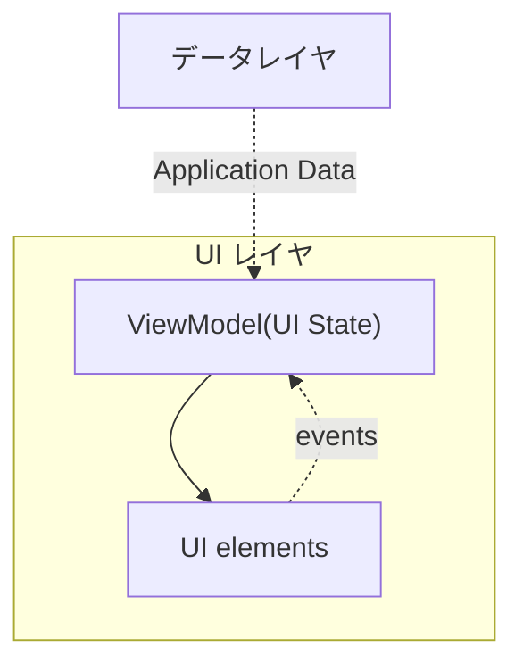

<https://developer.android.com/topic/architecture?hl=ja>

## モバイルアプリのユーザーエクスペリエンスについて

### Androidアプリの構成要素

Androidアプリは、いくつかの基本的なアプリコンポーネントから構成されます。これには以下が含まれます:

- **アクティビティ(Activity)**: ユーザーインターフェイスの単一の画面を提供します。
- **フラグメント(Fragment)**: アクティビティ内の再利用可能なUI部品です。
- **サービス(Service)**: バックグラウンドで動作する長期実行操作を行います。
- **コンテンツプロバイダ(Content Provider)**: アプリ間でデータを共有するためのインターフェースを提供します。
- **ブロードキャストレシーバ(Broadcast Receiver)**: システムやアプリから送られるブロードキャストメッセージを受け取ることができます。

### ユーザーエクスペリエンスとリソース管理

ユーザーが複数のアプリを頻繁に切り替える環境では、アプリはさまざまなワークフローとタスクに柔軟に対応する必要があります。Android OSはリソースが限られているため、必要に応じてアプリプロセスを終了させることがあります。

#### アプリコンポーネントの独立性

アプリコンポーネントは個別に、また任意の順序で起動され得ます。これは、システムやユーザーの介入によりコンポーネントが随時終了または再起動される可能性があることを意味します。開発者は、以下の点を考慮する必要があります:

- **データと状態の管理**: アプリのデータや状態はコンポーネント間で共有されず、またメモリ内に永続的に保持されないようにしてください。データの持続性が必要な場合は、データベースやファイルシステムなど、適切な保存方法を利用する必要があります。
- **コンポーネント間の依存関係**: アプリコンポーネントは互いに独立しているべきで、他のコンポーネントの存在や状態に依存しないように設計する必要があります。

## アプリアーキテクチャに関する共通の原則

### 関心の分離(Separation of Concerns)

- コードを1つの`Activity`や`Fragment`に集中させるのは避けましょう。
- UI関連のクラスには、UI表示やOSとのやり取りを行うロジックのみを含め、それ以外のロジックは分離しましょう。
- これにより、コンポーネントのライフサイクルに関連する問題を回避し、テストのしやすさを向上させます。

#### Dice Roller アプリを例に関心分離コード

- 元コード：<https://github.com/google-developer-training/basic-android-kotlin-compose-training-dice-roller>
- [チュートリアル](https://developer.android.com/codelabs/basic-android-kotlin-compose-build-a-dice-roller-app?continue=https%3A%2F%2Fdeveloper.android.com%2Fcourses%2Fpathways%2Fandroid-basics-compose-unit-2-pathway-2&hl=ja#7)

```java
    // DiceRoller/app/src/main/java/com/example/diceroller/DiceViewModel.kt
    package com.example.diceroller

    import androidx.lifecycle.ViewModel
    import androidx.lifecycle.viewModelScope
    import kotlinx.coroutines.flow.MutableStateFlow
    import kotlinx.coroutines.flow.StateFlow
    import kotlinx.coroutines.launch

    /**
    * DiceViewModel: サイコロのロール結果を管理するビューモデル。
    * UIとビジネスロジックの間の橋渡しを行い、UIの状態を保持します。
    */
    class DiceViewModel : ViewModel() {
        private val _diceResult = MutableStateFlow(1) // Default value is 1
        val diceResult: StateFlow<Int> = _diceResult

        /**
        * rollDice: サイコロを振り、1から6までのランダムな整数を生成して結果を更新します。
        */
        fun rollDice() {
            viewModelScope.launch {
                _diceResult.value = (1..6).random()
            }
        }
    }

    // DiceRoller/app/src/main/java/com/example/diceroller/MainActivity.kt
    package com.example.diceroller

    import android.os.Bundle
    import androidx.activity.ComponentActivity
    import androidx.activity.compose.setContent
    import androidx.activity.viewModels
    import androidx.compose.foundation.Image
    import androidx.compose.foundation.layout.*
    import androidx.compose.material3.Button
    import androidx.compose.material3.MaterialTheme
    import androidx.compose.material3.Text
    import androidx.compose.runtime.Composable
    import androidx.compose.runtime.collectAsState
    import androidx.compose.runtime.getValue
    import androidx.compose.ui.Alignment
    import androidx.compose.ui.Modifier
    import androidx.compose.ui.res.painterResource
    import androidx.compose.ui.res.stringResource
    import androidx.compose.ui.tooling.preview.Preview
    import androidx.compose.ui.unit.dp
    import androidx.compose.ui.unit.sp

    /**
    * MainActivity: アプリケーションのエントリポイント。
    * このアクティビティは、UI を設定し、DiceViewModel を初期化します。
    */
    class MainActivity : ComponentActivity() {
        private val diceViewModel by viewModels<DiceViewModel>()

        override fun onCreate(savedInstanceState: Bundle?) {
            super.onCreate(savedInstanceState)
            setContent {
                MaterialTheme {
                    DiceRollerApp(diceViewModel)
                }
            }
        }
    }

    /**
    * DiceRollerApp: サイコロアプリのUIを構築するコンポーザブル関数。
    * @param diceViewModel DiceViewModelのインスタンスを受け取り、UIにデータを提供します。
    */
    @Composable
    fun DiceRollerApp(diceViewModel: DiceViewModel) {
        val result by diceViewModel.diceResult.collectAsState()
        DiceWithButtonAndImage(result = result, onRollDice = { diceViewModel.rollDice() })
    }

    /**
    * DiceWithButtonAndImage: サイコロの結果を表示し、サイコロを振るボタンを提供するUIコンポーネント。
    * @param result サイコロの結果を表す整数。
    * @param onRollDice サイコロを振る動作を実行するコールバック関数。
    */
    @Composable
    fun DiceWithButtonAndImage(result: Int, onRollDice: () -> Unit) {
        val imageResource = when(result) {
            1 -> R.drawable.dice_1
            2 -> R.drawable.dice_2
            3 -> R.drawable.dice_3
            4 -> R.drawable.dice_4
            5 -> R.drawable.dice_5
            else -> R.drawable.dice_6
        }

        Column(modifier = Modifier
            .fillMaxSize()
            .wrapContentSize(Alignment.Center), horizontalAlignment = Alignment.CenterHorizontally) {
            Image(painter = painterResource(id = imageResource), contentDescription = "Dice rolled result $result")
            Spacer(modifier = Modifier.height(16.dp)) // Add some space between the image and button
            Button(onClick = onRollDice) {
                Text(text = stringResource(id = R.string.roll), fontSize = 24.sp)
            }
        }
    }

    /**
    * PreviewDiceWithButtonAndImage: プレビュー機能を提供するコンポーザブル関数。
    * デザインタイムにUIの見た目を確認するために使用します。
    */
    @Preview(showBackground = true)
    @Composable
    fun PreviewDiceWithButtonAndImage() {
        MaterialTheme {
            DiceWithButtonAndImage(result = 1, onRollDice = {})
        }
    }


```

### UIをデータモデルで操作

- UIは、永続的なデータモデルに基づいて操作されるべきです。
- データモデルは、UI要素や他のコンポーネントから独立しているべきで、そのライフサイクルには依存しません。
- 永続モデルを利用することで、OSによるアプリの破棄時でもデータの安全を保ち、ネットワークの状況に左右されない動作を実現できます。

### 信頼できる唯一の情報源(Single Source of Truth, SSOT)

- データの「オーナー」となる信頼できる唯一の情報源を定義しましょう。
- 信頼できる唯一の情報源(SSOT)のみがデータを変更でき、変更は不変の型を使用して公開されます。
- これにより、データ変更の集約、保護、追跡が容易になります。
- オフラインファーストのアプリでは、通常、データベースがSSOTとなります。

※アプリ内で同じ情報（データ）を一箇所のみで管理し、その情報に対する全ての変更やアクセスをその場所を通じて行うということ(データの一貫性を保ち、エラーやデータの不整合を最小限に抑える)

### 単方向データフロー(Unidirectional Data Flow)

- 状態の変更は一方向にのみ流れ、イベントはその反対方向に流れます。
- データは上位スコープから下位スコープへと流れ、イベントは下位スコープからSSOTへと流れます。
- このパターンにより、データの整合性が保たれ、エラーの可能性が減少し、デバッグが容易になります。

<details markdown="1">
<summary>比喩での説明</summary>

```txt
ある街に一つの大きな水タンクがあり、その水を各家庭へ配る水道管システムがあるとします。この場合、水タンクはデータの源（SSOT）に相当し、水道管はデータが流れる経路、家庭はデータを受け取るUI（ユーザーインターフェース）に相当します。人々が水を使いたい時、彼らは蛇口をひねりますが、これはユーザーイベント（例えばボタンの押下）に似ています。水（データ）は一方向に流れ、家庭（UI）に届きます。

そして、何らかの理由で水量を調整する必要がある場合（データの更新）、この要求は水道システムを逆方向に伝わり、水タンク（SSOT）に至ります。水タンクでは、必要に応じて水量が調整され、その後の水流はこの新しい状態を反映します。
```

- 単方向データフローの原則
  - データは一方向にのみ流れます: データ（またはアプリの状態）は、一般的にデータソース（例えばデータベースやAPI）からUIに向けて流れます。これにより、データの管理が容易になり、予期せぬ変更を避けることができます。
  - イベントは反対方向に流れます: ユーザーがUIで行うアクション（例えばボタンを押す）はイベントを生成し、これらのイベントはUIからデータソースへと「逆流」します。そして、データの更新や変更が必要な場合は、これらのイベントを通じて行われます。
  - データの整合性: このパターンを使うことで、アプリ全体でデータの一貫性を保つことができ、ユーザーインターフェースは常に最新の状態を反映します。
  - デバッグの容易さ: データとイベントの流れが明確なため、問題が発生した際に原因を特定しやすくなります。

</details>

## アプリの推奨アーキテクチャ

アプリの設計と開発において、スケーラビリティ、品質、堅牢性、テストのしやすさを確保するために、推奨されるアーキテクチャのベストプラクティスに従うことが重要です。([Android アーキテクチャに関する推奨事項](https://developer.android.com/topic/architecture/recommendations?hl=ja))

### アプリアーキテクチャの主要レイヤ

#### [UIレイヤ](https://developer.android.com/topic/architecture/ui-layer?hl=ja)

- **役割**: アプリデータを画面に表示します。ユーザーの操作や外部からの入力によるデータの変更をUIに反映させる必要があります。
- **構成要素**:
  - **UI要素**: データを画面にレンダリングします。`View`や`Jetpack Compose`関数を利用して作成されます。
  - **状態ホルダー**: データを保持し、UIに公開し、ロジックを処理します。例えば、`ViewModel`クラスがこれにあたります。



#### [データレイヤ](https://developer.android.com/topic/architecture/data-layer?hl=ja)

- **役割**: アプリのビジネスロジックを含み、データを作成、保存、変更する方法を決定します。
- **構成要素**:
  - **リポジトリ**: 一つまたは複数のデータソースを含むことができ、アプリの他の部分にデータを提供します。データソースの競合を解決し、アプリの他の部分からデータソースを抽象化します。
  - **データソースクラス**: ファイル、ネットワークソース、ローカルデータベースなど、単一のデータソースのみを扱います。

#### [ドメインレイヤ (オプション)](https://developer.android.com/topic/architecture/domain-layer?hl=ja)

- **役割**: UIレイヤとデータレイヤの間のやり取りを簡素化し、再利用性を高めるために存在します。複雑なビジネスロジックや、複数のViewModelで再利用される単純なビジネスロジックをカプセル化します。
- **構成要素**:
  - **ユースケース/インタラクタ**: 一つの機能を担当します。例えば、`GetTimeZoneUseCase`クラスがある特定の機能を実行します。

```mermaid
flowchart TD
    UIレイヤ:::GreenClass --> データレイヤ
    データレイヤ:::BlueClass  --> ドメインレイヤ:::BlackClass
    classDef GreenClass fill:#00FF00
    classDef BlueClass fill:#0000FF
    classDef BlackClass fill:#000000
```



### 最新のアプリアーキテクチャの特徴

- **リアクティブで階層的なアーキテクチャ**。
- **全レイヤでの単方向データフロー(UDF)**。
- **UIレイヤにおける状態ホルダーの使用**。
- **コルーチンとフローを通じた非同期処理**。
- **依存関係挿入のベストプラクティスによる柔軟なコード構造**。

## コンポーネント間の依存関係を管理する

アプリ開発において、クラスが他のクラスに依存して機能するのは一般的です。これらの依存関係を適切に管理することで、アプリのコードをより拡張性が高く、テストしやすいものにすることができます。以下に、依存関係を管理するための2つの主要なデザインパターンを紹介します。
(依存関係の注入のパターンに沿って、Android アプリで [Hilt](https://developer.android.com/training/dependency-injection/hilt-android?hl=ja) ライブラリを使用することをおすすめ)

### 依存関係の注入（Dependency Injection, DI）

- **概要**: 依存関係の注入は、クラスが自身の依存関係を直接構築する代わりに、実行時に外部から依存オブジェクトを受け取るデザインパターンです。
- **利点**:
  - 依存関係を外部から提供することで、コードの再利用性とテストのしやすさが向上します。
  - 設定変更や依存関係のバージョンアップ時に、コードの変更を最小限に抑えることができます。

### サービスロケータ（Service Locator）

- **概要**: サービスロケータパターンでは、依存関係のレジストリ（サービスロケータ）を通じてクラスが必要な依存オブジェクトを取得します。
- **利点**:
  - 単一の場所で依存関係を管理することができ、アプリ全体での依存関係の解決が簡単になります。
  - 必要なサービスを動的に取得できるため、柔軟性が高まります。

### Android アプリでの依存関係の注入: Hilt

Android アプリ開発において、`Hilt`は依存関係の注入を簡単にするためのライブラリです。Hiltを使用すると、依存関係ツリーを自動的に構築し、コンパイル時に依存関係を検証することができます。

#### Hiltのサンプルコード

以下は、Hiltを使用して依存関係を注入する簡単な例です。

```java
// 依存関係を提供するクラス
@Module
@InstallIn(SingletonComponent::class)
object NetworkModule {
    @Singleton
    @Provides
    fun provideRetrofitService(): RetrofitService {
        return Retrofit.Builder()
            .baseUrl("https://example.com")
            .build()
            .create(RetrofitService::class.java)
    }
}

// 依存関係を注入するクラス
@AndroidEntryPoint
class MainActivity : AppCompatActivity() {
    @Inject lateinit var retrofitService: RetrofitService

    override fun onCreate(savedInstanceState: Bundle?) {
        super.onCreate(savedInstanceState)
        setContentView(R.layout.activity_main)

        // retrofitService を使用
    }
}
```

この例では、`NetworkModule`クラスで`RetrofitService`のインスタンスを提供し、`MainActivity`でそのインスタンスを注入しています。`Hilt`は、アプリの他の部分で`RetrofitService`が必要になった場合に自動的に提供されるように、これらの設定を利用します。

## 一般的なベスト プラクティス

### 1. アプリのコンポーネントにデータを格納しないでください

- **推奨**: アプリのコンポーネント（アクティビティやサービスなど）内にデータを格納しないでください。
- **理由**: コンポーネントの生存期間は予測が難しく、デバイスの操作やシステム状態によっては短くなる可能性があるため、データの安全性が保証できません。

### 2. Android クラスへの依存を減らします

- **推奨**: 限られたクラスのみAndroidフレームワークSDK APIに依存させ、他のクラスは抽象化を行います。
- **理由**: これにより、テストが容易になり、アプリ内での結合度が低減します。

<details markdown="1">
<summary>つまり</summary>

```txt
アプリの大部分のコードが、ContextやToastのようなAndroidフレームワークのクラスやAPIに直接依存しないように設計することを意味します。代わりに、このような依存性を必要とする機能は、限られた数のクラス（例えば、ビューを管理するアクティビティやフラグメント）に集中させるべきです。
```

- 具体的な実装方法
  - 抽象化レイヤーの導入: AndroidフレームワークのAPIを直接使用する代わりに、その機能をラップする独自のインターフェースやクラスを作成します。例えば、データの永続化を扱うクラスが直接SharedPreferencesを使用するのではなく、PreferencesManagerのようなインターフェースを通じてアクセスします。
  - 依存性の注入（DI）: 必要な依存性をコンポーネントに注入することで、実際の実装からビジネスロジックを分離します。これは、テスト時にモック実装を注入しやすくするためです。

</details>

### 3. アプリの各種モジュール間の役割の境界を明確に定義します

- **推奨**: 各モジュールからの公開は最小限に留め、役割の境界を明確に定義します。
- **理由**: 関連のない複数の処理を同じクラスに定義することを避け、アプリの推奨アーキテクチャに沿うことで、コードベースの可読性と保守性が向上します。

### 4. 各モジュールからの公開はできるだけ行わないでください

- **推奨**: 各モジュールからの公開を最小限にする。モジュール（あるいはコンポーネント、クラス）の内部実装の詳細を外部に露出させることを避けるというものです。つまり、モジュールの外部からアクセスする必要がある機能のみを公開し、内部でのみ使用される詳細は隠蔽します。
- **理由**:
  - 保守性の向上: モジュールの内部実装が外部から直接アクセスされないようにすることで、将来的にその内部実装を変更する際に、他のモジュールへの影響を最小限に抑えることができます。これにより、保守や拡張が容易になります。
  - 技術的負債の軽減: 短期的には内部実装の詳細を公開することで時間を節約できるかもしれませんが、長期的に見ると、コードベースが成長して複雑になるにつれ、それらの公開された実装を維持するために必要な労力が増加し、技術的負債が増大します。
  - 可読性と理解の容易さ: モジュールが提供するAPIがシンプルで、その内部実装の詳細が隠蔽されていると、他の開発者がそのモジュールを使用する際に、どの機能が提供されているのか、どのように使用すれば良いのかを理解しやすくなります。
  - 再利用性の向上: 内部実装を隠蔽し、清潔なインターフェースを提供するモジュールは、他のプロジェクトやコンテキストでも再利用しやすくなります。

### 5. アプリの特別な部分に焦点を当てて、他のアプリとの差別化を図ります

- **推奨**: アプリの特別な部分に焦点を当て、他のアプリとの差別化を図ります。
- **理由**: Jetpackライブラリやその他の推奨ライブラリを利用してボイラープレートコードの記述を減らし、アプリのユニークな機能開発にリソースを集中させることで、アプリの価値を高めることができます。

### 6. アプリの各部分を個別にテストできるようにする方法を検討します

- **推奨**: アプリの各部分を個別にテストできるように構造を考えます。
- **理由**: 例えば、ネットワークからデータを取得するコードと、そのデータをローカルデータベースに永続化するコードを分離することで、各モジュールを独立してテストすることが可能になります。

### 7. 型は同時実行ポリシーに関する責任を負います

- **推奨**: 型は同時実行ポリシーに関する責任を負います。
- **理由**: ある型が重い処理を行う場合、その処理を適切なスレッドに移動する責任を持つことで、アプリのレスポンス性を保ち、メインスレッドのブロッキングを避けることができます。

### 8. データの関連性と新鮮さをできる限り維持します

- **推奨**: データの関連性と新鮮さをできるだけ維持します。
- **理由**: ユーザーがオフラインでもアプリの機能を利用できるようにし、接続速度が遅い場合や受信状況が悪い場所でも最良のユーザーエクスペリエンスを提供するためです。

## サンプルコード

- <https://github.com/google-developer-training>
