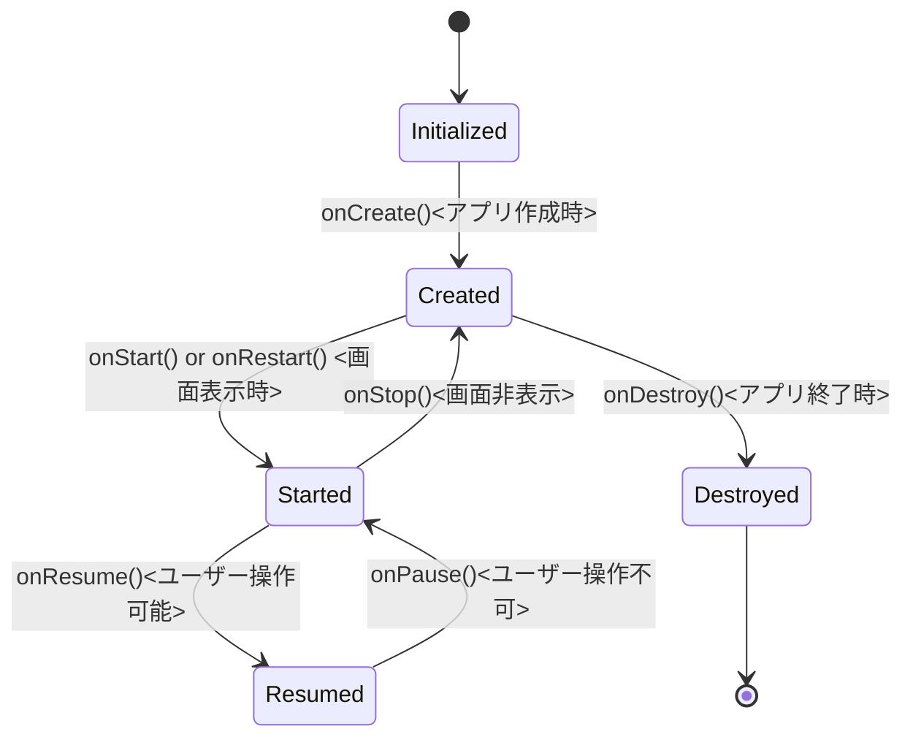

## Android アクティビティのライフサイクル

アンドロイドのアクティビティは、特定のライフサイクルに従っています。このライフサイクルは、アクティビティがユーザーに対してどのように現れ、消えるかを管理します。以下の説明と図は、アクティビティが経験する主なライフサイクルのステージを表しています。

#### ライフサイクルのステージ

- **Initialized**: アクティビティがメモリにロードされた状態。
- **Created**: `onCreate()` が呼ばれる。アクティビティに対して 1 回限りの初期化が行われる。
  - アクティビティがメモリ上に新しく作成された直後に 1 回だけ呼ばれます。
  - 呼び出された時点でアクティビティは「作成された」と見なされます。
  - オーバーライドする際は、アクティビティの作成を完了するためにスーパークラスの onCreate() (super.onCreate())を必ず呼び出す必要があります。
    - 注意）すべてのライフサイクル コールバック メソッド（onStart(), onResume(), onPause(), onStop(), onDestroy()）においても、同様にスーパークラスのメソッドを呼び出す必要があります。
- **Started**: `onStart()` または `onRestart()` が呼ばれる。アクティビティがユーザーに見えるようになる。
  - onCreate() の直後に呼ばれ、アクティビティが画面に表示される準備ができたことを示します。
  - アクティビティがユーザーに見えるようになったときに毎回呼ばれるため、onCreate() と異なり、複数回呼び出される可能性があります。
  - onStart() と onStop() は対になっており、onStart() で始めたプロセスや設定は onStop() でクリーンアップする必要があります。
  - ユーザーがアプリを開始し、後でデバイスのホーム画面に戻るときなど、アクティビティが前面に来たり去ったりするたびに onStart() と onStop() が呼ばれます。
  - アクティビティが画面に表示されるたびに必要なリソースをセットアップするために onStart() を使用します。
- **Resumed**: `onResume()` が呼ばれる。アクティビティがフォーカスを得て、ユーザーと対話可能になる。
- **Paused**: `onPause()` が呼ばれる。アクティビティがまだ見えるが、フォーカスを失っている状態。
- **Stopped**: `onStop()` が呼ばれる。アクティビティがユーザーに見えなくなる。
- **Destroyed**: `onDestroy()` が呼ばれる。アクティビティがメモリから破棄される。

各ステージに対して、Android システムは関連するコールバックメソッドを呼び出します。開発者はこれらのコールバックをオーバーライドして、必要な処理を実装します。

#### コールバックメソッドとそのタイミング

- `onCreate()`: アクティビティが生成されたときに一度だけ呼ばれる。初期化処理を行う。
- `onStart()`/`onRestart()`: アクティビティがユーザーに見えるようになる前に呼ばれる。リソースの確保などを行う。
- `onResume()`: アクティビティがフォーカスを得てユーザーとの対話が可能になったときに呼ばれる。最も活発な状態。
- `onPause()`: 別のアクティビティがフォーカスを得るために現在のアクティビティが部分的に隠されるときに呼ばれる。状態の保存や軽量なリリース処理を行う。
- `onStop()`: アクティビティが完全にユーザーに見えなくなったときに呼ばれる。リソースのリリース処理を行う。
- `onDestroy()`: アクティビティが不要になり、システムによって破棄されるときに呼ばれる。最終的なクリーンアップを行う。

これらのメソッドは、ユーザーがアプリを使用する中でアクティビティがどのように振る舞うかを制御するために重要です。開発者はこれらの各ステージで適切な処理を行うことにより、ユーザーエクスペリエンスとアプリのパフォーマンスを最適化することができます。

注: `onRestart()` メソッドは、`onStop()` が呼ばれた後、アクティビティが再び開始された場合にのみ呼ばれます。



#### 動作

###### アプリがバックグラウンドになるとき

アプリがバックグラウンドになるときに onPause() と onStop() が呼び出され、フォアグラウンドに戻るときに onRestart()、onStart()、onResume() が呼び出されます。

###### デバイスの画面回転とアクティビティのライフサイクル

画面が回転すると、アクティビティはシャットダウンされ再作成されるため、デフォルト値にリセットされます。この動作は、アクティビティが持っていたデータ（例：デザートの販売数や総収益）が失われることを意味します。
Android アプリケーションでデバイスの画面が回転すると、以下のライフサイクルイベントが発生します。

1. **`onPause()`** が呼ばれ、アクティビティは一時停止します。
2. **`onStop()`** が続いて呼ばれ、アクティビティは停止します。
3. **`onDestroy()`** が呼ばれ、アクティビティは破棄されます。
4. デバイスが画面の向きを変更し終えると、アクティビティは再作成されます。
5. 新しいアクティビティインスタンスで **`onCreate()`** が呼ばれ、アクティビティは再び作成されます。
6. **`onStart()`** と **`onResume()`** が呼ばれ、アクティビティがユーザーに再表示されます。

#### コンポーザブルのライフサイクル

###### Composition

- **コンポーズの初期化**: アプリの UI は、コンポーズ可能な関数を実行することで初めて構築されます。このプロセスを Composition と呼びます。
- **状態の変化と再コンポーズ**: アプリの状態が変化すると、影響を受けるコンポーズ可能な関数は再実行されます。これを再コンポーズと呼び、更新された UI が作成されます。

###### Composable 関数のライフサイクル

- **Composition に入る**: コンポーズ可能な関数が最初に実行される際のプロセス。
- **再コンポーズする**: 状態変化に応じて、関数が 0 回以上再実行されることがあります。
- **Composition から出る**: UI からコンポーズ可能な要素が削除される時、リソースのクリーンアップが行われます。

###### 状態管理

- **State と MutableState**: Compose では状態の変更を追跡するために `State` または `MutableState` 型を使用します。

  - `State` 型: 不変であり、読み取り専用。

    ```java
      /* 可変変数 revenue を作成するには、mutableStateOf を使用して宣言します。0 は初期のデフォルト値です。
       これは、収益値が変更されたときに Compose で再コンポーズをトリガーするには十分ですが、更新された値を保持するには不十分です。
       コンポーザブルが再実行されるたびに、収益値が再初期化されて初期のデフォルト値である 0 になります。
       */
      var revenue = mutableStateOf(0)
    ```

  - `MutableState` 型: 可変であり、読み取りと書き込みが可能。

    ```java
       /*
        revenue の値が変更されると、Compose は、この値を読み取るすべてのコンポーズ可能な関数を、再コンポーズのためにスケジュール設定します。
        Compose は再コンポーズ時に収益の状態を記憶しますが、構成の変更の際はこの状態を保持しません。構成の変更の際に Compose が状態を保持するようにするには、rememberSaveable を使用する必要があります。
       */
      var revenue by remember { mutableStateOf(0) }
    ```

- **rememberSaveable**: remember の機能に加えて、アクティビティやフラグメントの再作成時に状態を自動的に保存し復元する

  - State は不変であり、その値は読み取り専用です。一方、MutableState は可変であり、値の更新が可能です。
  - rememberSaveable は remember の機能に加えて、アクティビティやフラグメントの再作成時に状態を自動的に保存し復元する機能を持っています。これにより、デバイスの回転やメモリ不足によるシステムによる再起動後も、ユーザーが入力したデータや選択した設定などが失われることなく保持されます。

    ```java
      var count by rememberSaveable { mutableStateOf(0) }
    ```

###### 状態の追跡

- **状態のトラッキング**: Compose が再コンポーズを効果的にトリガーするためには、状態がどのように変化したのかを正確に把握する必要があります。
- **再コンポーズのトリガー**: 特定の状態が変更された時、それに依存するコンポーズ可能な関数は再コンポーズされます。

#### Log

コールバックメソッドとそのタイミングを可視化するためのプログラム

```java

private const val TAG = "MainActivity";
class MainActivity : ComponentActivity() {

    override fun onCreate(savedInstanceState: Bundle?) {
        enableEdgeToEdge()
        super.onCreate(savedInstanceState)
        Log.d(TAG, "onCreate Called")
        setContent {
            DessertClickerTheme {
                // A surface container using the 'background' color from the theme
                Surface(
                    modifier = Modifier
                        .fillMaxSize()
                        .statusBarsPadding(),
                ) {
                    DessertClickerApp(desserts = Datasource.dessertList)
                }
            }
        }
    }

    override fun onStart() {
        super.onStart()
        Log.d(TAG, "onStart Called")
    }
    override fun onResume() {
        super.onResume()
        Log.d(TAG, "onResume Called")
    }

    override fun onRestart() {
        super.onRestart()
        Log.d(TAG, "onRestart Called")
    }

    override fun onPause() {
        super.onPause()
        Log.d(TAG, "onPause Called")
    }

    override fun onStop() {
        super.onStop()
        Log.d(TAG, "onStop Called")
    }

    override fun onDestroy() {
        super.onDestroy()
        Log.d(TAG, "onDestroy Called")
    }
}

```

#### 関連サイト

- [アクティビティのライフサイクルのステージ](https://developer.android.com/codelabs/basic-android-kotlin-compose-activity-lifecycle?hl=ja&continue=https%3A%2F%2Fdeveloper.android.com%2Fcourses%2Fpathways%2Fandroid-basics-compose-unit-4-pathway-1%3Fhl%3Dja%23codelab-https%3A%2F%2Fdeveloper.android.com%2Fcodelabs%2Fbasic-android-kotlin-compose-activity-lifecycle##2)
- [Activity Lifecycle](https://developer.android.com/reference/android/app/Activity##activity-lifecycle)
