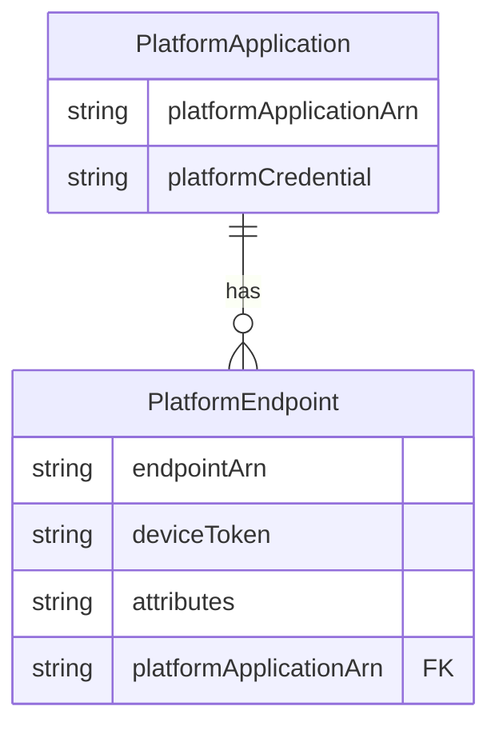
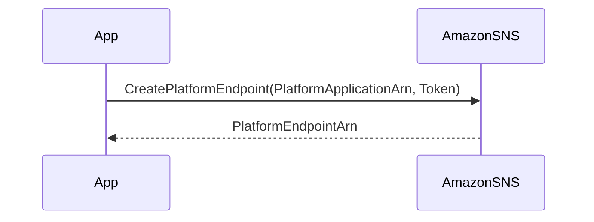

最近、Amazon Simple Notification Service (SNS) を使ってモバイルトークンの管理方法について調べたので、その内容をまとめました。SNSを使ったプッシュ通知の仕組みや、トークン管理の注意点について触れていきます。

## アプリケーション、エンドポイント、トークンの関係性

まず、SNSでのモバイル通知には以下の3つの主要なオブジェクトが登場します。

- **PlatformApplication**: 特定のプラットフォーム（例：iOSやAndroid）に関連するアプリケーション情報を持ちます。プラットフォームごとの認証情報や設定が含まれます。

- **PlatformEndpoint**: 個々のデバイストークンを表すエンドポイントです。特定のデバイス上の特定のアプリケーションを指します。

- **Token**: モバイルデバイスが発行する一意の識別子です。プッシュ通知を送る際の宛先となります。

### オブジェクト間の関係図

以下のER図は、1つの`PlatformApplication`が複数の`PlatformEndpoint`を持つ関係を示しています。



## トークンの登録方法

### `CreatePlatformEndpoint` APIの使い方

モバイルデバイスにプッシュ通知を送るためには、そのデバイスのトークンをSNSに登録する必要があります。これには`CreatePlatformEndpoint`というAPIを使います。

1. **リクエストパラメータ**:
   - `PlatformApplicationArn`: 対象アプリケーションのARN。
   - `Token`: デバイスから取得したトークン。

2. **レスポンス**:
   - `PlatformEndpointArn`: 作成されたエンドポイントのARN。

シーケンスとしては以下のようになります。



### `CreatePlatformEndpoint`の挙動

このAPIは冪等性を持っています。つまり、同じトークンで何度呼び出しても結果が一貫しています。

- **既存のエンドポイントがある場合**: その`PlatformEndpointArn`を返します。
- **トークンが同じでも属性が異なる場合**: エラーを返します。
- **新しいトークンの場合**: 新たにエンドポイントを作成します。

エラーが発生した場合でも、エラーメッセージ内に既存の`EndpointArn`が含まれているので、それを利用できます。

以下はJavaでの実装例です。

```java
private String createEndpoint() {
    String endpointArn = null;
    try {
        System.out.println("Creating endpoint with token " + token);
        CreatePlatformEndpointRequest cpeReq = 
                new CreatePlatformEndpointRequest()
                .withPlatformApplicationArn(applicationArn)
                .withToken(token);
        CreatePlatformEndpointResult cpeRes = client
                .createPlatformEndpoint(cpeReq);
        endpointArn = cpeRes.getEndpointArn();
    } catch (InvalidParameterException ipe) {
        String message = ipe.getErrorMessage();
        System.out.println("Exception message: " + message);
        Pattern p = Pattern
                .compile(".*Endpoint (arn:aws:sns[^ ]+) already exists " +
                        "with the same Token.*");
        Matcher m = p.matcher(message);
        if (m.matches()) {
            endpointArn = m.group(1);
        } else {
            throw ipe;
        }
    }
    storeEndpointArn(endpointArn);
    return endpointArn;
}
```

## 注意すべきポイント

**1. 古いトークンを使い回す問題**

アプリ起動時に最初に取得したトークンを永遠に使い続けるのは避けましょう。理由は以下の通りです。

- **トークンの有効期限切れ**: GCMやAPNSはトークンの有効期限が切れると新しいトークンを発行します。古いトークンを使い続けると通知が届かなくなります。

- **エンドポイントの無効化**: SNSは無効なトークンに対して通知を送ると、そのエンドポイントを無効化します。

- **エンドポイントの上限**: 同じトークンで作成できるエンドポイントの数には上限（3つまで）があり、それを超えるとエラーになります。

**例**:

1. **最初のトークンでエンドポイントを作成**: Token Aで`CreatePlatformEndpoint`を呼び出す。

2. **トークンが更新される**: デバイス側でToken Bが発行されるが、アプリは依然としてToken Aを使用。

3. **エンドポイント作成を繰り返す**: 同じToken Aで何度も`CreatePlatformEndpoint`を呼び出すと、エンドポイントが増え続ける。

4. **上限に達する**: 4回目以降の呼び出しでエラーが発生。

## 無効なトークンに関連付けられたエンドポイントの再有効化

モバイルプラットフォームがトークンを無効と判断すると、SNSはそのエンドポイントを無効化します。このエンドポイントを再度有効化するには、以下の手順が必要です。

1. **有効なトークンでエンドポイントを更新**: `SetEndpointAttributes` APIを使用して、新しいトークンを設定。

2. **エンドポイントを有効化**: 属性を更新してエンドポイントを再有効化。

---

**参考サイト**

- [FCM 登録トークン管理のベスト プラクティス](https://firebase.google.com/docs/cloud-messaging/manage-tokens?hl=ja)
