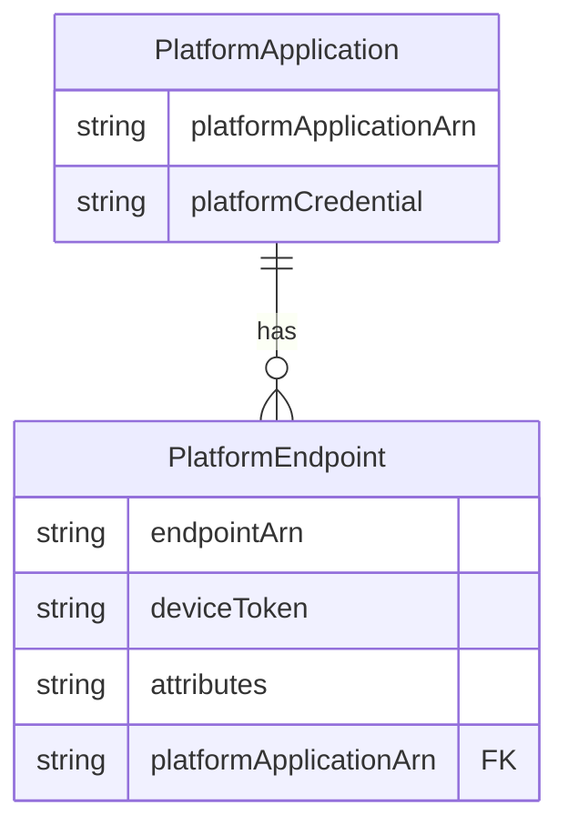
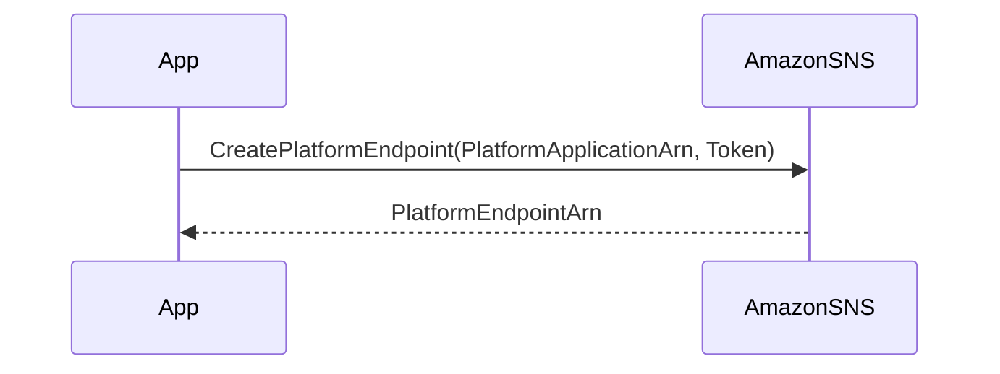

最近、Amazon Simple Notification Service (SNS) を使ってモバイルトークンの管理方法について学んだので、その内容をメモとして残します。

## アプリケーション、エンドポイント、トークンの関係性

- **PlatformApplication**: 特定のプラットフォーム（例：iOS や Android）に関連するアプリケーション情報を持ちます。プラットフォームごとの認証情報や設定が含まれます。

- **PlatformEndpoint**: 個々のデバイストークンを表すエンドポイントです。特定のデバイス上の特定のアプリケーションを指します。

- **Token**: モバイルデバイスが発行する一意の識別子です。プッシュ通知を送る際の宛先となります。

### オブジェクト間の関係図

以下の ER 図は、1 つの`PlatformApplication`が複数の`PlatformEndpoint`を持つ関係を示しています。



## トークンの登録方法

### `CreatePlatformEndpoint` API の使い方

モバイルデバイスにプッシュ通知を送るためには、そのデバイスのトークンを SNS に登録する必要があります。これには`CreatePlatformEndpoint`という API を使います。

1. **リクエストパラメータ**:

   - `PlatformApplicationArn`: 対象アプリケーションの ARN。
   - `Token`: デバイスから取得したトークン。

2. **レスポンス**:
   - `PlatformEndpointArn`: 作成されたエンドポイントの ARN。

シーケンスとしては以下のようになります。



### `CreatePlatformEndpoint`の挙動

この API は冪等性を持っています。つまり、同じトークンで何度呼び出しても結果が一貫しています。

- **既存のエンドポイントがある場合**: その`PlatformEndpointArn`を返します。

- **トークンが同じでも属性が異なる場合**: エラーを返します。

- **新しいトークンの場合**: 新たにエンドポイントを作成します。

エラーが発生した場合でも、エラーメッセージ内に既存の`EndpointArn`が含まれているので、それを利用できます。

以下は Java での実装例です。

```java
private String createEndpoint() {
    String endpointArn = null;
    try {
        System.out.println("Creating endpoint with token " + token);
        CreatePlatformEndpointRequest cpeReq =
                new CreatePlatformEndpointRequest()
                .withPlatformApplicationArn(applicationArn)
                .withToken(token);
        CreatePlatformEndpointResult cpeRes = client
                .createPlatformEndpoint(cpeReq);
        endpointArn = cpeRes.getEndpointArn();
    } catch (InvalidParameterException ipe) {
        String message = ipe.getErrorMessage();
        System.out.println("Exception message: " + message);
        Pattern p = Pattern
                .compile(".*Endpoint (arn:aws:sns[^ ]+) already exists " +
                        "with the same Token.*");
        Matcher m = p.matcher(message);
        if (m.matches()) {
            endpointArn = m.group(1);
        } else {
            throw ipe;
        }
    }
    storeEndpointArn(endpointArn);
    return endpointArn;
}
```

## 注意すべきポイント

**1. 古いトークンを使い回す問題**

アプリ起動時に最初に取得したトークンを永遠に使い続けるのは避けましょう。理由は以下の通りです。

- **トークンの有効期限切れ**: GCM や APNS はトークンの有効期限が切れると新しいトークンを発行します。古いトークンを使い続けると通知が届かなくなります。

- **エンドポイントの無効化**: SNS は無効なトークンに対して通知を送ると、そのエンドポイントを無効化します。

- **エンドポイントの上限**: 同じトークンで作成できるエンドポイントの数には上限（3 つまで）があり、それを超えるとエラーになります。

**例**:

1. **最初のトークンでエンドポイントを作成**: Token A で`CreatePlatformEndpoint`を呼び出す。

2. **トークンが更新される**: デバイス側で Token B が発行されるが、アプリは依然として Token A を使用。

3. **エンドポイント作成を繰り返す**: 同じ Token A で何度も`CreatePlatformEndpoint`を呼び出すと、エンドポイントが増え続ける。

4. **上限に達する**: 4 回目以降の呼び出しでエラーが発生。

## 無効なトークンに関連付けられたエンドポイントの再有効化

モバイルプラットフォーム（APNS や GCM など）が SNS に対して「このトークンは無効です」と通知すると、SNS はそのトークンに関連付けられた**エンドポイントを無効化**します。

### 再有効化の注意点

無効化されたエンドポイントをそのまま再有効化しても、トークン自体が無効であるため、通知は届きません。再度通知を送信しようとすると、モバイルプラットフォームから再び「トークンが無効」と通知され、エンドポイントは再び無効化されてしまいます。

### 正しい再有効化の手順

エンドポイントを正しく再有効化するためには、以下の手順が必要です。

1. **有効なトークンでエンドポイントを更新**: `SetEndpointAttributes` API を使用して、エンドポイントに新しい**有効なトークン**を設定します。

2. **エンドポイントを再有効化**: エンドポイントの属性を更新し、ステータスを「有効」に変更します。

これにより、エンドポイントが有効なトークンと関連付けられ、再び通知を受け取ることが可能になります。無効なトークンのままでは、エンドポイントを再有効化しても意味がありません。

### 特殊なケース

唯一、トークンを更新せずにエンドポイントを再有効化して効果があるのは、トークンが以前は無効だったが再び有効になった場合です。例えば、アプリがアンインストールされた後に同じデバイスに再インストールされ、同じトークンが再発行された場合などです。

## ハンズオン

このハンズオンでは、`CreatePlatformEndpoint` API の異なるシナリオでの挙動を確認します。

- **シナリオ 1**：属性情報なしで`CreatePlatformEndpoint`を 2 回呼び出す場合。
- **シナリオ 2**：属性情報ありで`CreatePlatformEndpoint`を呼び、その後属性情報なしで再度呼ぶ場合。
- **シナリオ 3**：同じ属性情報で`CreatePlatformEndpoint`を複数回呼ぶ場合。

#### ステップ 1：LocalStack を起動

AWS サービスをローカルでシミュレートするために、LocalStack の Docker コンテナを起動します。

```bash
docker run --name localstack \
-p 127.0.0.1:4566:4566 \
-p 127.0.0.1:4510-4559:4510-4559 \
-e DEBUG=${DEBUG:-0} \
-v "$(pwd)/docker/localstack:/var/lib/localstack" \
-v /var/run/docker.sock:/var/run/docker.sock \
localstack/localstack:latest
```

#### ステップ 2：プラットフォームアプリケーションを作成

`create_platform_application.sh`というスクリプトを作成し、以下の内容を記述します。

```bash
#!/bin/bash
set -euo pipefail

PROFILE="localstack"
ENV="local"
REGION="us-east-1"
PLATFORM_NAME="alarm-${ENV}-FCM"
FCM_SERVICE_JSON_FILE_PATH="./fcm_credential.json"  # 実際のパスに置き換えてください
SERVICE_JSON=$(jq @json < "${FCM_SERVICE_JSON_FILE_PATH}")

aws sns create-platform-application \
    --name "${PLATFORM_NAME}" \
    --platform "GCM" \
    --attributes PlatformCredential="${SERVICE_JSON}" \
    --region "${REGION}" \
    --profile "${PROFILE}" \
    --endpoint-url="http://localhost:4566"
```

注意点：

- `./fcm_credential.json`を実際の FCM クレデンシャル JSON ファイルのパスに置き換えてください。
- 実行権限を付与します：`chmod +x create_platform_application.sh`
- スクリプトを実行します：`./create_platform_application.sh`

#### ステップ 3：プラットフォームアプリケーションの確認

作成されたプラットフォームアプリケーションをリストします。

```bash
aws sns list-platform-applications \
    --region "us-east-1" \
    --profile "localstack" \
    --endpoint-url="http://localhost:4566" \
    --query 'PlatformApplications[].PlatformApplicationArn' \
    --output text
```

#### ステップ 4：シナリオ 1 - 属性なしで 2 回呼び出す

最初の呼び出し：

```bash
aws sns create-platform-endpoint \
    --platform-application-arn "arn:aws:sns:us-east-1:000000000000:app/GCM/alarm-local-FCM" \
    --token "valid-token" \
    --region "us-east-1" \
    --profile "localstack" \
    --endpoint-url="http://localhost:4566"
```

同じトークンで属性情報なしの 2 回目の呼び出し：

```bash
aws sns create-platform-endpoint \
    --platform-application-arn "arn:aws:sns:us-east-1:000000000000:app/GCM/alarm-local-FCM" \
    --token "valid-token" \
    --region "us-east-1" \
    --profile "localstack" \
    --endpoint-url="http://localhost:4566"
```

**観察結果**：2 回目の呼び出しは既存の`EndpointArn`を返し、冪等性を示します。

#### ステップ 5：シナリオ 2 - 属性情報ありとなしでの呼び出し

カスタムユーザーデータを指定してエンドポイントを作成：

```bash
aws sns create-platform-endpoint \
    --platform-application-arn "arn:aws:sns:us-east-1:000000000000:app/GCM/alarm-local-FCM" \
    --token "valid-token1" \
    --custom-user-data "your-custom-user-data" \
    --region "us-east-1" \
    --profile "localstack" \
    --endpoint-url="http://localhost:4566"
```

同じトークンで属性情報なしの呼び出し：

```bash
aws sns create-platform-endpoint \
    --platform-application-arn "arn:aws:sns:us-east-1:000000000000:app/GCM/alarm-local-FCM" \
    --token "valid-token1" \
    --region "us-east-1" \
    --profile "localstack" \
    --endpoint-url="http://localhost:4566"
```

**観察結果**：2 回目の呼び出しは属性の不一致によりエラーが発生する可能性があります。

#### ステップ 6：シナリオ 3 - 同じ属性情報での複数回の呼び出し

同じトークンとカスタムユーザーデータで再度`CreatePlatformEndpoint`を呼び出します。

```bash
aws sns create-platform-endpoint \
    --platform-application-arn "arn:aws:sns:us-east-1:000000000000:app/GCM/alarm-local-FCM" \
    --token "valid-token1" \
    --custom-user-data "your-custom-user-data" \
    --region "us-east-1" \
    --profile "localstack" \
    --endpoint-url="http://localhost:4566"
```

**観察結果**：属性が一致しているため、呼び出しは成功し、既存の`EndpointArn`が返されます。

#### ステップ 7：エンドポイントのリスト表示

結果を確認するため、すべてのエンドポイントをリストします。

```bash
aws sns list-endpoints-by-platform-application \
    --platform-application-arn "arn:aws:sns:us-east-1:000000000000:app/GCM/alarm-local-FCM" \
    --region "us-east-1" \
    --profile "localstack" \
    --endpoint-url="http://localhost:4566" \
    --query 'Endpoints[].EndpointArn' \
    --output text
```

#### ステップ 8：クリーンアップ

必要に応じてエンドポイントを削除します。

```bash
aws sns delete-endpoint \
    --endpoint-arn "arn:aws:sns:us-east-1:000000000000:endpoint/GCM/alarm-local-FCM/your-endpoint-id" \
    --region "us-east-1" \
    --profile "localstack" \
    --endpoint-url="http://localhost:4566"
```

#### まとめ

- **冪等性**：`CreatePlatformEndpoint`は、同じトークンと属性で呼び出すと冪等的に動作します。
- **属性の不一致**：同じトークンで異なる属性を指定すると、エラーが発生します。
- **属性の一致**：同じトークンと属性であれば、既存のエンドポイントがエラーなく返されます。

---

**参考サイト**

- [FCM 登録トークン管理のベスト プラクティス](https://firebase.google.com/docs/cloud-messaging/manage-tokens?hl=ja)
- [Mobile token management with Amazon SNS](https://aws.amazon.com/jp/blogs/mobile/mobile-token-management-with-amazon-sns/)
