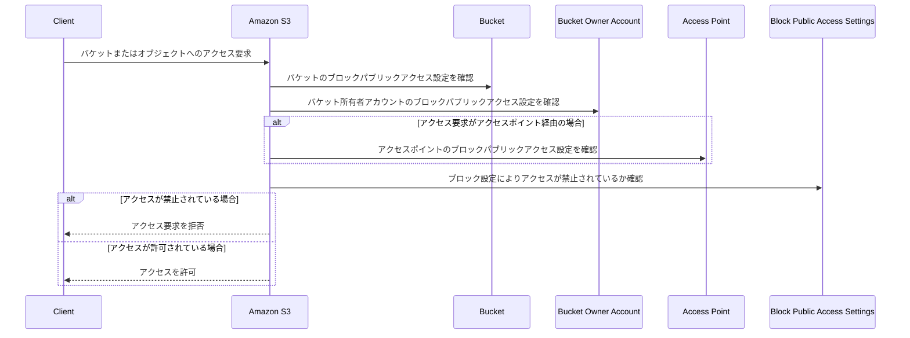

[Blocking public access to your Amazon S3 storage](https://docs.aws.amazon.com/AmazonS3/latest/userguide/access-control-block-public-access.html?icmpid=docs_amazons3_console)のドキュメント読んだので
私の理解をまとめる。

- Amazon S3 Block Public Accessは、アクセスポイント、バケット、アカウント全体に設定可能で、S3リソースのパブリックアクセス管理を支援する機能。
  - デフォルト動作：
    - 新しく作成されたバケット、アクセスポイント、オブジェクトは、デフォルトでパブリックアクセスが許可されていない。
    - ただし、ユーザーはバケットポリシーやオブジェクトの権限を変更してパブリックアクセスを許可可能。
  - Block Public Access設定の効果：
    - Block Public Accessを有効にすると、バケットポリシーやオブジェクトのPermissionsを変更してパブリックアクセスを許可しようとしても、それを**無効化（override）**する。
    - これにより、意図しないパブリックアクセスを防止できる。
  - 適用範囲：
    - アカウント全体に適用することで、すべてのリソースの一括管理が可能。
    - 特定のバケット単位でも設定可能。
  - 重要な制約：
    - Block Public Accessが有効な場合、バケットやオブジェクトレベルでパブリックアクセスを許可することはできない。
  - 誰が設定できるか：
    - アカウント管理者（account administrators）
    - バケット所有者（bucket owners）
  - Block Public Accessの適用ルール：
    - アクセスポイント、バケット、アカウントに異なるBlock Public Access設定がある場合、それらがすべて評価される。
    - 適用される設定：
      - Amazon S3は、アクセスポイント、バケット、アカウント設定の中で最も制限の厳しい設定を適用する。
  - Block Public Access設定は以下の単位で適用可能：
    - アクセスポイント
    - バケット
    - AWSアカウント
    - 個々のオブジェクト（per-object）単位では設定をサポートしない。
  - アカウントレベルで設定を適用すると、全AWSリージョンにグローバルで適用される。
  - 設定の反映は全リージョンで即座には行われず、伝播には時間がかかる場合がある。
    - 最終的にはすべてのリージョンで設定が有効になる。
  - オブジェクト単位での詳細な制御は、Block Public Access設定では対応していない。



## Block public access settings

### BlockPublicAcls

- `True`の場合
  - `PUT Bucket acl` や `PUT Object acl` を使って、バケットやオブジェクトを公開（public）設定にしようとすると失敗する。
  - `PUT Object` のリクエスト内に `public ACL` が含まれている場合、そのリクエストも失敗する。
  - `Block Public Access settings for this account` の `BlockPublicAcls=True` を設定すると、アカウント全体で上記２つが制御がされる

```bash
aws s3api create-bucket \
    --bucket test-block-public-acls-d86a2718 \
    --region us-east-1 \
    --profile dev-medcom.ne.jp

# バケットにBlockPublicAclsのみ有効化

aws s3api put-public-access-block \
    --bucket test-block-public-acls-d86a2718 \
    --public-access-block-configuration "BlockPublicAcls=true,IgnorePublicAcls=false,BlockPublicPolicy=false,RestrictPublicBuckets=false" \
    --region us-east-1 \
    --profile dev-medcom.ne.jp

# PUT Bucket acl（公開ACLの設定が失敗するか確認）

## request

aws s3api put-bucket-acl \
    --bucket test-block-public-acls-d86a2718 \
    --acl public-read\
    --region us-east-1 \
    --profile dev-medcom.ne.jp

## response
## --acl public-read はパブリックACLを付与するためのオプションなので、このリクエストが BlockPublicAcls 設定によって拒否されています。
## An error occurred (AccessDenied) when calling the PutBucketAcl operation: User: arn:aws:iam::hogehoge:user/{username} is not authorized to perform: s3:PutBucketAcl on resource: "arn:aws:s3:::test-block-public-acls-d86a2718" because public access control lists (ACLs) are blocked by the BlockPublicAcls block public access setting

# PUT Object acl（オブジェクトに公開ACLを設定が失敗するか確認）

## テスト用のオブジェクトをアップロードします

aws s3 cp test-file.txt s3://test-block-public-acls-d86a2718/test-file.txt \
    --region us-east-1 \
    --profile dev-medcom.ne.jp

## その後、オブジェクトに公開ACLを設定します

## request

aws s3api put-object-acl \
    --bucket test-block-public-acls-d86a2718 \
    --key test-file.txt \
    --acl public-read \
    --region us-east-1 \
    --profile dev-medcom.ne.jp

## response

## An error occurred (AccessDenied) when calling the PutObjectAcl operation: User: arn:aws:iam::hogehoge:user/{username} is not authorized to perform: s3:PutObjectAcl on resource: "arn:aws:s3:::test-block-public-acls-d86a2718/test-file.txt" because public access control lists (ACLs) are blocked by the BlockPublicAcls block public access setting

# PUT Object（リクエストで公開ACLが指定された場合に失敗するか確認）

## request

aws s3 cp test-file.txt s3://test-block-public-acls-d86a2718/test-file.txt --acl public-read \
    --region us-east-1 \
    --profile dev-medcom.ne.jp

## response

## upload failed: ./test-file.txt to s3://test-block-public-acls-d86a2718/test-file.txt An error occurred (AccessControlListNotSupported) when calling the PutObject operation: The bucket does not allow ACLs

# テスト後に不要なリソースを削除

aws s3 rm s3://test-block-public-acls-d86a2718/test-file.txt --region us-east-1 --profile dev-medcom.ne.jp
aws s3api delete-bucket --bucket test-block-public-acls-d86a2718 --region us-east-1 --profile dev-medcom.ne.jp

```

### IgnorePublicAcls

- `True`の場合
  - `Access control list (ACL)`の`Everyone (public access)`(以降 public ACL)の設定を無効にします。
    - 結果として、`public ACL`によるアクセス許可は無視され、S3バケットやオブジェクトへのパブリックアクセスが拒否されます。
  - ただし、`PUT Object`(`put-object`or`put-object-acl`のようなAPI)で`public ACL`を設定すること自体は可能です（ただし、その設定は無視されます）。
  - IgnorePublicAcls は「既存のACLを保持しつつ、それを無効化する」設定です。

```bash
# バケットの作成
aws s3api create-bucket \
    --bucket test-ignore-public-acls-379d86b2 \
    --region us-east-1 \
    --profile dev-medcom.ne.jp

# バケットにIgnorePublicAclsのみ有効化

aws s3api put-public-access-block \
    --bucket test-ignore-public-acls-379d86b2 \
    --public-access-block-configuration "BlockPublicAcls=false,IgnorePublicAcls=true,BlockPublicPolicy=false,RestrictPublicBuckets=false" \
    --region us-east-1 \
    --profile dev-medcom.ne.jp

#  公開ACL付きでオブジェクトをアップロード
aws s3api put-object \
    --bucket test-ignore-public-acls-379d86b2 \
    --key test-file.txt \
    --body ./test-file.txt \
    --region us-east-1 \
    --profile dev-medcom.ne.jp

# request
### ownership-controlsが有効だとACLの設定が無効になるので削除する
aws s3api delete-bucket-ownership-controls \
    --bucket test-ignore-public-acls-379d86b2 \
    --region us-east-1 \
    --profile dev-medcom.ne.jp

## --acl public-read はパブリックACLを付与する（リクエスト成功します）
aws s3api put-object-acl \
    --bucket test-ignore-public-acls-379d86b2 \
    --key test-file.txt \
    --acl public-read \
    --region us-east-1 \
    --profile dev-medcom.ne.jp

# get
# publicからのアクセスしても403エラーになります
curl -I https://test-ignore-public-acls-379d86b2.s3.us-east-1.amazonaws.com/test-file.txt

## Response
### HTTP/1.1 403 Forbidden
### x-amz-request-id: PD8ZAV35WJRTW090
### x-amz-id-2: SedahzRcytojRH5iDnWUKf17iR8JsRWFqZ64ybW0kbvGfhY6yzkU03Jknlbv0qq9KuMt3OewIAy9q13P13ZJnw/rmPb4ChQ8L7CzINBx9ig=
### Content-Type: application/xml
### Transfer-Encoding: chunked
### Date: Mon, 02 Dec 2024 22:16:15 GMT
### Server: AmazonS3

# テスト後に不要なリソースを削除

aws s3 rm s3://test-ignore-public-acls-379d86b2/test-file.txt --region us-east-1 --profile dev-medcom.ne.jp
aws s3api delete-bucket --bucket test-ignore-public-acls-379d86b2 --region us-east-1 --profile dev-medcom.ne.jp

```

### BlockPublicPolicy

- `True`の場合
  - バケットに設定した場合
    - バケットポリシー (PUT Bucket policy) において、パブリックアクセスを許可するポリシー が設定されるリクエストを拒否します。
    - 同じアカウント内の該当バケットのアクセスポイントに対して、パブリックアクセスを許可するポリシー を設定するリクエスト (PUT access point policy) も拒否します。
  - アクセスポイントに設定した場合
    - 該当アクセスポイント経由で行われるリクエスト (PUT access point policy または PUT Bucket policy) が、アクセスポイントまたはバケットでパブリックアクセスを許可するポリシー を設定する場合、これを拒否します。

```bash
# バケットの作成
aws s3api create-bucket \
    --bucket test-ignore-public-acls-bf7a02be \
    --region us-east-1 \
    --profile dev-medcom.ne.jp

# バケットにBlockPublicPolicyのみ有効化
aws s3api put-public-access-block \
    --bucket test-ignore-public-acls-bf7a02be \
    --public-access-block-configuration "BlockPublicAcls=false,IgnorePublicAcls=false,BlockPublicPolicy=true,RestrictPublicBuckets=false" \
    --region us-east-1 \
    --profile dev-medcom.ne.jp

# Set Policy
aws s3api put-bucket-policy \
    --bucket test-ignore-public-acls-bf7a02be \
    --policy '{
        "Version": "2012-10-17",
        "Statement": [
            {
                "Sid": "PublicReadGetObject",
                "Effect": "Allow",
                "Principal": "*",
                "Action": "s3:GetObject",
                "Resource": "arn:aws:s3:::test-ignore-public-acls-bf7a02be/*"
            }
        ]
    }' \
    --region us-east-1 \
    --profile dev-medcom.ne.jp

## response
## An error occurred (AccessDenied) when calling the PutBucketPolicy operation: User: arn:aws:iam::hogehoge:user/hogehoge is not authorized to perform: s3:PutBucketPolicy on resource: "arn:aws:s3:::test-ignore-public-acls-bf7a02be" because public policies are blocked by the BlockPublicPolicy block public access setting.

# create-access-point 
aws s3control create-access-point \
    --account-id 454347382012 \
    --name test-access-point-4b2c576e \
    --bucket test-ignore-public-acls-bf7a02be \
    --region us-east-1 \
    --profile dev-medcom.ne.jp

## response
## {
##   "AccessPointArn": "arn:aws:s3:us-east-1:454347382012:accesspoint/test-access-point-4b2c576e",
##   "Alias": "test-access-point-4b-kjdie1411tt4aw18muc5igu3w5j9guse1b-s3alias"
## }

## confirm

aws s3api put-object \
    --bucket arn:aws:s3:us-east-1:454347382012:accesspoint/test-access-point-4b2c576e \
    --key example-object \
    --body ./example-file.txt \
    --region us-east-1 \
    --profile dev-medcom.ne.jp

# {
# "ETag": "\"d41d8cd98f00b204e9800998ecf8427e\"",
# "ServerSideEncryption": "AES256"
# }

aws s3api get-object \
    --bucket arn:aws:s3:us-east-1:454347382012:accesspoint/test-access-point-4b2c576e \
    --key example-object \
    ./downloaded-file.txt \
    --region us-east-1 \
    --profile dev-medcom.ne.jp

# {
#     "AcceptRanges": "bytes",
#     "LastModified": "2024-12-03T21:54:51+00:00",
#     "ContentLength": 0,
#     "ETag": "\"d41d8cd98f00b204e9800998ecf8427e\"",
#     "ContentType": "binary/octet-stream",
#     "ServerSideEncryption": "AES256",
#     "Metadata": {}
# }
# ~/Downloads$ ls
# downloaded-file.txt     example-file.txt

# set access-point-policy
aws s3control put-access-point-policy \
    --account-id 454347382012 \
    --name test-access-point-4b2c576e \
    --policy '{
        "Version": "2012-10-17",
        "Statement": [
            {
                "Sid": "PublicReadAccess",
                "Effect": "Allow",
                "Principal": "*",
                "Action": "s3:GetObject",
                "Resource": "arn:aws:s3:us-east-1:454347382012:accesspoint/test-access-point-4b2c576e/object/*"
            }
        ]
    }' \
    --region us-east-1 \
    --profile dev-medcom.ne.jp

## response
## An error occurred (AccessDenied) when calling the PutAccessPointPolicy operation: Access Denied

# テスト後に不要なリソースを削除

aws s3 rm s3://test-ignore-public-acls-379d86b2/test-file.txt --region us-east-1 --profile dev-medcom.ne.jp
aws s3api delete-bucket --bucket test-ignore-public-acls-379d86b2 --region us-east-1 --profile dev-medcom.ne.jp

```

### RestrictPublicBuckets

- `True`の場合
  - アクセスポイントおよびバケットへのアクセスが厳密に管理される。
  - `AWS Service Principals`および`authorized users`（バケット所有者アカウントまたはアクセスポイント所有者アカウント内のユーザー）のみがアクセス可能。
  - すべての`cross-account access`がブロックされる（ただし、AWS Service Principals は例外）。

## The meaning of "public"

### ACLs

Everyone (public access) (group: <http://acs.amazonaws.com/groups/global/AllUsers>) または
Authenticated users group (anyone with an AWS account) (group: <http://acs.amazonaws.com/groups/global/AuthenticatedUsers>) に対して、
ACLで List または Read、もしくはその両方の権限を付与した場合、Amazon S3 はそのバケットまたはオブジェクトのACLを public とみなします。

### Bucket policies

Bucket policiesの設定によってpublicかnon-publicかを評価します。

- `non-public`とみなされる条件:
  - `Principal`または`Condition`に固定値が指定されていること。
- `public`とみなされる条件:
  - ワイルドカード（`*`）や変数を含む場合。

non-publicのポリシーを作成するためには以下の要素を固定値として指定します。

- Principal
  - An AWS principal, user, role, or service principal (e.g. aws:PrincipalOrgID)
- Condition
  - aws:SourceIp
  - aws:SourceArn
  - aws:SourceVpc
  - aws:SourceVpce
  - aws:SourceOwner
  - aws:SourceAccount
  - aws:userid, outside the pattern "AROLEID:*"
  - s3:DataAccessPointArn
  - s3:DataAccessPointAccount

以下の例はnon-publicとされます。

```json
{
   "Version":"2012-10-17",
   "Statement":[
      {
         "Principal":{
            "AWS":"arn:aws:iam::111122223333:role/JohnDoe"
         },
         "Effect":"Allow",
         "Action":"s3:GetObject",
         "Resource":"arn:aws:s3:::amzn-s3-demo-bucket/*"
      }
   ]
}

{
   "Version":"2012-10-17",
   "Statement":[
      {
          "Principal": "*", 
          "Resource": "*", 
          "Action": "s3:PutObject", 
          "Effect": "Allow", 
          "Condition": {"StringEquals": {"aws:SourceVpc": "vpc-91237329"}}
      }
   ]
 }

{
  "Version": "2012-10-17",
  "Statement": [
    {
      "Effect": "Allow",
      "Principal": "*",
      "Action": "s3:GetObject",
      "Resource": "arn:aws:s3:::example-bucket/*",
      "Condition": {
        "IpAddress": {
          "aws:SourceIp": "192.168.1.1/32"
        }
      }
    }
  ]
}
```

### Access PointsとBucketsでのPublic Access Settingsの違い

- VPCに紐づいたaccess pointsは、ポリシーの内容に関係なく常に非公開（non-public）扱いになる。

  ```json
    {
      "Effect": "Allow",
      "Principal": "*",
      "Action": "s3:GetObject",
      "Resource": "arn:aws:s3:us-west-2:123456789012:accesspoint/my-access-point/*"
    }
  ```

- `s3:DataAccessPointArn`を使った`access points policy`は`access points`においては`public`とみなされます。
  - `bucket policy`では`non-public`とみなされます

## Using IAM Access Analyzer for S3 to review public buckets

IAM Access Analyzer for S3は、Amazon S3バケットの現在のアクセス設定を評価して、インターネット全体や外部AWSアカウントに対して`public`または`shared access`が
許可されているかを検出するツールです。

検出結果（Findings）を基に、アクセスリスクを認識し、記録します。

**IAM Access Analyzer for S3とAmazon S3 Block Public Accessの役割**

- IAM Access Analyzer for S3
  - 現在の公開状態を分析・通知して、リスクを見つけ出す「診断ツール」。
- Amazon S3 Block Public Access
  - Public Accessを意図的または誤って設定されるのを防ぐ「保護メカニズム」。

## Permissions

Amazon S3の Block Public Access 機能を使用するために必要なIAMパーミッションはドキュメントの表を[参照](https://docs.aws.amazon.com/AmazonS3/latest/userguide/access-control-block-public-access.html?icmpid=docs_amazons3_console#access-control-block-public-access-permissions)

## 参考

- [Hosting a static website using Amazon S3](https://docs.aws.amazon.com/AmazonS3/latest/userguide/WebsiteHosting.html)
- [What does these settings mean for Block Public Access settings in S3?](https://stackoverflow.com/questions/64303953/what-does-these-settings-mean-for-block-public-access-settings-in-s3)
