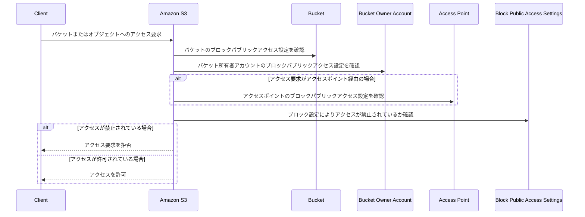

[Blocking public access to your Amazon S3 storage](https://docs.aws.amazon.com/AmazonS3/latest/userguide/access-control-block-public-access.html?icmpid=docs_amazons3_console)のドキュメント読んだので
私の理解をまとめる。

- Amazon S3 Block Public Accessは、アクセスポイント、バケット、アカウント全体に設定可能で、S3リソースのパブリックアクセス管理を支援する機能。
  - デフォルト動作：
    - 新しく作成されたバケット、アクセスポイント、オブジェクトは、デフォルトでパブリックアクセスが許可されていない。
    - ただし、ユーザーはバケットポリシーやオブジェクトの権限を変更してパブリックアクセスを許可可能。
  - Block Public Access設定の効果：
    - Block Public Accessを有効にすると、バケットポリシーやオブジェクトのPermissionsを変更してパブリックアクセスを許可しようとしても、それを**無効化（override）**する。
    - これにより、意図しないパブリックアクセスを防止できる。
  - 適用範囲：
    - アカウント全体に適用することで、すべてのリソースの一括管理が可能。
    - 特定のバケット単位でも設定可能。
  - 重要な制約：
    - Block Public Accessが有効な場合、バケットやオブジェクトレベルでパブリックアクセスを許可することはできない。
  - 誰が設定できるか：
    - アカウント管理者（account administrators）
    - バケット所有者（bucket owners）
  - Block Public Accessの適用ルール：
    - アクセスポイント、バケット、アカウントに異なるBlock Public Access設定がある場合、それらがすべて評価される。
    - 適用される設定：
      - Amazon S3は、アクセスポイント、バケット、アカウント設定の中で最も制限の厳しい設定を適用する。
  - Block Public Access設定は以下の単位で適用可能：
    - アクセスポイント
    - バケット
    - AWSアカウント
    - 個々のオブジェクト（per-object）単位では設定をサポートしない。
  - アカウントレベルで設定を適用すると、全AWSリージョンにグローバルで適用される。
  - 設定の反映は全リージョンで即座には行われず、伝播には時間がかかる場合がある。
    - 最終的にはすべてのリージョンで設定が有効になる。
  - オブジェクト単位での詳細な制御は、Block Public Access設定では対応していない。

## 参考

- [Hosting a static website using Amazon S3](https://docs.aws.amazon.com/AmazonS3/latest/userguide/WebsiteHosting.html)
