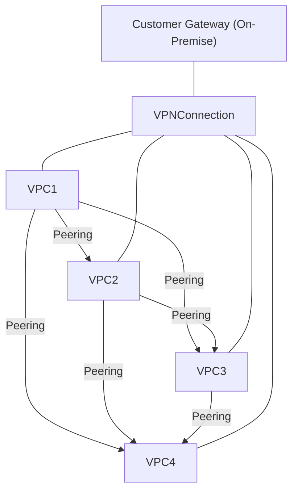
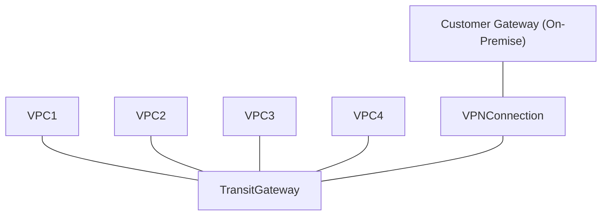

[userguide/what-is-amazon-vpc](https://docs.aws.amazon.com/vpc/latest/userguide/what-is-amazon-vpc.html)を読んだので、自分なりにまとめました。

## What is Amazon VPC

AWSリソースを論理的に独立した仮想ネットワーク内で起動でき、従来のデータセンターのように操作できるスケーラブルな(リソースの配置、接続性、セキュリティなど、仮想ネットワーク環境をフルで制御できる)サービス

## VPCs and subnets

- サブネット: VPC内のIPアドレス範囲。リソースはサブネットに配置
- デフォルトVPC（2013年12月4日以降のアカウントには自動で設定）
  - 各AZにpublic subnet
  - インターネットゲートウェイ
  - メインルートテーブルが全トラフィックをインターネットに送る設定
  - パブリックIPアドレスを持つインスタンスに自動的にパブリックDNSホスト名を割り当て、Amazon提供のDNSサーバーを通じてDNS解決を有効にするDNS設定
- non-default VPC: ユーザーが手動で作成するVPC
  - non-default subnets: ユーザーが作成したサブネット

## Route tables

- ルートテーブルはルート（各ルール）の集合体
- ルートには「宛先IP範囲」と「送信経路（ゲートウェイやインターフェイス）」を指定
- サブネットを特定のルートテーブルに明示的に関連付け可能

## Access the internet

- デフォルトVPC
  - インターネットゲートウェイがあるため、パブリックサブネット内のインスタンスは自動でインターネットに接続
  - 各インスタンスはパブリックIPv4とプライベートIPv4を持つ
- 非デフォルトサブネット
  - プライベートIPのみが割り当てられ、インターネットに接続できない
  - インターネット接続にはElastic IPやNATが必要
  - IPv6: 別のルート設定が必要

## Access a corporate or home network

AWSクラウドを自社のデータセンターやホームネットワークの拡張として利用できる

- AWSのVPCに別のネットワークからVPN接続が可能。
- 接続方法はIPsecを使用したAWS Site-to-Site VPN接続で行われます。
- VPN接続には[2つのトンネル](https://docs.aws.amazon.com/vpn/latest/s2svpn/VPNTunnels.html)が存在し、冗長性と高可用性を確保します。
  - 片方のトンネルがメンテナンスや障害などで利用できなくなった場合でも、もう一方のトンネルを通じて通信が継続できるように、一つのトンネルが利用できなくなった場合に、もう一つのトンネルに自動的にトラフィックが切り替わる。
  - 各トンネルはユニークなPublic IPアドレスを使用する
- AWS側では、接続先としてVirtual Private Gateway または Transit Gateway を使用します。
- ユーザー側（データセンターやホームネットワーク側）では、Customer Gateway Device（物理デバイスまたはソフトウェアアプライアンス）を設定して接続します。
以下のように内容を整形しました。

---

## Connect VPCs and Networks

1. VPC Peering
   1. 2つのVPC間で直接接続を作成し、インスタンス同士が同じネットワーク内にいるかのように通信できる
   2. VPC間のトラフィックはプライベートにルーティングされる。
2. Transit Gateway
   1. VPCとオンプレミスネットワークを相互接続することができる。
   2. Transit Gatewayはリージョン内の仮想ルーターとして機能し、VPCs、VPN connections、AWS Direct Connect gateways、Transit Gateway peering接続の間でトラフィックを中継する。

---

従来、VPC Peeringを使って複数のVPC間で相互通信を行うには、**フルメッシュ構成**を作成する必要がありました。つまり、各VPCが他のすべてのVPCと直接Peering接続を持つ形です。VPCが増えると、Peering接続の管理が複雑になります。

そこで、**Transit Gateway**を導入することでこの問題を解決できます。Transit Gatewayは、複数のVPCを中心に1つのハブとして配置し、それぞれのVPCはTransit Gatewayに接続（アタッチメント）するだけで、他のすべてのVPCとの相互通信が可能になります。

※補足

- Transit：通過、通行、乗り継ぎ、トランジット。
- [Transit Gateway Peering](https://docs.aws.amazon.com/ja_jp/vpc/latest/tgw/tgw-peering.html)：異なるAWSリージョンにあるトランジットゲートウェイ同士を接続する機能。

### フルメッシュ構成（VPC Peering + VPN接続 + Customer Gateway）

### Transit Gateway構成（VPC + VPN接続 + Customer Gateway）

## AWS private global network

- AZ内部同士および同一リージョン内のアベイラビリティゾーン（AZ）間の通信はaws private networkを経由する
- 異なるRegion間ではAWS private global networkを経由する(China Regionsは除外)
