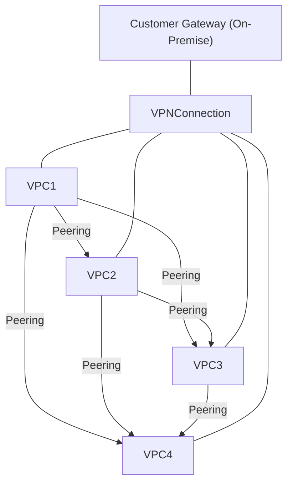
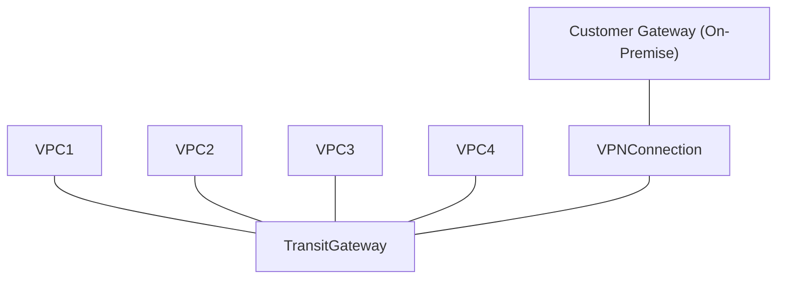

[userguide/what-is-amazon-vpc](https://docs.aws.amazon.com/vpc/latest/userguide/what-is-amazon-vpc.html)を読んだので、自分なりにまとめました。

## What is Amazon VPC

AWS リソースを論理的に独立した仮想ネットワーク内で起動でき、従来のデータセンターのように操作できるスケーラブルな(リソースの配置、接続性、セキュリティなど、仮想ネットワーク環境をフルで制御できる)サービス

## VPCs and subnets

- サブネット: VPC 内の IP アドレス範囲。リソースはサブネットに配置
- デフォルト VPC（2013 年 12 月 4 日以降のアカウントには自動で設定）
  - 各 AZ に public subnet
  - インターネットゲートウェイ
  - メインルートテーブルが全トラフィックをインターネットに送る設定
  - パブリック IP アドレスを持つインスタンスに自動的にパブリック DNS ホスト名を割り当て、Amazon 提供の DNS サーバーを通じて DNS 解決を有効にする DNS 設定
- non-default VPC: ユーザーが手動で作成する VPC
  - non-default subnets: ユーザーが作成したサブネット

## Route tables

- ルートテーブルはルート（各ルール）の集合体
- ルートには「宛先 IP 範囲」と「送信経路（ゲートウェイやインターフェイス）」を指定
- サブネットを特定のルートテーブルに明示的に関連付け可能

## Access the internet

- デフォルト VPC
  - インターネットゲートウェイがあるため、パブリックサブネット内のインスタンスは自動でインターネットに接続
  - 各インスタンスはパブリック IPv4 とプライベート IPv4 を持つ
- 非デフォルトサブネット
  - プライベート IP のみが割り当てられ、インターネットに接続できない
  - インターネット接続には Elastic IP や NAT が必要
  - IPv6: 別のルート設定が必要

## Access a corporate or home network

AWS クラウドを自社のデータセンターやホームネットワークの拡張として利用できる

- AWS の VPC に別のネットワークから VPN 接続が可能。
- 接続方法は IPsec を使用した AWS Site-to-Site VPN 接続で行われます。
- VPN 接続には[2 つのトンネル](https://docs.aws.amazon.com/vpn/latest/s2svpn/VPNTunnels.html)が存在し、冗長性と高可用性を確保します。
  - 片方のトンネルがメンテナンスや障害などで利用できなくなった場合でも、もう一方のトンネルを通じて通信が継続できるように、一つのトンネルが利用できなくなった場合に、もう一つのトンネルに自動的にトラフィックが切り替わる。
  - 各トンネルはユニークな Public IP アドレスを使用する
- AWS 側では、接続先として Virtual Private Gateway または Transit Gateway を使用します。
- ユーザー側（データセンターやホームネットワーク側）では、Customer Gateway Device（物理デバイスまたはソフトウェアアプライアンス）を設定して接続します。
  以下のように内容を整形しました。

---

## Connect VPCs and Networks

1. VPC Peering
   1. 2 つの VPC 間で直接接続を作成し、インスタンス同士が同じネットワーク内にいるかのように通信できる
   2. VPC 間のトラフィックはプライベートにルーティングされる。
2. Transit Gateway
   1. VPC とオンプレミスネットワークを相互接続することができる。
   2. Transit Gateway はリージョン内の仮想ルーターとして機能し、VPCs、VPN connections、AWS Direct Connect gateways、Transit Gateway peering 接続の間でトラフィックを中継する。

---

従来、VPC Peering を使って複数の VPC 間で相互通信を行うには、**フルメッシュ構成**を作成する必要がありました。つまり、各 VPC が他のすべての VPC と直接 Peering 接続を持つ形です。VPC が増えると、Peering 接続の管理が複雑になります。

そこで、**Transit Gateway**を導入することでこの問題を解決できます。Transit Gateway は、複数の VPC を中心に 1 つのハブとして配置し、それぞれの VPC は Transit Gateway に接続（アタッチメント）するだけで、他のすべての VPC との相互通信が可能になります。

※補足

- Transit：通過、通行、乗り継ぎ、トランジット。
- [Transit Gateway Peering](https://docs.aws.amazon.com/ja_jp/vpc/latest/tgw/tgw-peering.html)：異なる AWS リージョンにあるトランジットゲートウェイ同士を接続する機能。

### フルメッシュ構成（VPC Peering + VPN 接続 + Customer Gateway）

### Transit Gateway 構成（VPC + VPN 接続 + Customer Gateway）

## AWS private global network

- AZ 内部同士および同一リージョン内のアベイラビリティゾーン（AZ）間の通信は aws private network を経由する
- 異なる Region 間では AWS private global network を経由する(China Regions は除外)
