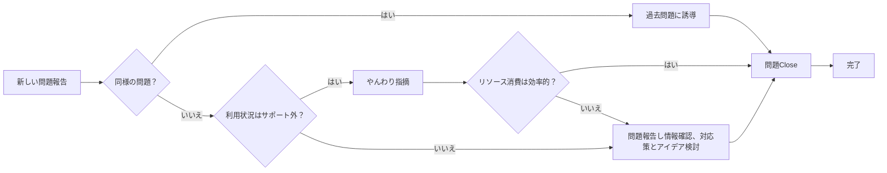
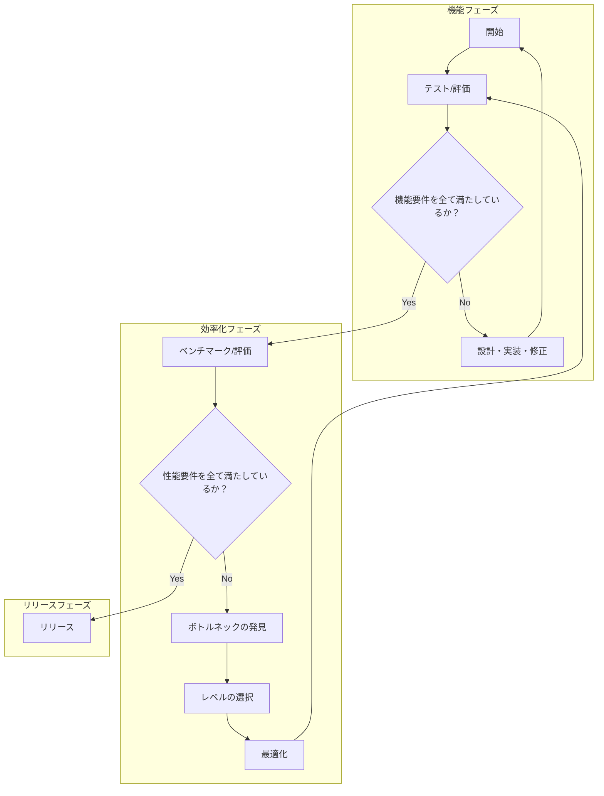

## 効率的なGoから私が学んだこと

### 1章 ソフトウェア効率性が重要

性能（パフォーマンス）とは全体的な実効の質を指します。単なる速度ではなく、以下の3つの要素の組み合わせで構成されています。

**性能 = 精度 × 効率 × 速度**

- **性能**：タスクやシステム全体が求められた基準をどれだけ満たしているか？
  - **精度**：タスクを正確に達成するために必要な正確さ
  - **効率**：余計な仕事をしていないか、資源を使いすぎていないか
  - **速度**：早くできているか

**精度**  
タスクを正確に達成するために必要な正確さを指します。

**速度**  
タスクを達成するために必要な作業をどれだけ早く行うかを示します。例えば、メモリ上の1GBのデータを圧縮する場合、一般的には約10秒（レイテンシー）がかかり、約100MB/sのスループットが得られます。

**効率**  
システムがタスクを達成するために消費するリソース（時間、メモリ、CPUなど）の割合を示します。例えば、64バイトの意味のあるデータをディスクから取得する操作で420バイトをRAMに割り当てた場合、メモリ効率は15.23%に相当します。

特に効率性が重要です。速度はほんのわずかな問題であり、リソースの無駄や不必要な消費こそが低速化を引き起こします。効率的にリソースを利用することで、全体のパフォーマンスが向上します。
以下は、章「効率的なGo入門」からの主要な情報の見出しと内容のまとめです。

---

### 2章 効率的なGo入門

#### Go言語の基本特徴

- **用途**: 汎用言語であり、特にシステムプログラミング向けに設計されています。
- **型**: 命令型言語で、プログラムの実行プロセスを詳細に制御可能。
- **型付け**: 静的型付けを採用し、コンパイル時に多くの最適化とエラーチェックが行われます。
- **信頼性と効率**: 上記特徴により、信頼性と効率が高いプログラムを作成可能。
- **呼称**: 一般的に「Go」または検索しやすい「Golang」とも呼ばれます。

※[システムプログラミング](https://appmaster.io/ja/glossary/shisutemupuroguramingu): 基礎となるハードウェアおよびオペレーティング システムと密接に対話するソフトウェア システムの開発を指します。

#### Go言語の開発者

- **Rob Pike(ロブ・パイク)**: UTF-8とPlan 9 OSの共同開発者、LimboやNewsqueakの共同作者。
- **Robert Griesemer(ロバート・グリーセマー)**: Sawzall言語の開発者、Niklaus Wirthの指導のもとで博士号を取得。
- **Ken Thompson(ケン・トンプソン)**: Unixシステムとgrepコマンドの原作者、UTF-8とPlan 9をRob Pikeと共同開発。

#### Go言語開発の背景

- 3人の開発者は、主流のプログラミング言語（C++, Java, Python）の問題点を改善するために新しい言語を作ることを目指しました。このプロジェクトは、2008年にフルタイムで進行し、2009年に公開されました。2012年にはバージョン1.0がリリースされました。

#### C++とJavaに対する不満

- 複雑性が高く機能が多すぎる。
- 大規模な変更時のコンパイル時間が長すぎる。
- 大規模プロジェクトでの更新やリファクタリングのコストが高い。
- 環境設定とテストデータベースの問題。

#### Goの開発目標

- より少ない労力で多くのことを実現する。
- 安全性や繰り返しの少なさを犠牲にしないシンプルなコード。
- 実行効率を保ちながら高速なコンパイルとビルド時間の短縮。
- 明示的なインポートにより、変更されたコードのみをコンパイルすることでビルド時間を短縮。
もちろんです。以下に同じフォーマットでまとめました：

#### 主な指導方針

- シンプルさ
- 安全性
- 可読性

#### Goの哲学

- 「[less is more](https://en.wikipedia.org/wiki/Less_is_more)」のパターンに従う
  - 「少ない方が多い」は、建築やデザイン、芸術など多くの分野でシンプルさと明確さが良いデザインにつながるという原則です。

#### コーディングスタイル

- gofmtというツールが保証
- 「gofmtのスタイルは誰の好みでもないが、gofmtはみんなの好みである "Gofmt's style is no one's favorite, yet gofmt is everyone's favorite."」

#### プログラミングにおける意思決定の簡素化

- エラーの扱いは１つの方法
- オブジェクトの書き方は１つの方法
- 並列処理の方法は１つの方法

#### パッケージとモジュール

- パッケージ：同ディレクトリ内のソースファイル群で、すべて同一の`package`文が必要。
- `go.mod`：Goアプリの依存関係とバージョンを記述するファイル。
- 実行可能ファイル：`func main()`含むファイルで、実行またはビルドが可能。インポート不可。
- スコープ：要素が大文字で始まる場合は公開、小文字は非公開。

#### 依存関係の透明性

- **未使用のインポートや循環的な依存関係はコンパイルエラーの原因となる**
  - 未使用のインポートは、コンパイル時にエラーを引き起こす。
  - 循環的な依存関係は、コンパイル時にエラーを引き起こす。

- **標準ライブラリからのインポート**
  - Import宣言でDomainで始まるパスを持たない場合は、標準ライブラリからのパッケージがインポートされる。
  - 標準ライブラリのパスは、`($go env GOROOT)/src/***`を参照する。

- **標準パッケージ以外のインポート**
  - 標準パッケージ以外は、インターネットドメイン名と特定のモジュール内のパッケージへのパスでの形でインポートされる。

```go
package main

// 標準ライブラリからのインポート
import (
    "fmt"
    "os"
)

// 外部パッケージからのインポート
import (
    "github.com/gin-gonic/gin"
    "golang.org/x/net/context"
)
```

#### CLI

| コマンド                    | 説明                                                                                       |
|-----------------------------|--------------------------------------------------------------------------------------------|
| `go bug`                    | ブラウザを開いて、公式のバグレポートを提出できる                                     |
| `go build -o <out path> <package>` | 指定したパッケージをビルドし、出力ファイルを指定したパスに保存する。                               |
| `go env`                    | Goの環境変数を表示するコマンド。                                                            |
| `go fmt`                    |  コードスタイルをフォーマットする。goimportsを使えばimportを整理してくれる           |
| `go get <package@version>`  | 指定したバージョンのパッケージを取得し、インストールする。   最新版が@latest                               |
| `go get <package@none>`     | 指定したパッケージを削除する。                                                             |
| `go help <command/topic>`                   | コマンドやトピックについてのドキュメントを表示                                                         |
| `go install <package>`      | go getと似ていて、与えられたパッケージが「実行可能」であればバイナリをインストールする                                                    |
| `go list <package>`                  | 指定したパッケージとその依存関係のリストを表示する。                                         |
| `go mod`                    | Goのモジュール管理に関するコマンド（例：init, tidy, vendor）。                                |
| `go test`                   | テストを実行するためのコマンド。                                                            |
| `go tool`                   | 高度なCLIツールを利用できます。徳の、パフォーマンス最適化については go tool pprofでチェックできる                           |
| `go vet`                    | Goコードを静的解析し、潜在的なエラーを検出する。                                             |

#### 単一のエラー処理

### Go言語におけるエラー処理の要点

1. **エラーインターフェースの利用**: Goでは、エラーは`error`インターフェースを通じて扱われる。これは`Error()`メソッドを持つ唯一のメソッドを持つインターフェースである。
2. **エラーチェックの必要性**: 関数やメソッドが`error`を返す場合、呼び出し元は返されたエラーが`nil`でないかを確認して、エラーがあれば適切に対処する。
3. **明示的なエラーの返却**: Goの関数は、エラーが発生した場合には明示的にエラーを返す必要がある。これにより、エラーの有無が明確になる。
4. **Panicの使用についての注意**: `panic`は例外的な状況で使われるべきであり、通常のエラー処理で使うべきではない。`panic`を使うとプログラムが予期せず終了することがあり、エラーの原因を隠蔽することにもつながる。

```go
package main

import (
    "fmt"
    "os"
)

func main() {
    _, err := os.Open("filename.txt")
    if err != nil {
        fmt.Println("エラーが発生しました:", err)
        return // エラーがある場合はここで処理を終了
    }

    // ファイル操作など、エラーがない場合の処理を続ける
    fmt.Println("ファイルを正常に開きました。")
}
```

#### Goランタイム

Goは仮想マシンを必要としない。

#### オブジェクト指向

- Goにはクラスが存在しませんが、それに相当する`struct`が存在します。
- `struct`はメソッドとフィールドを持つ構造体型です。
- 別の`struct`を自身の`struct`に含めることで、継承のように扱うことができます。
- メソッドには値レシーバーとポインターレシーバの二種類があります。
- 状態を変更しない場合は値レシーバーを、状態を変更する場合はポインターレシーバーを使用します。
- interfaceの定義が可能
  - c#のように特定のinterfaceを実装した特定の明示マーク`implement`は不要

```go
package main

import "fmt"

// Animal interface
type Animal interface {
 Describe()
}

type Cat struct {
 Name string
}

// AnimalInterfaceに定義されているメソッドを実装していればAnimalInterfaceとしてみなされる
func (c Cat) Describe() {
 fmt.Printf("This is %s, a cat.\n", c.Name)
}

// Dog struct
type Dog struct {
 Name  string
 Breed string
}

func (d Dog) Describe() {
 fmt.Printf("This is %s, and it is a %s.\n", d.Name, d.Breed)
}

func main() {
 animals := []Animal{
  Cat{Name: "Whiskers"},
  Dog{Name: "Rex", Breed: "Golden Retriever"},
 }

 for _, animal := range animals {
  animal.Describe()
 }
}
```

#### 合理的な最適化

「合理的な最適化」とは、その効果が明らかでなければなりません。開発者として、次の二つの重要な条件を確認する必要があります：

1. **最適化によりプログラムの追加的な作業が不要になること**：
   - この最適化を実施することで、将来的にプログラムに対する追加の修正や調整が必要とならない状態を目指します。つまり、一度の最適化で長期的にメンテナンスの手間が減少するようにすることが求められます。
2. **ソフトウェアの他の重要な品質や機能を犠牲にしないこと**：
   - 最適化を行うことでプログラムのパフォーマンスは向上しますが、それによってプログラムの可読性、柔軟性、移植性といった他の重要な品質や、ソフトウェアが提供する基本的な機能や拡張性を損なってはなりません。

※プログラミングに不慣れなうちは、どの操作が無駄か分からなくても問題ありません。経験を積むことで分かるようになります。推測で最適化するのではなく、実践を通じて学びましょう。

### 効率性向上のための問題解決プロセス

全ての問題が最適化を必要とするわけではありません。基本的な開発者のワークフローとして、最適化はまだこの段階では考慮しません。



ステップFで、この問題はCloseかOpenかのどちらかです。全てステップを経てOpenであれば、
その緊急性を検討し、次のステップをチームと話し合います。

### 最適化設計レベル

```text
システム
┌───────────────────────┐
│       モジュール        │
│ ┌─────────────────────┤
│ │アルゴリズムとデータ構造 │
│ ├─────────────────────┤
│ │   実装 | コンパイラー  │
│ ├─────────────────────┤
│ │オペレーティングシステム │
│ ├─────────────────────┤
│ │     ハードウェア      │
└───────────────────────┘
```

1. モジュールレベル
    「モジュール」とは、特定の機能（メソッド、インターフェースなどAPI）を持ち、簡単に交換・変更ができるよう設計された小さなソフトウェアの部品です。システムレベルでの最適化とは、どのモジュールを使うか、どのようにリンクするか、誰がどのコンポーネントをどれだけの頻度で呼び出すかを適切に変えることです。
2. アルゴリズムとデータ構造レベル
    アルゴリズムは、データを処理し解決策を導くための具体的な手順（バイナリサーチやクイックソートなど）です。データ構造は、アルゴリズムがデータを効率的に扱うために、適切なデータ構造の選択が不可欠です（配列、ハッシュマップ、連結リストなど）。
3. 実装レベル
    「コードレベルでの最適化」とは、プログラムが出す結果（アルゴリズム）は変えずに、プログラムの動きをより効率的にすることです。
4. OSレベル
    オペレーティングシステム（OS）はソフトウェアをプロセスやスレッドに分割し、CPUのスケジューリング、メモリ・IO管理、デバイスアクセスなどの基本サービスを提供します。
5. ハードウェアレベル
    ハードウェアレベルとは、私たちのコードから翻訳された命令のセットが、コンピューターのCPUユニットによって実行される部分です。

### 効率性の開発フロー



### 現代のコンピューターアーキテクチャにおけるCPU

```txt
          CPU
┌──────────────────────────────────┐
│  ┌─────────────────┐┌────┐┌────┐ │ 
│  │┌───────┐ ┌───┐  ││CPU ││CPU │ │ 
│  ││レジスタ│ │ L1│  │└────┘└────┘  │ 
│  │└───────┘ └───┘  │┌────┐┌────┐ │ 
│  │┌──────────┐┌───┐││CPU ││CPU │ │ 
│  ││コントロール││L2 ││└────┘└────┘ │ 
│  ││ユニット   │└───┘ │            │
│  │└──────────┘┌───┐│┌──────────┐ │
│  │            │ALU│││L3キャッシュ│ │ 
│  │            └───┘│└──────────┘ │ 
│  └─────────────────┘             │
└──────────────────────────────────┘
   │（USB/SATA/PCI-E）   |
 IOデバイス            メモリコントローラー
                               |
                              RAM
```

- コア
  - 複数のコアで構成されるCPUが存在する
  - 各コアは、RAMやレジスタ、Lキャッシュなどのメモリ層に保存されたデータを使って命令を実行する。
- RAM（ランダムアクセスメモリ）
  - コンピューターに電源が供給されている限り、データやプログラムコードを保存できる。
  - 高速で揮発性のメモリとしての役割を果たす。
- メモリコントローラー
  - RAMチップ上の情報を維持するために、RAMに一定の電力を供給する。
- I/O（入力出力）デバイス
  - CPUと外部または内部のデバイス間で相互作用する。
  - バイトストリームを送受信するデバイスを指す。
  - 例として、マウス、キーボード、スピーカー、モニター、HDDまたはSSDディスク、ネットワークインターフェイス、GPUなどがある。

### Goでアセンブリ表示

```bash
go mod init example.com/compile
touch sum.go
touch sum_test.go
go test -c
go tool objdump -S complie.test > sum_asm.s
```

sum.go

```go
package main

import "fmt"

// 数値の配列を合計する関数
func Sum(numbers []int) int {
 total := 0
 for _, number := range numbers {
  total += number
 }
 return total
}

func main() {
 // 配列を定義
 numbers := []int{11, 13, 17, 19, 23}

 // Sum関数を呼び出し
 result := Sum(numbers)

 // 結果を表示
 fmt.Println("Sum:", result)
}


```

sum_test.go

```go
package main

import "testing"

func TestSum(t *testing.T) {
 numbers := []int{1, 2}
 result := Sum(numbers)
 expected := 3
 if result != expected {
  t.Errorf("Sum(1, 2) = %d; want %d", result, expected)
 }
}

```

- **コンパイラー**: Goのコードを特定のアーキテクチャ（例えば、x86やARM）とオペレーティングシステム（例えば、WindowsやLinux）に適合する機械語（コンピュータが直接理解できる低レベル言語）に変換します。
- **リンカー**: 複数のオブジェクトファイルやライブラリや共有ファイルをリンクする。
- **ビルド**: コンパイルとリンクのプロセス全体を指します。
- **ロード**: 実行時に実行ファイルや共有ライブラリがメモリに読み込まれるプロセスです。

※詳しくは、[Introduction to the Go compiler](https://go.dev/src/cmd/compile/README)

コンパイラーがコードの検証や最適化を行い、デバッグのための重要なメタデータを準備します。
コンパイラーと**協働**する必要があり、逆らった作業はできません。
ただし、プログラマーは読みやすさや移植性に集中して実装することができます。

Goのバージョンを切り替える際には、コンパイラーの仕様変更が行われている可能性があるため、ベンチマークを実行して問題がないかを確認することが重要です。

<details>
<summary>`-gcflags -m` オプションについて</summary>

`-gcflags -m` オプションに数値を指定する場合、Go コンパイラに対する詳細な情報の出力レベルを制御できます。数値が大きくなるほど、より詳細な情報が提供されます。

### 詳細レベルの意味

- **`-m=1`**: 基本的なメモリ割り当て情報と逃げ分析（escape analysis）の結果を表示します。デフォルトでこのレベルが使われます。
  - 変数がヒープに割り当てられるか、スタックに割り当てられるか。
  - 関数がインライン化されるかどうか。
  - 基本的なメモリ割り当ての理由。

- **`-m=2`**: `-m=1` よりもさらに詳細なメモリ割り当て情報と逃げ分析の理由を表示します。
  - 変数が特定の場所に割り当てられる具体的な理由。
  - 追加のインライン化情報。
  - メモリ割り当てに関する詳細な解析結果。

- **`-m=3`** およびそれ以上の数値: `-m=2` よりもさらに詳細な情報を提供し、デバッグや最適化のための非常に詳細なメモリ割り当ておよびインライン化の決定プロセスを表示します。

</details>

## CPU

- 左によったコードは高速なコードを実現する。
  - CPUコアが次に実行する命令を予測しやすくなる。
  - 分岐だらけのコードは分岐予測の失敗が増え、パイプラインの効率が低下する。
  - 投機的実行が効果的に働く。
  - 分岐の失敗が減り、無駄なCPUサイクルが減少する。
  - 条件分岐を減らすコーディング技術が分岐予測を助け、高速な実行を可能にする。;

<details>
<summary>フリンの分類（Flynn's Taxonomy）</summary>

フリンの分類（Flynn's Taxonomy）は、コンピュータアーキテクチャの分類方法の一つで、1966年にマイケル・J・フリン（Michael J. Flynn）によって提案されました。この分類は、命令の流れ（Instruction stream）とデータの流れ（Data stream）の数によってコンピュータシステムを4つのカテゴリーに分類します。

1. **SISD（Single Instruction stream, Single Data stream）**:
    - 一つの命令ストリームが一つのデータストリームを処理する。
    - 一般的な単一プロセッサのシステム。

2. **SIMD（Single Instruction stream, Multiple Data stream）**:
    - 一つの命令ストリームが複数のデータストリームを同時に処理する。
    - ベクトルプロセッサやグラフィックス処理装置（GPU）などがこれに該当。

3. **MISD（Multiple Instruction stream, Single Data stream）**:
    - 複数の命令ストリームが一つのデータストリームを処理する。
    - このアーキテクチャは非常に珍しく、実用的な例はほとんど存在しない。

4. **MIMD（Multiple Instruction stream, Multiple Data stream）**:
    - 複数の命令ストリームが複数のデータストリームを同時に処理する。
    - マルチプロセッサシステムやクラスタコンピューティングシステムがこれに該当。

</details>

<details>
<summary>[パイプライン処理の基本概念](https://serip39.hatenablog.com/entry/2022/03/25/090000)</summary>

パイプライン処理とは、複数の命令を異なるステージで並行して処理する技術です。1つの命令が複数のステージを経る際に、各ステージが異なる命令を同時に処理することで、全体の処理効率を向上させます。

#### 例：5ステージのパイプライン

1つの命令が5つのステージを経ると仮定します。これらのステージは、例えば次のようになります：

1. **フェッチ（Fetch）**：命令をメモリから読み取る。
2. **デコード（Decode）**：命令を解釈する。
3. **実行（Execute）**：命令を実行する。
4. **メモリアクセス（Memory Access）**：必要に応じてメモリからデータを読み書きする。
5. **書き戻し（Write Back）**：結果をレジスタに書き戻す。

### パイプラインの動作

パイプライン処理では、命令が次々にステージを進む間に、各ステージが異なる命令を処理します。例えば、5つの命令（A, B, C, D, E）を以下のように処理します。

| サイクル | ステージ1 | ステージ2 | ステージ3 | ステージ4 | ステージ5 |
|----------|-----------|-----------|-----------|-----------|-----------|
| 1        | Aフェッチ |           |           |           |           |
| 2        | Bフェッチ | Aデコード |           |           |           |
| 3        | Cフェッチ | Bデコード | A実行     |           |           |
| 4        | Dフェッチ | Cデコード | B実行     | Aメモリアクセス |           |
| 5        | Eフェッチ | Dデコード | C実行     | Bメモリアクセス | A書き戻し |
| 6        |           | Eデコード | D実行     | Cメモリアクセス | B書き戻し |
| 7        |           |           | E実行     | Dメモリアクセス | C書き戻し |
| 8        |           |           |           | Eメモリアクセス | D書き戻し |
| 9        |           |           |           |           | E書き戻し |

このように、各命令が異なるステージで同時に処理されることで、1サイクルごとに新しい命令が開始され、最終的に1サイクルあたり5つの命令が並行して処理されます。

</details>

### Goランタイムスケジューラー

Go言語では、OSのスレッドの上に「ゴルーチン」という軽量な並行処理の仕組みを導入しています。ゴルーチンがシステムコールやI/O操作でブロックされると、Goのスケジューラーが素早く別のゴルーチンに切り替えます。

例えば、あるゴルーチンがネットワークからデータを受信するためにI/O操作を開始し、その操作が完了するまでブロックされたとします。
この場合、

 1. ブロックされたゴルーチンを一時停止。
 2. 他の実行可能なゴルーチンを探し、そのゴルーチンを同じOSスレッドまたは別のスレッドに割り当てて実行。
 3. ブロックされていたI/O操作が完了したら、停止していたゴルーチンを再開。

- [Scheduling In Go : Part II - Go Scheduler](https://www.ardanlabs.com/blog/2018/08/scheduling-in-go-part2.html)

2つのゴルーチンを起動する関数

```go
func anotherFunction(arg1 string) { /*...*/ }

func function() {
    // ① ...
    go func() {
        // ② ...
    }()

    go anotherFunction("argument1") ③

    return ④
}
```

① 現在のゴルーチンのスコープ
② 今すぐにでも並行して実行される新しいゴルーチンのスコープ
③ anotherFunctionは今にも並行して実行し始めるだろう
④ functionが終了しても、起動した2つのゴルーチンは引き続き実行可能

1. すべてのゴルーチンはフラットな階層構造を持ち、互いに対等である。
2. 唯一の例外はmain()関数で始まるメインゴルーチンで、これが終了するとプログラム全体が終了し、他のゴルーチンは強制的に終了する。
3. ゴルーチンはプロセス内の同じメモリ空間にアクセスでき、共有メモリを使ってデータの受け渡しが可能。
4. Goではほとんどの操作がアトミックでないため、並行してメモリにアクセスするとデータ競合や非決定的な動作が発生する可能性がある。
5. データ競合を防ぐためには、[アトミック関数](https://pkg.go.dev/sync/atomic)や[ミューテックス（](https://go-tour-jp.appspot.com/concurrency/9)ロックなどの同期技術）を使用する必要がある。

#### チャネル

1. メモリを共有することで通信を行うのではなく、通信を行うことでメモリを共有するべきである（"Effective Go"の概念）。
2. チャネルを使用してゴルーチン間の通信パイプラインを実装することで、データの共有を促す。
3. 同じメモリアドレスを共有するには同期処理が必要だが、チャネルを使うと自然に同期し、スレッドセーフが確保される。
4. チャネルの作成、送信、受信、クローズの方法：
   - `ch := make(chan <型>, バッファサイズ)`でチャネルを作成。
   - 指定された型の値をチャネルに送信。
   - チャネルから指定された型の値を読み取る。
   - 送信が終了したらチャネルをクローズし、リソースを解放。
5. チャネルのバッファリング機能を利用すると、送信側のゴルーチンがブロックされる前に複数の要素を送信でき、受信側のゴルーチンはチャネルが閉じられた後でも要素を読み取ることができる。

<details>
<summary>
バッファ付きチャネルの動作
</summary>

Go言語では、バッファ付きチャネルを使用することで、送信側はバッファがいっぱいになるまではブロックされずにデータを送信できます。例えば、バッファサイズ3のチャネルなら、3つの値を連続して送信可能です。4つ目の値を送信する際は、受信側が値を読み取るまで送信側はブロックされます。

受信側はチャネルから値を読み取ります。チャネルが閉じられても、バッファに残っている値はすべて読み取れます。ただし、チャネルが閉じられた後、新しい値は送信できず、同じ値を何度も読み取ることもできません。

</details>

チャネルを介したメモリセーフなマルチゴルーチン通信の一例

```go
func sharingWithChannel() (sum int64) {
    result := make(chan int64) ①

    concurrentFn := func() {
        // ...
        result <- randInt64() ②
    }

    go concurrentFn()
    go concurrentFn()
    go concurrentFn()

    for i := 0; i < 3; i++ {
        sum += <-result ④
    }

    close(result) ⑤
    return sum
}
```

① Goでは、ch := make(chan <型>, バッファサイズ) という構文でチャネルを作成できます。
② 指定された型の値をチャネルに送信できます。
③ 受信する予定の正確なメッセージの数についての数を悪用しているので、この例ではsync.
WaitGroupは必要ないことに注意してください。もしそのような情報がない場合は、WaitGroup
や他のメカニズムが必要になります。
④ チャネルから指定された型の値を読み取れます。
⑤ また、もう何も送信する予定がないのであれば、チャネルをクローズすべきです。これにより
リソースが解放され、特定の送受信フローがブロックされなくなります（これについては後で説明
します）。

### Goメモリリソースの使用方法

#### mmapを利用したメモリ

```bash
$ ./run_and_check.sh
  PID      VSZ    RSS COMM
42511 410075680   1120 go
  PID      VSZ    RSS COMM
42511 411371984  21696 go

```

1. **PID**:
   - `42511`
   - プロセスIDです。システム上の一意の識別子で、この値を使用して特定のプロセスに対する操作を行います。

2. **VSZ**:
   - `411371984`
   - 仮想メモリサイズ（Virtual Memory Size）です。プロセスが使用する仮想メモリの総量をバイト単位で表します。この場合、約411MB（411371984バイト）です。仮想メモリには、物理メモリに存在しないページやマップされたファイルのサイズなどが含まれます。

3. **RSS**:
   - `21696`
   - 常駐セットサイズ（Resident Set Size）です。プロセスが実際に使用している物理メモリのサイズ（キロバイト単位）を表します。この場合、約21MB（21696キロバイト）です。RSSは、現在物理メモリ上に読み込まれているプロセスのメモリ部分を表し、スワップアウトされている部分は含まれません。

4. **COMM**:
   - `go`
   - 実行中のコマンドの名前です。この場合、Goランタイムが実行していることを示しています。

プロセスID `42511` のGoプログラムが約411MBの仮想メモリを使用し、そのうち約21MBが物理メモリに読み込まれていることがわかります。仮想メモリの大部分は、メモリマッピングされたファイルやヒープの空間などに対応しており、実際に使用されている物理メモリ（RSS）はその一部です。

```go
package main

import (
 "fmt"
 "os"

 "github.com/efficientgo/core/merrors"
 "golang.org/x/sys/unix"
)

type MemoryMap struct {
 f *os.File // 匿名なら nil
 b []byte
}

// OpenFileBacked は、指定されたパスからファイルによってバックアップされたメモリマップを作成します。
func OpenFileBacked(path string, size int) (*MemoryMap, error) {
 f, err := os.OpenFile(path, os.O_RDWR, 0644)
 if err != nil {
  return nil, err
 }

 b, err := unix.Mmap(int(f.Fd()), 0, size, unix.PROT_READ|unix.PROT_WRITE, unix.MAP_SHARED)
 if err != nil {
  return nil, merrors.New(f.Close(), err).Err()
 }

 return &MemoryMap{f: f, b: b}, nil
}

// Close はメモリマップを解除し、ファイルを閉じます。
func (m *MemoryMap) Close() error {
 errs := merrors.New()
 errs.Add(unix.Munmap(m.b))
 errs.Add(m.f.Close())
 return errs.Err()
}

// Bytes はメモリマップされたバイト配列を返します。
func (m *MemoryMap) Bytes() []byte { return m.b }

func main() {
 // テスト用のファイルパスとサイズ
 path := "test1mbfile.out"
 size := 1 * 1024 * 1024 // 1MB

 // メモリマップを作成
 mm, err := OpenFileBacked(path, size)
 if err != nil {
  fmt.Println("Error opening file:", err)
  return
 }
 defer func() {
  if err := mm.Close(); err != nil {
   fmt.Println("Error closing memory map:", err)
  }
 }()

 // メモリマップされたデータにアクセス
 fmt.Println("Before modification:")
 fmt.Println("Reading the 5000th byte:", mm.Bytes()[5000])
 fmt.Println("Reading the 100 000th byte:", mm.Bytes()[100000])
 fmt.Println("Reading the 104 000th byte:", mm.Bytes()[104000])

 // メモリマップされたデータを書き換え
 mm.Bytes()[5000] = 'A'
 mm.Bytes()[100000] = 'B'
 mm.Bytes()[104000] = 'C'

 fmt.Println("After modification:")
 fmt.Println("Reading the 5000th byte:", mm.Bytes()[5000])
 fmt.Println("Reading the 100 000th byte:", mm.Bytes()[100000])
 fmt.Println("Reading the 104 000th byte:", mm.Bytes()[104000])
}

```

#### 仮想メモリ（VSZ）と物理メモリ（RSS）の使用状況を確認

1. **デバッグ開始**:
   VS CodeでGoプログラムのデバッグを開始し、途中でブレークポイントを設定してプログラムを停止させます。
2. **プロセスIDの確認**:
   ターミナルで以下のコマンドを実行し、DelveデバッガのプロセスID（PID）を確認します。

   ```bash
   $ ps aux | grep dlv
   {user}       52771   0.0  0.0 410069680    960 s007  R+    8:54AM   0:00.00 grep dlv
   {user}      52280   0.0  0.1 415623216  18048   ??  S     8:53AM   0:00.23 /Users/{user}/go/bin/dlv dap --listen=127.0.0.1:49378 --log-dest=3
   ```

   `{user}` はあなたのユーザー名です。ここで `52280` はDelveデバッガのプロセスIDです。
3. **メモリ使用量の確認**:
   取得したプロセスIDを使って、以下のコマンドでプロセスのメモリ使用量を確認します。

   ```bash
   $ ps -o pid,vsz,rss,comm -p 52280
     PID      VSZ    RSS COMM
   52280 415623216  21744 /Users/{user}/go/bin/dlv
   ```

   - **VSZ (Virtual Memory Size)**: 仮想メモリの使用量（バイト単位）。
   - **RSS (Resident Set Size)**: 物理メモリの使用量（キロバイト単位）。
   - **COMM**: 実行中のコマンド名。

```go
package main

import (
 "fmt"
 "os"
)

func main() {
 // 600MBのファイルを開く
 f, err := os.Open("test68mbfile.out")
 if err != nil {
  fmt.Println("Error opening file:", err)
  return
 }
 defer f.Close()

 // 600MBのバッファを作成
 b := make([]byte, 600*1024*1024)

 // ファイルからバッファにデータを読み込む
 if _, err := f.Read(b); err != nil {
  fmt.Println("Error reading file:", err)
  return
 }

 // バッファ内の特定の位置のデータを表示
 fmt.Println("Reading the 5000th byte:", b[5000])
 fmt.Println("Reading the 100 000th byte:", b[100000])
 fmt.Println("Reading the 104 000th byte:", b[104000])
}
```
