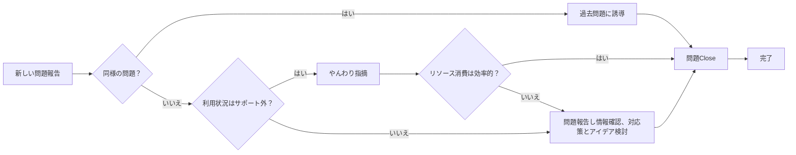
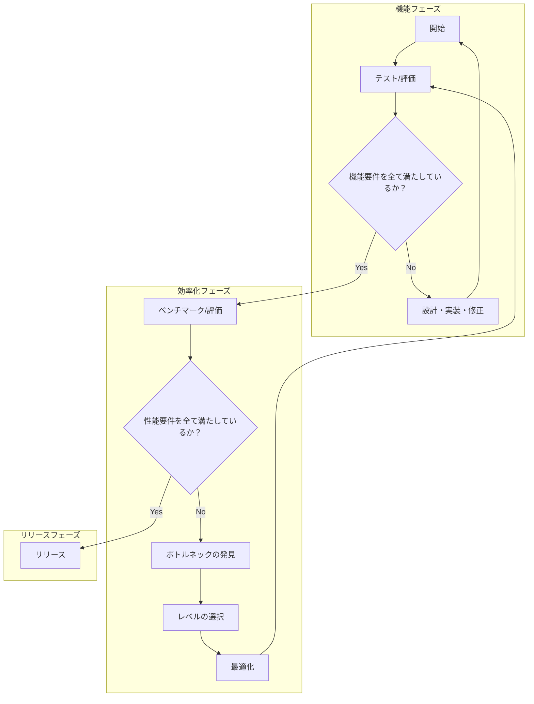

## 効率的なGoから私が学んだこと

### 1章 ソフトウェア効率性が重要

性能（パフォーマンス）とは全体的な実効の質を指します。単なる速度ではなく、以下の3つの要素の組み合わせで構成されています。

**性能 = 精度 × 効率 × 速度**

- **性能**：タスクやシステム全体が求められた基準をどれだけ満たしているか？
  - **精度**：タスクを正確に達成するために必要な正確さ
  - **効率**：余計な仕事をしていないか、資源を使いすぎていないか
  - **速度**：早くできているか

**精度**  
タスクを正確に達成するために必要な正確さを指します。

**速度**  
タスクを達成するために必要な作業をどれだけ早く行うかを示します。例えば、メモリ上の1GBのデータを圧縮する場合、一般的には約10秒（レイテンシー）がかかり、約100MB/sのスループットが得られます。

**効率**  
システムがタスクを達成するために消費するリソース（時間、メモリ、CPUなど）の割合を示します。例えば、64バイトの意味のあるデータをディスクから取得する操作で420バイトをRAMに割り当てた場合、メモリ効率は15.23%に相当します。

特に効率性が重要です。速度はほんのわずかな問題であり、リソースの無駄や不必要な消費こそが低速化を引き起こします。効率的にリソースを利用することで、全体のパフォーマンスが向上します。
以下は、章「効率的なGo入門」からの主要な情報の見出しと内容のまとめです。

---

### 2章 効率的なGo入門

#### Go言語の基本特徴

- **用途**: 汎用言語であり、特にシステムプログラミング向けに設計されています。
- **型**: 命令型言語で、プログラムの実行プロセスを詳細に制御可能。
- **型付け**: 静的型付けを採用し、コンパイル時に多くの最適化とエラーチェックが行われます。
- **信頼性と効率**: 上記特徴により、信頼性と効率が高いプログラムを作成可能。
- **呼称**: 一般的に「Go」または検索しやすい「Golang」とも呼ばれます。

※[システムプログラミング](https://appmaster.io/ja/glossary/shisutemupuroguramingu): 基礎となるハードウェアおよびオペレーティング システムと密接に対話するソフトウェア システムの開発を指します。

#### Go言語の開発者

- **Rob Pike(ロブ・パイク)**: UTF-8とPlan 9 OSの共同開発者、LimboやNewsqueakの共同作者。
- **Robert Griesemer(ロバート・グリーセマー)**: Sawzall言語の開発者、Niklaus Wirthの指導のもとで博士号を取得。
- **Ken Thompson(ケン・トンプソン)**: Unixシステムとgrepコマンドの原作者、UTF-8とPlan 9をRob Pikeと共同開発。

#### Go言語開発の背景

- 3人の開発者は、主流のプログラミング言語（C++, Java, Python）の問題点を改善するために新しい言語を作ることを目指しました。このプロジェクトは、2008年にフルタイムで進行し、2009年に公開されました。2012年にはバージョン1.0がリリースされました。

#### C++とJavaに対する不満

- 複雑性が高く機能が多すぎる。
- 大規模な変更時のコンパイル時間が長すぎる。
- 大規模プロジェクトでの更新やリファクタリングのコストが高い。
- 環境設定とテストデータベースの問題。

#### Goの開発目標

- より少ない労力で多くのことを実現する。
- 安全性や繰り返しの少なさを犠牲にしないシンプルなコード。
- 実行効率を保ちながら高速なコンパイルとビルド時間の短縮。
- 明示的なインポートにより、変更されたコードのみをコンパイルすることでビルド時間を短縮。
もちろんです。以下に同じフォーマットでまとめました：

#### 主な指導方針

- シンプルさ
- 安全性
- 可読性

#### Goの哲学

- 「[less is more](https://en.wikipedia.org/wiki/Less_is_more)」のパターンに従う
  - 「少ない方が多い」は、建築やデザイン、芸術など多くの分野でシンプルさと明確さが良いデザインにつながるという原則です。

#### コーディングスタイル

- gofmtというツールが保証
- 「gofmtのスタイルは誰の好みでもないが、gofmtはみんなの好みである "Gofmt's style is no one's favorite, yet gofmt is everyone's favorite."」

#### プログラミングにおける意思決定の簡素化

- エラーの扱いは１つの方法
- オブジェクトの書き方は１つの方法
- 並列処理の方法は１つの方法

#### パッケージとモジュール

- パッケージ：同ディレクトリ内のソースファイル群で、すべて同一の`package`文が必要。
- `go.mod`：Goアプリの依存関係とバージョンを記述するファイル。
- 実行可能ファイル：`func main()`含むファイルで、実行またはビルドが可能。インポート不可。
- スコープ：要素が大文字で始まる場合は公開、小文字は非公開。

#### 依存関係の透明性

- **未使用のインポートや循環的な依存関係はコンパイルエラーの原因となる**
  - 未使用のインポートは、コンパイル時にエラーを引き起こす。
  - 循環的な依存関係は、コンパイル時にエラーを引き起こす。

- **標準ライブラリからのインポート**
  - Import宣言でDomainで始まるパスを持たない場合は、標準ライブラリからのパッケージがインポートされる。
  - 標準ライブラリのパスは、`($go env GOROOT)/src/***`を参照する。

- **標準パッケージ以外のインポート**
  - 標準パッケージ以外は、インターネットドメイン名と特定のモジュール内のパッケージへのパスでの形でインポートされる。

```go
package main

// 標準ライブラリからのインポート
import (
    "fmt"
    "os"
)

// 外部パッケージからのインポート
import (
    "github.com/gin-gonic/gin"
    "golang.org/x/net/context"
)
```

#### CLI

| コマンド                    | 説明                                                                                       |
|-----------------------------|--------------------------------------------------------------------------------------------|
| `go bug`                    | ブラウザを開いて、公式のバグレポートを提出できる                                     |
| `go build -o <out path> <package>` | 指定したパッケージをビルドし、出力ファイルを指定したパスに保存する。                               |
| `go env`                    | Goの環境変数を表示するコマンド。                                                            |
| `go fmt`                    |  コードスタイルをフォーマットする。goimportsを使えばimportを整理してくれる           |
| `go get <package@version>`  | 指定したバージョンのパッケージを取得し、インストールする。   最新版が@latest                               |
| `go get <package@none>`     | 指定したパッケージを削除する。                                                             |
| `go help <command/topic>`                   | コマンドやトピックについてのドキュメントを表示                                                         |
| `go install <package>`      | go getと似ていて、与えられたパッケージが「実行可能」であればバイナリをインストールする                                                    |
| `go list <package>`                  | 指定したパッケージとその依存関係のリストを表示する。                                         |
| `go mod`                    | Goのモジュール管理に関するコマンド（例：init, tidy, vendor）。                                |
| `go test`                   | テストを実行するためのコマンド。                                                            |
| `go tool`                   | 高度なCLIツールを利用できます。徳の、パフォーマンス最適化については go tool pprofでチェックできる                           |
| `go vet`                    | Goコードを静的解析し、潜在的なエラーを検出する。                                             |

#### 単一のエラー処理

### Go言語におけるエラー処理の要点

1. **エラーインターフェースの利用**: Goでは、エラーは`error`インターフェースを通じて扱われる。これは`Error()`メソッドを持つ唯一のメソッドを持つインターフェースである。
2. **エラーチェックの必要性**: 関数やメソッドが`error`を返す場合、呼び出し元は返されたエラーが`nil`でないかを確認して、エラーがあれば適切に対処する。
3. **明示的なエラーの返却**: Goの関数は、エラーが発生した場合には明示的にエラーを返す必要がある。これにより、エラーの有無が明確になる。
4. **Panicの使用についての注意**: `panic`は例外的な状況で使われるべきであり、通常のエラー処理で使うべきではない。`panic`を使うとプログラムが予期せず終了することがあり、エラーの原因を隠蔽することにもつながる。

```go
package main

import (
    "fmt"
    "os"
)

func main() {
    _, err := os.Open("filename.txt")
    if err != nil {
        fmt.Println("エラーが発生しました:", err)
        return // エラーがある場合はここで処理を終了
    }

    // ファイル操作など、エラーがない場合の処理を続ける
    fmt.Println("ファイルを正常に開きました。")
}
```

#### Goランタイム

Goは仮想マシンを必要としない。

#### オブジェクト指向

- Goにはクラスが存在しませんが、それに相当する`struct`が存在します。
- `struct`はメソッドとフィールドを持つ構造体型です。
- 別の`struct`を自身の`struct`に含めることで、継承のように扱うことができます。
- メソッドには値レシーバーとポインターレシーバの二種類があります。
- 状態を変更しない場合は値レシーバーを、状態を変更する場合はポインターレシーバーを使用します。
- interfaceの定義が可能
  - c#のように特定のinterfaceを実装した特定の明示マーク`implement`は不要

```go
package main

import "fmt"

// Animal interface
type Animal interface {
 Describe()
}

type Cat struct {
 Name string
}

// AnimalInterfaceに定義されているメソッドを実装していればAnimalInterfaceとしてみなされる
func (c Cat) Describe() {
 fmt.Printf("This is %s, a cat.\n", c.Name)
}

// Dog struct
type Dog struct {
 Name  string
 Breed string
}

func (d Dog) Describe() {
 fmt.Printf("This is %s, and it is a %s.\n", d.Name, d.Breed)
}

func main() {
 animals := []Animal{
  Cat{Name: "Whiskers"},
  Dog{Name: "Rex", Breed: "Golden Retriever"},
 }

 for _, animal := range animals {
  animal.Describe()
 }
}
```

#### 合理的な最適化

「合理的な最適化」とは、その効果が明らかでなければなりません。開発者として、次の二つの重要な条件を確認する必要があります：

1. **最適化によりプログラムの追加的な作業が不要になること**：
   - この最適化を実施することで、将来的にプログラムに対する追加の修正や調整が必要とならない状態を目指します。つまり、一度の最適化で長期的にメンテナンスの手間が減少するようにすることが求められます。
2. **ソフトウェアの他の重要な品質や機能を犠牲にしないこと**：
   - 最適化を行うことでプログラムのパフォーマンスは向上しますが、それによってプログラムの可読性、柔軟性、移植性といった他の重要な品質や、ソフトウェアが提供する基本的な機能や拡張性を損なってはなりません。

※プログラミングに不慣れなうちは、どの操作が無駄か分からなくても問題ありません。経験を積むことで分かるようになります。推測で最適化するのではなく、実践を通じて学びましょう。

### 効率性向上のための問題解決プロセス

全ての問題が最適化を必要とするわけではありません。基本的な開発者のワークフローとして、最適化はまだこの段階では考慮しません。



ステップFで、この問題はCloseかOpenかのどちらかです。全てステップを経てOpenであれば、
その緊急性を検討し、次のステップをチームと話し合います。

### 最適化設計レベル

```text
システム
┌───────────────────────┐
│       モジュール        │
│ ┌─────────────────────┤
│ │アルゴリズムとデータ構造 │
│ ├─────────────────────┤
│ │   実装 | コンパイラー  │
│ ├─────────────────────┤
│ │オペレーティングシステム │
│ ├─────────────────────┤
│ │     ハードウェア      │
└───────────────────────┘
```

1. モジュールレベル
    「モジュール」とは、特定の機能（メソッド、インターフェースなどAPI）を持ち、簡単に交換・変更ができるよう設計された小さなソフトウェアの部品です。システムレベルでの最適化とは、どのモジュールを使うか、どのようにリンクするか、誰がどのコンポーネントをどれだけの頻度で呼び出すかを適切に変えることです。
2. アルゴリズムとデータ構造レベル
    アルゴリズムは、データを処理し解決策を導くための具体的な手順（バイナリサーチやクイックソートなど）です。データ構造は、アルゴリズムがデータを効率的に扱うために、適切なデータ構造の選択が不可欠です（配列、ハッシュマップ、連結リストなど）。
3. 実装レベル
    「コードレベルでの最適化」とは、プログラムが出す結果（アルゴリズム）は変えずに、プログラムの動きをより効率的にすることです。
4. OSレベル
    オペレーティングシステム（OS）はソフトウェアをプロセスやスレッドに分割し、CPUのスケジューリング、メモリ・IO管理、デバイスアクセスなどの基本サービスを提供します。
5. ハードウェアレベル
    ハードウェアレベルとは、私たちのコードから翻訳された命令のセットが、コンピューターのCPUユニットによって実行される部分です。

### 効率性の開発フロー



### 現代のコンピューターアーキテクチャにおけるCPU

```txt
          CPU
┌──────────────────────────────────┐
│  ┌─────────────────┐┌────┐┌────┐ │ 
│  │┌───────┐ ┌───┐  ││CPU ││CPU │ │ 
│  ││レジスタ│ │ L1│  │└────┘└────┘  │ 
│  │└───────┘ └───┘  │┌────┐┌────┐ │ 
│  │┌──────────┐┌───┐││CPU ││CPU │ │ 
│  ││コントロール││L2 ││└────┘└────┘ │ 
│  ││ユニット   │└───┘ │            │
│  │└──────────┘┌───┐│┌──────────┐ │
│  │            │ALU│││L3キャッシュ│ │ 
│  │            └───┘│└──────────┘ │ 
│  └─────────────────┘             │
└──────────────────────────────────┘
   │（USB/SATA/PCI-E）   |
 IOデバイス            メモリコントローラー
                               |
                              RAM
```

- コア
  - 複数のコアで構成されるCPUが存在する
  - 各コアは、RAMやレジスタ、Lキャッシュなどのメモリ層に保存されたデータを使って命令を実行する。
- RAM（ランダムアクセスメモリ）
  - コンピューターに電源が供給されている限り、データやプログラムコードを保存できる。
  - 高速で揮発性のメモリとしての役割を果たす。
- メモリコントローラー
  - RAMチップ上の情報を維持するために、RAMに一定の電力を供給する。
- I/O（入力出力）デバイス
  - CPUと外部または内部のデバイス間で相互作用する。
  - バイトストリームを送受信するデバイスを指す。
  - 例として、マウス、キーボード、スピーカー、モニター、HDDまたはSSDディスク、ネットワークインターフェイス、GPUなどがある。

### Goでアセンブリ表示

```bash
go mod init example.com/compile
touch sum.go
touch sum_test.go
go test -c
go tool objdump -S complie.test > sum_asm.s
```

sum.go

```go
package main

import "fmt"

// 数値の配列を合計する関数
func Sum(numbers []int) int {
 total := 0
 for _, number := range numbers {
  total += number
 }
 return total
}

func main() {
 // 配列を定義
 numbers := []int{11, 13, 17, 19, 23}

 // Sum関数を呼び出し
 result := Sum(numbers)

 // 結果を表示
 fmt.Println("Sum:", result)
}


```

sum_test.go

```go
package main

import "testing"

func TestSum(t *testing.T) {
 numbers := []int{1, 2}
 result := Sum(numbers)
 expected := 3
 if result != expected {
  t.Errorf("Sum(1, 2) = %d; want %d", result, expected)
 }
}

```
