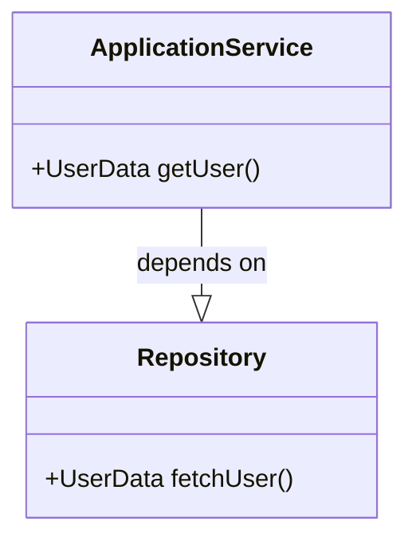
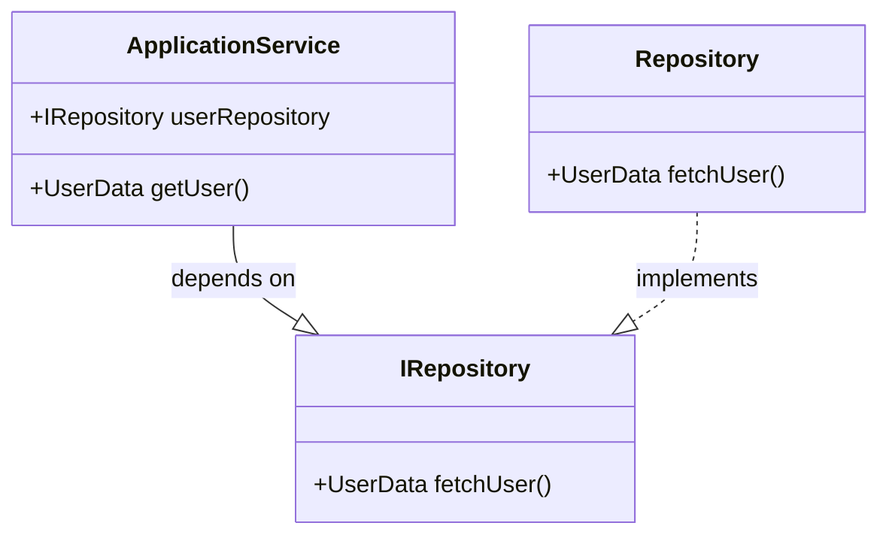

## 依存関係の逆転の原則(Dependency Inversion Principle, DIP)

### 定義

上位のモジュールは下位のモジュールに依存してはならい。どちらのモジュールも、抽象に依存すべきである。
抽象は、実装の詳細に依存すべきではない。詳細が抽象に依存すべきである。

_良くない実装パターン_

この例では、ApplicationService が Repository に直接依存しています。これは、高レベルモジュールが低レベルモジュールに直接依存していることを示しており、DIP に反しています。



_理想的な実装パターン_

この例では、ApplicationService と Repository が共に同じ抽象（インターフェイス）に依存しています。IRepository というインターフェイスが導入され、ApplicationService はこのインターフェイスに依存することで、具体的な Repository の実装から独立します。



### インターフェース依存のメリット

1. 開発者モードと本番モードでの実装クラスの使い分け
   - **環境適応性**：開発時にはデータベースへの接続を模倣するテスト用リポジトリを使用し、本番環境では実際のデータベース操作を行う本番用リポジトリを使用することができます。これにより、環境に応じた適切な実装を動的に選択し、開発の効率を向上させます。
2. Unit テストの容易化
   - **テストの独立性**：実装をモックやスタブに置き換えることで、外部システムへの依存なしにコンポーネントの機能を検証できます。これにより、再現性のあるテスト環境を確保できます。

### Service Locator と IoC Container

##### Service Locator

Service Locator パターンは、アプリケーション内で使用されるすべてのサービスへのアクセスを提供する中央レジストリを使用します。このパターンでは、クライアントがサービスロケーターにサービスを要求し、サービスロケーターが適切なサービスのインスタンスを返します。依存性の解決は、実行時に動的に行われます。

```csharp
public static class ServiceLocator {
    private static readonly IDictionary<Type, object> _services = new Dictionary<Type, object>();

    public static void RegisterService<T>(object service) {
        _services[typeof(T)] = service;
    }

    public static T Resolve<T>() {
        return (T)_services[typeof(T)];
    }
}

public interface IRepository {
    string Query();
}

public class Repository : IRepository {
    public string Query() => "Repository Query";
}

public class ApplicationService {
    private readonly IRepository _repo;

    public ApplicationService() {
        this._repo = ServiceLocator.Resolve<IRepository>();
    }
}

// Usage
public class Program {
    public static void Main() {
        ServiceLocator.RegisterService<IRepository>(new Repository());
        var service = new ApplicationService();
    }
}

```

##### IoC Container

IoC（Inversion of Control）コンテナは、オブジェクトのライフサイクルと依存関係の管理を行うためのツールです。依存性注入（DI）を利用して、アプリケーションのコンポーネントに依存オブジェクトを供給します。IoC コンテナはコードから依存性解決の詳細を抽象化し、設定ファイルやアノテーションによって管理されます。

```csharp
using Microsoft.Extensions.DependencyInjection;

public class Program {
    public static void Main() {
        var services = new ServiceCollection();
        services.AddTransient<IRepository, Repository>();
        var serviceProvider = services.BuildServiceProvider();

        var service = serviceProvider.GetService<ApplicationService>();
    }
}

public interface IRepository {
    string Query();
}

public class Repository : IRepository {
    public string Query() => "Repository Query";
}

public class ApplicationService {
    private readonly IRepository _repo;

    public ApplicationService(IRepository repo) {
        this._repo = repo;
    }
}
```

##### IoC Container の利点と Service Locator の問題点

IoC（Inversion of Control）コンテナを使用する理由は、その明示的な依存性の注入にあります。IoC コンテナを用いることで、クラスが依存しているコンポーネントがコンストラクタを通じて注入されるため、依存関係が明確になります。これにより、アプリケーションのコードがより透明性を持ち、テストや保守が容易になります。

一方、Service Locator パターンは、実行時まで依存性が明らかでないため、依存するオブジェクトが利用可能でない場合に実行時エラーを引き起こすリスクがあります。また、ユニットテストの際に依存関係を透過的に管理できないため、テストが困難になりがちです。

したがって、IoC を使う方がいいかなと思います。

### 参考

- [ドメイン駆動設計入門](https://www.seshop.com/product/detail/20675)
- [Best Practice - An Introduction To Domain-Driven Design](https://learn.microsoft.com/en-us/archive/msdn-magazine/2009/february/best-practice-an-introduction-to-domain-driven-design)
- [Dependency inversion](https://learn.microsoft.com/en-us/dotnet/architecture/modern-web-apps-azure/architectural-principles##dependency-inversion)
