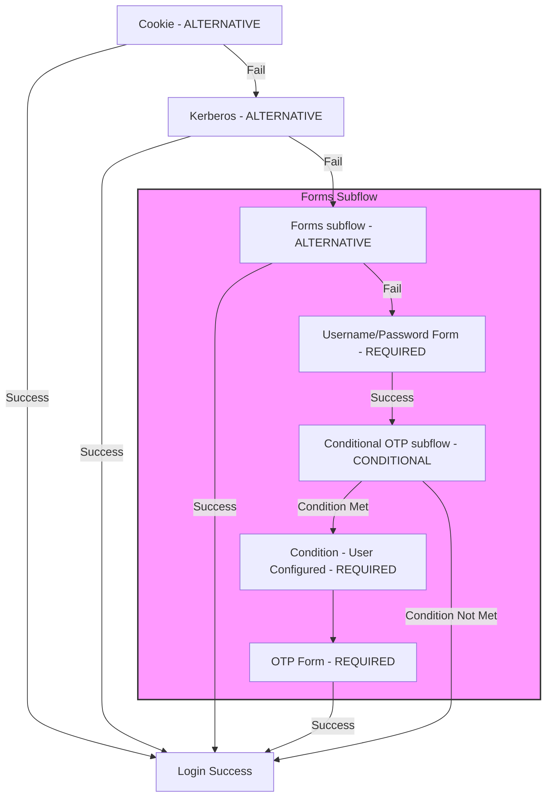

## Authentication SPIについて

- Keycloakには、さまざまな認証メカニズム（kerberos、password、otp など）が含まれているが、これらが要件を満たさない場合、カスタムプラグインを作成して新たに追加することが可能。
- SPI（Service Provider Interface）を提供しており、これを使用してカスタムの認証メカニズムを作成できる。
- Admin Consoleでは、カスタムプラグインの適用、順序設定、設定変更が可能。

## 登録フォームと詳細なSPI

- Keycloakはシンプルな登録フォームを提供しており、reCAPTCHA の有効化・無効化などの設定が可能。
- 同じSPIを利用して、新しいページを追加したり、登録Flowを完全に再実装することが可能。
- 詳細なSPIを利用して、組み込みの登録フォームに特定のバリデーションやユーザー拡張を追加することも可能。

## Required Action（Required Action）について

- 「Required Action（Required Action）」は、ユーザーが認証後に必ず実行しなければならないアクション。
- アクションが成功すると、同じアクションを再度行う必要はない。
- 例：「パスワードリセット」はRequired Actionの一つであり、初回ログイン後に新しいパスワードを設定する必要があるが、完了後は再度求められない。
- KeycloakにはビルトインのRequired Actionがいくつか用意されており、独自のRequired Actionを作成して追加することも可能。

## Authentication Terms and Relationships

1. Authentication Flow
   - Authentication Flowは、ログインや登録時に必要なすべての認証ステップをまとめた「Flow」です。
   - Flowは複数のAuthenticatorで構成され、他のFlowを含むこともできます。各Flowの内容はAdmin Consoleで確認でき、ブラウザログインや登録用に異なるFlowを設定できます。

2. Authenticator
   - Authenticatorは、Flow内で認証や特定のアクションを実行するプラグイン可能なコンポーネントで、認証ロジックを持ちます。
   - 通常はシングルトン（一つのインスタンスのみ存在）であり、ユーザーがログイン時に入力したパスワードの検証やOTPの生成などの役割を担います。

3. Execution
   - Executionは、AuthenticatorをFlowに結びつけるオブジェクトであり、Authenticatorの設定情報も含んでいます。
   - これにより、FlowはどのAuthenticatorをどのように実行するかを管理します。

4. Execution Requirement
   - Execution Requirementは、特定のAuthenticatorがFlow内でどのように動作するか（有効/無効、必須/代替など）を定義します。
   - 例えば、「Alternative」に設定されている場合、そのAuthenticatorが成功すればFlow全体が成功とみなされ、後続のAuthenticatorは実行されません。

5. Authenticator Config
   - Authenticator Configは、特定のExecutionで使用されるAuthenticatorの設定を示すオブジェクトです。
   - 同じAuthenticatorでも、異なるExecutionごとに異なる設定が可能です。

6. Required Action
   - Required Actionは、認証完了後にユーザーがログイン前に行う必要がある一時的なアクションです。
   - 例えば、OTPトークンの設定、パスワードのリセット、利用規約の承諾などがあります。

これらの用語は連携してユーザーの認証Flowを構成します。簡単に言えば、Authentication Flowが全体のFlowを管理し、Authenticatorがその中で認証処理を実行し、Executionがその設定や順序を定義します。Execution Requirementは各Executionが必須か代替かなどの条件を決め、認証が完了するとユーザーにRequired Actionが求められることがあります。

## Algorithm Overview



## Flow Details

1. OpenID Connect or SAML Authentication Provider
   - 認証プロバイダは受け取ったデータを展開し、クライアントや署名を検証し、認証セッションを作成し、どのFlowを使用するかを確認してそのFlowの実行を開始します。
2. Cookie Authentication
   1. Flowの開始
      - 最初に、システムはクッキーを使用してログインを試みます。「ALTERNATIVE」設定により、クッキー認証が失敗しても他の方法が試行されます。
   2. クッキープロバイダの読み込み
      - クッキープロバイダが読み込まれ、ユーザーがログイン可能かどうかを確認します。
      - 現在の認証セッションにユーザーが関連付けられているかどうかを確認します（これはオプションの設定です）。
         - 関連付けが必須でない場合、Flowは次のステップに進みます。
         - 必須であれば、Flowは停止し、エラーメッセージが表示されます。
   3. クッキーの確認と検証
      - システムは「SSOクッキー」（シングルサインオン用のクッキー）が設定されているかを確認します。
      - SSOクッキーが存在し、有効であれば、ログインは成功と見なされます。
         - クッキープロバイダは`success()`ステータスを返します。
         - 他の認証方法は実行されず、ログインは即座に完了します。
      - SSOクッキーが存在しないか無効な場合：
         - クッキープロバイダは`attempted()`ステータスを返します。
         - 「attempted」はエラーではなく、成功もしていない状態を意味します。
         - クッキー認証が失敗した場合、Flowは次の認証方法（例：パスワード入力）に進みます。
3. Kerberos Authentication (KeycloakをKerberosプロバイダとして使用する場合)
   1. Flowの開始
      - KerberosプロバイダはSPNEGO（Simple and Protected GSS-API Negotiation Mechanism）プロトコルを使用してログインを試みます。
      - このプロトコルでは、サーバーとクライアントがネゴシエーションヘッダを交換する複数回のチャレンジ/レスポンスが必要です。
   2. Kerberosプロバイダの動作
      - Kerberosプロバイダがネゴシエーションヘッダを受け取っていない場合、これがサーバーとクライアントの初回のやり取りであると見なします。
      - クライアントに対してHTTPチャレンジレスポンスを作成し、`forceChallenge()`ステータスを設定します。これはクライアントが必ず応答する必要があることを意味します。
   3. `forceChallenge()`と`challenge()`の違い
      - `forceChallenge()`はクライアントの応答が無視できず、必ず提供される必要がある状態です。
      - 一方、`challenge()`は他の認証方法が試行されるまで応答が保留される状態です。
   4. ネゴシエーションヘッダの確認とFlowの進行
      - サーバーがクライアントにチャレンジレスポンスを送信し、Flowが一時停止します。
      - ブラウザがその後、正しいネゴシエートヘッダで応答した場合、Kerberosプロバイダはユーザーを`AuthenticationSession`に関連付け、`success()`ステータスを返します。
         - これにより、他の認証方法は試行されず、ログインが完了します。
      - ブラウザが有効なネゴシエートヘッダで応答しなかった場合：
         - Kerberosプロバイダは`attempted()`ステータスを返し、認証が試みられたが成功しなかったことを示します。
         - その後、他の認証方法（例：パスワード認証）が試行されます。
4. Forms Subflow
   1. Username/Passwordプロバイダ
      1. Flowの開始
         - `UsernamePassword`プロバイダは最初にユーザー名とパスワードを入力するためのHTMLページをChallenge-Responseとして作成します。
         - このプロバイダは、ユーザーが認証セッションに関連付けられている必要はありません。
         - この実行は必須であるため、Challenge-Responseはそのままブラウザに送信されます。
      2. ユーザーの入力と認証
         - ユーザーがユーザー名とパスワードを送信すると、そのリクエストは再び`UsernamePassword`プロバイダに送られます。
         - 認証が成功するか失敗するかに応じて以下の処理が行われます：
            - 失敗：無効なユーザー名またはパスワードが入力された場合、新しいChallenge-Responseが作成され、`failureChallenge()`ステータスが設定されます。
              - `failureChallenge()`はエラーとしてログに記録され、複数回のログイン失敗があるアカウントやIPアドレスのロックに使用されることがあります。
            - 成功：有効なユーザー名とパスワードが入力された場合、`UserModel`が`AuthenticationSessionModel`に関連付けられ、`success()`ステータスが返されます。
   2. Conditional Subflow
      1. Flowの開始
         - このサブFlowの要件は`Conditional`です。
            - `Conditional`は、サブFlow内のすべての条件付き実行（Conditional Executors）が評価されることを意味します。
      2. 条件付き実行の評価
         - 条件付き実行は`ConditionalAuthenticator`を実装する認証プロバイダによって実装され、`boolean matchCondition(AuthenticationFlowContext context)`メソッドを実装する必要があります。
            - 特定の条件を満たすユーザーに対して追加の認証を行うかどうかを決定します。
         - 条件付きサブFlowは、その中に含まれるすべての条件付き実行の`matchCondition`メソッドを呼び出します。
            - すべてが`true`に評価された場合、そのサブFlowは`Required`サブFlowとして扱われます。
            - いずれかが`false`に評価された場合、そのサブFlowは無効と見なされます。
      3. 条件付き認証プロバイダの役割
         - 条件付き認証プロバイダは、この目的のみに使用され、実際の認証には使用されません。
            - 条件付き認証プロバイダが`true`と評価されても、FlowやサブFlowが成功したことにはなりません。
            - 例えば、条件付きサブFlowのみを含むFlowでは、ユーザーのログインが許可されません。
   3. Conditional OTP Subflow
      1. Condition - User Configured
         - 最初の実行は`Condition - User Configured`であり、このプロバイダはユーザーがFlowに関連付けられている必要があります。
            - この要件は、`UsernamePassword`プロバイダが既にユーザーをFlowに関連付けているため、満たされています。
         2. `matchCondition`メソッドの評価
            - プロバイダの`matchCondition`メソッドは、現在のサブFlow内の他の認証プロバイダに対して`configuredFor`メソッドを評価します。
            - サブFlow内に`Required`の実行が含まれている場合、すべての必須認証プロバイダが`configuredFor`を`true`と評価する場合にのみ、`matchCondition`メソッドは`true`を返します。
            - それ以外の場合、サブFlow内の代替（`Alternative`）認証プロバイダのいずれかが`true`と評価されれば、`matchCondition`メソッドも`true`を返します。
   4. OTP Form
      1. Flowの開始
         - 次の実行は`OTP Form`であり、このプロバイダもユーザーがFlowに関連付けられている必要があります。
            - この要件は、`UsernamePassword`プロバイダが既にユーザーをFlowに関連付けているため、満たされています。
         2. プロバイダの設定確認
            - ユーザーが関連付けられている場合、このプロバイダはユーザーがOTPを設定済みかどうかを確認します。
            - ユーザーがOTPを設定していない場合、認証後に行うべきRequired Action（OTP設定ページ）が設定されます。
            - ユーザーがOTPを設定済みであれば、OTPコードの入力を求められます。
      2. Conditional OTP Subflowとの関係
         - `Conditional OTP`が`Required`に設定されていない限り、ユーザーにはOTPログインページは表示されません。
   5. Flow完了後の処理
      1. ユーザーセッションの作成
         - Flowが完了すると、認証プロセッサは`UserSessionModel`を作成し、`AuthenticationSessionModel`に関連付けます。
      2. Required Actionの確認
         - 認証プロセッサは、ユーザーがログイン前に完了すべきRequired Actionがあるかどうかを確認します。
   6. Required Actionの評価
      1. `evaluateTriggers()`メソッドの呼び出し
         - 最初に、各Required Actionの`evaluateTriggers()`メソッドが呼び出されます。
         - このメソッドは、Required Actionプロバイダがアクションをトリガーする必要があるかどうかを確認するための状態をチェックします。
            - 例：レルムにパスワードの有効期限ポリシーがある場合、このメソッドがアクションをトリガーすることがあります。
   7. Required Action Challenge
      1. `requiredActionChallenge()`メソッドの呼び出し
         - ユーザーに関連付けられた各Required Actionについて、`requiredActionChallenge()`メソッドが呼び出されます。
         - このメソッドはHTTPレスポンスを設定し、Required Action用のページを表示します。
            - この時点でチャレンジステータスが設定され、ユーザーに対してアクションを実行するよう促されます。
         - Required Actionが最終的に成功した場合、そのRequired Actionはユーザーのリストから削除されます。
   8. ログイン
      - すべてのRequired Actionが解決されると、ユーザーはついにログインします。

認証機構における`Challenge and Response`

[rfc7235](https://www.ietf.org/rfc/rfc7235.txt)「2.1.  Challenge and Response」に書いてあります。

HTTPのチャレンジ・レスポンス認証フレームワークは、サーバーとクライアント間のやり取りを通じて認証を行うシンプルな仕組みです。この仕組みでは、サーバーがクライアントに対して「認証が必要だよ」という指示（チャレンジ）を出し、クライアントがその指示に従って認証情報を提供することで認証が行われます。

<details>
<summary>詳しい説明</summary>

 1. サーバーからのチャレンジ:
  • クライアントがサーバーにリクエストを送ると、サーバーはそのリクエストが認証を必要とするリソースへのアクセスであるかを確認します。
  • 認証が必要な場合、サーバーはクライアントに「認証情報を送ってください」というチャレンジを返します。これは、HTTPレスポンスヘッダーの一部（WWW-Authenticateヘッダー）を使って行われます。
 1. 認証スキームの指定:
  • このチャレンジには「どの認証方法を使って認証するか」という情報が含まれます。たとえば、「Basic」認証や「Digest」認証といった認証スキームです。
  • これを示すために、認証スキームを表すトークン（単語のような識別子）が使われます。このトークンは大文字・小文字を区別しません（つまり、「Basic」も「basic」も同じ意味です）。
 1. クライアントの応答:
  • クライアントは、サーバーからのチャレンジを受け取ると、その指示に従って認証情報（ユーザー名とパスワードなど）を提供します。
  • 提供された情報が正しければ、サーバーはリクエストを受け付け、リソースへのアクセスを許可します。間違っている場合は、認証が失敗し、アクセスが拒否されます。

</details>

## Authenticator SPI walk through

[Keycloak Quickstarts Repository](https://github.com/keycloak/keycloak-quickstarts/tree/release/26.0) repository under extension/authenticator

KeycloakのAuthenticator SPI（Service Provider Interface）を実装する際に、以下の主要な要素が必要となります。

### 1. AuthenticatorとAuthenticatorFactoryの実装

Authenticatorを作成するには、最低限次の2つのインターフェースを実装する必要があります。

- `Authenticator`：認証のロジックを定義します。
- `AuthenticatorFactory`：Authenticatorのインスタンスを作成します。

これらのインターフェースは、Keycloakの他のコンポーネント（例：User Federation）と同様に、より汎用的な`Provider`および`ProviderFactory`のインターフェースを拡張しています。

### 2. Authenticatorの種類

Authenticatorは大きく2種類に分類されます：

- CookieAuthenticatorのように、ユーザーが知っている認証情報を必要とせずに認証を行うもの。
- PasswordFormAuthenticatorやOTPFormAuthenticatorのように、ユーザーが何らかの情報を入力し、それをデータベース内の情報と照合して認証を行うもの。

後者のタイプのAuthenticatorは「CredentialValidator」と呼ばれ、以下のような追加のクラスを実装する必要があります。

### 3. CredentialValidatorの実装

CredentialValidatorを実装するには、以下のクラスを実装する必要があります：

1. `CredentialModel`の拡張クラス：データベース内でクレデンシャル（認証情報）を正しい形式で生成するクラスです。
   - `org.keycloak.credential.CredentialModel`を拡張します。
   - CredentialModelのプロパティの説明は[こちら](https://www.keycloak.org/docs/26.0.0/server_development/#extending-the-credentialmodel-class)

2. `CredentialProvider`の実装クラス：
   - ユーザーが入力した情報を管理し、検証するプロバイダクラスです。
   - `org.keycloak.credential.CredentialProvider`インターフェースを実装します。

3. `CredentialProviderFactory`の実装クラス：
   - `CredentialProvider`のファクトリを実装します。

### 実装するクラスのまとめ

- `Authenticator`：認証ロジックを定義するインターフェース。
- `AuthenticatorFactory`：`Authenticator`インスタンスを生成するインターフェース。
- `CredentialModel`の拡張クラス：クレデンシャルデータをデータベースに格納する形式を定義。
- `CredentialProvider`：クレデンシャルの検証と管理を行うプロバイダ。
- `CredentialProviderFactory`：`CredentialProvider`を生成するファクトリクラス。

### Packaging Classes and Deployment

Keycloakにカスタム認証プロバイダーを追加するための手順を以下に示します。

1. JARファイルについて

JARファイルは、Javaで作成したプログラム（クラスやリソースファイル）をひとまとめにしたファイルです。カスタム認証プロバイダーのクラスをJARファイルとしてまとめておくことで、Keycloakがそのプロバイダーを認識できるようにします。

2. META-INF/servicesディレクトリの準備

JARファイル内に META-INF/services という特別なディレクトリを作成します。このディレクトリは、Keycloakが認識するサービスやプロバイダーに関する情報を格納する場所です。

- META-INF/services ディレクトリ内に org.keycloak.authentication.AuthenticatorFactory という名前のファイルを作成します。このファイルには、Keycloakが読み込むべきカスタム認証プロバイダーの完全修飾クラス名をリストします。

3. AuthenticatorFactory ファイルの内容

META-INF/services/org.keycloak.authentication.AuthenticatorFactory ファイルには、カスタム認証プロバイダーのクラス名を1行ずつ記述します。

サンプル

```plaintext
org.keycloak.quickstart.actiontoken.authenticator.ExternalAppAuthenticatorFactory
```

この設定を行うことで、KeycloakはJARファイルを読み込む際にこのファイルをスキャンし、カスタム認証プロバイダーを自動的に認識してくれます。この設定がないと、Keycloakは新しいプロバイダーを認識することができません。

4. ディレクトリ構成の例

以下に、プロジェクトのファイル構成の一部はTree形式で示します。
Keycloakできちんとした構成は確認してください[こちら](https://github.com/keycloak/keycloak-quickstarts/tree/release/26.0/extension/action-token-authenticator/src/main/resources/META-INF/services)

```plaintext
extension/
└── action-token-authenticator/
    ├── src/
    │   ├── main/
    │   │   ├── java/
    │   │   │   └── org/
    │   │   │       └── keycloak/
    │   │   │           └── quickstart/
    │   │   │               └── actiontoken/
    │   │   │                   └── authenticator/
    │   │   │                       └── ExternalAppAuthenticator.java
    │   │   └── resources/
    │   │       └── META-INF/
    │   │           └── services/
    │   │               └── org.keycloak.authentication.AuthenticatorFactory
```

extension/action-token-authenticator/src/main/resources/META-INF/services/org.keycloak.authentication.AuthenticatorFactory

1. デプロイ手順

生成したJARファイルをKeycloakの providers ディレクトリにコピーするだけでデプロイは完了です。その後、Keycloakを再起動すれば、新しいカスタムプロバイダーが自動的にロードされます。
