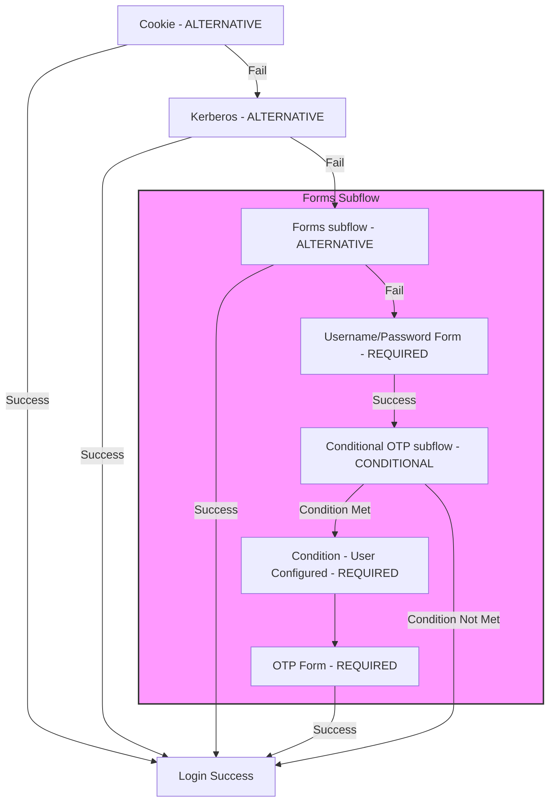

## Authentication SPI について

- Keycloak には、さまざまな認証メカニズム（kerberos、password、otp など）が含まれているが、これらが要件を満たさない場合、カスタムプラグインを作成して新たに追加することが可能。
- SPI（Service Provider Interface）を提供しており、これを使用してカスタムの認証メカニズムを作成できる。
- Admin Console では、カスタムプラグインの適用、順序設定、設定変更が可能。

## 登録フォームと詳細な SPI

- Keycloak はシンプルな登録フォームを提供しており、reCAPTCHA の有効化・無効化などの設定が可能。
- 同じ SPI を利用して、新しいページを追加したり、登録 Flow を完全に再実装することが可能。
- 詳細な SPI を利用して、組み込みの登録フォームに特定のバリデーションやユーザー拡張を追加することも可能。

## Required Action（Required Action）について

- 「Required Action（Required Action）」は、ユーザーが認証後に必ず実行しなければならないアクション。
- アクションが成功すると、同じアクションを再度行う必要はない。
- 例：「パスワードリセット」は Required Action の一つであり、初回ログイン後に新しいパスワードを設定する必要があるが、完了後は再度求められない。
- Keycloak にはビルトインの Required Action がいくつか用意されており、独自の Required Action を作成して追加することも可能。

## Authentication Terms and Relationships

1. Authentication Flow

   - Authentication Flow は、ログインや登録時に必要なすべての認証ステップをまとめた「Flow」です。
   - Flow は複数の Authenticator で構成され、他の Flow を含むこともできます。各 Flow の内容は Admin Console で確認でき、ブラウザログインや登録用に異なる Flow を設定できます。

2. Authenticator

   - Authenticator は、Flow 内で認証や特定のアクションを実行するプラグイン可能なコンポーネントで、認証ロジックを持ちます。
   - 通常はシングルトン（一つのインスタンスのみ存在）であり、ユーザーがログイン時に入力したパスワードの検証や OTP の生成などの役割を担います。

3. Execution

   - Execution は、Authenticator を Flow に結びつけるオブジェクトであり、Authenticator の設定情報も含んでいます。
   - これにより、Flow はどの Authenticator をどのように実行するかを管理します。

4. Execution Requirement

   - Execution Requirement は、特定の Authenticator が Flow 内でどのように動作するか（有効/無効、必須/代替など）を定義します。
   - 例えば、「Alternative」に設定されている場合、その Authenticator が成功すれば Flow 全体が成功とみなされ、後続の Authenticator は実行されません。

5. Authenticator Config

   - Authenticator Config は、特定の Execution で使用される Authenticator の設定を示すオブジェクトです。
   - 同じ Authenticator でも、異なる Execution ごとに異なる設定が可能です。

6. Required Action
   - Required Action は、認証完了後にユーザーがログイン前に行う必要がある一時的なアクションです。
   - 例えば、OTP トークンの設定、パスワードのリセット、利用規約の承諾などがあります。

これらの用語は連携してユーザーの認証 Flow を構成します。簡単に言えば、Authentication Flow が全体の Flow を管理し、Authenticator がその中で認証処理を実行し、Execution がその設定や順序を定義します。Execution Requirement は各 Execution が必須か代替かなどの条件を決め、認証が完了するとユーザーに Required Action が求められることがあります。

## Algorithm Overview



## Flow Details

1. OpenID Connect or SAML Authentication Provider
   - 認証プロバイダは受け取ったデータを展開し、クライアントや署名を検証し、認証セッションを作成し、どの Flow を使用するかを確認してその Flow の実行を開始します。
2. Cookie Authentication
   1. Flow の開始
      - 最初に、システムはクッキーを使用してログインを試みます。「ALTERNATIVE」設定により、クッキー認証が失敗しても他の方法が試行されます。
   2. クッキープロバイダの読み込み
      - クッキープロバイダが読み込まれ、ユーザーがログイン可能かどうかを確認します。
      - 現在の認証セッションにユーザーが関連付けられているかどうかを確認します（これはオプションの設定です）。
        - 関連付けが必須でない場合、Flow は次のステップに進みます。
        - 必須であれば、Flow は停止し、エラーメッセージが表示されます。
   3. クッキーの確認と検証
      - システムは「SSO クッキー」（シングルサインオン用のクッキー）が設定されているかを確認します。
      - SSO クッキーが存在し、有効であれば、ログインは成功と見なされます。
        - クッキープロバイダは`success()`ステータスを返します。
        - 他の認証方法は実行されず、ログインは即座に完了します。
      - SSO クッキーが存在しないか無効な場合：
        - クッキープロバイダは`attempted()`ステータスを返します。
        - 「attempted」はエラーではなく、成功もしていない状態を意味します。
        - クッキー認証が失敗した場合、Flow は次の認証方法（例：パスワード入力）に進みます。
3. Kerberos Authentication (Keycloak を Kerberos プロバイダとして使用する場合)
   1. Flow の開始
      - Kerberos プロバイダは SPNEGO（Simple and Protected GSS-API Negotiation Mechanism）プロトコルを使用してログインを試みます。
      - このプロトコルでは、サーバーとクライアントがネゴシエーションヘッダを交換する複数回のチャレンジ/レスポンスが必要です。
   2. Kerberos プロバイダの動作
      - Kerberos プロバイダがネゴシエーションヘッダを受け取っていない場合、これがサーバーとクライアントの初回のやり取りであると見なします。
      - クライアントに対して HTTP チャレンジレスポンスを作成し、`forceChallenge()`ステータスを設定します。これはクライアントが必ず応答する必要があることを意味します。
   3. `forceChallenge()`と`challenge()`の違い
      - `forceChallenge()`はクライアントの応答が無視できず、必ず提供される必要がある状態です。
      - 一方、`challenge()`は他の認証方法が試行されるまで応答が保留される状態です。
   4. ネゴシエーションヘッダの確認と Flow の進行
      - サーバーがクライアントにチャレンジレスポンスを送信し、Flow が一時停止します。
      - ブラウザがその後、正しいネゴシエートヘッダで応答した場合、Kerberos プロバイダはユーザーを`AuthenticationSession`に関連付け、`success()`ステータスを返します。
        - これにより、他の認証方法は試行されず、ログインが完了します。
      - ブラウザが有効なネゴシエートヘッダで応答しなかった場合：
        - Kerberos プロバイダは`attempted()`ステータスを返し、認証が試みられたが成功しなかったことを示します。
        - その後、他の認証方法（例：パスワード認証）が試行されます。
4. Forms Subflow
   1. Username/Password プロバイダ
      1. Flow の開始
         - `UsernamePassword`プロバイダは最初にユーザー名とパスワードを入力するための HTML ページを Challenge-Response として作成します。
         - このプロバイダは、ユーザーが認証セッションに関連付けられている必要はありません。
         - この実行は必須であるため、Challenge-Response はそのままブラウザに送信されます。
      2. ユーザーの入力と認証
         - ユーザーがユーザー名とパスワードを送信すると、そのリクエストは再び`UsernamePassword`プロバイダに送られます。
         - 認証が成功するか失敗するかに応じて以下の処理が行われます：
           - 失敗：無効なユーザー名またはパスワードが入力された場合、新しい Challenge-Response が作成され、`failureChallenge()`ステータスが設定されます。
             - `failureChallenge()`はエラーとしてログに記録され、複数回のログイン失敗があるアカウントや IP アドレスのロックに使用されることがあります。
           - 成功：有効なユーザー名とパスワードが入力された場合、`UserModel`が`AuthenticationSessionModel`に関連付けられ、`success()`ステータスが返されます。
   2. Conditional Subflow
      1. Flow の開始
         - このサブ Flow の要件は`Conditional`です。
           - `Conditional`は、サブ Flow 内のすべての条件付き実行（Conditional Executors）が評価されることを意味します。
      2. 条件付き実行の評価
         - 条件付き実行は`ConditionalAuthenticator`を実装する認証プロバイダによって実装され、`boolean matchCondition(AuthenticationFlowContext context)`メソッドを実装する必要があります。
           - 特定の条件を満たすユーザーに対して追加の認証を行うかどうかを決定します。
         - 条件付きサブ Flow は、その中に含まれるすべての条件付き実行の`matchCondition`メソッドを呼び出します。
           - すべてが`true`に評価された場合、そのサブ Flow は`Required`サブ Flow として扱われます。
           - いずれかが`false`に評価された場合、そのサブ Flow は無効と見なされます。
      3. 条件付き認証プロバイダの役割
         - 条件付き認証プロバイダは、この目的のみに使用され、実際の認証には使用されません。
           - 条件付き認証プロバイダが`true`と評価されても、Flow やサブ Flow が成功したことにはなりません。
           - 例えば、条件付きサブ Flow のみを含む Flow では、ユーザーのログインが許可されません。
   3. Conditional OTP Subflow
      1. Condition - User Configured
         - 最初の実行は`Condition - User Configured`であり、このプロバイダはユーザーが Flow に関連付けられている必要があります。
           - この要件は、`UsernamePassword`プロバイダが既にユーザーを Flow に関連付けているため、満たされています。
         2. `matchCondition`メソッドの評価
            - プロバイダの`matchCondition`メソッドは、現在のサブ Flow 内の他の認証プロバイダに対して`configuredFor`メソッドを評価します。
            - サブ Flow 内に`Required`の実行が含まれている場合、すべての必須認証プロバイダが`configuredFor`を`true`と評価する場合にのみ、`matchCondition`メソッドは`true`を返します。
            - それ以外の場合、サブ Flow 内の代替（`Alternative`）認証プロバイダのいずれかが`true`と評価されれば、`matchCondition`メソッドも`true`を返します。
   4. OTP Form
      1. Flow の開始
         - 次の実行は`OTP Form`であり、このプロバイダもユーザーが Flow に関連付けられている必要があります。
           - この要件は、`UsernamePassword`プロバイダが既にユーザーを Flow に関連付けているため、満たされています。
         2. プロバイダの設定確認
            - ユーザーが関連付けられている場合、このプロバイダはユーザーが OTP を設定済みかどうかを確認します。
            - ユーザーが OTP を設定していない場合、認証後に行うべき Required Action（OTP 設定ページ）が設定されます。
            - ユーザーが OTP を設定済みであれば、OTP コードの入力を求められます。
      2. Conditional OTP Subflow との関係
         - `Conditional OTP`が`Required`に設定されていない限り、ユーザーには OTP ログインページは表示されません。
   5. Flow 完了後の処理
      1. ユーザーセッションの作成
         - Flow が完了すると、認証プロセッサは`UserSessionModel`を作成し、`AuthenticationSessionModel`に関連付けます。
      2. Required Action の確認
         - 認証プロセッサは、ユーザーがログイン前に完了すべき Required Action があるかどうかを確認します。
   6. Required Action の評価
      1. `evaluateTriggers()`メソッドの呼び出し
         - 最初に、各 Required Action の`evaluateTriggers()`メソッドが呼び出されます。
         - このメソッドは、Required Action プロバイダがアクションをトリガーする必要があるかどうかを確認するための状態をチェックします。
           - 例：レルムにパスワードの有効期限ポリシーがある場合、このメソッドがアクションをトリガーすることがあります。
   7. Required Action Challenge
      1. `requiredActionChallenge()`メソッドの呼び出し
         - ユーザーに関連付けられた各 Required Action について、`requiredActionChallenge()`メソッドが呼び出されます。
         - このメソッドは HTTP レスポンスを設定し、Required Action 用のページを表示します。
           - この時点でチャレンジステータスが設定され、ユーザーに対してアクションを実行するよう促されます。
         - Required Action が最終的に成功した場合、その Required Action はユーザーのリストから削除されます。
   8. ログイン
      - すべての Required Action が解決されると、ユーザーはついにログインします。

認証機構における`Challenge and Response`

[rfc7235](https://www.ietf.org/rfc/rfc7235.txt)「2.1. Challenge and Response」に書いてあります。

HTTP のチャレンジ・レスポンス認証フレームワークは、サーバーとクライアント間のやり取りを通じて認証を行うシンプルな仕組みです。この仕組みでは、サーバーがクライアントに対して「認証が必要だよ」という指示（チャレンジ）を出し、クライアントがその指示に従って認証情報を提供することで認証が行われます。

<details>
<summary>詳しい説明</summary>

1. サーバーからのチャレンジ:
   • クライアントがサーバーにリクエストを送ると、サーバーはそのリクエストが認証を必要とするリソースへのアクセスであるかを確認します。
   • 認証が必要な場合、サーバーはクライアントに「認証情報を送ってください」というチャレンジを返します。これは、HTTP レスポンスヘッダーの一部（WWW-Authenticate ヘッダー）を使って行われます。
1. 認証スキームの指定:
   • このチャレンジには「どの認証方法を使って認証するか」という情報が含まれます。たとえば、「Basic」認証や「Digest」認証といった認証スキームです。
   • これを示すために、認証スキームを表すトークン（単語のような識別子）が使われます。このトークンは大文字・小文字を区別しません（つまり、「Basic」も「basic」も同じ意味です）。
1. クライアントの応答:
   • クライアントは、サーバーからのチャレンジを受け取ると、その指示に従って認証情報（ユーザー名とパスワードなど）を提供します。
   • 提供された情報が正しければ、サーバーはリクエストを受け付け、リソースへのアクセスを許可します。間違っている場合は、認証が失敗し、アクセスが拒否されます。

</details>

## Authenticator SPI walk through

[Keycloak Quickstarts Repository](https://github.com/keycloak/keycloak-quickstarts/tree/release/26.0) repository under extension/authenticator

Keycloak の Authenticator SPI（Service Provider Interface）を実装する際に、以下の主要な要素が必要となります。

### 1. Authenticator と AuthenticatorFactory の実装

Authenticator を作成するには、最低限次の 2 つのインターフェースを実装する必要があります。

- `Authenticator`：認証のロジックを定義します。
- `AuthenticatorFactory`：Authenticator のインスタンスを作成します。

これらのインターフェースは、Keycloak の他のコンポーネント（例：User Federation）と同様に、より汎用的な`Provider`および`ProviderFactory`のインターフェースを拡張しています。

### 2. Authenticator の種類

Authenticator は大きく 2 種類に分類されます：

- CookieAuthenticator のように、ユーザーが知っている認証情報を必要とせずに認証を行うもの。
- PasswordFormAuthenticator や OTPFormAuthenticator のように、ユーザーが何らかの情報を入力し、それをデータベース内の情報と照合して認証を行うもの。

後者のタイプの Authenticator は「CredentialValidator」と呼ばれ、以下のような追加のクラスを実装する必要があります。

### 3. CredentialValidator の実装

CredentialValidator を実装するには、以下のクラスを実装する必要があります：

1. `CredentialModel`の拡張クラス：データベース内でクレデンシャル（認証情報）を正しい形式で生成するクラスです。

   - `org.keycloak.credential.CredentialModel`を拡張します。
   - CredentialModel のプロパティの説明は[こちら](https://www.keycloak.org/docs/26.0.0/server_development/#extending-the-credentialmodel-class)

2. `CredentialProvider`の実装クラス：

   - ユーザーが入力した情報を管理し、検証するプロバイダクラスです。
   - `org.keycloak.credential.CredentialProvider`インターフェースを実装します。

3. `CredentialProviderFactory`の実装クラス：
   - `CredentialProvider`のファクトリを実装します。

### 実装するクラスのまとめ

- `Authenticator`：認証ロジックを定義するインターフェース。
- `AuthenticatorFactory`：`Authenticator`インスタンスを生成するインターフェース。
- `CredentialModel`の拡張クラス：クレデンシャルデータをデータベースに格納する形式を定義。
- `CredentialProvider`：クレデンシャルの検証と管理を行うプロバイダ。
- `CredentialProviderFactory`：`CredentialProvider`を生成するファクトリクラス。

### Keycloak Authenticator SPI Walkthrough & Required Action Guide

[Authenticator SPI Walkthrough](https://www.keycloak.org/docs/26.0.0/server_development/#_auth_spi_walkthrough)と[Required Action Walkthrough](https://www.keycloak.org/docs/26.0.0/server_development/#required-action-walkthrough)で紹介されたコードを実際に動作させることができるリポジトリを公開しました。

以下のリンクからご覧ください：

[keycloak-secret-question-spi](https://github.com/YamazakiNorihito/keycloak-secret-question-spi)

#### 1. JAR ファイルの配置

作成した SPI の JAR ファイルは、Keycloak の`/opt/keycloak/providers/`ディレクトリに配置します。

#### 2. META-INF/services ディレクトリの作成

プロジェクトのディレクトリ内に`META-INF/services`ディレクトリを作成します。このディレクトリには、Keycloak が認識するサービスやプロバイダーに関する情報が格納されます。

#### 3. ディレクトリ構成の例

以下に、プロジェクトのファイル構成例を Tree 形式で示します。Keycloak での正しい構成については、[こちら](https://github.com/keycloak/keycloak-quickstarts/tree/release/26.0/extension/action-token-authenticator/src/main/resources/META-INF/services)を参考にしてください。

```plaintext
my-auth-spi/
├── pom.xml
└── src
    ├── main
    │   ├── java
    │   │   └── org
    │   │       └── keycloak
    │   │           └── example
    │   │               └── authenticator
    │   │                   ├── SecretQuestionAuthenticator.java
    │   │                   ├── SecretQuestionAuthenticatorFactory.java
    │   │                   ├── SecretQuestionCredentialProvider.java
    │   │                   ├── SecretQuestionCredentialProviderFactory.java
    │   │                   ├── SecretQuestionRequiredAction.java
    │   │                   ├── SecretQuestionRequiredActionFactory.java
    │   │                   └── credential
    │   │                       ├── SecretQuestionCredentialModel.java
    │   │                       └── dto
    │   │                           ├── SecretQuestionCredentialData.java
    │   │                           └── SecretQuestionSecretData.java
    │   └── resources
    │       ├── META-INF
    │       │   └── services
    │       │       ├── org.keycloak.authentication.AuthenticatorFactory
    │       │       ├── org.keycloak.authentication.RequiredActionFactory
    │       │       └── org.keycloak.credential.CredentialProviderFactory
    │       └── themes
    │           └── custom
    │               └── login
    │                   ├── secret-question-config.ftl
    │                   ├── secret-question.ftl
    │                   └── theme.properties
    └── test
        └── java
            └── com
                └── example
                    └── keycloak
                        └── AppTest.java
```

#### 4. デプロイ手順

デプロイ手順については、[Dockerfile](https://github.com/YamazakiNorihito/keycloak-secret-question-spi/blob/main/docker/keycloak/Dockerfile)を参照してください。

特に重要なのは以下の部分です：

- カスタムプロバイダ(JAR)を追加

  ```plaintext
  COPY my-auth-spi/target/my-auth-spi-1.0-SNAPSHOT.jar /opt/keycloak/providers/
  ```

- カスタムテーマ(FTL)ファイルを追加

  ```plaintext
  COPY my-auth-spi/src/main/resources/themes/custom/login/ /opt/keycloak/themes/custom/login/
  ```

これらの手順を行うことで、カスタム認証プロバイダーとテーマを Keycloak に追加することができます。

## Modifying or extending the registration form

- Keycloak では、独自の認証フローを作成して、登録の仕組み全体を変更することが可能です。
  - しかし、一般的には、標準の登録ページに少しだけバリデーションを追加するだけで十分な場合が多いです。
- そのために、新しい SPI（Service Provider Interface）が用意されており、この SPI を使うことで、次のことができます：
  - フォームの入力内容を検証（バリデーション）する。
  - 登録が完了した後に、ユーザーの属性やデータを初期化する。
- サンプルコード
  - [AbstractRegistrationRecaptcha](https://github.com/keycloak/keycloak/blob/902abfdae42685b68c127e309da17ec64ffd2382/services/src/main/java/org/keycloak/authentication/forms/AbstractRegistrationRecaptcha.java#L47-L48)
  - [RegistrationRecaptcha](https://github.com/keycloak/keycloak/blob/902abfdae42685b68c127e309da17ec64ffd2382/services/src/main/java/org/keycloak/authentication/forms/RegistrationRecaptcha.java#L42-L43)
  - [RegistrationRecaptchaEnterprise](https://github.com/keycloak/keycloak/blob/902abfdae42685b68c127e309da17ec64ffd2382/services/src/main/java/org/keycloak/authentication/forms/RegistrationRecaptchaEnterprise.java#L42-L43)
