# Sequence diagrams

元ページ
<https://mermaid.js.org/syntax/sequenceDiagram.html>

## シーケンスダイアグラムとは？

シーケンスダイアグラムは、相互作用ダイアグラムの一種であり、プロセスが互いにどのように作用し、どの順序で動作するかを示します。
システム内のオブジェクト間のインタラクションを時間の流れに沿って表現するために使用されます

## mermaid-sequenceDiagram

Mermaidというツールを用いて、テキストベースでシーケンスダイアグラムを簡単に記述し、視覚的なダイアグラムにレンダリングすることができます。この例では、AliceとJohnという二つのオブジェクトがメッセージを交換しています。

```markdown
sequenceDiagram
    Alice->>John: Hello John, how are you?
    John-->>Alice: Great!
    Alice-)John: See you later!
```

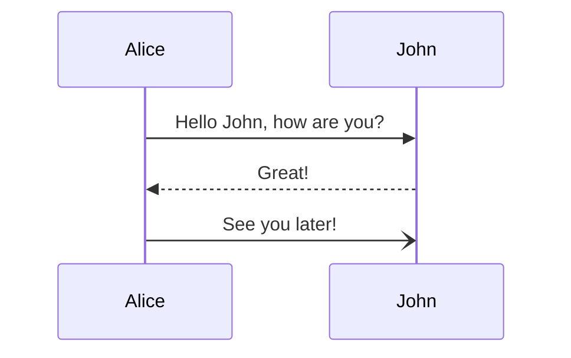
```mermaid
sequenceDiagram
    Alice->>John: Hello John, how are you?
    John-->>Alice: Great!
    Alice-)John: See you later!
```

この処理は以下の処理をしていることを表現しています。

1. Alice が John に「Hello John, how are you?」と挨拶。
2. John が Alice に「Great!」と応答。
3. Alice が John に「See you later!」と別れの挨拶。

**情報（INFO）:**

ノードについての注記：Mermaid言語では、「end」という単語が図を破損させる可能性があります。避けられない場合は、括弧()、引用符""、または括弧{}、[]を使用して「end」を囲む必要があります。例：(end)、[end]、{end}。

```markdown
sequenceDiagram
    participant Alice
    participant Bob
    Alice->>Bob: Are you at the end of the project?
    Note right of Bob: When Alice asks if I am at "the {end}" of the project.
    Bob->>Alice: Yes, almost at (end)!
```

この例では、AliceがBobにプロジェクトの終わり近くにいるかどうかを尋ねます。ここで、「end」という単語が引用符、括弧、カッコの中で使われています。これにより、「end」がMermaidスクリプトによって特別な意味を持つ予約語として解釈されることを防いでいます。

- Bobは「Yes, almost at (end)!」と応答しており、「end」を括弧で囲んで安全に使用しています。
- 「Note」はダイアグラム内で注釈を加えるために使用されており、「the {end}」という表現で「end」を中括弧で囲んで示しています。

このように特定の記号で「end」という単語を囲むことで、Mermaidスクリプトが正しく解釈し、期待される動作を行うように保証します。

## Syntax(構文)

### Participants(参加者)

>(原文)参加者は、このページの最初の例のように暗黙的に定義することができます。参加者またはアクターは、ダイアグラムのソーステキストにおける登場順に描画されます。時には、最初のメッセージに表示される順序とは異なる順序で参加者を表示したい場合があります。以下のようにして、アクターの登場順序を指定することが可能です。

参加者（アクター）をシンプルに定義してメッセージのやり取りを表現することができます。参加者は通常、スクリプト内で最初に記述された順番に描画されますが、明示的に参加者の順番を変更することも可能です。

```markdown
sequenceDiagram
    participant Alice
    participant Bob
    Alice->>Bob: Hi Bob
    Bob->>Alice: Hi Alice
```

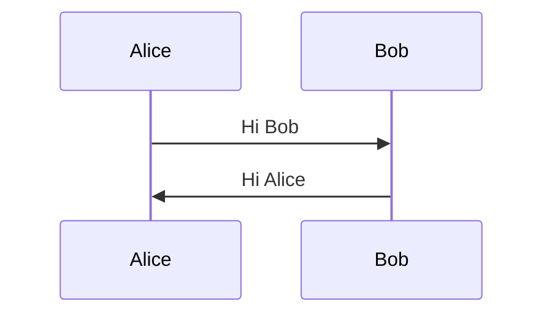
```mermaid
sequenceDiagram
    participant Alice
    participant Bob
    Alice->>Bob: Hi Bob
    Bob->>Alice: Hi Alice
```

### Actors(アクター)

>(原文)四角形のテキストの代わりにアクターシンボルを使用したい場合、以下のように actor ステートメントを使用することができます。

アクターシンボルを使用することで、通常の四角形ではなく、専用のシンボルを持つアクターを表現することができます。これにより、ダイアグラムが視覚的にわかりやすくなります。

```markdown
sequenceDiagram
    actor Alice
    actor Bob
    Alice->>Bob: Hi Bob
    Bob->>Alice: Hi Alice
```

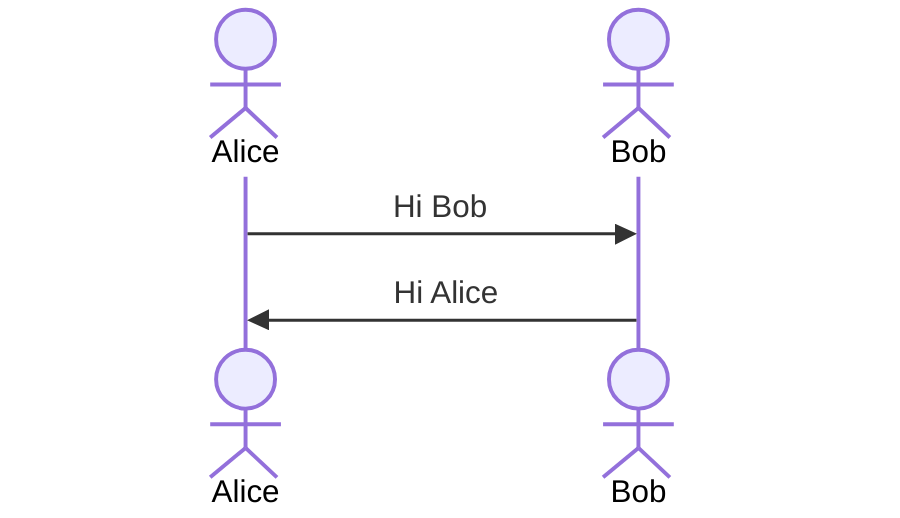
```mermaid
sequenceDiagram
    actor Alice
    actor Bob
    Alice->>Bob: Hi Bob
    Bob->>Alice: Hi Alice
```

### Aliases(エイリアス)

>(原文)アクターには便利な識別子と説明的なラベルを持たせることができます。

エイリアスを用いることで、コード内で短い識別子を使用しつつ、ダイアグラム上ではより詳細な説明を持つラベルを表示させることが可能です。

```markdown
sequenceDiagram
    participant A as Alice
    participant J as John
    A->>J: Hello John, how are you?
    J->>A: Great!
```

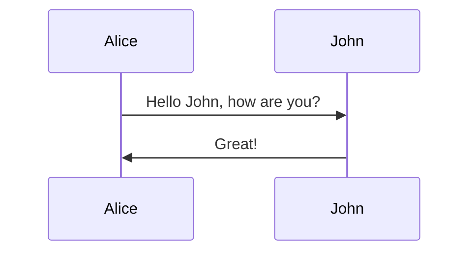
```mermaid
sequenceDiagram
    participant A as Alice
    participant J as John
    A->>J: Hello John, how are you?
    J->>A: Great!
```

### Actor Creation and Destruction (v10.3.0+)(アクターの作成と破棄)

メッセージによってアクターを作成および破棄することが可能です。これを行うには、メッセージの前に create または destroy ディレクティブを追加します。

```markdown
create participant B
A --> B: Hello
```

>(原文)create ディレクティブはアクター/参加者の区別とエイリアスをサポートします。メッセージの送信者または受信者を破棄することができますが、作成できるのは受信者のみです。

v10.3.0以降のバージョンでは、シーケンスダイアグラム内でアクターや参加者を動的に作成および破棄する機能が提供されています。これは特に動的なプロセスや一時的なエンティティをダイアグラムに表現する際に有効です。create および destroy ディレクティブを使用して、特定のメッセージの前後でアクターの状態を変更することができます。

```markdown
sequenceDiagram
    Alice->>Bob: Hello Bob, how are you ?
    Bob->>Alice: Fine, thank you. And you?
    create participant Carl
    Alice->>Carl: Hi Carl!
    create actor D as Donald
    Carl->>D: Hi!
    destroy Carl
    Alice-xCarl: We are too many
    destroy Bob
    Bob->>Alice: I agree

```

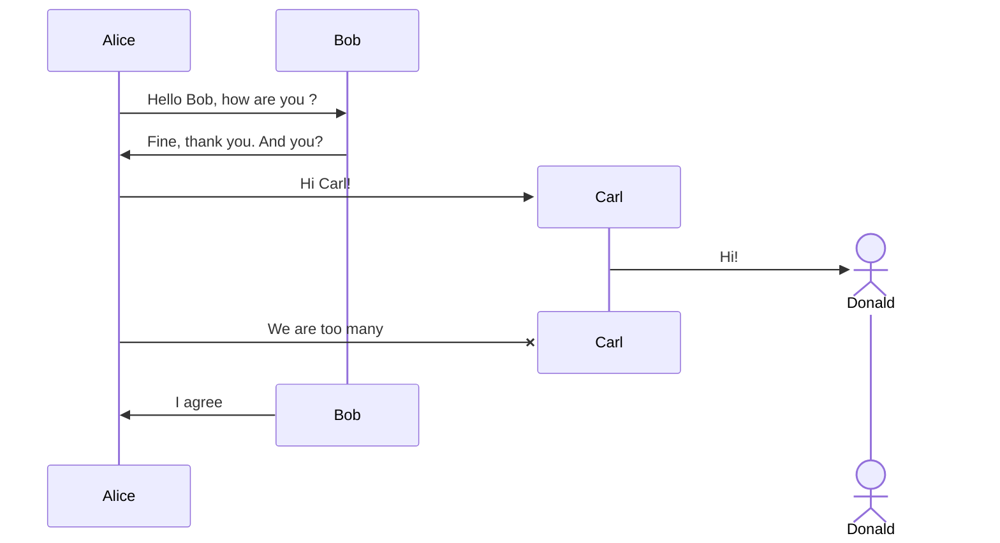
```mermaid
sequenceDiagram
    Alice->>Bob: Hello Bob, how are you ?
    Bob->>Alice: Fine, thank you. And you?
    create participant Carl
    Alice->>Carl: Hi Carl!
    create actor D as Donald
    Carl->>D: Hi!
    destroy Carl
    Alice-xCarl: We are too many
    destroy Bob
    Bob->>Alice: I agree

```

#### 不修正可能なアクター/参加者の作成/削除エラー

>(原文)アクター/参加者の作成または削除時に次のタイプのエラーが発生する場合:
>
>破棄された参加者 participant-name には、その宣言後に関連する破棄メッセージがありません。シーケンスダイアグラムを確認してください。
>
>そして、ダイアグラムコードの修正がこのエラーを解消しない場合や、他のすべてのダイアグラムのレンダリングが同じエラーで結果となる場合、Mermaidのバージョンを (v10.7.0+) にアップデートする必要があります。

アクターの破棄には、そのアクターが宣言された後に関連する破棄メッセージが必要です。これがないと、Mermaidはエラーを返します。
もしエラーが続く場合、Mermaidのバージョンを更新することが推奨されます。これにより、改善されたエラーハンドリングや新機能の利用が可能になります。

### Grouping / Box(グループ化 / ボックス)

>(原文)アクターは垂直ボックスでグループ化することができます。

アクターを「box」ディレクティブを使用して視覚的にグループ化することができます。この機能は、関連するアクターを明確に区別して表示するために有用です。
各ボックスは、オプションで色を指定でき、説明ラベルを加えることも可能です。色は名前（例：Aqua）、RGB値、または「transparent」と指定することができます。

以下の記法を使用して、色（指定しない場合は透明になります）および/または説明ラベルを定義できます：

```bash
box Aqua Group Description
... actors ...
end
box Group without description
... actors ...
end
box rgb(33,66,99)
... actors ...
end
```

**情報**

グループ名が色の名前の場合、その色を透明に強制することができます：

```bash
box transparent Aqua
... actors ...
end
```

```markdown
sequenceDiagram
    box Purple Alice & John
        participant A
        participant J
    end
    box Another Group
        participant B
        participant C
    end
    A->>J: Hello John, how are you?
    J->>A: Great!
    A->>B: Hello Bob, how is Charley?
    B->>C: Hello Charley, how are you?
```

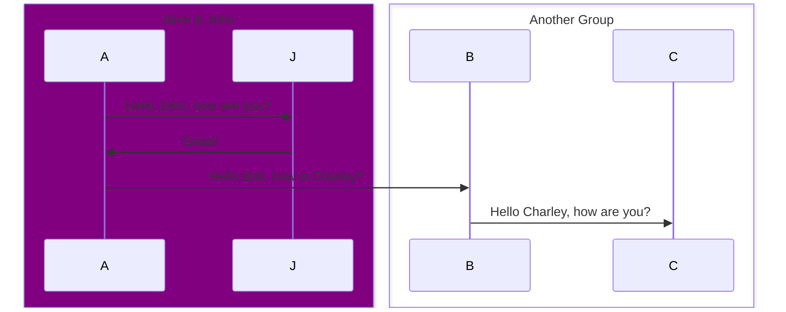
```mermaid
sequenceDiagram
    box Purple Alice & John
        participant A
        participant J
    end
    box Another Group
        participant B
        participant C
    end
    A->>J: Hello John, how are you?
    J->>A: Great!
    A->>B: Hello Bob, how is Charley?
    B->>C: Hello Charley, how are you?
```

上記の例では、AliceとJohnが「Purple」グループに、BobとCharleyが「Another Group」に分類されています。各グループは異なる色で区切られ、グループ内のアクター間でのメッセージ交換が視覚的に追いやすくなっています。

#### transparentについて

1. transparentを使用する場合:
`box transparent Aqua`のように使用すると、この指定は「Aqua」という名前のグループを透明なボックスで囲みます。これは、ボックスに色を指定しつつ、その色を透明に設定して背景と同化させることを意味します。この方法でボックスは視覚的に目立たなくなりますが、構造的なグルーピングは保持されます。これは特に、ダイアグラムの読みやすさを保ちながら、論理的なグループ化を明示したい場合に有用です。
2. 説明や色指定がないboxを使用する場合:
box Group without descriptionのように使用すると、単にその名前のグループに参加者をグループ化するボックスが作成されますが、色や透明度の指定がないため、Mermaidのデフォルトのスタイル（通常は透明でない）でボックスが描画されます。この場合、ボックスは背景から区別される色を持ちますが、具体的な色指定がなければデフォルト色（通常は灰色や他の薄い色）が適用されます。

```markdown
sequenceDiagram
    box transparent Aqua "Transparent Box Example"
        participant Alice
        participant Bob
    end
    box Group without description
        participant Carol
        participant Dave
    end
    Alice->>Bob: Message in a transparent box
    Carol->>Dave: Message in a regular box
```

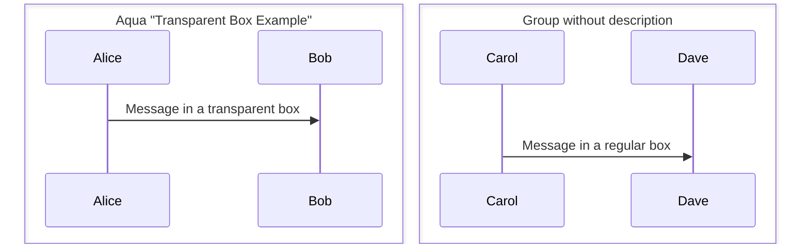
```mermaid
sequenceDiagram
    box transparent Aqua "Transparent Box Example"
        participant Alice
        participant Bob
    end
    box Group without description
        participant Carol
        participant Dave
    end
    Alice->>Bob: Message in a transparent box
    Carol->>Dave: Message in a regular box
```

※クォーテーションについて
ダブルクォーテーションを使う必要があるかどうかは、名や説明が空白を含む場合や特別な文字を含む場合に依存します。基本的には以下のようなルールがあります：

1. 名や説明に空白や特殊文字が含まれる場合：
この場合、ダブルクォーテーションを使用する必要があります。これにより、Mermaid はその文字列を一つのグループ名や説明として認識します。
例：box "Group with space or special character" ... end
1. グループ名が単一の単語で構成されている場合：
ダブルクォーテーションは必要ありません。
例：box Group ... end

## Messages

メッセージは実線または点線のどちらかで表示されます。

```bash
[アクター][矢印][アクター]:メッセージテキスト
```

現在サポートされている矢印のタイプは6種類です：

| タイプ  | 説明                                   |
| ------- | -------------------------------------- |
| `->`    | 矢印なしの実線。直接的な一方通行の通信を表します。 |
| `-->`   | 矢印なしの点線。軽いまたは一時的な影響の通信を示します。 |
| `->>`   | 矢印付きの実線。応答が期待される一方通行の通信を表します。 |
| `-->>`  | 矢印付きの点線。非同期または後で応答が返される通信を示します。 |
| `-x`    | 終端に十字がある実線。メッセージが終了点または中止を表す場合に使用します。エラーや停止を表現するのに適しています。 |
| `--x`   | 終端に十字がある点線。非同期プロセスの終了や中止を表す場合に使います。|
| `-)`    | 終端に開いた矢印のある実線（非同期）。非同期であり、その場での応答が不要な通信を示します。 |
| `--)`   | 終端に開いた矢印のある点線（非同期）。長期にわたる非同期プロセスや遅延応答を期待する通信に使われます。|

ユーザーがウェブサイトにアクセスしてデータをリクエストし、システムがデータベースからデータを取得してユーザーに応答します。途中、エラーが発生する可能性があり、エラー処理が行われます。

```markdown
sequenceDiagram
    actor User as "ユーザー"
    participant Server as "サーバー"
    participant DB as "データベース"

    User->>Server: データリクエスト（ユーザープロフィール）
    Server->>DB: データベースクエリ発行
    DB-->>Server: クエリ結果

    alt 成功した場合
        Server->>User: ユーザーデータ応答
    else エラーが発生した場合
        Server-xUser: エラー応答
    end

    User-)Server: 非同期リクエスト（最新ニュース）
    Server--)User: 非同期応答（最新ニュース）

    User->>Server: ログアウトリクエスト
    Server--xUser: ログアウト完了
```

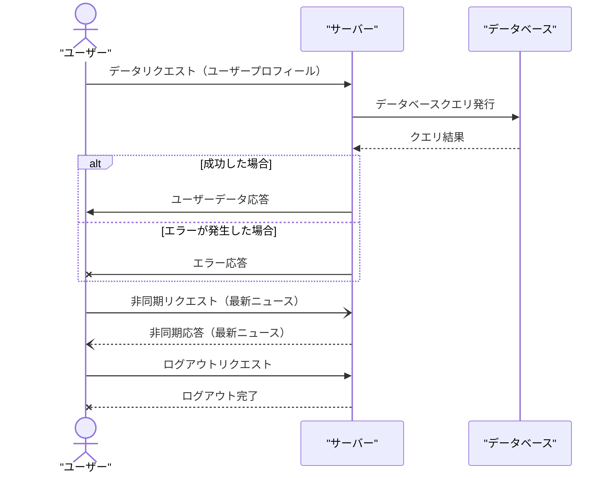
```mermaid
sequenceDiagram
    actor User as "ユーザー"
    participant Server as "サーバー"
    participant DB as "データベース"

    User->>Server: データリクエスト（ユーザープロフィール）
    Server->>DB: データベースクエリ発行
    DB-->>Server: クエリ結果

    alt 成功した場合
        Server->>User: ユーザーデータ応答
    else エラーが発生した場合
        Server-xUser: エラー応答
    end

    User-)Server: 非同期リクエスト（最新ニュース）
    Server--)User: 非同期応答（最新ニュース）

    User->>Server: ログアウトリクエスト
    Server--xUser: ログアウト完了

```

## Activations

アクティベーションは、シーケンスダイアグラムにおいてアクターが活動中である期間を視覚的に示すために使用されます。以下のような状況で特に有効です：

- タスクの実行中を示す場合： 特定のアクターが何らかのリクエストを処理している期間や、ある処理が実行中であることを表現する際に使います。これにより、処理の開始と終了が明確に示され、アクターの応答時間や活動期間が視覚的に把握しやすくなります。
- システムの反応を示す場合： システムがユーザーからの入力を受けて活動を開始したときや、バックグラウンドでのデータ処理が行われている場合に活用できます。アクティベーションとデアクティベーションを使用して、システムの状態変更を明確にすることができます。

アクターの活性化と非活性化は可能です。(デ)アクティブ化は専用の宣言で行うことができます：

```markdown
sequenceDiagram
    Alice->>John: Hello John, how are you?
    activate John
    John-->>Alice: Great!
    deactivate John
```

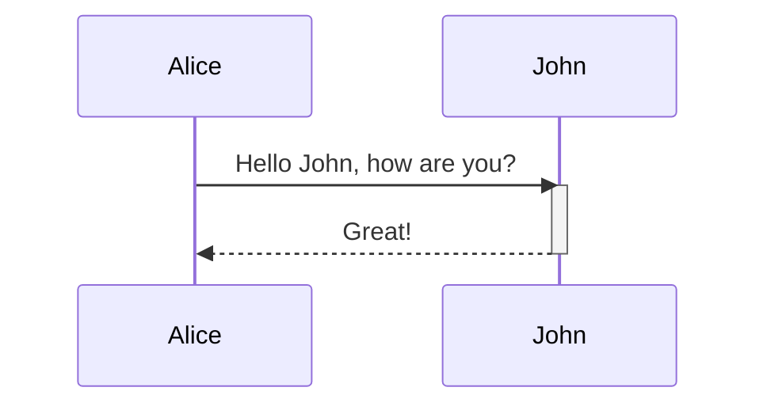
```mermaid
sequenceDiagram
    Alice->>John: Hello John, how are you?
    activate John
    John-->>Alice: Great!
    deactivate John
```

また、メッセージの矢印に接尾辞として＋/-を付けるショートカット表記もある：

```markdown
sequenceDiagram
    Alice->>+John: Hello John, how are you?
    John-->>-Alice: Great!
```

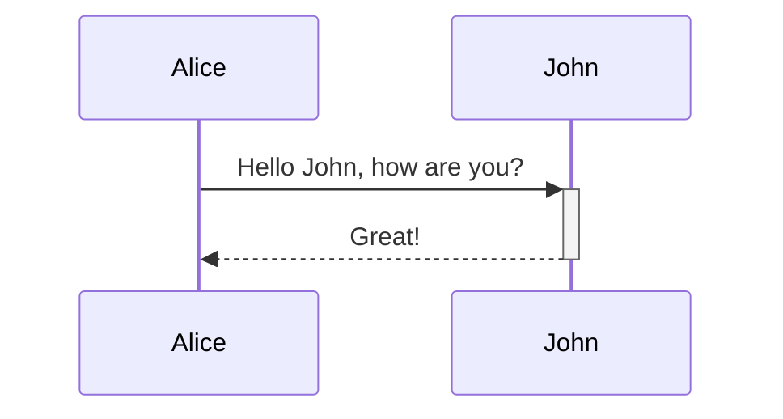
```mermaid
sequenceDiagram
    Alice->>+John: Hello John, how are you?
    John-->>-Alice: Great!
```

アクティベーションは、同じアクターに重ねて行うことができます：

```markdown
sequenceDiagram
    Alice->>+John: Hello John, how are you?
    Alice->>+John: John, can you hear me?
    John-->>-Alice: Hi Alice, I can hear you!
    John-->>-Alice: I feel great!
```

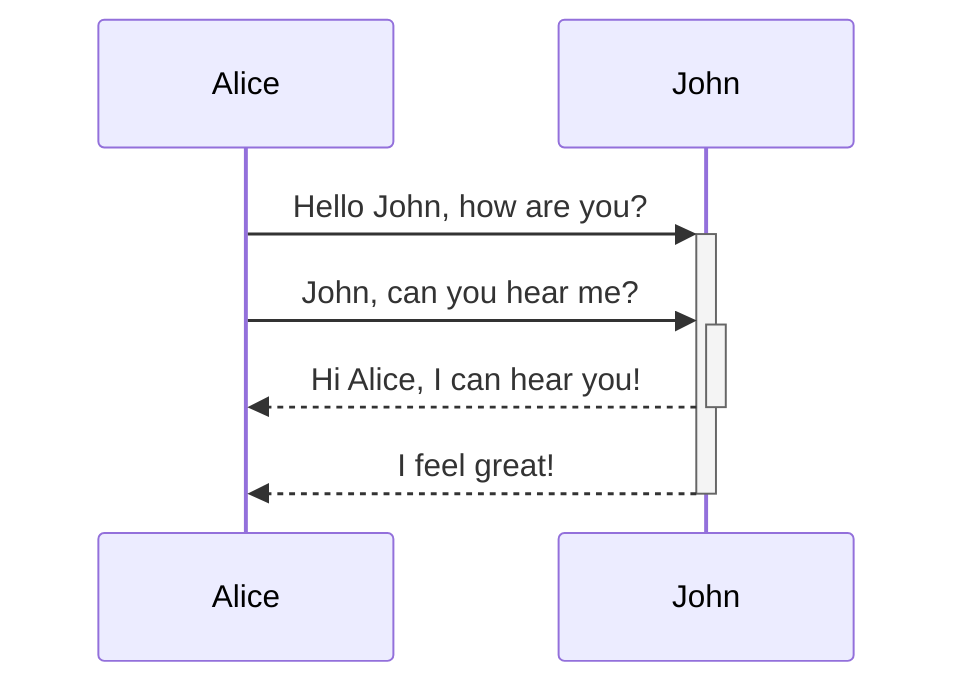
```mermaid
sequenceDiagram
    Alice->>+John: Hello John, how are you?
    Alice->>+John: John, can you hear me?
    John-->>-Alice: Hi Alice, I can hear you!
    John-->>-Alice: I feel great!

```

## Notes

ノートはシーケンスダイアグラムに補足情報を提供するために用います。ノートの使用は以下の状況で有用です：

- 追加情報を提供する場合： ダイアグラムの特定の部分に対して追加説明が必要な場合や、特定のアクションの目的を説明するために使用します。例えば、特定のリクエストがなぜ必要か、または特定のプロセスがどのような条件でトリガーされるかを説明するのに役立ちます。
- 複数アクター間の特定のやり取りを強調する場合： 二人以上のアクター間での重要な通信や相互作用を強調するためにノートを使います。これにより、そのやり取りの重要性や文脈が他の視覚的要素と区別され、より注目されます。
- プロセスのフェーズや条件を説明する場合： プロセスの特定の段階や、ある条件下での動作が発生する際の説明にノートを配置します。これにより、ダイアグラムを見る人はプロセスの流れをより深く理解することができます。

シーケンスダイアグラムにはノートを追加することができます。これは Note [right of | left of | over] [Actor]: Text in note content という記法で行われます。

*ノートの記法の構成要素*

1. 位置指定
    - right of: 指定したアクターの右側にノートを配置します。
    - left of: 指定したアクターの左側にノートを配置します。
    - over: 一つまたは複数のアクターの上部にノートを跨がせて配置します。
2. アクター
    - ノートを配置する対象のアクターを指定します。アクターは、ダイアグラムにおける参加者（participant）の名前で指定されます。
3. テキスト内容
   - : の後に続くテキストがノートに記載される内容です。このテキストには説明や注釈が含まれ、ダイアグラムを理解する上での追加情報を提供します。

単一参加者の右側にノートを追加する例:

```markdown
sequenceDiagram
    participant John
    Note right of John: Text in note
```

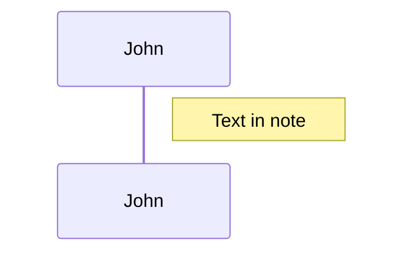
```mermaid
sequenceDiagram
    participant John
    Note right of John: Text in note
```

2つの参加者にまたがるノートを作成する例:

```markdown
sequenceDiagram
    Alice->John: Hello John, how are you?
    Note over Alice,John: A typical interaction
```

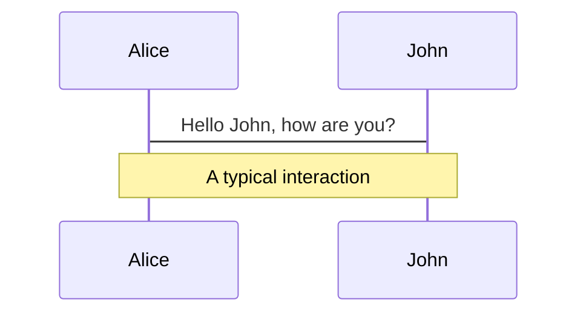
```mermaid
sequenceDiagram
    Alice->John: Hello John, how are you?
    Note over Alice,John: A typical interaction
```

テキスト入力全般に適用される改行の追加:

```markdown
sequenceDiagram
    Alice->John: Hello John, how are you?
    Note over Alice,John: A typical interaction<br/>But now in two lines
```

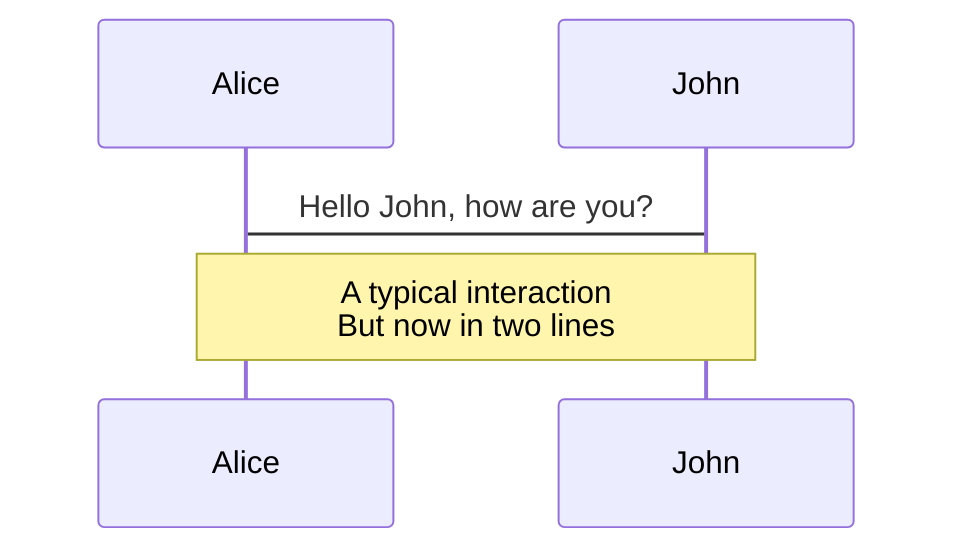
```mermaid
sequenceDiagram
    Alice->John: Hello John, how are you?
    Note over Alice,John: A typical interaction<br/>But now in two lines
```

## Loops

シーケンスダイアグラムにおいては、ループを表現することが可能です。この表現は次のような記法で行われます：

構文

```bash
loop Loop text
... statements ...
end
```

```markdown
sequenceDiagram
    Alice->John: Hello John, how are you?
    loop Every minute
        John-->Alice: Great!
    end
```

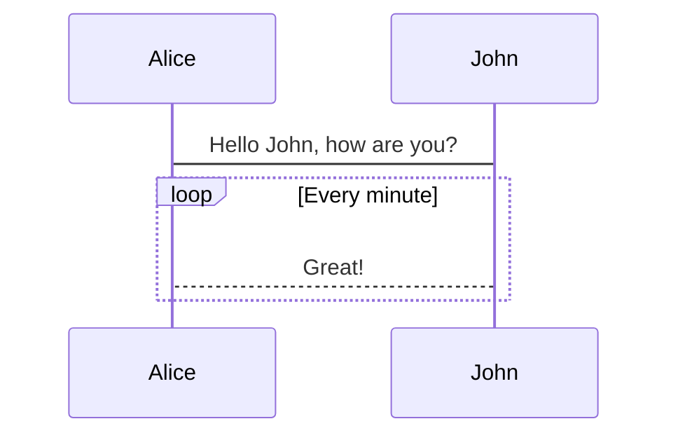
```mermaid
sequenceDiagram
    Alice->John: Hello John, how are you?
    loop Every minute
        John-->Alice: Great!
    end
```

この例では、Johnが毎分Aliceに「Great!」と応答するループを示しています。

## Alt

シーケンスダイアグラムでは、代替パスを表現することが可能です。これは以下の記法で行います：

```bash
alt 説明テキスト
    ... ステートメント ...
else
    ... ステートメント ...
end
```

また、任意のシーケンス（elseなしのif）も表現できます。

```bash
opt 説明テキスト
    ... ステートメント ...
end
```

Sample:

```markdown
sequenceDiagram
    Alice->>Bob: Hello Bob, how are you?
    alt is sick
        Bob->>Alice: Not so good :(
    else is well
        Bob->>Alice: Feeling fresh like a daisy
    end
    opt Extra response
        Bob->>Alice: Thanks for asking
    end

```

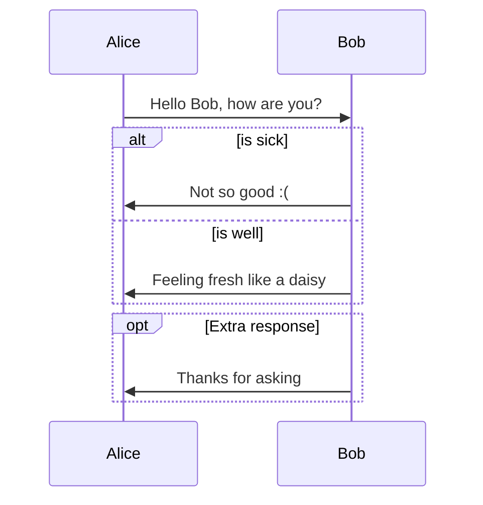
```mermaid
sequenceDiagram
    Alice->>Bob: Hello Bob, how are you?
    alt is sick
        Bob->>Alice: Not so good :(
    else is well
        Bob->>Alice: Feeling fresh like a daisy
    end
    opt Extra response
        Bob->>Alice: Thanks for asking
    end

```

1. 代替パス (alt)

- alt ブロックは、条件に基づいて異なるアクションが取られる場合に使用します。この例では、Bobが体調が悪い場合と良い場合で異なる応答をしています。このような条件分岐は、エラーハンドリングやユーザーの入力に基づく動作の変更など、多くのアプリケーションで見られるシナリオです。
- alt は「もしも」の状況を表現するために使用します。つまり、特定の条件に基づいて異なるアクションや応答が必要な場合にこのブロックを使用します。これは、プログラミングで言う「if-else」文に似ています。例えば、システムがユーザーのリクエストに応じて異なる結果を返す必要がある場合に使います。

2. オプショナルセクション (opt)

- opt ブロックは、発生しなくてもプロセスの進行に影響を与えない任意のアクションを示すのに使用します。この例では、Bobが追加で感謝の意を示す場面がオプショナルとされています。このようなオプショナルなステップは、特定の条件下でのみ発生するログの記録、追加のユーザー確認などに使われることがあります。
- opt は特定のアクションやメッセージがオプショナル、つまり必須ではない場合に使用します。これは、ある条件が満たされた場合にのみ実行されるプロセスやステップを示すのに便利ですが、その条件が満たされなかった場合にプロセスの残りに影響を与えることはありません。

## Parallel(並行処理)

シーケンスダイアグラムにおいて、並行して発生しているアクションを示すことが可能です。これは以下の記法で表されます：

```bash
par [アクション 1]
    ... ステートメント ...
and [アクション 2]
    ... ステートメント ...
and [アクション N]
    ... ステートメント ...
end
```

以下に例を示します：

```markdown
sequenceDiagram
    par Alice to Bob
        Alice->>Bob: Hello guys!
    and Alice to John
        Alice->>John: Hello guys!
    end
    Bob-->>Alice: Hi Alice!
    John-->>Alice: Hi Alice!

```

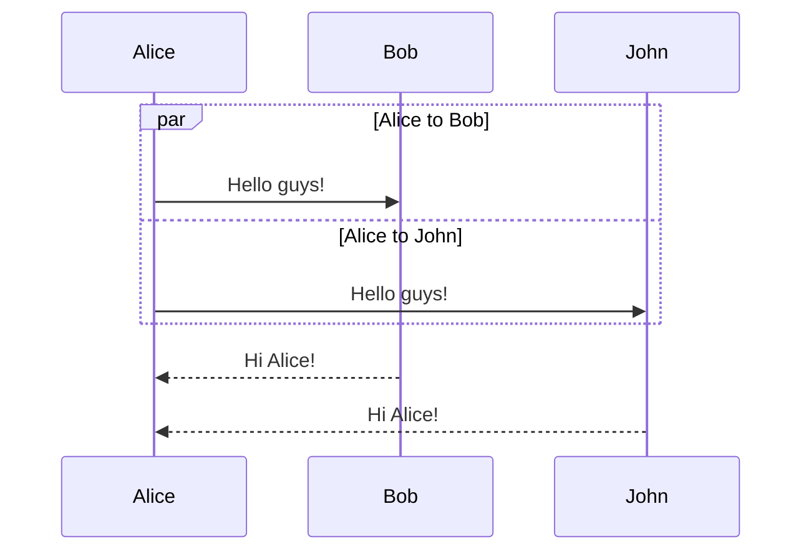
```mermaid
sequenceDiagram
    par Alice to Bob
        Alice->>Bob: Hello guys!
    and Alice to John
        Alice->>John: Hello guys!
    end
    Bob-->>Alice: Hi Alice!
    John-->>Alice: Hi Alice!
```

この例では、AliceがBobとJohnに同時に挨拶をしていることが示されています。その後、BobとJohnからAliceへの応答も示されています。

並行ブロックはネストすることも可能です。
ネストされた並行処理の例:

```markdown
sequenceDiagram
    par Alice to Bob
        Alice->>Bob: Go help John
    and Alice to John
        Alice->>John: I want this done today
        par John to Charlie
            John->>Charlie: Can we do this today?
        and John to Diana
            John->>Diana: Can you help us today?
        end
    end
```

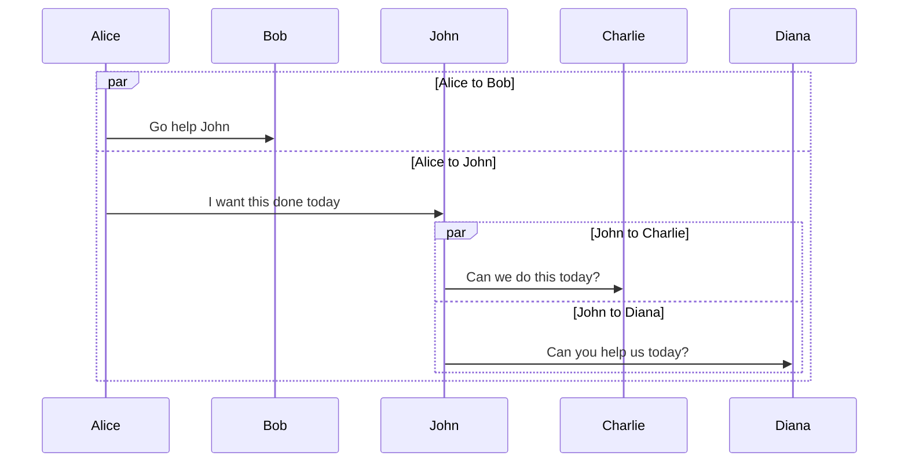
```mermaid
sequenceDiagram
    par Alice to Bob
        Alice->>Bob: Go help John
    and Alice to John
        Alice->>John: I want this done today
        par John to Charlie
            John->>Charlie: Can we do this today?
        and John to Diana
            John->>Diana: Can you help us today?
        end
    end
```

- 並行処理の使用場面
  - マルチタスク環境の表現: 複数のプロセスやタスクが同時に進行している状況を表現するのに有効です。例えば、ソフトウェアが複数のスレッドまたはサービスを同時に実行している場合に使用します。
  - リアルタイムのインタラクション: 複数のユーザーが同時に異なるアクションを取るオンラインプラットフォームやゲームでのインタラクションを表現するのに役立ちます。
- ネストされた並行処理の使用場面
  - 複雑な依存関係の表現: 一つのタスクが開始された後、そのタスクに関連する複数のサブタスクが並行して行われる状況を示すのに使用します。これは、プロジェクト管理やソフトウェア開発プロセスでよく見られます。

## Critical Region(クリティカルリージョン)

シーケンスダイアグラムにおいて、条件に応じて自動的に行わなければならないアクションを表現することが可能です。これは以下の記法で行われます：

```bash
critical [実行必須のアクション]
    ... ステートメント ...
option [条件A]
    ... ステートメント ...
option [条件B]
    ... ステートメント ...
end
```

以下に例を示します：

```markdown
sequenceDiagram
    critical Establish a connection to the DB
        Service-->DB: connect
    option Network timeout
        Service-->Service: Log error
    option Credentials rejected
        Service-->Service: Log different error
    end

```

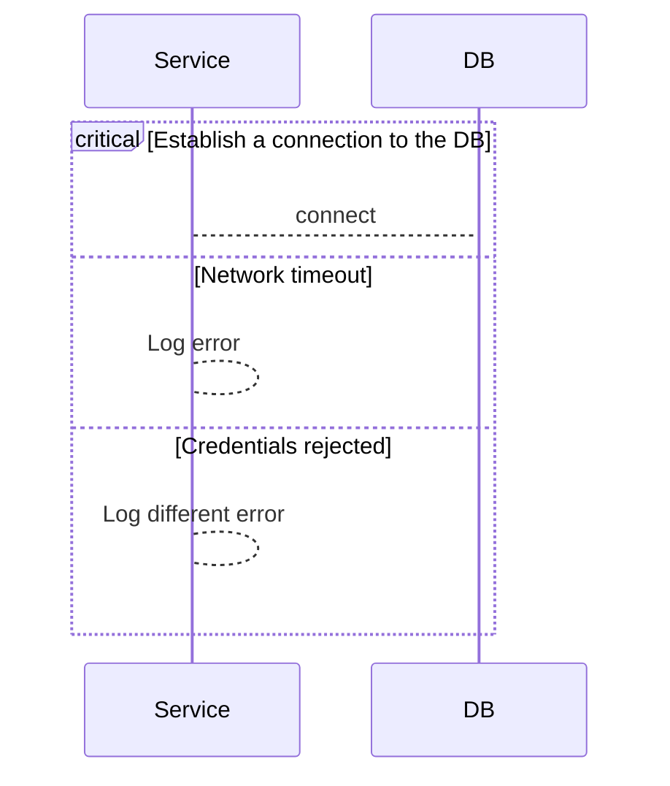
```mermaid
sequenceDiagram
    critical Establish a connection to the DB
        Service-->DB: connect
    option Network timeout
        Service-->Service: Log error
    option Credentials rejected
        Service-->Service: Log different error
    end

```

この例では、データベースへの接続確立がクリティカルリージョンとして定義されています。接続中にネットワークタイムアウトや認証情報の拒否といった異なる条件に応じたエラーログが記録されます。

オプションが全くない場合のコード例もあります：

```markdown
sequenceDiagram
    critical Establish a connection to the DB
        Service-->DB: connect
    end
```

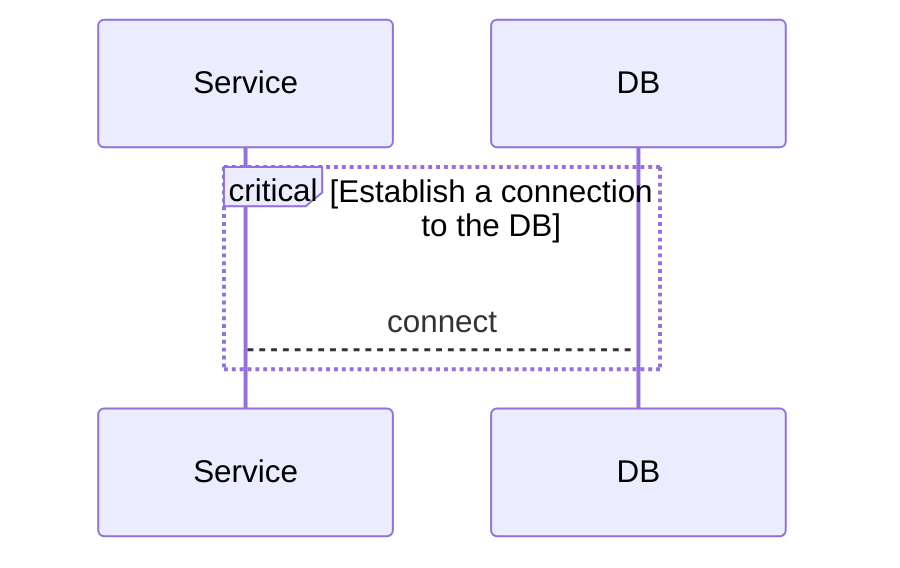
```mermaid
sequenceDiagram
    critical Establish a connection to the DB
        Service-->DB: connect
    end
```

クリティカルリージョン（Critical Region）とは、シーケンスダイアグラムにおいて特定の操作が必須であり、その実行がシステムの安定性やセキュリティに直接影響する重要なプロセスを指します。これは、その操作が成功しなければならない、または特定の条件下で特別な処理が必要とされる場面で使用されます。この機能は、以下のようなシナリオで特に役立ちます：

- システムの安定性とセキュリティに影響する操作: データベースへの接続、システムの初期化、重要なデータの更新など、失敗するとシステム全体に影響が出る可能性があるアクションをクリティカルリージョンとして明示的に管理します。
- エラーハンドリング: クリティカルリージョン内で発生する可能性のある各種エラーを個別に処理し、適切なエラーログを記録することで、問題解決を迅速に行うための情報を提供します。

### CriticalとAlt

#### Criticalの目的と使用

Critical は、その区間に記述されたプロセスがシステムにとって非常に重要であり、必ず成功しなければならない操作を意味します。ここでのエラー処理は、「この操作が失敗した場合の対応」を示すものであり、主にシステムが正常に機能するために「絶対に成功する必要がある操作」を保証するためのものです。つまり、Critical セクション内でのエラー処理は、「もしも失敗したら、どのように安全に処理を終了させるか」という観点から記述されます。

#### Altの目的と使用

一方で、Alt は条件分岐を表し、異なる状況下での複数の可能性を示します。これは「if-else」構造に似ており、特定の条件に基づいてシステムが取り得る異なるアクションパスを示しています。Alt では、各条件に応じてどのような処理が行われるかを定義し、それぞれの条件は互いに排他的な選択肢として扱われます。例えば、「ユーザーがログイン情報を正しく入力した場合」と「入力エラーがあった場合」の処理を分けて記述することができます。

## Break

 break は、プロセスが予期せぬ理由で中断しなければならない場合や、特定のエラー条件が満たされたときに使用されます。通常、例外的な状況やエラーハンドリングのシナリオで用いられ、プロセスが正常に完了しなかった場合のフローを明示的に示します。

シーケンスダイアグラムにおいて、フロー内でシーケンスの停止（通常は例外をモデル化するために使用される）を示すことが可能です。これは以下の記法で行われます：

```bash
break [something happened]
... statements ...
end
```

```markdown
sequenceDiagram
    Consumer-->API: Book something
    API-->BookingService: Start booking process
    break when the booking process fails
        API-->Consumer: show failure
    end
    API-->BillingService: Start billing process
```

```mermaid
sequenceDiagram
    Consumer-->API: Book something
    API-->BookingService: Start booking process
    break when the booking process fails
        API-->Consumer: show failure
    end
    API-->BillingService: Start billing process
```

この例では、顧客がAPIを通じて何かを予約し、APIが予約サービスを開始します。予約プロセスが失敗した場合、break ブロックが活用され、消費者に対して失敗を通知します。その後、請求プロセスが開始されます。

- 使い所：
  - エラーハンドリング： システムが特定の操作を実行中にエラーに遭遇した場合、そのポイントで処理を中断し、ユーザーにエラー情報を提供するために使用します。
  - 例外処理： プログラムの実行中に予期しない状況が発生したときに、通常のフローから抜け出して特定のアクションを実行します。

- 実用的なシナリオ：
  - サービス障害時の処理： オンライン予約システムで予約プロセスがサーバーエラーやデータベースの問題で失敗した場合に、処理を中断し、ユーザーに失敗を通知する。
  - 入力検証失敗時： ユーザーからの入力が要件を満たさない場合、処理を中断してエラーメッセージを返す。

## Background Highlighting

色のついた背景の矩形を提供することで、フローを強調することができる。これは次の記法で行う。
色はrgbとrgba構文を使って定義する。

```bash
rect rgb(0, 255, 0)
... content ...
end
rect rgba(0, 0, 255, .1)
... content ...
end
```

以下の例を参照のこと：

```markdown
sequenceDiagram
    participant Alice
    participant John

    rect rgb(191, 223, 255)
    note right of Alice: Alice calls John.
    Alice->>+John: Hello John, how are you?
    rect rgb(200, 150, 255)
    Alice->>+John: John, can you hear me?
    John-->>-Alice: Hi Alice, I can hear you!
    end
    John-->>-Alice: I feel great!
    end
    Alice ->>+ John: Did you want to go to the game tonight?
    John -->>- Alice: Yeah! See you there.
```

```mermaid
sequenceDiagram
    participant Alice
    participant John

    rect rgb(191, 223, 255)
    note right of Alice: Alice calls John.
    Alice->>+John: Hello John, how are you?
    rect rgb(200, 150, 255)
    Alice->>+John: John, can you hear me?
    John-->>-Alice: Hi Alice, I can hear you!
    end
    John-->>-Alice: I feel great!
    end
    Alice ->>+ John: Did you want to go to the game tonight?
    John -->>- Alice: Yeah! See you there.
```

## Comments

コメントはシーケンス図の中に入力することができますが、パーサーはこれを無視します。コメントは1行で記述し、先頭に%%（ダブル・パーセント記号）を付ける必要があります。コメントの先頭から次の改行までのテキストは、ダイアグラム構文を含め、すべてコメントとして扱われます。

```markdown
sequenceDiagram
    Alice->>John: Hello John, how are you?
    %% this is a comment
    John-->>Alice: Great!
```

```mermaid
sequenceDiagram
    Alice->>John: Hello John, how are you?
    %% this is a comment
    John-->>Alice: Great!
```

## Entity codes to escape characters

ここに例示した構文を使って文字をエスケープすることは可能である。

```markdown
sequenceDiagram
    A->>B: I #9829; you!
    B->>A: I #9829; you #infin; times more!
```

```mermaid
sequenceDiagram
    A->>B: I #9829; you!
    B->>A: I #9829; you #infin; times more!
```

>数字は10進数なので、#は #35;とエンコードできる。HTML文字名の使用もサポートされている。
マークアップを定義するために改行の代わりにセミコロンを使うことができるので、メッセージ・テキストにセミコロンを含めるには#59;を使う必要があります。

*基本的なHTMLエスケープ文字*:

| 文字          | HTMLエンティティ | 数値参照   |
|---------------|------------------|------------|
| アンパサンド & | `&amp;`          | `&#38;`    |
| クオート "    | `&quot;`         | `&#34;`    |
| アポストロフィ' | `&apos;`        | `&#39;`    |
| 小なり記号 <  | `&lt;`           | `&#60;`    |
| 大なり記号 >  | `&gt;`           | `&#62;`    |
| セミコロン ;  | N/A              | `&#59;`    |

*特殊な文字と記号*:
| 説明       | エンティティ    | 数値参照   | 表示結果 |
|------------|----------------|------------|----------|
| スペース   | `&nbsp;`       | `&#160;`   | (空白)   |
| カピラル通貨 | `&euro;`       | `&#8364;`  | €        |
| ポンド     | `&pound;`      | `&#163;`   | £        |
| 円         | `&yen;`        | `&#165;`   | ¥        |
| コピーライト | `&copy;`      | `&#169;`   | ©        |
| 登録商標   | `&reg;`        | `&#174;`   | ®        |
| ダッシュ   | `&mdash;`      | `&#8212;`  | —        |
| エンダッシュ | `&ndash;`     | `&#8211;`  | –        |
| 左二重引用符 | `&ldquo;`     | `&#8220;`  | “        |
| 右二重引用符 | `&rdquo;`     | `&#8221;`  | ”        |
| 左単引用符 | `&lsquo;`      | `&#8216;`  | ‘        |
| 右単引用符 | `&rsquo;`      | `&#8217;`  | ’        |
| 不等号     | `&ne;`         | `&#8800;`  | ≠        |
| 小なり等しい | `&le;`        | `&#8804;`  | ≤        |
| 大なり等しい | `&ge;`        | `&#8805;`  | ≥        |
| ディビジョン | `&divide;`    | `&#247;`   | ÷        |
| マルチプライ | `&times;`     | `&#215;`   | ×        |
| ディグリー | `&deg;`        | `&#176;`   | °        |

## sequenceNumbers

シーケンス図の各矢印にシーケンス番号を付けることができます。これは、以下のようにマーメイドをウェブサイトに追加する際に設定することができます：

```html
<script>
  mermaid.initialize({ sequence: { showSequenceNumbers: true } });
</script>
```

また、図のように、ダイアグラムコードを介してオンにすることもできる：

```markdown
sequenceDiagram
    autonumber
    Alice->>John: Hello John, how are you?
    loop HealthCheck
        John->>John: Fight against hypochondria
    end
    Note right of John: Rational thoughts!
    John-->>Alice: Great!
    John->>Bob: How about you?
    Bob-->>John: Jolly good!

```

```mermaid
sequenceDiagram
    autonumber
    Alice->>John: Hello John, how are you?
    loop HealthCheck
        John->>John: Fight against hypochondria
    end
    Note right of John: Rational thoughts!
    John-->>Alice: Great!
    John->>Bob: How about you?
    Bob-->>John: Jolly good!

```

## Actor Menus

アクターには、外部ページへのリンクを含むポップアップメニューを設定することができます。たとえば、アクターがウェブサービスを表している場合、役立つリンクにはサービスのヘルスダッシュボードへのリンク、サービスのコードを含むリポジトリ、またはサービスを説明するWikiページへのリンクが含まれるかもしれません。

この設定は、以下のフォーマットを持つ1つ以上のリンク行を追加することで行うことができます：

```bash
link <actor>: <link-label> @ <link-url>
```

```markdown
sequenceDiagram
    participant Alice
    participant John
    link Alice: Dashboard @ https://dashboard.contoso.com/alice
    link Alice: Wiki @ https://wiki.contoso.com/alice
    link John: Dashboard @ https://dashboard.contoso.com/john
    link John: Wiki @ https://wiki.contoso.com/john
    Alice->>John: Hello John, how are you?
    John-->>Alice: Great!
    Alice-)John: See you later!
```

```mermaid
sequenceDiagram
    participant Alice
    participant John
    link Alice: Dashboard @ https://dashboard.contoso.com/alice
    link Alice: Wiki @ https://wiki.contoso.com/alice
    link John: Dashboard @ https://dashboard.contoso.com/john
    link John: Wiki @ https://wiki.contoso.com/john
    Alice->>John: Hello John, how are you?
    John-->>Alice: Great!
    Alice-)John: See you later!

```

このシーケンスダイアグラムでは、AliceとJohnという2人の参加者（アクター）がいて、それぞれにダッシュボードとWikiへのリンクが設定されています。

### 高度なメニュー構文

JSON形式を利用した高度な構文も存在します。JSON形式に慣れている場合、以下の形式でリンクを追加できます：

```bash
links <actor>: <json-formatted link-name link-url pairs>
```

```markdown
sequenceDiagram
    participant Alice
    participant John
    links Alice: {"Dashboard": "https://dashboard.contoso.com/alice", "Wiki": "https://wiki.contoso.com/alice"}
    links John: {"Dashboard": "https://dashboard.contoso.com/john", "Wiki": "https://wiki.contoso.com/john"}
    Alice->>John: Hello John, how are you?
    John-->>Alice: Great!
    Alice-)John: See you later!
```

```mermaid
sequenceDiagram
    participant Alice
    participant John
    links Alice: {"Dashboard": "https://dashboard.contoso.com/alice", "Wiki": "https://wiki.contoso.com/alice"}
    links John: {"Dashboard": "https://dashboard.contoso.com/john", "Wiki": "https://wiki.contoso.com/john"}
    Alice->>John: Hello John, how are you?
    John-->>Alice: Great!
    Alice-)John: See you later!
```

この例では、AliceとJohnに対してそれぞれのダッシュボードとWikiページへのリンクがJSON形式で設定されています。この形式を使うと、複数のリンクを1行で効率的に設定できるため、大規模な図や多くのリンクが必要な場合に便利です。

## Styling

## Configuration

疲れたからやらない
