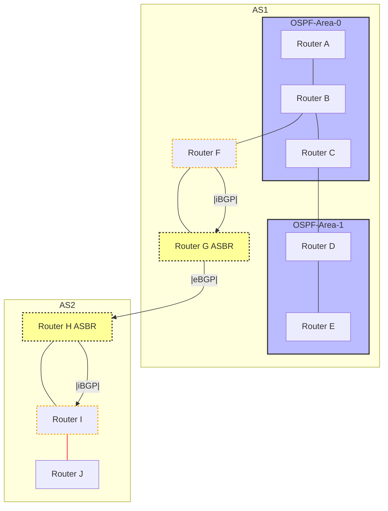

# BGP、OSPF、およびASについての簡単な説明

## AS（Autonomous System）：自律システム

自律システム（AS）は、一つの組織が管理するIPネットワークの集まりです。例えば、インターネットサービスプロバイダ（ISP）や大学などが自分たちのネットワークを管理するためにASを使用します。

## OSPF（Open Shortest Path First）

OSPFは、一つのAS内で使用されるルーティングプロトコルです。ネットワーク内の各ルータに対して、他のルータへの最短経路を計算させることで、データパケットが目的地まで最も効率的なルートをたどるようにします。

## BGP（Border Gateway Protocol）

BGPは、異なるAS間でルーティング情報を交換するためのプロトコルです。インターネットは多数のASで構成されており、BGPによって異なるネットワーク間でデータパケットが正しく転送されます。

## 関係性

- **OSPF**は、AS**内部**でのルーティングを最適化するために使われます。これにより、ネットワーク内での通信がスムーズになります。
- **BGP**は、AS**間**のルーティング情報の交換に使われ、インターネット全体の接続性を保ちます。
- 一つのAS内では**OSPF**が使用されることが多く、異なるAS同士が通信する際には**BGP**が使用されます。

これらのプロトコルと概念は、インターネットがどのようにして動作しているかを理解する上で非常に重要です。

