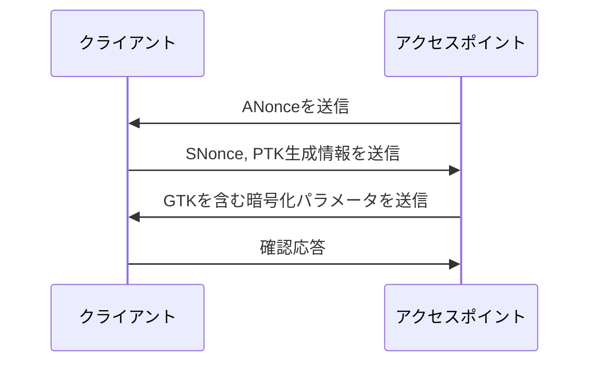
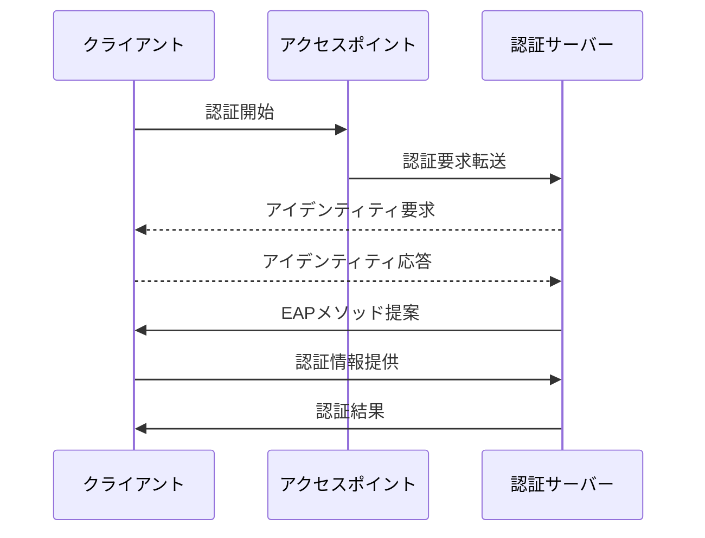
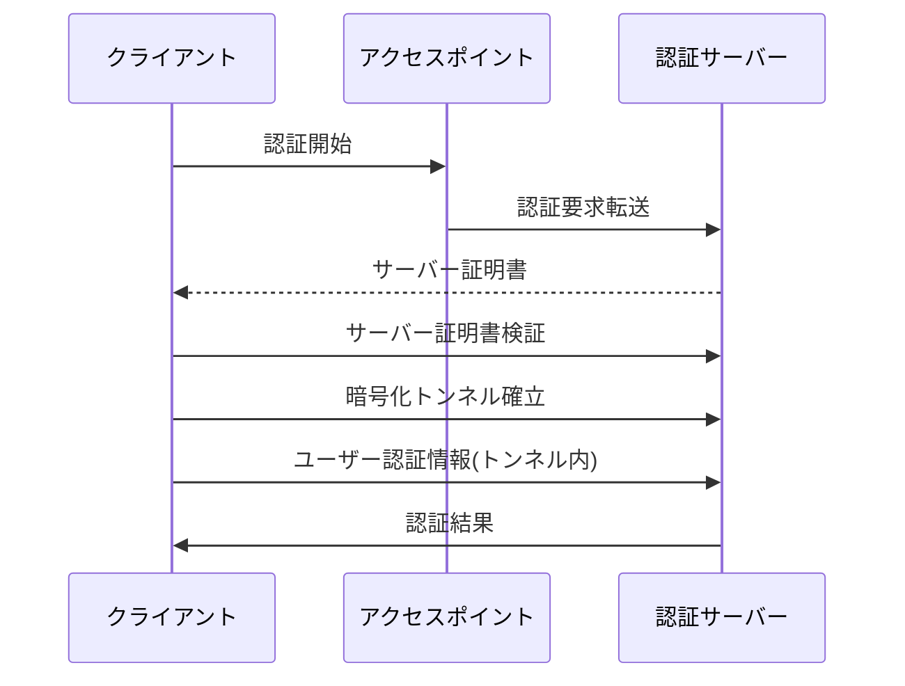
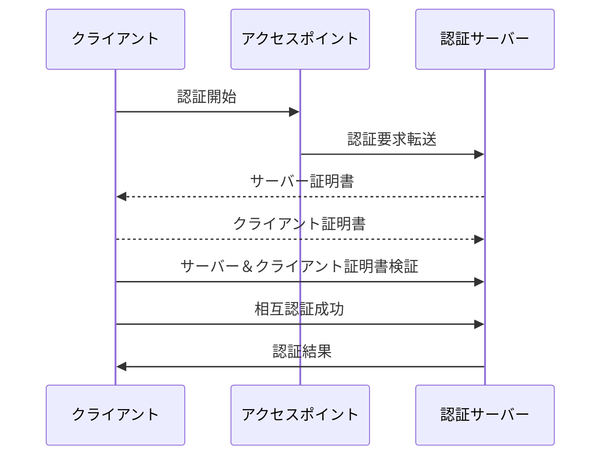

# 無線LANの認証方式

無線LANにおける主要な認証方式には、以下のものがあります：

## WEP (Wired Equivalent Privacy)

- **認証プロセス**: 端末がネットワークに接続する際に、事前に共有された鍵（WEPキー）を用いてデータを暗号化し、送信します。アクセスポイントはこのキーを使用してデータを復号化し、認証を行います。
- **必要な情報**: 事前に共有されたWEPキー。

## WPA-PSK (Wi-Fi Protected Access Pre-Shared Key)

- **認証プロセス**: 事前に共有されたキー（プリシェアードキー、PSK）を基にハンドシェイクプロセスを行い、暗号化キーを生成します。このキーはセッション中のデータ暗号化に使用されます。
- **必要な情報**: 事前に共有されたPSK。

## MACアドレス認証

- **認証プロセス**: アクセスポイントのフィルタリングリストに登録されたMACアドレスを持つデバイスのみがネットワークアクセスを許可されます。
- **必要な情報**: デバイスのMACアドレス。

## WEB認証

- **認証プロセス**: ユーザーがブラウザを介して認証ページにアクセスし、ログイン情報（ユーザー名とパスワード）を提供します。認証後、ネットワークアクセスが許可されます。
- **必要な情報**: ユーザー名とパスワード。

## EAP (Extensible Authentication Protocol) / IEEE 802.1X認証

- **認証プロセス**: 認証サーバー（例: RADIUSサーバー）を使用してデバイス認証を行います。クライアントと認証サーバー間でEAPメッセージが交換され、ユーザー名とパスワード、証明書などに基づいて認証が行われます。
- **必要な情報**: 認証方法に依存しますが、一般にユーザー名とパスワード、デジタル証明書など。

これらの認証方式は無線LANネットワークのセキュリティを強化するために、事前に共有された情報やデバイスの特定の属性を利用します。選択する認証方式は、ネットワークのセキュリティ要件と利便性を考慮して決定されるべきです。

%% WPA-PSK 認証プロセス

%% EAP/IEEE 802.1X 認証プロセス

# PEAPとEAP-TLSについて

無線LANネットワークで使用される認証プロトコル、PEAP（Protected Extensible Authentication Protocol）とEAP-TLS（Extensible Authentication Protocol-Transport Layer Security）についての概要と特徴。

## 概要

| 特徴           | PEAP                                        | EAP-TLS                                     |
| -------------- | ------------------------------------------- | ------------------------------------------- |
| 認証タイプ     | サーバー認証＋ユーザー認証                   | 相互認証                                    |
| セキュリティ   | 高                                           | 非常に高                                     |
| 認証情報       | サーバー証明書（クライアント証明書は任意）   | サーバーとクライアントの証明書               |
| 設定の容易さ   | 比較的容易                                   | 複雑                                        |

## 認証プロセスのシーケンス図

### PEAP認証プロセス

### EAP-TLS認証プロセス

