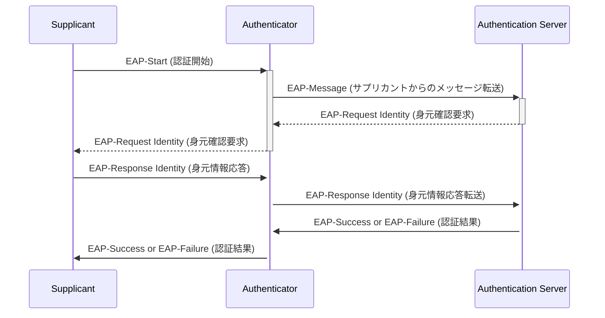
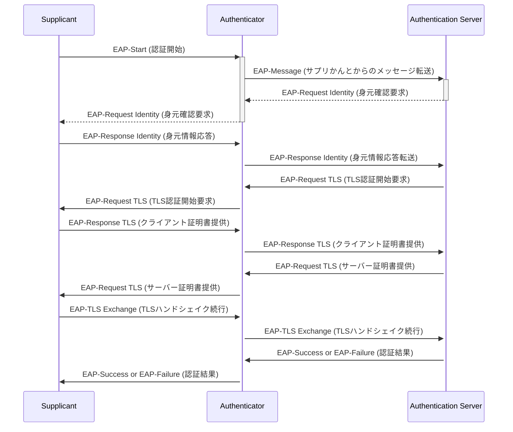

# EAPについての概要

EAP（Extensible Authentication Protocol）は、様々な認証メカニズムをサポートするために設計されたフレームワークです。これはPPP（Point-to-Point Protocol）を拡張する形で開発され、無線LANや有線ネットワークでの認証に広く利用されています。

## EAPが拡張したプロトコル

EAPは、2点間の接続を確立するためのPPPに対して認証機能を拡張しました。これにより、多様な認証メカニズムをPPP上で提供することが可能となりました。

## 認証方式

EAPは以下のような多様な認証方式をサポートしています。

- EAP-MD5
- EAP-TLS（Transport Layer Security）
- EAP-TTLS（Tunneled Transport Layer Security）
- PEAP（Protected EAP）
- EAP-SIM（Subscriber Identity Module）
- EAP-AKA（Authentication and Key Agreement）

| 認証方式    | 認証メカニズム              | セキュリティレベル | 実装の複雑さ | 特徴                                                     |
|-----------|------------------------|--------------|------------|--------------------------------------------------------|
| EAP-MD5   | ユーザー名とパスワード      | 低            | 低          | 古い方式であり、暗号化されていないため、安全性が低いです。                          |
| EAP-TLS   | デジタル証明書             | 高            | 高          | クライアントとサーバーの両方が証明書を必要とし、高いセキュリティを提供します。         |
| EAP-TTLS  | チュネルを使用した証明書       | 高            | 中          | サーバーのみが証明書を必要とし、クライアント認証はチュネル内で行われます。             |
| PEAP      | チュネルを使用したパスワード認証 | 中            | 中          | サーバーの証明書を使用してチュネルを確立し、その内部でパスワード認証を行います。       |
| EAP-SIM   | SIMカード                | 中            | 低          | モバイルネットワークのSIMカードを使用した認証方式です。                        |
| EAP-AKA   | SIMカードの派生          | 高            | 中          | 強化されたセキュリティ機能を持つSIMカードを使用した認証方式です。                   |

***覚え方***

- EAP-TLS: 「全員証明書」
  - EAP-TLSは、クライアントとサーバーの両方がデジタル証明書を使用することが特徴です。この方式を「全員証明書」と覚えることで、双方が証明書を持っていることを思い出しやすくなります。
- PEAP: 「パスワードの保護層」
  - PEAP（Protected EAP）は、セキュリティで保護されたトンネルを確立してからパスワード認証を行う方式です。この特徴を「パスワードの保護層」と考えることで、PEAPが提供するセキュリティ層を通じてパスワードが保護されることを覚えられます。
- EAP-SIM: 「モバイル認証」
  - EAP-SIMは、モバイルネットワークのSIMカードを使用して認証を行う方法です。この方式を簡単に「モバイル認証」と覚えることで、SIMカードを利用する認証方法として記憶に残ります。

## IEEE 802.1Xとの関係

IEEE 802.1Xは、特に有線LANや無線LANで利用されるネットワークアクセス制御プロトコルです。EAPはIEEE 802.1Xの認証フレームワークとして機能し、端末がネットワークへのアクセスを試みる際に前もって認証を行う仕組みを提供します。これにより、IEEE 802.1Xプロトコルの実現が可能となります。

# IEEE 802.1X認証フレームワークのコンポーネント

IEEE 802.1X認証フレームワークでは、以下の3つの主要コンポーネントが連携してネットワーク認証を行います。

1. **Supplicant (サプリカント)**: ネットワークにアクセスしようとするクライアントデバイスです。認証情報を提供する責任があります。
2. **Authenticator (オーセンティケータ)**: ネットワークアクセスポイントのことで、クライアントデバイスと認証サーバ間の中間者として機能します。
3. **Authentication Server (認証サーバ)**: 認証情報の検証を担当するサーバです。通常はRADIUSサーバがこの役割を果たします。

## 認証プロセスのシーケンス

以下は、これらのコンポーネント間での基本的な認証プロセスのMermaidシーケンス図です。

## EAP-TLS認証プロセス

EAP-TLSを使用した認証プロセスでは、サプリカント（Supplicant）、オーセンティケータ（Authenticator）、および認証サーバー（Authentication Server）間で証明書が交換され、相互認証が行われます。以下はそのプロセスを示したシーケンス図です。

1. EAP-Start: サプリカントが認証開始を知らせます。
1. EAP-Request Identity: 認証サーバーが身元確認要求をします。
1. EAP-Response Identity: サプリカントが身元情報を応答します。
1. EAP-Request TLS: TLS認証の開始が要求されます。
1. EAP-Response TLS (クライアント証明書提供): サプリカントがクライアント証明書を提供します。
1. EAP-Request TLS (サーバー証明書提供): 認証サーバーがサーバー証明書を提供します。
1. EAP-TLS Exchange: TLSハンドシェイクが続行され、相互認証とセキュアな通信チャネルの確立が行われます。
1. EAP-Success or EAP-Failure: 認証結果がサプリカントに通知されます。
