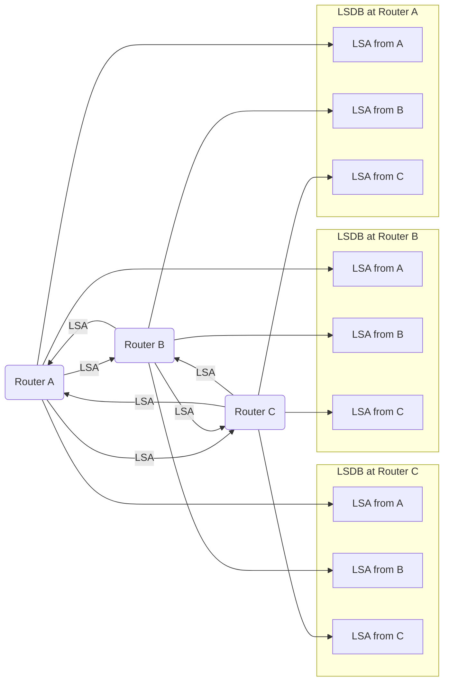
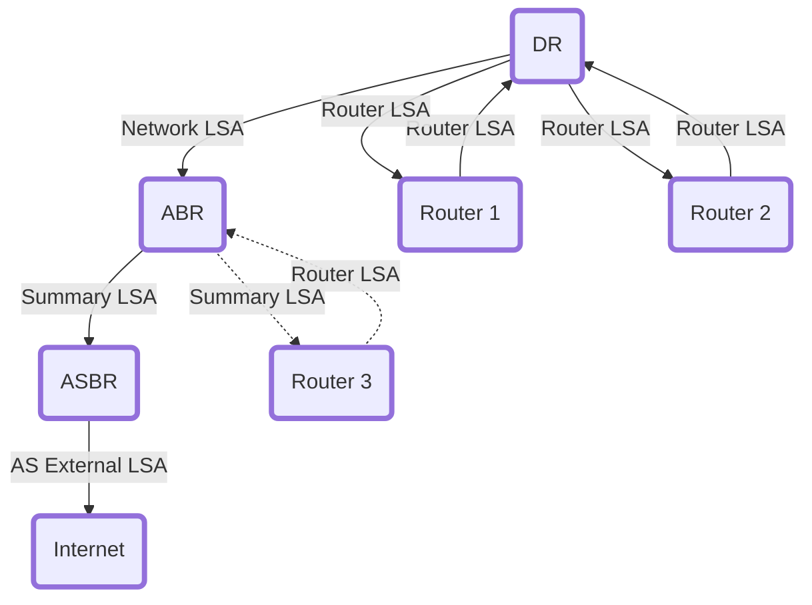
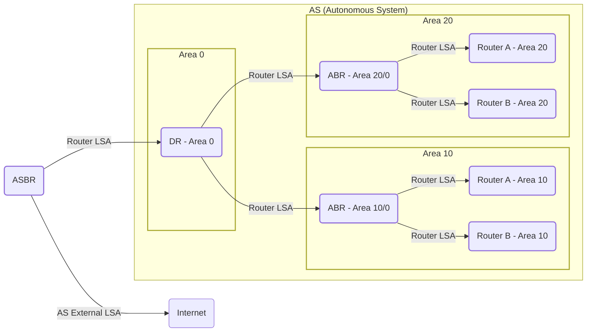

## OSPFについてのまとめ

#### OSPFの概要

- **OSPF (Open Shortest Path First)**: ルータ間で動的にルーティング情報を交換するインターネットプロトコル。
  - ３５文字以内の説明
    - `最短経路を決定するプロトコル`

- **リンクステートルーティングプロトコル**: 各ルータがネットワークの全体像を把握し、最短経路を計算。
- **動的ルーティングプロトコル**: ネットワークの変更時にルート情報を自動更新。

#### OSPFとエリア

- **エリア**: 効率的な管理とルーティング情報の伝播制御のためにネットワークを分割。
- **バックボーンエリア (エリア 0)**: OSPFネットワークの中心。他のエリアはこのエリアに接続する必要がある。
- **非バックボーンエリア**: エリア 0 以外。ローカルなルーティング情報を保持。

#### OSPFの動作原理

- **LSA (Link State Advertisement)**: リンクステート情報の広告。
- **LSDB (Link State Database)**: 受け取ったLSAを格納するデータベース。

#### OSPFの技術的詳細

- **OSIモデル**: OSPFはネットワーク層（レイヤー3）で動作。
- **IPプロトコル番号**: OSPFはプロトコル番号 **89** を使用。
- **マルチキャストアドレス**: 224.0.0.5 (全OSPFルーターへのメッセージ送信用)、224.0.0.6 (指定ルーターへのメッセージ送信用)。
  
#### 最短経路の計算

- **アルゴリズム**: Dijkstra(ダイクストラ)アルゴリズム
- **コスト計算**: 100(Mbps) / 回線速度
  - 回線速度10Mbpsの場合、100 /10 = 10 10コストとなる

#### 視覚的説明

- **Mermaid図**: OSPFのLSAとLSDBの関係と流れを視覚的に示す。

#### 主要コンポーネント

###### DR（Designated Router）

- 役割:
  - OSPFでは、同じブロードキャストネットワーク（例えば、イーサネット）上に複数のルーターが存在する場合、全てのルーター間で情報を交換すると大量のトラフィックが発生します。この問題を解決するために、DRとBDR（バックアップ）が選出され、ネットワーク上のルーター間の情報交換を代行します。
- 選出:
  - DRは、OSPFの優先度（デフォルトでは1）やルーターIDに基づいて選出されます。優先度が最も高いルーターがDRになります。

柔らかく表現

- 何をするの？:
  - たくさんのルーターがいる場所では、全てのルーターがお互いに話し合うとごちゃごちゃして大変です。そこで、DRという特別なルーターが選ばれて、みんなの代わりに話をまとめる役割をします。
- どうやって選ばれるの？:
  - ルーターたちは、自分たちの中から「私がやる！」と言うルーターの中で、一番条件が良いルーターをDRとして選びます。

###### ABR（Area Border Router）

- 役割:
  - OSPFネットワークは、複数のエリアに分割されることがあります。ABRは異なるOSPFエリア間の境界に位置し、エリア間ルーティング情報を交換する役割を持ちます。
- 機能:
  - ABRは、異なるエリアから受信したルーティング情報を要約し、他のエリアに配布することができます。

柔らかく表現

- 何をするの？:
  - OSPFでは、大きなネットワークを小さなエリアに分けて管理します。ABRは、これらのエリアの間に立って、異なるエリア同士が情報を交換できるようにするルーターです。
- どんな役割？:
  - ABRは、異なるエリアから来た情報を受け取り、他のエリアに伝えることで、大きなネットワーク全体で情報がスムーズに行き渡るようにします。

###### ASBR（Autonomous System Boundary Router）

- 役割:
  - ASBRは、OSPFが動作している自律システム（AS）と外部ネットワーク（他のルーティングプロトコルや静的ルートが配置されているネットワーク）との間でルーティング情報を交換するルーターです。
- 機能:
  - ASBRは、外部ルートをOSPFネットワークにインポートし、必要に応じてOSPFネットワークから外部ネットワークへのルートをアドバタイズします。

柔らかく表現

- 何をするの？:
  - ASBRは、OSPFで管理されているネットワークと、外部の別のネットワーク（例えばインターネットなど）との間で情報をやり取りするルーターです。
- どんな役割？:
  - 外から来た情報をOSPFネットワーク内に伝えたり、逆にOSPFネットワークから外部に情報を出したりします。

#### LSA（Link State Advertisement）

- OSPFネットワーク内のトポロジー情報を伝播するために使用されるメッセージ。
- 異なるタイプのLSAがあり、ネットワークの異なる側面を記述します。

###### タイプ別のLSA

1. **Router LSA (Type 1)**: ルーターが直接接続されているリンクの状態を記述します。
2. **Network LSA (Type 2)**: DRによって生成され、ブロードキャストネットワーク上のルーターのリストを含みます。
3. **Summary LSA (Type 3)**: ABRによって生成され、異なるエリアへのルートの要約を提供します。
4. **AS External LSA (Type 5)**: ASBRによって生成され、外部ネットワークへのルート情報をOSPFエリア内に配布します。

#### 視覚化例（Mermaid）

#### ちなみに

過去こんな問題がありました。

> 各拠点のL3SWでは,経路制御プロトコルとしてOSPFを動作させます。OSPF では,[　ア　]と呼ばれるメトリックを扱います。L3SWでは,物理ポートの通信速度から計算された値がメトリックのデフォルト値になりますが,拠点間の経路選択を適切に行うために、①各処点のL3SWのポートの一つにはデフォルト値よりも大きな値を設定しておきます。
設問2 (1)本文中の[　ア　]に入れる適切な数値を答えよ。
 (2)本文中の下線①を行うのは,デフォルト値のままでは何の情報が反映されていないからか。

(1)アは”コスト”
(2)は”拠点間の通信回線の実質的な回線速度の情報”

(2)の解説
デフォルトのコスト値では、拠点間の通信回線の実質的な回線速度の情報が反映されていないからです。
OSPFでは、物理ポートの通信速度に基づいてコストを自動的に計算しますが、この方法では、
実際のネットワークの利用状況や回線品質（例えば、回線の輻輳やエラー率）を考慮していません。
そのため、実際にはより低速であったり、品質が劣る回線が選択される可能性があります。

この問題を解決するために、
特定のポートに対してデフォルト値よりも大きなコスト値を設定することで、
実質的な回線速度や品質を反映させます。これにより、OSPFはより現実的なネットワーク環境を考慮した経路選択を行うことができ、
結果的に通信の効率性や信頼性が向上します。具体的には、より遅い回線や品質が劣る回線を避けて、
より高速で信頼性の高い経路を選択するために、コスト値を手動で調整することが行われます。
