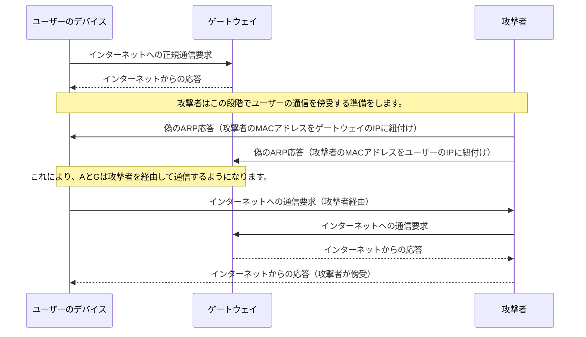

# ARPスプーフィング攻撃とは

ARPスプーフィング攻撃は、攻撃者がネットワーク内の他のデバイスに対して偽のARPメッセージを送信し、自分をネットワーク上の他のデバイス（多くの場合はゲートウェイ）として装うことにより、ユーザーのデータトラフィックを傍受する攻撃です。この攻撃により、攻撃者は中間者攻撃（Man-In-The-Middle, MITM）を実行し、通信を監視したり、改ざんしたりすることが可能になります。

## 攻撃のプロセス

1. **通常のARP動作**:
   - デバイスはネットワーク上の他のデバイスのMACアドレスを知るためにARP要求をブロードキャストします。
   - 要求を受信したデバイスは、自分のMACアドレスを含むARP応答を返します。

2. **ARPスプーフィング攻撃**:
   - 攻撃者はネットワーク上で偽のARP応答をブロードキャストし、自分のMACアドレスをターゲットデバイスのIPアドレスに関連付けます。

## ARPテーブルの変化を示す図解

### 攻撃前

- **ユーザーのデバイスARPテーブル**:
  | IPアドレス    | MACアドレス         |
  |-----------|------------------|
  | ゲートウェイのIP | ゲートウェイのMACアドレス |

- **攻撃者のデバイスARPテーブル**:
  | IPアドレス    | MACアドレス    |
  |-----------|---------------|
  | ユーザーのIP | ユーザーのMACアドレス |

### 攻撃後

- **ユーザーのデバイスARPテーブル**:
  | IPアドレス    | MACアドレス      |
  |-----------|-----------------|
  | ゲートウェイのIP | **攻撃者のMACアドレス** |

- **攻撃者のデバイスARPテーブル**:
  | IPアドレス    | MACアドレス         |
  |-----------|------------------|
  | ゲートウェイのIP | ゲートウェイのMACアドレス |
  | ユーザーのIP    | ユーザーのMACアドレス    |

このように、ARPスプーフィング攻撃により、攻撃者はユーザーのデバイスとゲートウェイの間に自分を挿入し、すべてのトラフィックを傍受することができます。これにより、攻撃者は機密情報を盗み出したり、通信内容を改ざんしたりすることが可能になります。

# ARPスプーフィング攻撃に対する対策

ARPスプーフィング攻撃を防ぐためには、ネットワークのセキュリティを強化し、不正なARPトラフィックを検出できるようにする必要があります。以下に、効果的な対策をいくつか紹介します。

## 静的ARPエントリの設定

- ネットワーク内の重要なデバイス（例えば、ゲートウェイ、サーバー）に対して、ARPテーブルに静的にIPアドレスとMACアドレスを割り当てます。
- これにより、攻撃者が偽のARP応答でこれらのデバイスを偽装することを防ぐことができます。

## ARPスヌーピングの有効化

- スイッチやルーターでARPスヌーピング機能を有効にすることで、不正なARPパケットを検出し、ブロックすることができます。
- ARPスヌーピングは、信頼できるポートからのみARP応答を許可し、不正なソースからのARPトラフィックを制限します。

## ネットワークセグメンテーション

- ネットワークを複数のセグメントに分割することで、攻撃の影響範囲を限定し、セキュリティを向上させることができます。
- セグメンテーションにより、攻撃者がネットワーク全体にアクセスするのを難しくします。

## VPNの使用

- ネットワークトラフィックを暗号化することで、ARPスプーフィングによる傍受を防ぐことができます。
- VPNは、特に公共のWi-Fiネットワークなど、セキュリティが低い環境での通信において有効です。

## セキュリティソフトウェアの使用

- ARPスプーフィング攻撃を検出し、警告するセキュリティソフトウェアやシステムを導入します。
- これらのツールは、不審なARPアクティビティを監視し、攻撃を早期に発見するのに役立ちます。

これらの対策を適切に実施することで、ARPスプーフィング攻撃に対するリスクを大幅に低減させることができます。しかし、ネットワークのセキュリティを維持するためには、これらの対策を定期的に見直し、更新することが重要です。

# 参考サイト
- https://www.infraexpert.com/study/dhcpz6.html