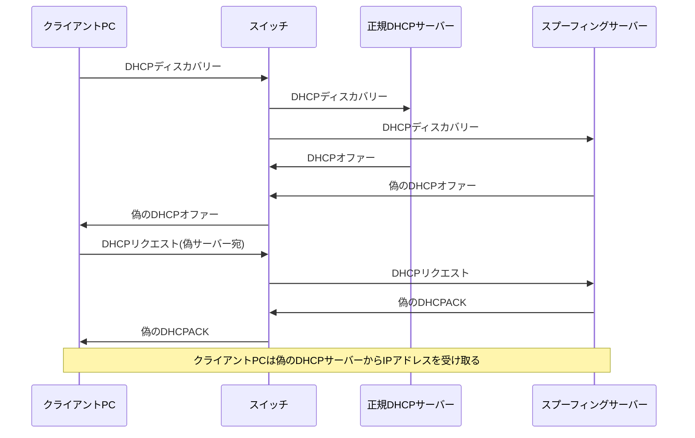
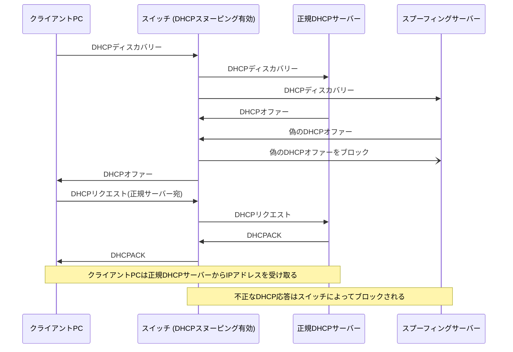

# DHCPスヌーピングとは

DHCPスヌーピングは、ネットワークセキュリティを強化するための技術であり、不正なDHCPサーバからの攻撃を検出し、防止する機能です。この技術には、「trusted（信頼された）」ポートと「untrusted（信頼されていない）」ポートを区別する概念が含まれています。

## TrustedポートとUntrustedポート

- **Trustedポート**: これらのポートは、正規のDHCPサーバからの応答を許可するとマークされています。ネットワーク管理者は、実際のDHCPサーバに接続されているポートをtrustedとして設定することにより、正当なDHCP通信のみがネットワーク内で行われるようにします。

- **Untrustedポート**: 一方、untrustedポートは、DHCPサーバからの応答を許可しないとマークされています。クライアントデバイスが接続されるポートは通常、untrustedとして設定され、これにより不正なDHCPサーバがネットワーク内で応答することを防ぎます。

## 主な機能と利点

- **不正なDHCPサーバの検出と防止**: untrustedポートからのDHCP応答をブロックすることで、不正なDHCPサーバによる攻撃を防ぎます。
- **DHCPスターベーション攻撃の防止**: untrustedポートからの大量のDHCPリクエストを制御することで、IPアドレスプールの枯渇を防ぎます。
- **ネットワークセキュリティの向上**: trustedポートのみがDHCP応答を許可することにより、ネットワークのセキュリティが強化されます。
- **攻撃の検出と報告**: 不正な活動を検出し、管理者に報告することで、迅速な対応を可能にします。

# シーケンス図

***DHCP Spoofing***

***DHCP Snooping***

# 参考サイト

- [DHCP Snooping](https://www.infraexpert.com/study/dhcp4.htm)
- [DHCP Spoofing](https://www.infraexpert.com/study/dhcpz5.html)