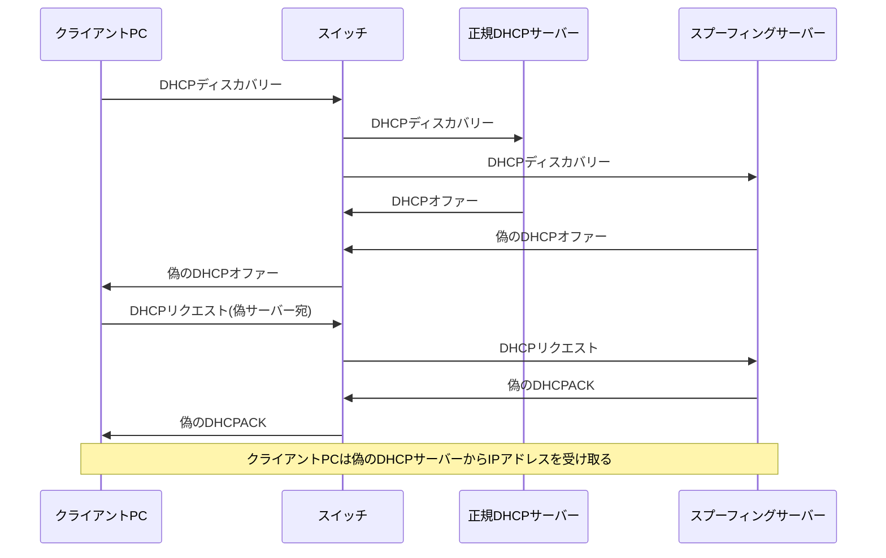
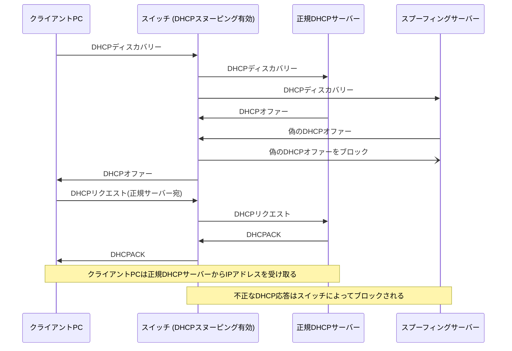

## DHCP スヌーピングとは

DHCP スヌーピングは、ネットワークセキュリティを強化するための技術であり、不正な DHCP サーバからの攻撃を検出し、防止する機能です。この技術には、「trusted（信頼された）」ポートと「untrusted（信頼されていない）」ポートを区別する概念が含まれています。

#### Trusted ポートと Untrusted ポート

- **Trusted ポート**: これらのポートは、正規の DHCP サーバからの応答を許可するとマークされています。ネットワーク管理者は、実際の DHCP サーバに接続されているポートを trusted として設定することにより、正当な DHCP 通信のみがネットワーク内で行われるようにします。

- **Untrusted ポート**: 一方、untrusted ポートは、DHCP サーバからの応答を許可しないとマークされています。クライアントデバイスが接続されるポートは通常、untrusted として設定され、これにより不正な DHCP サーバがネットワーク内で応答することを防ぎます。

#### 主な機能と利点

- **不正な DHCP サーバの検出と防止**: untrusted ポートからの DHCP 応答をブロックすることで、不正な DHCP サーバによる攻撃を防ぎます。
- **DHCP スターベーション攻撃の防止**: untrusted ポートからの大量の DHCP リクエストを制御することで、IP アドレスプールの枯渇を防ぎます。
- **ネットワークセキュリティの向上**: trusted ポートのみが DHCP 応答を許可することにより、ネットワークのセキュリティが強化されます。
- **攻撃の検出と報告**: 不正な活動を検出し、管理者に報告することで、迅速な対応を可能にします。

## シーケンス図

**_DHCP Spoofing_**

**_DHCP Snooping_**

## 参考サイト

- [DHCP Snooping](https://www.infraexpert.com/study/dhcp4.htm)
- [DHCP Spoofing](https://www.infraexpert.com/study/dhcpz5.html)
