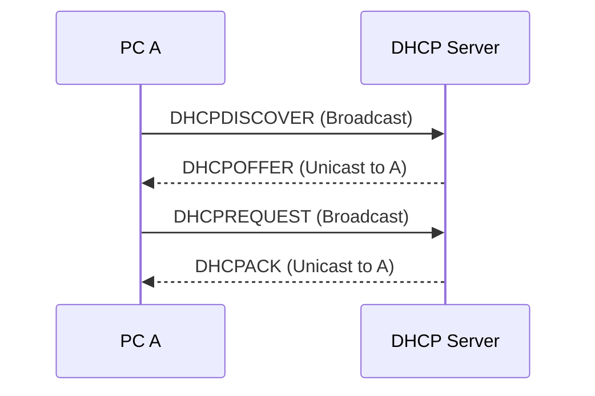

# DHCP について

## 1. **DHCP とは**

- DHCP（Dynamic Host Configuration Protocol）は、ネットワーク上のデバイスに対して自動的に IP アドレスを割り当てるプロトコルです。ネットワーク上に接続されたデバイスがインターネットやその他のネットワークリソースにアクセスするためには、IP アドレスが必要であり、DHCP によってこのプロセスが自動化されます。

## 2. **メリット**

- **自動化による効率化**
  - DHCP を使用すると、ネットワーク管理者は全ての端末に対して IP アドレスやその他のネットワーク設定を手動で行う必要がありません。これは、特に設定の変更が必要な場合や、新しいデバイスをネットワークに追加する場合、またはデバイスを異なるフロアや場所に移動して使用する場合などに便利です。
- **設定の煩雑さを解消**
  - DHCP を利用することで、「IP アドレスなどを手作業で設定する煩雑さをなくす」ことができます。これは、大規模な環境や頻繁に設定変更が必要な環境において、時間と労力の大きな節約につながります。
- **IP アドレスの一元管理**
  - DHCP サーバーを使用すると、IP アドレスを一元的に管理できます。これにより、IP アドレスの割り当て状況を把握しやすくなり、IP アドレスの衝突を避けることが可能になります。また、DHCP サーバーのログを通じて、ネットワーク上のデバイスの割り当て状況を追跡できます。
- **IP アドレスの有効利用**
  - DHCP による IP アドレスの動的割り当ては、リース期間の概念を導入することで、IP アドレスの再利用を可能にします。これにより、「一定期間ごとの IP アドレスの再利用を行うので、DHCP サーバに登録する IP アドレス数の削減ができる」というメリットがあります。企業がプライベートアドレスを使用している場合でも、IP アドレスの枯渇を防ぐことに貢献します。

## 3. **デメリット**

- **DHCP サーバーの依存性**
  - DHCP サーバーがダウンすると、新しくネットワークに接続するクライアントに IP アドレスを割り当てることができなくなります。これは、ネットワークの利用開始時や IP アドレスのリース更新時に特に問題となり、結果としてネットワークの利用が一時的に不可能になる可能性があります。
- **運用コスト**
  - DHCP サーバーの導入および運用には、ハードウェア、ソフトウェア、管理の各面でコストがかかります。大規模なネットワークでは、高可用性を実現するために複数の DHCP サーバーを設置する必要があり、これはコストをさらに増加させます。
- **IP アドレスの動的割り当てによる課題**
  - DHCP による IP アドレスの動的割り当ては、IP アドレスが固定されないため、特定の端末やユーザーの追跡を難しくします。これは、ネットワークセキュリティの監視や管理、特定のサービスの端末への固定的な提供など、IP アドレスに基づく管理を必要とする場合にデメリットとなり得ます。固定 IP アドレスが必要なサーバーや特定のネットワーク機器に対しては、手動での IP アドレス設定や DHCP サーバー上での静的割り当て（予約）が必要になります。

## 4. **IP 取得までのシーケンス図**

## 5. **DHCP のパケット構成**

### **_パケット構成_**

| レイヤー           | ヘッダタイプ       | サイズ (バイト) |
| ------------------ | ------------------ | --------------- |
| データリンク層     | イーサネットヘッダ | 14              |
| ネットワーク層     | IP ヘッダ          | 20              |
| トランスポート層   | UDP ヘッダ         | 8               |
| アプリケーション層 | DHCP メッセージ    | 240 以上        |

---

### **_DHCP メッセージ構成_**

| フィールド | ビット数 | 説明                                                         |
| ---------- | -------- | ------------------------------------------------------------ |
| OP         | 8        | メッセージタイプ（1 = BOOTREQUEST, 2 = BOOTREPLY）           |
| HTYPE      | 8        | ハードウェアタイプ（例: 1 = Ethernet）                       |
| HLEN       | 8        | ハードウェアアドレスの長さ（Ethernet の場合は 6）            |
| HOPS       | 8        | ホップ数（DHCP リレーエージェントが使用）                    |
| XID        | 32       | トランザクション ID                                          |
| SECS       | 16       | トランザクション開始からの経過秒数                           |
| FLAGS      | 16       | フラグ（例: 0x8000 = ブロードキャストビット）                |
| CIADDR     | 32       | クライアント IP アドレス（クライアントが既に持っている場合） |
| YIADDR     | 32       | 'your' (クライアント) IP アドレス                            |
| SIADDR     | 32       | 次のサーバー IP アドレス（ブートストラップサーバー）         |
| GIADDR     | 32       | リレーエージェント IP アドレス                               |
| CHADDR     | 128      | クライアントハードウェアアドレス                             |
| SNAME      | 512      | サーバー名                                                   |
| FILE       | 1024     | ブートファイル名                                             |
| OPTIONS    | 可変     | オプション                                                   |

このテーブルは、DHCP パケットの構成を示しています。各フィールドは特定の目的を持ち、ネットワーク上でのデバイス間の通信において重要な役割を果たします。オプションフィールドは可変長であり、DHCP サーバーがクライアントに提供する追加情報（例: サブネットマスク、デフォルトゲートウェイ、DNS サーバーのアドレスなど）を含みます。

## 6. UDP ポート番号

- **クライアントからサーバーへの通信には UDP ポート 67**が使用されます。
- **サーバーからクライアントへの通信には UDP ポート 68**が使用されます。

これらのポート番号は、DHCP クライアントとサーバー間の通信において標準化されており、クライアントがネットワーク上で動的に IP アドレスやその他のネットワーク設定を取得する際に使用されます。

## 7. ざっくりパケット内容

以下の表は、DHCP を使用した IP アドレス取得プロセスの各ステップでのパケット構成を示しています。サンプル値を用いて説明し、固定値と環境依存値を区別しています。

### ステップ 1: DHCPDISCOVER（クライアントからサーバーへのブロードキャスト）

| ヘッダタイプ       | フィールド          | サンプル値 / 説明 | 備考                                  |
| ------------------ | ------------------- | ----------------- | ------------------------------------- |
| イーサネットヘッダ | 宛先 MAC アドレス   | FF:FF:FF:FF:FF:FF | 固定値 (ブロードキャスト)             |
|                    | 送信元 MAC アドレス | 00:11:22:33:44:55 | 環境依存(クライアントの MAC アドレス) |
|                    | イーサタイプ        | 0x0800            | 固定値 (IPv4)                         |
| IP ヘッダ          | 送信元 IP アドレス  | 0.0.0.0           | 固定値 (未割り当て)                   |
|                    | 宛先 IP アドレス    | 255.255.255.255   | 固定値 (ブロードキャスト)             |
| UDP ヘッダ         | 送信元ポート        | 68                | 固定値 (DHCP クライアント)            |
|                    | 宛先ポート          | 67                | 固定値 (DHCP サーバー)                |
| DHCP メッセージ    | メッセージタイプ    | DHCPDISCOVER      | 固定値                                |

### ステップ 2: DHCPOFFER（サーバーからクライアントへのブロードキャストまたはユニキャスト）

| ヘッダタイプ       | フィールド          | サンプル値 / 説明                        | 備考                                   |
| ------------------ | ------------------- | ---------------------------------------- | -------------------------------------- |
| イーサネットヘッダ | 宛先 MAC アドレス   | 00:11:22:33:44:55                        | 環境依存(クライアントの MAC アドレス)  |
|                    | 送信元 MAC アドレス | AA:BB:CC:DD:EE:FF                        | 環境依存(DHCP サーバーの MAC アドレス) |
|                    | イーサタイプ        | 0x0800                                   | 固定値 (IPv4)                          |
| IP ヘッダ          | 送信元 IP アドレス  | 192.168.1.1                              | 環境依存 (DHCP サーバーの IP)          |
|                    | 宛先 IP アドレス    | 255.255.255.255 または クライアントの IP | 環境依存                               |
| UDP ヘッダ         | 送信元ポート        | 67                                       | 固定値 (DHCP サーバー)                 |
|                    | 宛先ポート          | 68                                       | 固定値 (DHCP クライアント)             |
| DHCP メッセージ    | メッセージタイプ    | DHCPOFFER                                | 固定値                                 |

DHCPOFFER の宛先 IP アドレスについて
DHCP サーバーが DHCPOFFER を送信する際には、基本的に以下の２つの状況が考えられます：

1. クライアントがまだ IP アドレスを持っていない場合:
   - この場合、DHCP サーバーはブロードキャストアドレス「255.255.255.255」を宛先 IP アドレスとして使用します。なぜなら、クライアントはまだ有効な IP アドレスを持っておらず、直接ユニキャストでの通信ができないためです。DHCPDISCOVER メッセージを受け取ったサーバーは、ネットワーク上のすべてのデバイスに到達可能なブロードキャストアドレスを使用して DHCPOFFER を送り返します。
2. クライアントが IP アドレスを持っている、または予約されている場合:
   - 一部の DHCP サーバー実装では、クライアントに予約された IP アドレスがある場合や、リレーエージェントを介して特定のクライアントに直接メッセージを送信できる状況で、宛先 IP アドレスとしてクライアントの IP アドレス（または予約 IP）を使用することができます。この場合、DHCPOFFER は特定のクライアントに向けてユニキャストされます。

しかし、実際のところ、ほとんどの初期 DHCP プロセスでは、クライアントがまだ自身の IP アドレスを持っていないため、DHCPOFFER はブロードキャストで送信されることが一般的です。ユニキャストでの送信は、ネットワークの設定や DHCP サーバーの特定の設定に依存します。

### ステップ 3: DHCPREQUEST（クライアントからサーバーへのブロードキャスト、オファーを受け入れる）

- 同じくイーサネットヘッダ、IP ヘッダ、UDP ヘッダを使用しますが、DHCP メッセージのタイプが DHCPREQUEST になり、クライアントが受け入れた IP アドレスを示します。

### ステップ 4: DHCPACK（サーバーからクライアントへのブロードキャストまたはユニキャスト、IP アドレスの割り当て確認）

- DHCP サーバーは、DHCPACK パケットを使用して、クライアントに IP アドレスの割り当てを確認します。このパケットには、クライアントの設定に必要な追加情報（サブネットマスク、デフォルトゲートウェイ、DNS サーバーアドレスなど）も含まれます。
