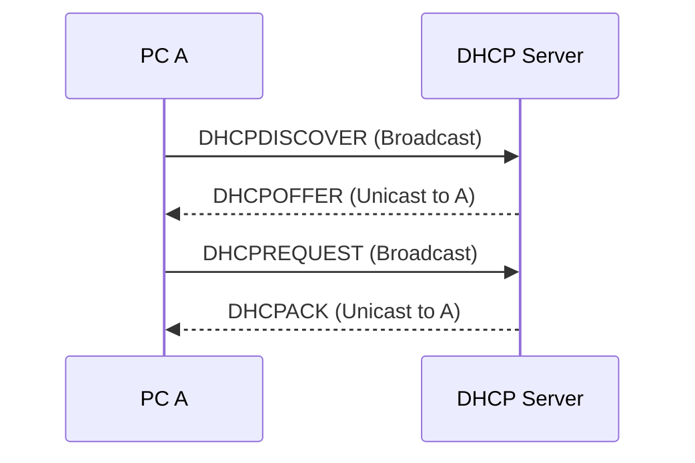

# DHCPについて

## 1. **DHCPとは**

- DHCP（Dynamic Host Configuration Protocol）は、ネットワーク上のデバイスに対して自動的にIPアドレスを割り当てるプロトコルです。ネットワーク上に接続されたデバイスがインターネットやその他のネットワークリソースにアクセスするためには、IPアドレスが必要であり、DHCPによってこのプロセスが自動化されます。

## 2. **メリット**

- **自動化による効率化**
  - DHCPを使用すると、ネットワーク管理者は全ての端末に対してIPアドレスやその他のネットワーク設定を手動で行う必要がありません。これは、特に設定の変更が必要な場合や、新しいデバイスをネットワークに追加する場合、またはデバイスを異なるフロアや場所に移動して使用する場合などに便利です。
- **設定の煩雑さを解消**
  - DHCPを利用することで、「IPアドレスなどを手作業で設定する煩雑さをなくす」ことができます。これは、大規模な環境や頻繁に設定変更が必要な環境において、時間と労力の大きな節約につながります。
- **IPアドレスの一元管理**
  - DHCPサーバーを使用すると、IPアドレスを一元的に管理できます。これにより、IPアドレスの割り当て状況を把握しやすくなり、IPアドレスの衝突を避けることが可能になります。また、DHCPサーバーのログを通じて、ネットワーク上のデバイスの割り当て状況を追跡できます。
- **IPアドレスの有効利用**
  - DHCPによるIPアドレスの動的割り当ては、リース期間の概念を導入することで、IPアドレスの再利用を可能にします。これにより、「一定期間ごとのIPアドレスの再利用を行うので、DHCPサーバに登録するIPアドレス数の削減ができる」というメリットがあります。企業がプライベートアドレスを使用している場合でも、IPアドレスの枯渇を防ぐことに貢献します。

## 3. **デメリット**

- **DHCPサーバーの依存性**
  - DHCPサーバーがダウンすると、新しくネットワークに接続するクライアントにIPアドレスを割り当てることができなくなります。これは、ネットワークの利用開始時やIPアドレスのリース更新時に特に問題となり、結果としてネットワークの利用が一時的に不可能になる可能性があります。
- **運用コスト**
  - DHCPサーバーの導入および運用には、ハードウェア、ソフトウェア、管理の各面でコストがかかります。大規模なネットワークでは、高可用性を実現するために複数のDHCPサーバーを設置する必要があり、これはコストをさらに増加させます。
- **IPアドレスの動的割り当てによる課題**
  - DHCPによるIPアドレスの動的割り当ては、IPアドレスが固定されないため、特定の端末やユーザーの追跡を難しくします。これは、ネットワークセキュリティの監視や管理、特定のサービスの端末への固定的な提供など、IPアドレスに基づく管理を必要とする場合にデメリットとなり得ます。固定IPアドレスが必要なサーバーや特定のネットワーク機器に対しては、手動でのIPアドレス設定やDHCPサーバー上での静的割り当て（予約）が必要になります。

## 4. **IP取得までのシーケンス図**

## 5. **DHCPのパケット構成**

### ***パケット構成***

| レイヤー         | ヘッダタイプ     | サイズ (バイト) |
|--------------|--------------|------------|
| データリンク層      | イーサネットヘッダ | 14         |
| ネットワーク層      | IPヘッダ         | 20         |
| トランスポート層    | UDPヘッダ       | 8          |
| アプリケーション層  | DHCPメッセージ  | 240以上      |

---

### ***DHCPメッセージ構成***

| フィールド              | ビット数 | 説明                                               |
|----------------------|-------|--------------------------------------------------|
| OP                   | 8     | メッセージタイプ（1 = BOOTREQUEST, 2 = BOOTREPLY）    |
| HTYPE                | 8     | ハードウェアタイプ（例: 1 = Ethernet）              |
| HLEN                 | 8     | ハードウェアアドレスの長さ（Ethernetの場合は6）        |
| HOPS                 | 8     | ホップ数（DHCPリレーエージェントが使用）              |
| XID                  | 32    | トランザクションID                                   |
| SECS                 | 16    | トランザクション開始からの経過秒数                     |
| FLAGS                | 16    | フラグ（例: 0x8000 = ブロードキャストビット）         |
| CIADDR               | 32    | クライアントIPアドレス（クライアントが既に持っている場合） |
| YIADDR               | 32    | 'your' (クライアント) IPアドレス                    |
| SIADDR               | 32    | 次のサーバーIPアドレス（ブートストラップサーバー）      |
| GIADDR               | 32    | リレーエージェントIPアドレス                          |
| CHADDR               | 128   | クライアントハードウェアアドレス                      |
| SNAME                | 512   | サーバー名                                           |
| FILE                 | 1024  | ブートファイル名                                     |
| OPTIONS              | 可変  | オプション                                           |

このテーブルは、DHCPパケットの構成を示しています。各フィールドは特定の目的を持ち、ネットワーク上でのデバイス間の通信において重要な役割を果たします。オプションフィールドは可変長であり、DHCPサーバーがクライアントに提供する追加情報（例: サブネットマスク、デフォルトゲートウェイ、DNSサーバーのアドレスなど）を含みます。

## 6. UDPポート番号

- **クライアントからサーバーへの通信にはUDPポート67**が使用されます。
- **サーバーからクライアントへの通信にはUDPポート68**が使用されます。

これらのポート番号は、DHCPクライアントとサーバー間の通信において標準化されており、クライアントがネットワーク上で動的にIPアドレスやその他のネットワーク設定を取得する際に使用されます。

## 7. ざっくりパケット内容

以下の表は、DHCPを使用したIPアドレス取得プロセスの各ステップでのパケット構成を示しています。サンプル値を用いて説明し、固定値と環境依存値を区別しています。

### ステップ1: DHCPDISCOVER（クライアントからサーバーへのブロードキャスト）

| ヘッダタイプ       | フィールド             | サンプル値 / 説明                          | 備考                   |
|----------------|---------------------|--------------------------------------|----------------------|
| イーサネットヘッダ | 宛先MACアドレス         | FF:FF:FF:FF:FF:FF                    | 固定値 (ブロードキャスト) |
|                | 送信元MACアドレス       | 00:11:22:33:44:55                    | 環境依存(クライアントのMACアドレス)                |
|                | イーサタイプ          | 0x0800                              | 固定値 (IPv4)         |
| IPヘッダ          | 送信元IPアドレス        | 0.0.0.0                              | 固定値 (未割り当て)      |
|                | 宛先IPアドレス         | 255.255.255.255                      | 固定値 (ブロードキャスト) |
| UDPヘッダ        | 送信元ポート          | 68                                  | 固定値 (DHCPクライアント) |
|                | 宛先ポート           | 67                                  | 固定値 (DHCPサーバー)    |
| DHCPメッセージ    | メッセージタイプ       | DHCPDISCOVER                        | 固定値                 |

### ステップ2: DHCPOFFER（サーバーからクライアントへのブロードキャストまたはユニキャスト）

| ヘッダタイプ       | フィールド             | サンプル値 / 説明                          | 備考                   |
|----------------|---------------------|--------------------------------------|----------------------|
| イーサネットヘッダ | 宛先MACアドレス         | 00:11:22:33:44:55                    | 環境依存(クライアントのMACアドレス)                |
|                | 送信元MACアドレス       | AA:BB:CC:DD:EE:FF                    | 環境依存(DHCPサーバーのMACアドレス)                |
|                | イーサタイプ          | 0x0800                              | 固定値 (IPv4)         |
| IPヘッダ          | 送信元IPアドレス        | 192.168.1.1                          | 環境依存 (DHCPサーバーのIP) |
|                | 宛先IPアドレス         | 255.255.255.255 または クライアントのIP | 環境依存                |
| UDPヘッダ        | 送信元ポート          | 67                                  | 固定値 (DHCPサーバー)    |
|                | 宛先ポート           | 68                                  | 固定値 (DHCPクライアント) |
| DHCPメッセージ    | メッセージタイプ       | DHCPOFFER                           | 固定値                 |

DHCPOFFERの宛先IPアドレスについて
DHCPサーバーがDHCPOFFERを送信する際には、基本的に以下の２つの状況が考えられます：

1. クライアントがまだIPアドレスを持っていない場合:
   - この場合、DHCPサーバーはブロードキャストアドレス「255.255.255.255」を宛先IPアドレスとして使用します。なぜなら、クライアントはまだ有効なIPアドレスを持っておらず、直接ユニキャストでの通信ができないためです。DHCPDISCOVERメッセージを受け取ったサーバーは、ネットワーク上のすべてのデバイスに到達可能なブロードキャストアドレスを使用してDHCPOFFERを送り返します。
2. クライアントがIPアドレスを持っている、または予約されている場合:
   - 一部のDHCPサーバー実装では、クライアントに予約されたIPアドレスがある場合や、リレーエージェントを介して特定のクライアントに直接メッセージを送信できる状況で、宛先IPアドレスとしてクライアントのIPアドレス（または予約IP）を使用することができます。この場合、DHCPOFFERは特定のクライアントに向けてユニキャストされます。

しかし、実際のところ、ほとんどの初期DHCPプロセスでは、クライアントがまだ自身のIPアドレスを持っていないため、DHCPOFFERはブロードキャストで送信されることが一般的です。ユニキャストでの送信は、ネットワークの設定やDHCPサーバーの特定の設定に依存します。

### ステップ3: DHCPREQUEST（クライアントからサーバーへのブロードキャスト、オファーを受け入れる）

- 同じくイーサネットヘッダ、IPヘッダ、UDPヘッダを使用しますが、DHCPメッセージのタイプがDHCPREQUESTになり、クライアントが受け入れたIPアドレスを示します。

### ステップ4: DHCPACK（サーバーからクライアントへのブロードキャストまたはユニキャスト、IPアドレスの割り当て確認）

- DHCPサーバーは、DHCPACKパケットを使用して、クライアントにIPアドレスの割り当てを確認します。このパケットには、クライアントの設定に必要な追加情報（サブネットマスク、デフォルトゲートウェイ、DNSサーバーアドレスなど）も含まれます。
