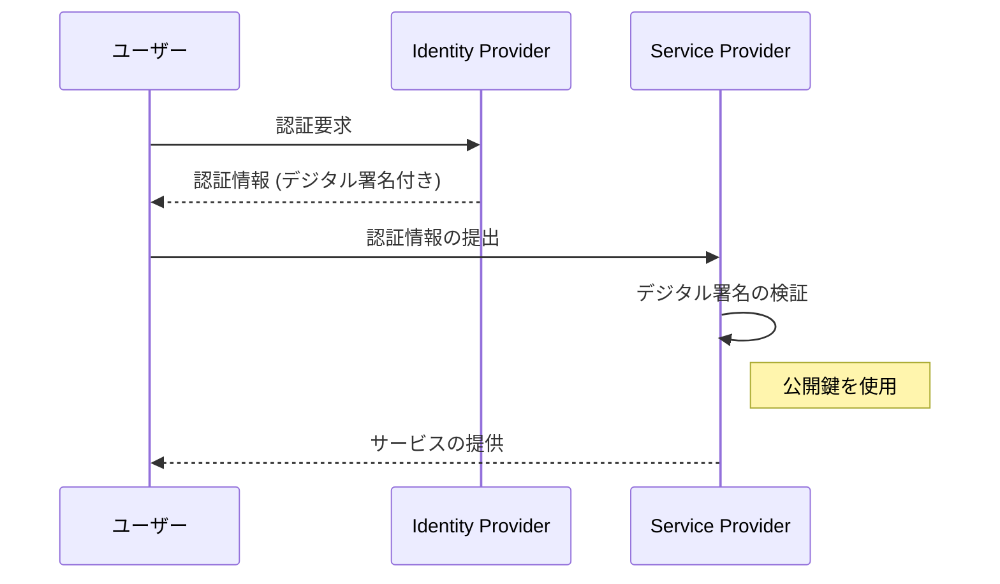

# デジタル署名とは

デジタル署名は、オンラインでの身元確認やメッセージの改ざんがないことを証明する方法です。

## 参加者

- **IdP（Identity Provider）**: ユーザーの身元を確認し、情報にデジタル署名をする役割。
- **SP（Service Provider）**: 署名を検証し、メッセージが改ざんされていないか確認する役割。

## デジタル署名のプロセス

1. **秘密鍵と公開鍵の生成**:
   IdPは秘密鍵と公開鍵の一対を持ちます。秘密鍵は秘密に、公開鍵は公開されます。

2. **メッセージの署名**:
   IdPはメッセージに対して秘密鍵を使用し、デジタル署名を生成します。これは、メッセージの内容から計算されたハッシュを秘密鍵で暗号化したものです。

3. **署名の検証**:
   SPは公開鍵を使用してデジタル署名を復号化し、ハッシュ値を取得します。メッセージ自体にも同じハッシュ関数を適用し、この二つのハッシュ値が一致すれば、署名が有効であると認識されます。

## Mermaid図

このプロセスにより、IdPのみが知っている秘密鍵で署名されたメッセージは、そのIdPから来たものであると確認されます。また、公開鍵を使って誰でも署名を検証できるため、信頼性の高いセキュリティが実現されます。
