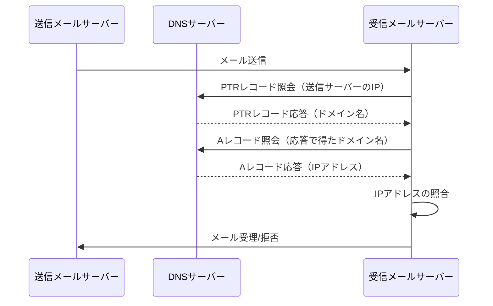
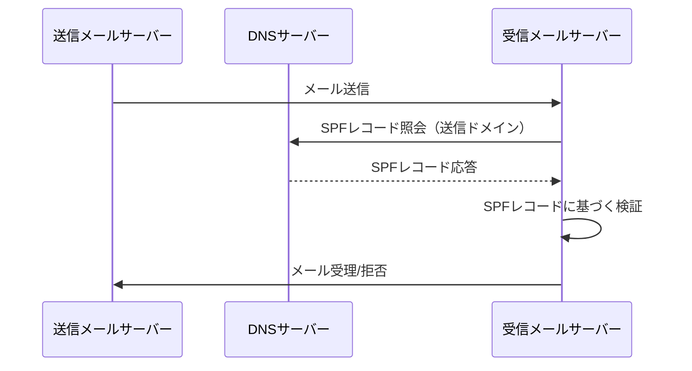

DNS レコードのリソースファイル（ゾーンファイル）は、ドメイン名とそのドメインに関連する様々なリソースレコード（RR）を定義するために使用されます。

---

### DNS ゾーンファイルサンプル

short version

```bind
$TTL 86400 ; 24 hours could be shorter
@       IN      SOA     ns1.example.com. admin.example.com. (
                              2023020501 ; serial
                              7200       ; refresh (2 hours)
                              900        ; retry (15 minutes)
                              1209600    ; expire (2 weeks)
                              86400      ; minimum (1 day)
                              )

; Define the nameservers
@       IN      NS      ns1.example.com.
@       IN      NS      ns2.example.com.

; Define the mail servers for example.com
@       IN      MX 10   mail.example.com.
@       IN      MX 20   mail2.example.com.

; Define IP address for the nameservers
ns1     IN      A       192.0.2.1
ns2     IN      A       192.0.2.2

; Define IP address for mail servers
mail    IN      A       192.0.2.3
mail2   IN      A       192.0.2.4

; Define A record for example.com
@       IN      A       192.0.2.5

; Define a CNAME record
www     IN      CNAME   @

; Define additional TXT record for SPF to prevent email spoofing
@       IN      TXT     "v=spf1 ip4:192.0.2.5 ~all"

```

long version

```bind
$TTL 86400 ; 24 hours could be shorter
example.com. IN SOA ns1.example.com. admin.example.com. (
                              2023020501 ; serial
                              7200       ; refresh (2 hours)
                              900        ; retry (15 minutes)
                              1209600    ; expire (2 weeks)
                              86400      ; minimum (1 day)
                              )

; Define the nameservers
example.com. IN NS ns1.example.com.
example.com. IN NS ns2.example.com.

; Define the mail servers for example.com
example.com. IN MX 10 mail.example.com.
example.com. IN MX 20 mail2.example.com.

; Define IP address for the nameservers
ns1.example.com. IN A 192.0.2.1
ns2.example.com. IN A 192.0.2.2

; Define IP address for mail servers
mail.example.com. IN A 192.0.2.3
mail2.example.com. IN A 192.0.2.4

; Define A record for example.com
example.com. IN A 192.0.2.5

; Define a CNAME record
www.example.com. IN CNAME example.com.

; Define additional TXT record for SPF to prevent email spoofing
example.com. IN TXT "v=spf1 ip4:192.0.2.5 ~all"

```

### 解説

- `$TTL`: このゾーンでのデフォルトの生存時間。ここでは 24 時間に設定。
- `SOAレコード`: ゾーンの権威情報。更新管理に使用される。
- `NSレコード`: このゾーンの DNS サーバー。ここでは`ns1.example.com`と`ns2.example.com`が使用されている。
- `MXレコード`: メールの配送先サーバーとその優先順位。`mail.example.com`が優先。
- `Aレコード`: ドメイン名を IPv4 アドレスに変換。DNS サーバーやメールサーバーの IP アドレスを指定。
- `CNAMEレコード`: エイリアス（ここでは`www`）を実際のドメイン（`@`は現在のゾーンを指す）にマッピング。
- `TXTレコード`: ドメインに関連するテキスト情報。例えば、SPF レコードがこれに含まれる。

---

## DNS レコード設定一覧

### SOA レコード（Start Of Authority）

「権威の開始」という意味

MNAME（ns1.example.com.）
・ゾーンファイルの基となるデータを持つ DNS サーバの名前
・プライマリの DNS サーバを指すこともある

RNAME（admin.example.com.）
・このドメインの管理者のメールアドレス（責任者の E メール）
・ DNS のサーバがこのアドレスを使うことはないが、人がゾーンの管理者と連絡を取りたい際に使う
・メールアドレスをそのまま書くのではなく、「@」記号を「.」に置き換えて記載
・例えば、「<admin@example.jp>」が管理者のメールアドレスであれば、「admin.example.jp」と記載する

### A レコード（IPv4 アドレス）

example.com. IN A 192.0.2.1

### AAAA レコード（IPv6 アドレス）

example.com. IN AAAA 2001:db8::1

### CNAME レコード（Canonical Name）

<www.example.com>. IN CNAME example.com.

### MX レコード（Mail Exchange）

example.com. IN MX 10 mail.example.com.

### TXT レコード（テキスト情報）

example.com. IN TXT "v=spf1 include:\_spf.example.com ~all"

### NS レコード（DNS サーバー）

example.com. IN NS ns1.example.com.
example.com. IN NS ns2.example.com.

### PTR レコード（ポインタレコード、逆引き用）

1.2.0.192.in-addr.arpa. IN PTR example.com.

**_PTR レコードの構造_**
PTR レコードは、逆引き専用のゾーンファイルに設定されます。
このゾーンは、in-addr.arpa.（IPv4 の場合）や ip6.arpa.（IPv6 の場合）ドメイン下に構成されます。
レコードの形式は次のようになります：

`IPアドレスの逆順.in-addr.arpa. IN PTR ドメイン名.`

sample)IPv4 アドレス 192.0.2.1 の PTR レコードの場合、その逆引きエントリーは次のように記述されます：
`1.2.0.192.in-addr.arpa. IN PTR example.com.`

PTR レコードの使用目的

- 電子メールの送信元認証: 電子メールサーバーが他のメールサーバーにメールを送信する際、受信側のサーバーは、送信元 IP アドレスの PTR レコードをチェックして、そのドメイン名が正当なメールサーバーからのものであるかを確認します。これにより、スパムや不正なメールの送信を抑制します。
- ログや監視: サーバーのアクセスログに記録される IP アドレスから、どのドメインがアクセスしてきたかを特定するのに役立ちます。
- セキュリティ: セキュリティ監視ツールは、ネットワーク上の異常なトラフィックを特定する際に、PTR レコードを使用して IP アドレスの背後にあるドメイン情報を取得します。

### SRV レコード（サービスレコード）

\_sip.\_tcp.example.com. IN SRV 0 5 5060 sipserver.example.com.

注意: 実際にこれらの設定を適用する際は、`example.com`や`192.0.2.1`などの値を実際のドメイン名や IP アドレスに置き換えてください。

---

## SPF と PTR レコードについて

### PTR レコードと電子メールの送信元認証

PTR レコードは、IP アドレスからその所有者のドメイン名を逆引きするために使用されます。
電子メールの送信元認証において PTR レコードが役立つケースはありますが、
これは主にサーバーの識別や信頼性の検証に用いられます。
たとえば、メールサーバーが受信したメールの IP アドレスに対応する PTR レコードを確認し、
そのドメイン名が合理的な送信元であるかを評価することがあります。しかし、この方法は SPF、DKIM（DomainKeys Identified Mail）、DMARC（Domain-based Message Authentication, Reporting, and Conformance）といった他の技術と組み合わせて使用されることが多いです。



1. メール送信: 送信メールサーバー(S)が受信メールサーバー(R)にメールを送信します。
2. PTR レコード照会: 受信メールサーバーは、送信メールサーバーの IP アドレスに基づいて PTR レコードを照会するために DNS サーバー(DNS)に問い合わせます。
3. PTR レコード応答: DNS サーバーは、該当する IP アドレスのドメイン名を含む PTR レコードの情報を受信メールサーバーに返します。
4. A レコード照会: 受信メールサーバーは、PTR レコードから得たドメイン名の正当性を確認するために、そのドメイン名の A レコードを DNS サーバーに問い合わせます。
5. A レコード応答: DNS サーバーは、ドメイン名に対応する IP アドレスを含む A レコードの情報を受信メールサーバーに返します。
6. IP アドレスの照合: 受信メールサーバーは、最初に受け取った送信メールサーバーの IP アドレスと A レコード応答で得た IP アドレスを照合します。これにより、送信サーバーのドメイン名がその IP アドレスに正しく関連付けられているかを検証します。
7. メール受理/拒否: IP アドレスが一致すれば、メールは正当な送信源からのものとして受理されます。不一致の場合は、メールは拒否されるか、さらなる検証が行われます。

### TXT レコード（SPF レコード）と電子メールの送信元認証

TXT レコード内に設定される SPF（Sender Policy Framework）レコードは、電子メールの送信元認証に直接使用されます。SPF レコードは、特定のドメインから送信が許可されているメールサーバーの IP アドレスまたはドメイン名を公開します。受信メールサーバーは、送信されたメールの Return-Path（または MAIL FROM）ドメインに対する SPF レコードを照会し、そのメールが許可されたサーバーから送信されたかを確認します。このプロセスにより、偽装されたメールの識別と拒否が可能になります。

`example.com. IN TXT "v=spf1 include:_spf.example.com ~all"`

この SPF レコードは、example.com ドメインからのメール送信が\_spf.example.com によって定義されたサーバーからのみ許可され、それ以外の送信元からのメールはソフトフェイル（~all）として扱われることを意味します。ソフトフェイルは、メールがスパムである可能性が高いとみなされるべきであるが、完全には拒否されないという意味です。



1. メール送信: 送信メールサーバー(S)が受信メールサーバー(R)に対してメールを送信します。
2. SPF レコード照会: 受信メールサーバーは、送信されたメールのドメインに対応する SPF レコードを取得するために DNS サーバー(DNS)に問い合わせます。
3. SPF レコード応答: DNS サーバーは、要求された SPF レコードの情報を受信メールサーバーに返します。
4. SPF レコードに基づく検証: 受信メールサーバーは、DNS サーバーから受け取った SPF レコードに基づいて、送信メールサーバーがメールの送信を許可されているかどうかを検証します。
5. メール受理/拒否: 検証の結果、メールが許可された送信サーバーから送信されたと判断されればメールを受理し、そうでなければ拒否します。

### 結論

PTR レコードは、IP アドレスの所有者のドメインを逆引きするために使用され、電子メールの送信元の識別に間接的に役立ちますが、メインの送信元認証メカニズムではありません。
SPF レコード（TXT レコード内で定義）は、ドメインからの電子メール送信を認証するための直接的な方法を提供し、偽装されたメールの識別に効果的です。

## 参考

- [SOA レコードには何が記述されている？](https://atmarkit.itmedia.co.jp/fnetwork/dnstips/014.html)
- [PTR レコード【DNS レコード】](https://wa3.i-3-i.info/word12291.html)
