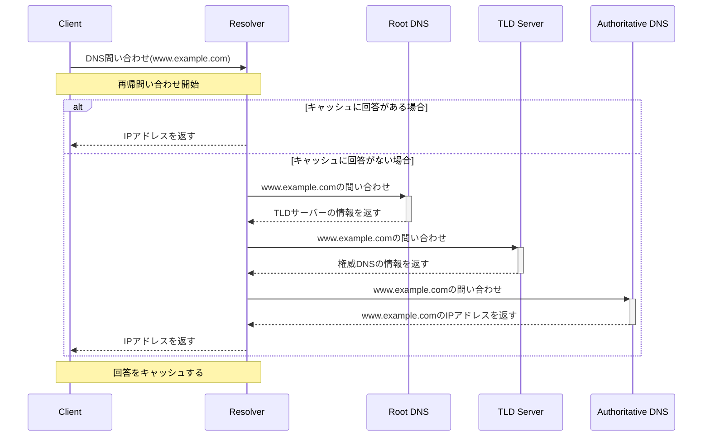

# 再帰問い合わせと非再帰問い合わせ

## 再帰問い合わせ (Recursive Query)

再帰問い合わせは、DNS (Domain Name System) の問い合わせの一種で、クライアントがDNSリゾルバにドメイン名のIPアドレスを問い合わせる際、リゾルバがその回答を持っていない場合、他のDNSサーバーに対してその回答を得るために問い合わせを繰り返すプロセスです。リゾルバは最終的に回答を見つけるまで、複数のDNSサーバーに問い合わせを行います。回答を得たら、それをクライアントに返し、通常、その回答をキャッシュに保存して後続の問い合わせを効率化します。

### 特徴
- クライアントは一度の問い合わせで済むため、プロセスが単純になる。
- リゾルバが問い合わせの全責任を負う。
- キャッシュ機能により、回答の速度が向上することがある。

## 非再帰問い合わせ (Non-Recursive Query)

非再帰問い合わせでは、DNSリゾルバはクライアントからの問い合わせに対して、直接回答を返します。リゾルバが回答をキャッシュに持っている場合、そのキャッシュから回答を提供します。キャッシュに回答がない場合、リゾルバはクライアントに対して、回答を得るための他のDNSサーバーの情報を提供しますが、そのサーバーへの問い合わせはクライアント自身が行う必要があります。

### 特徴
- クライアントが直接または間接的に複数のDNSサーバーに問い合わせを行う必要がある。
- リゾルバは回答をキャッシュするが、問い合わせプロセスの全てを管理するわけではない。
- 一部の環境では、セキュリティや負荷分散のために好まれる方法。

### シーケンス図

## まとめ

再帰問い合わせと非再帰問い合わせは、DNSがドメイン名をIPアドレスに解決する方法における二つの異なるアプローチです。再帰問い合わせはクライアントにとってシンプルで効率的な場合が多く、非再帰問い合わせはより制御が必要ですが、特定のシナリオでの柔軟性やセキュリティを提供します。

## DNSコンポーネントの説明

### クライアント (Client)

インターネット上でサービスやウェブサイトにアクセスするユーザーのコンピューターやデバイスを指します。DNS問い合わせを開始することで、特定のドメイン名（例: `www.example.com`）のIPアドレスを求めます。

### リゾルバ (Resolver)

クライアントからのDNS問い合わせを受け取り、必要なIPアドレスを見つけるまで他のDNSサーバーに問い合わせを行う役割を担うDNSサーバーです。リゾルバは、通常、インターネットサービスプロバイダー(ISP)によって提供されます。

### ルートDNS (Root DNS)

インターネットのDNS階層の最上位に位置するDNSサーバーで、全てのドメイン名の最上位レベル（TLD: Top-Level Domain）への問い合わせを管理しています。ルートDNSは、TLDサーバーへの問い合わせを指示することで、ドメイン名の解決プロセスを支援します。

### TLDサーバー (TLD Server)

トップレベルドメイン（例: `.com`, `.net`, `.org`など）ごとに存在し、そのTLDに属するドメイン名の情報を管理するDNSサーバーです。TLDサーバーは、リクエストされたドメイン名に関する権威DNSサーバーのアドレスをリゾルバに提供します。

### 権威DNS (Authoritative DNS)

特定のドメイン名（例: `example.com`）に対する詳細なレコード情報（IPアドレスを含む）を保持するDNSサーバーです。権威DNSは、そのドメイン名に関する最終的な回答を提供する役割を持ちます。
