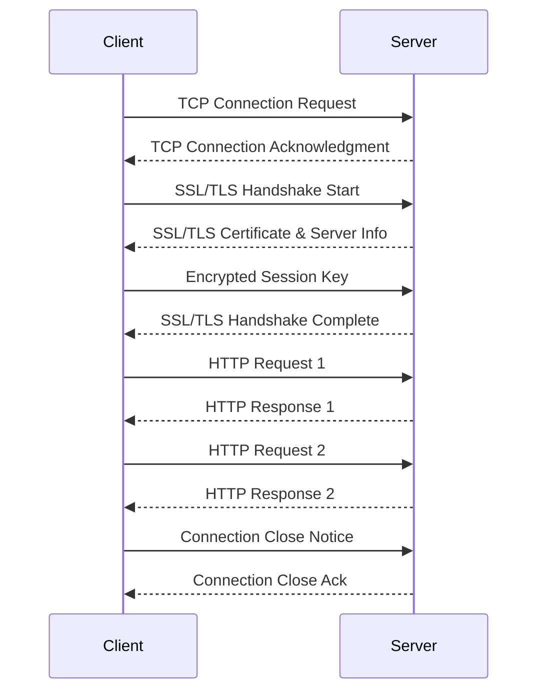
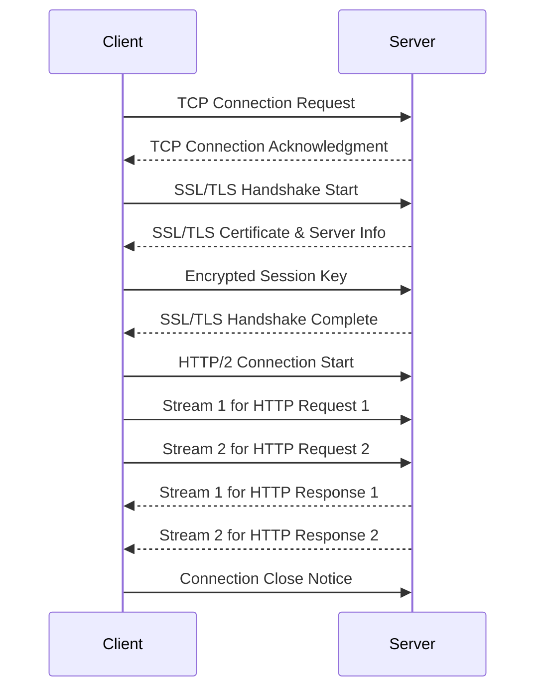
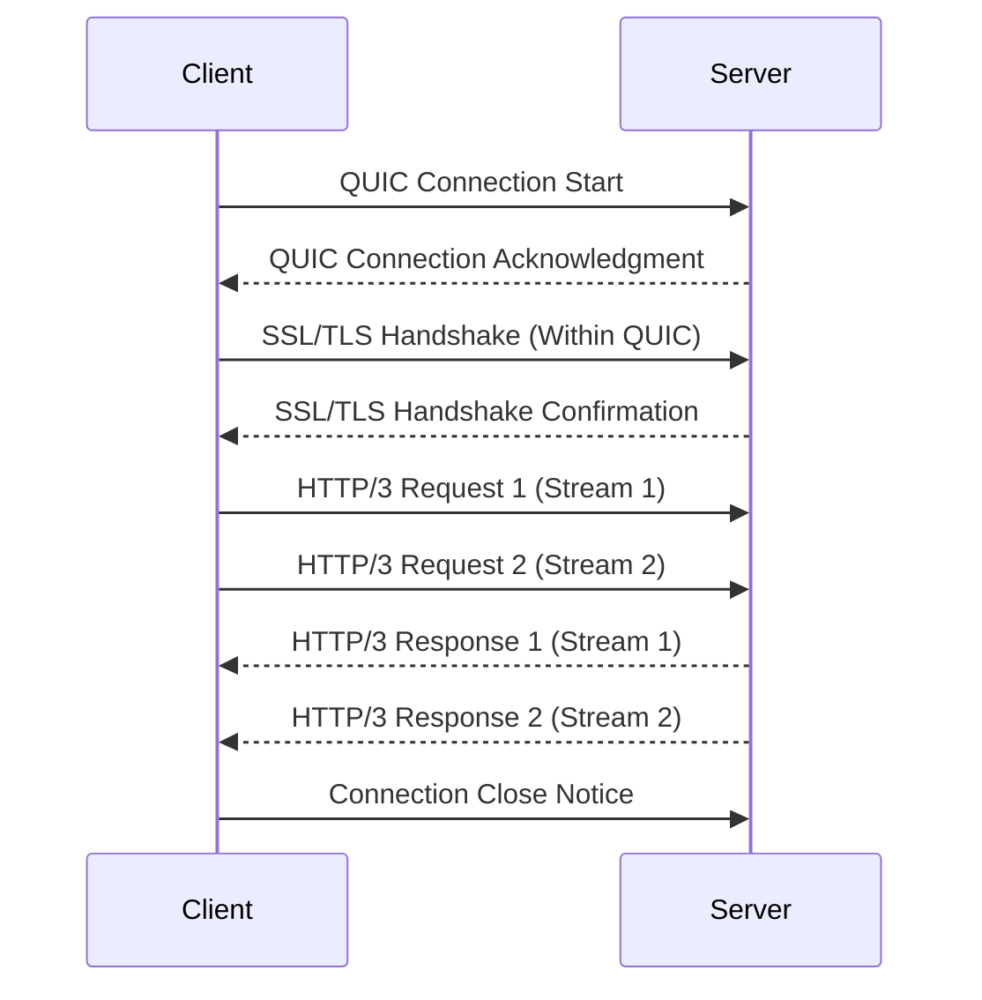
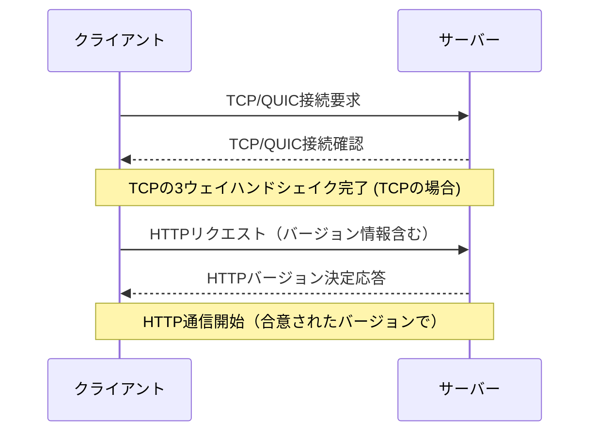

## HTTP/1.x

HTTP/1.0とHTTP/1.1は、インターネットの基本的なプロトコルとして広く使用されています。HTTP/1.1は特に、持続的接続やパイプライニングなど、いくつかの改善を導入しましたが、いくつかの問題点（特に「ヘッド・オブ・ライン・ブロッキング」）が残りました。

#### 特徴

- **テキストベース**: 人間が読める形式でメッセージを送信。
- **ステートレス**: 各リクエストは独立しており、前のリクエストの状態を保持しない。
- **ヘッド・オブ・ライン・ブロッキング**: 一つのリクエストの処理が終わるまで、次のリクエストの処理ができない。

## HTTP/2

HTTP/2は、パフォーマンスの向上を目的として設計されたHTTPプロトコルのメジャーアップデートです。バイナリフレーミング層を導入し、複数のリクエストとレスポンスを同時に同じ接続で扱うことが可能になりました。

#### 特徴

- **バイナリプロトコル**: 効率的な解析と低いオーバーヘッドを実現。
- **多重化**: 単一のTCP接続上で複数のリクエスト/レスポンスを並行して交換。
- **サーバープッシュ**: サーバーがクライアントの要求を待たずにリソースを送信可能。
- **ヘッダー圧縮**: HPACK圧縮を使用してヘッダー情報のサイズを削減。

## HTTP/3

HTTP/3は、HTTPの次の大きな進化であり、QUICトランスポートプロトコルを基盤としています。これにより、接続の確立時間の短縮、パケットの再送制御の改善、マルチパスとモビリティのサポートが可能になります。

#### 特徴

- **QUICに基づく**: UDPを使用し、接続の確立を高速化。
- **暗号化統合**: TLS 1.3を用いた組み込みのセキュリティ。
- **接続移行**: IPアドレスが変わっても接続を維持。
- **0-RTT再接続**: セッションの再開時にデータ送信を即時に開始可能。

これらのプロトコルは、ウェブのパフォーマンスとセキュリティを向上させるために進化しています。

###### HTTP/1.x

###### HTTP/2

###### HTTP/3

###### 違いの要約

- **HTTP/1.x** は各リクエスト/レスポンスが独立しており、パイプライニングにも関わらずヘッド・オブ・ライン・ブロッキングの問題が残ります。
- **HTTP/2** では、単一のTCP接続上で複数のリクエストとレスポンスを同時に扱うことが可能な多重化が導入されました。これにより、効率が大幅に向上します。
- **HTTP/3** はQUICプロトコルを使用し、UDPベースでより高速な接続確立、改善された再送制御、マルチパスサポートなどの機能を提供します。

1. **TCP/QUIC接続の確立**: クライアントはサーバーに対してTCP接続（HTTP/1.xおよびHTTP/2）またはQUIC接続（HTTP/3）を開始します。この時点では、まだHTTPのバージョンは関与していません。
2. **TCPの3ウェイハンドシェイク完了**: TCPを使用する場合、クライアントとサーバー間で3ウェイハンドシェイクが行われ、接続が確立されます。QUICを使用する場合は、QUIC独自の接続確立プロセスがあります。
3. **HTTPリクエスト送信**: TCP/QUIC接続が確立された後、クライアントはHTTPリクエストを送信します。このリクエストには、クライアントがサポートするHTTPバージョン情報が含まれています（例: `Upgrade: h2` ヘッダーを通じてHTTP/2を提案）。
4. **HTTPバージョンの決定と応答**: サーバーはクライアントのリクエストを受け取り、サポートするHTTPバージョンを決定します。サーバーは選択したバージョンで応答を返します。HTTP/2へのアップグレード要求がある場合、サーバーは適切な応答ヘッダー（例: `HTTP/2 101 Switching Protocols`）を使用してこれを承認します。
5. **HTTP通信の開始**: バージョンが決定された後、双方は合意されたバージョンでHTTP通信を開始します。

