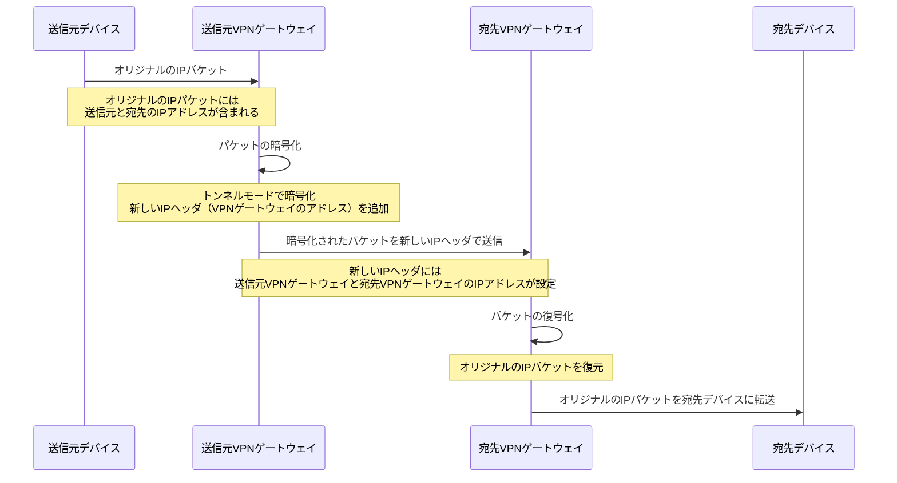
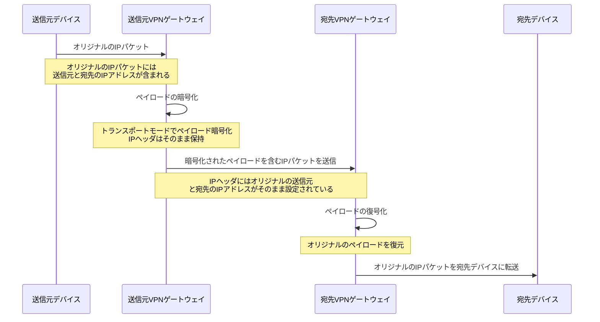
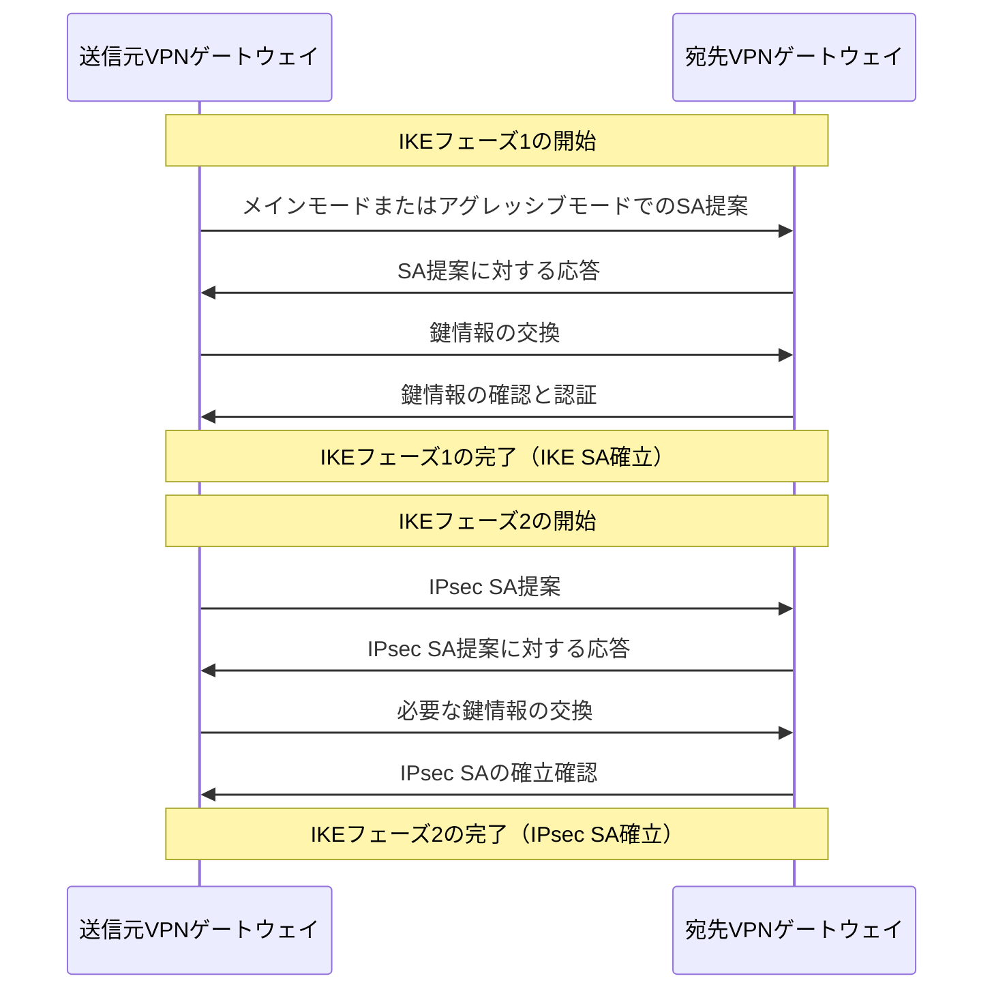

## IPsecトラフィックの保護

- IKEプロセスにより確立されたSAのパラメータに基づいて、IPsecによるデータパケットの暗号化および/または認証が行われます。
- IPsecは、トンネルモードまたはトランスポートモードでデータを保護することができます。
- **トンネルモード**：IPパケット全体を暗号化し、新しいIPヘッダを付加。
- **トランスポートモード**：IPパケットのペイロードのみを暗号化し、IPヘッダはそのまま保持。

## IPsecのトンネルモード

### IPsecトンネルモードのパケット構成

| セクション             | サイズ (バイト) | 説明                                                      |
|--------------------|------------|---------------------------------------------------------|
| Ethernet Header    | 14         | 宛先MACアドレス(6)、送信元MACアドレス(6)、EtherType(2)            |
| 新しいIP Header    | 20         | トンネルの送信元と宛先のIPアドレス、その他IPヘッダ情報                 |
| ESP Header         | 可変          | セキュリティパラメータインデックス(SPI)、シーケンス番号等              |
| 暗号化されたオリジナルのIPヘッダとペイロード | 可変          | 暗号化されたオリジナルのIPヘッダ、TCPヘッダ、データ(Payload)           |
| ESP Trailer        | 可変          | パディング（必要に応じて）、次のヘッダのタイプ                           |
| 認証データ (オプション) | 可変       | パケットの認証と完全性を保証するためのデータ (Integrity Check Value)    |

- 新しいIPヘッダ：トンネルの送信元と宛先VPNゲートウェイのIPアドレス。
- ESPヘッダ：セキュリティパラメータ（SPI）など、ESP処理に必要な情報。
- 暗号化されたオリジナルのIPヘッダとペイロード：ペイロードには、オリジナルのメッセージデータ、TCP/UDPヘッダ、アプリケーションデータなどが含まれます。
- ESPトレーラ：パディング（暗号化のためのデータアライメントを保証）と次のヘッダのタイプを指定します。
- 認証データ：パケットの完全性と認証を保証するためのデータ（オプション）。

## IPsecのトランスポートモード

### IPsecトランスポートモードのパケット構成

| セクション             | サイズ (バイト) | 説明                                                      |
|--------------------|------------|---------------------------------------------------------|
| Ethernet Header    | 14         | 宛先MACアドレス(6)、送信元MACアドレス(6)、EtherType(2)            |
| オリジナルのIP Header | 20         | 送信元と宛先のIPアドレス、その他IPヘッダ情報                          |
| ESP Header         | 可変          | セキュリティパラメータインデックス(SPI)、シーケンス番号等              |
| 暗号化されたデータ (Payload) | 可変    | 暗号化されたTCPヘッダとデータ(Payload)                              |
| ESP Trailer        | 可変          | パディング（必要に応じて）、次のヘッダのタイプ                           |
| 認証データ (オプション) | 可変       | パケットの認証と完全性を保証するためのデータ (Integrity Check Value)    |

- オリジナルのIPヘッダ：オリジナルの送信元と宛先のIPアドレス。
- ESPヘッダ：セキュリティパラメータ（SPI）など、ESP処理に必要な情報。
- 暗号化されたペイロード：オリジナルのメッセージデータ、TCP/UDPヘッダ、アプリケーションデータなどが含まれます。オリジナルのIPヘッダは暗号化されません。
- ESPトレーラ：パディングと次のヘッダのタイプを指定します。
- 認証データ：パケットの完全性と認証を保証するためのデータ（オプション）。

## VPN（IKE・フェーズ1・フェーズ2）

### IKEからIPsecへのフロー

1. IKEフェーズ1：VPN接続の両端点間で安全な通信チャネル（IKE SA）を確立します。このフェーズでは、相互認証が行われ、通信のための暗号鍵が生成されます。
2. IKEフェーズ2：フェーズ1で確立された安全なチャネルを使用して、実際のデータ転送に使用されるIPsec SAを確立します。このフェーズでは、保護されるトラフィックの詳細と使用するセキュリティプロトコル（ESPやAH）のパラメータが交渉されます。
3. IPsecトラフィックの保護：
   1. IKEプロセスにより確立されたIPsec SAのパラメータを基に、データパケットがIPsecプロトコルを使用して暗号化および/または認証され、送信されます。
   2. トラフィックは、トンネルモードまたはトランスポートモードで保護されることがあります。トンネルモードでは、IPパケット全体が暗号化され、新しいIPヘッダが付加されます。トランスポートモードでは、ペイロードのみが暗号化され、オリジナルのIPヘッダはそのまま保持されます。

IKEフェーズ1とフェーズ2を通じて、IPsec SAが確立され、セキュアなVPN接続やエンドツーエンドのセキュリティが実現されます。

### トラフィックフロー

- 送信：送信元デバイスは、IPsec SAのパラメータに基づき、データパケットを暗号化および/または認証し、宛先デバイスに向けて送信します。
- 受信：宛先のVPNゲートウェイ（またはデバイス）は、受信したデータパケットを復号化し、必要に応じて認証を行い、最終的な宛先デバイスに転送します。

### IKEフェーズ1とフェーズ2の違い

#### IKEフェーズ1（IKE SAの確立）

- **目的**：VPN接続の両端点間で安全な通信チャネル（IKE SA）を確立する。
- **相互認証**：プリシェアードキー（PSK）、デジタル証明書、公開鍵基盤（PKI）を用いた認証。
- **鍵交換**：Diffie-Hellman鍵交換アルゴリズムによる鍵情報の生成と交換。
- **セキュリティポリシーの確立**：使用する暗号化アルゴリズム、認証方法、鍵の有効期間などの基本的なセキュリティポリシーを交渉。
- **実行モード**：メインモード（より高いセキュリティ）またはアグレッシブモード（迅速な実行）。

#### IKEフェーズ2（IPsec SAの確立）

- **目的**：フェーズ1で確立された安全な通信チャネルを使用して、実際のデータ転送に使用されるIPsec SAを確立。
- **トラフィックセレクタの交渉**：保護されるトラフィックの種類や方向を定義。
- **セキュリティポリシーの詳細な交渉**：使用する暗号化アルゴリズム、認証アルゴリズム、キーの生成方法などの具体的なセキュリティポリシーを交渉。
- **鍵情報の更新**：セキュリティを維持するため、定期的に鍵情報を更新。
- **実行プロセス**：クイックモードを通じて迅速にセキュリティアソシエーションを確立。

#### まとめ

- **フェーズ1**は、安全な通信チャネルの確立に焦点を当て、相互認証と基本的な鍵交換を行います。
- **フェーズ2**は、そのチャネルを使用して具体的なセキュリティポリシーを交渉し、データ転送用のIPsec SAを確立することに焦点を置いています。
- フェーズ1は一度だけ実行され、フェーズ2は必要に応じて複数回実行されます。

### SA（Security Association）

- SAは、セキュアな通信を行うために必要なパラメータとポリシーを定義します。
- **含まれる情報**：
  - 使用する暗号化アルゴリズムと鍵
  - 使用する認証アルゴリズム
  - セキュリティプロトコル（ESPまたはAH）
  - SAの有効期間
  - SA識別子（SPI: Security Parameter Index）

SAは、IPsecによる通信のセキュリティ要件を定義し、保護されたデータ転送を可能にします。
