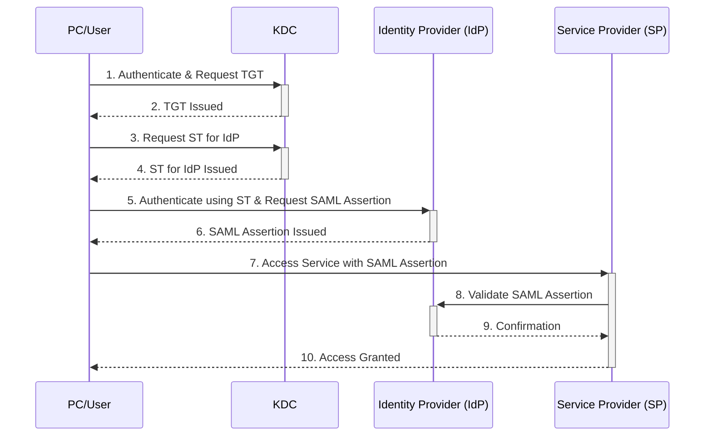

# ケロベロス認証の簡単な説明

ケロベロス認証は、インターネット上で安全に通信を行うための認証方式の一つで、特にネットワーク内でのユーザー認証に使われます。この認証方式は、古代ギリシャ神話に登場する三頭犬ケルベロスから名付けられました。

## ケロベロス認証の基本概念

1. **「チケット」を使った入場許可**  
   - ケロベロス認証は、イベントに入る時にチケットを見せるのに似ています。

2. **「三頭犬」が守る門**  
   - ケロベロス認証システムがネットワークの「門番」となり、不正なアクセスからシステムを守ります。

3. **チケットでサービスの利用許可を得る**  
   - チケット売り場でチケットを受け取ったら、それを使ってイベント内のさまざまな場所に入ることができます。

## KDC, TGT, STの説明

### KDC（Key Distribution Center）：キー配布センター

- KDCは、町の管理者のようなものです。

### TGT（Ticket Granting Ticket）：チケット発行チケット

- TGTは、「町の中心部への入場証」のようなものです。

### ST（Service Ticket）：サービスチケット

- STは、「特定の施設への入場券」です。

# SAML認証のプロセス解説

SAML認証でPC、KDC、IdP（Identity Provider）、SP（Service Provider）をアクターとし、ケロベロス認証のKDC、TGT、STを含むプロセスを図解します。

# ケロベロス認証の流れを簡単に説明

ケロベロス認証は、ネットワーク上で安全にサービスを利用するための認証プロセスです。以下に、そのステップを「バカでもわかる」ように簡単に説明します。

## ステップ1: ユーザーが「町の門」に到着

- **あなた（ユーザー）**は、特定のサービスやリソースにアクセスしたいと考えています。
- まず、「町の門」（KDC）に行き、入場許可（TGT）をもらうために自分が誰であるかを証明します。

## ステップ2: 「町の門番」から入場許可をもらう

- 「町の門番」（KDC）は、あなたが町の住民（有効なユーザー）であることを確認し、入場許可（TGT）を発行します。

## ステップ3: 特定の施設（サービス）への入場許可をリクエスト

- 次に、特定の施設（サービス）を利用したいとき、その施設用の別の入場許可（ST）が必要になります。
- そのため、あなたは先ほどもらった入場許可（TGT）を使って、再度「町の門番」（KDC）にアプローチし、目的の施設（サービス）用の入場許可（ST）をリクエストします。

## ステップ4: 施設（サービス）を利用

- 「町の門番」から特定の施設用の入場許可（ST）を受け取ったら、それを使って施設（サービス）に「入場」し、サービスを利用できます。

## まとめ

ケロベロス認証では、あなたが誰であるかを一度証明すれば、その後は様々なサービスやリソースに簡単にアクセスできるようになる、という流れです。まるで、町の中で様々な施設を自由に利用できるようになるようなものです。
