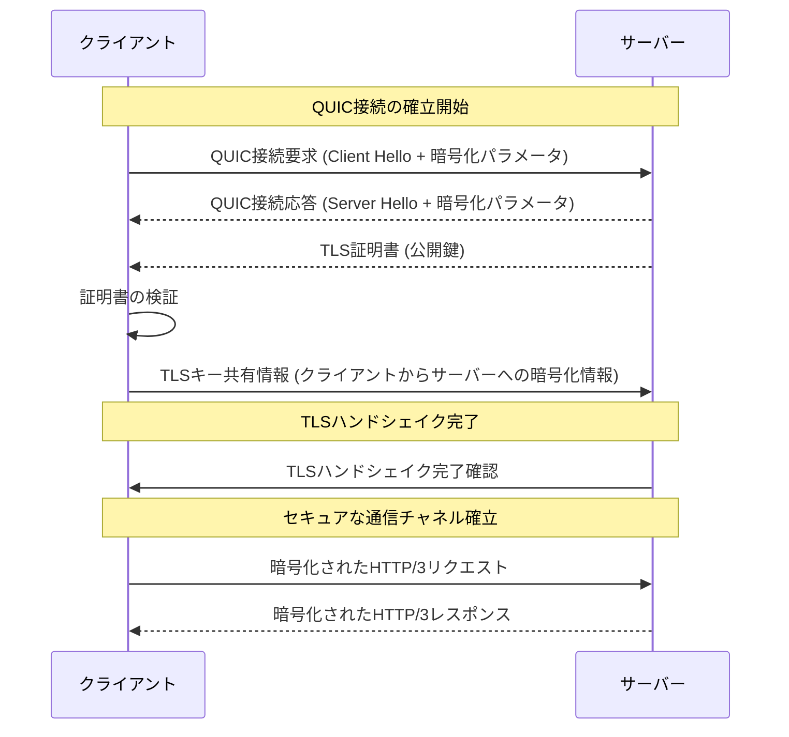

## TCP vs UDP vs QUIC

- **TCP (Transmission Control Protocol)**
  - 信頼性の高いデータ転送を保証
  - 3ウェイハンドシェイクによる接続確立
  - ヘッド・オブ・ライン・ブロッキングの問題あり
  - ヘッダーサイズが最小20バイト

- **UDP (User Datagram Protocol)**
  - 信頼性のないデータ転送
  - 非接続指向でオーバーヘッドが少ない
  - ヘッダーサイズが8バイト

- **QUIC (Quick UDP Internet Connections)**
  - UDPをベースにしつつ、TCPのような信頼性を提供
  - 組み込みの暗号化と0-RTT接続再開
  - ストリームの多重化によりヘッド・オブ・ライン・ブロッキングを解決
  - ヘッダーにはUDPヘッダーに加えてQUIC固有の情報が含まれる

## ヘッダ構成の比較

| 特徴          | TCP                             | UDP           | QUIC                                   |
|-------------|---------------------------------|---------------|----------------------------------------|
| ポート番号      | ソースポート、宛先ポート              | ソースポート、宛先ポート | ソースポート、宛先ポート (UDPヘッダー内) |
| シーケンス番号  | あり                             | なし           | あり (パケット番号として)                 |
| 確認応答番号   | あり                             | なし           | あり                                    |
| フラグ         | SYN, ACK, FINなど                 | なし           | フレームタイプによる制御                   |
| チェックサム    | あり                             | あり           | あり (UDPヘッダー内)                     |
| ヘッダーサイズ  | 最小20バイト                      | 8バイト        | UDPヘッダー(8バイト) + QUIC固有のオーバーヘッド |
| 暗号化        | アプリケーション層で実装 (例: TLS) | なし           | 組み込み (TLS 1.3)                      |
| ストリーム多重化 | なし                             | なし           | あり                                    |

QUICは、TCPとUDPの長所を組み合わせ、インターネット通信のパフォーマンスとセキュリティを向上させることを目指しています。特に、組み込みの暗号化、ストリームの多重化、そして低遅延の接続再開機能により、ウェブアプリケーションのパフォーマンスが大幅に改善される可能性があります。

### QUICとHTTPSの暗号化の関係

- **QUICの暗号化**: QUICは通信の開始時からTLS 1.3による暗号化を利用します。これにより、データの機密性と完全性が保護され、接続の確立も高速化されます。QUICにおいては、TLSのハンドシェイクがプロトコルの一部として統合されており、セキュリティの基盤を形成しています。
- **HTTPSの暗号化**: HTTPSはHTTP通信にTLS暗号化を追加することでセキュリティを確保しています。通常、このプロセスはTCP接続の上で行われますが、QUICを使用する場合、TCPと別のTLSセッションは不要です。なぜなら、QUIC自体がすでにTLS 1.3による暗号化とセッション管理を提供しているためです。
- **結果**: QUICを使用するHTTPS通信では、二重の暗号化層を重ねることはありません。代わりに、QUICの内蔵TLSが直接HTTPSのセキュリティ要件を満たします。これにより、セットアップ時間の短縮と効率的な暗号化処理が可能になり、結果としてウェブページのロード時間が改善されます。

### QUICにおける暗号化と平文通信

- **暗号化のタイミング**: QUICでは、ヘッダーを付与する際にデータ部分も含めて暗号化が行われます。これにより、データ転送の完全性と機密性が保証され、中間者攻撃などのセキュリティリスクを大幅に軽減します。
- **平文でのやり取りの廃止**: QUICを使用することで、HTTP/2やHTTP/1.xのようにアプリケーション層で平文のHTTPメッセージを送受信することはなくなります。QUICはデフォルトで全ての通信を暗号化するため、平文での通信は行われません。
- **TLS証明書（公開鍵）の交換**: QUICでは、接続の確立フェーズの一環としてTLSハンドシェイクが行われます。このハンドシェイクプロセス中に、サーバーはクライアントに対して自身の証明書（公開鍵含む）を送信し、クライアントはこの証明書を検証します。これにより、セキュアな通信チャネルの確立が保証されます。QUICのハンドシェイクは、接続開始時に0-RTTや1-RTTのいずれかの方法で迅速に行われ、通信の遅延を最小限に抑えることができます。

### QUIC接続確立とTLS証明書交換のシーケンス図

1. クライアントがQUIC接続要求を送信: クライアントはサーバーに対してQUIC接続要求を送り、Client Helloメッセージと共に初期の暗号化パラメータを含めます。
2. サーバーからの応答とTLS証明書の送信: サーバーはClient Helloに応答してServer Helloメッセージと自身のTLS証明書（公開鍵を含む）を送り返します。
3. クライアントによる証明書の検証: クライアントは受け取った証明書を検証し、信頼できる発行元からのものであることを確認します。
4. TLSキー共有情報の交換: クライアントはサーバーに対してTLSキー共有情報を送信し、サーバーもこれに応答してセキュアな通信チャネルの確立を完了します。
5. セキュアな通信の開始: TLSハンドシェイクが完了した後、クライアントとサーバーはこのセキュアなチャネルを通じて暗号化されたHTTP/3通信を開始します。
