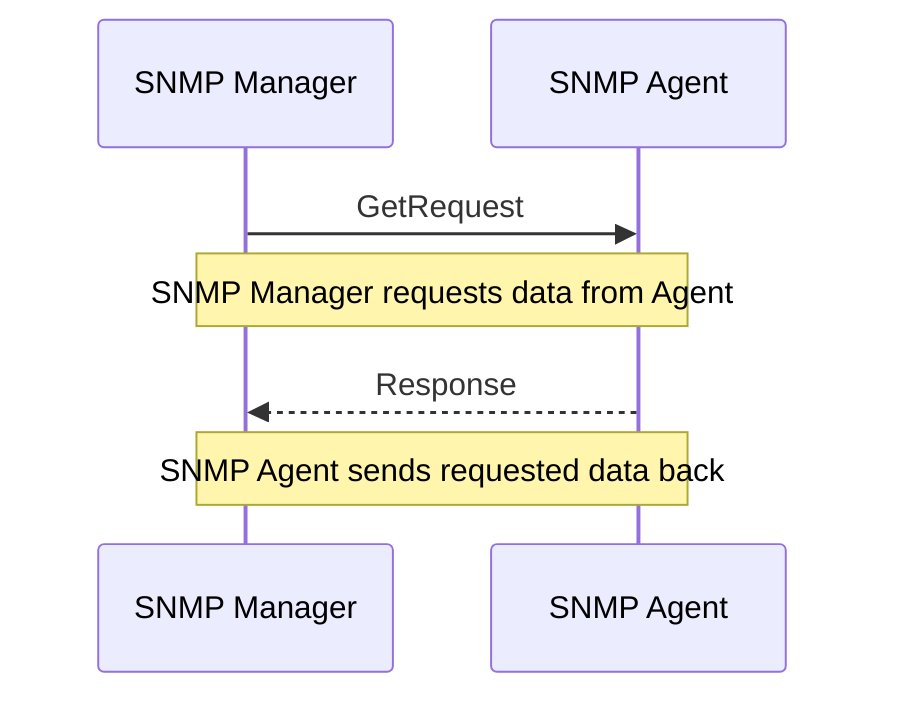
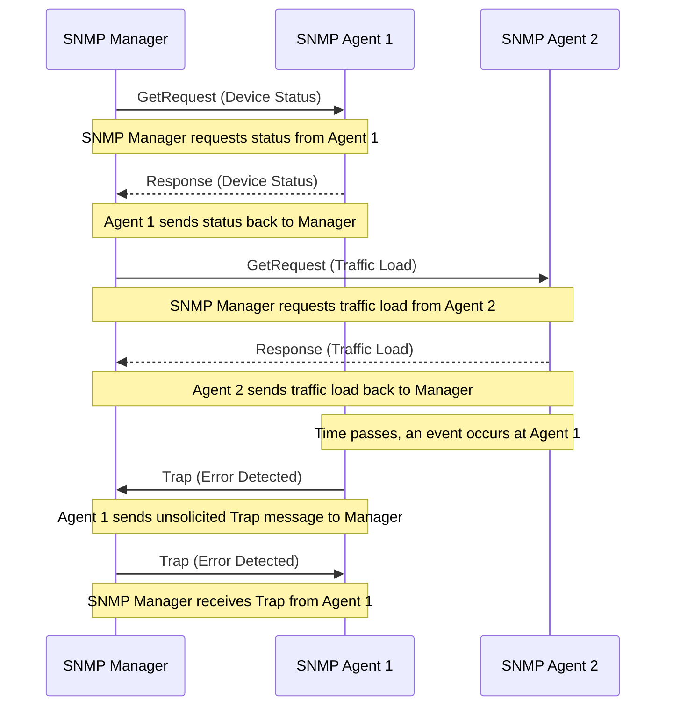

# SNMP（Simple Network Management Protocol）

## 概要

SNMPは、ネットワークデバイス（ルータ、スイッチ、サーバーなど）の監視と管理を行うためのプロトコルです。これにより、ネットワークのパフォーマンスを監視し、問題を診断し、ネットワークの設定変更を行うことができます。

## 使用するポート

- **ポート161**: SNMPマネージャがSNMPエージェントに対してリクエスト（GetRequest, SetRequest等）を送信するために使用します。
- **ポート162**: SNMPエージェントがSNMPマネージャにトラップ（非同期通知）を送信するために使用します。

## 機能

- **データ収集**: ネットワークデバイスからの情報収集。
- **構成管理**: デバイスの設定変更。
- **フォールト管理**: エラーや障害の検出と報告。
- **パフォーマンス管理**: ネットワークの効率と最適化の監視。
- **セキュリティ管理**: アクセス制御と活動の監視。

## バージョン

- **SNMPv1**: 最初のバージョンで、基本的な機能を提供しますが、セキュリティは限定的です。
- **SNMPv2**: パフォーマンスとセキュリティの改善、追加機能（例：バルク転送）を提供します。
- **SNMPv3**: 強化されたセキュリティ機能（認証と暗号化）を提供し、より柔軟な管理機能を備えています。

## コンポーネント

- **SNMPマネージャ**: ネットワーク管理システム（NMS）で、監視と管理の中心点です。
- **SNMPエージェント**: ネットワークデバイスに組み込まれ、情報を収集しマネージャに報告します。
- **MIB（Management Information Base）**: デバイスやネットワーク要素の情報を構造化するためのデータベース。

## 通信方式

SNMPは主にUDPを使用し、データの交換を行います。標準ポートは、マネージャからエージェントへのリクエスト用に161、エージェントからマネージャへの非同期通知（トラップ）用に162を使用します。

## コミュニティベースの認証方式

コミュニティベースの認証方式では、コミュニティストリングがキーとして機能し、SNMPエージェントとSNMPマネージャ間のメッセージが許可されるかどうかを決定します。

## MIB（Management Information Base）

MIBは、管理対象のネットワークデバイスやシステム上のオブジェクト（情報の集合）を階層的に構造化したデータベースです。各オブジェクトは一意の識別子（OID: Object Identifier）によって識別され、デバイスの状態、性能、設定などの情報を提供します。MIBは、SNMPマネージャがデバイスの特定の情報を照会したり、デバイスの設定を変更する際の基盤となります。

### 主なMIBセクション

- **system(1)**: デバイスの識別情報、稼働時間、連絡先などの基本情報。
- **interfaces(2)**: ネットワークインターフェース（物理的および論理的）の状態と構成。
- **ip(4)**, **icmp(5)**, **tcp(6)**, **udp(7)**: IP、ICMP、TCP、UDPプロトコルに関する統計と設定。
- **vendor-specific MIB modules**: デバイスメーカー固有の情報や機能を提供するセクション。

MIBを通じて、ネットワーク管理者はデバイスの状態を監視し、パフォーマンスを評価し、設定変更を行うことができます。

```bash
[iso(1)]
  └── [org(3)]
      └── [dod(6)]
          └── [internet(1)]
              ├── [directory(1)]
              ├── [mgmt(2)]
              │   └── [mib-2(1)]
              │       ├── [system(1)]
              │       ├── [interfaces(2)]
              │       ├── [at(3)]
              │       ├── [ip(4)]
              │       ├── [icmp(5)]
              │       ├── [tcp(6)]
              │       ├── [udp(7)]
              │       └── [...]
              └── [private(4)]
                  └── [enterprises(1)]
                      └── [vendor-specific MIB modules]
```

### シーケンス図

#### 簡易版



#### ちょっと詳しく版



```bash
[SNMPマネージャ]              [L2スイッチ]                [L3スイッチ]
     |                             |                          |
     |    GetRequest (ステータス情報)    |                          |
     |---------------------------->|                          |
     |                             |                          |
     |       Response (情報)       |                          |
     |<---------------------------|                          |
     |                             |                          |
     |                             |   GetRequest (ステータス情報)   |
     |------------------------------------------------------->|
     |                             |                          |
     |                             |      Response (情報)     |
     |<-------------------------------------------------------|
     |                             |                          |
     |   SetRequest (設定変更)     |                          |
     |------------------------------------------------------->|
     |                             |                          |
     |                             |      Response (確認)     |
     |<-------------------------------------------------------|
     |                             |                          |
     |                             |   Trap (エラー検出)     |
     |<----------------------------|                          |


```

# 参考

- [ネットワーク監視の超基本「SNMP」とは？](https://blogs.manageengine.jp/itom_what_is_snmp/)
