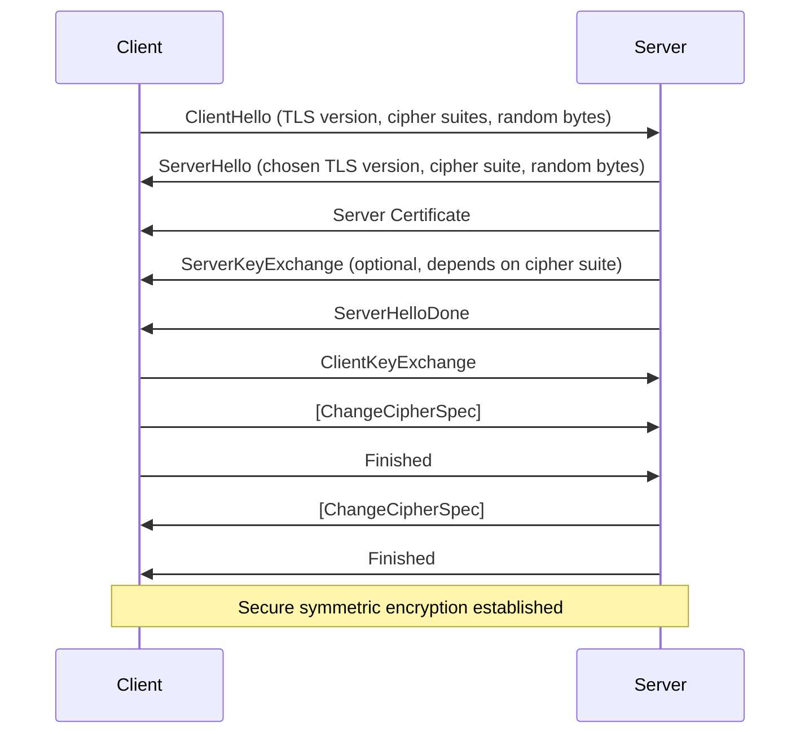

## TLS 1.1 (2006年発表)

### 特徴

- 改善されたエラーチェック機能。
- 暗号ブロックチェーンの初期化ベクトル(IV)の取り扱いが改善され、CBC攻撃への対応が強化された。
- しかし、セキュリティ上の問題が多く残っているため、現在は使用が推奨されていません。

## TLS 1.2 (2008年発表)

### 特徴

- SHA-256などの強化されたハッシュアルゴリズムをサポート。
- AEAD暗号のサポートを追加し、データの機密性と完全性を同時に保護。
- 暗号化スイートの選択肢が増え、よりセキュアな通信が可能に。
- 現在も広く使用されていますが、TLS 1.3への移行が進んでいます。

## TLS 1.3 (2018年発表)

### 特徴

- ハンドシェイクプロセスが簡略化され、接続確立が高速化。
- 不安全な暗号化アルゴリズムが削除され、セキュリティが強化された。
- 0-RTT再接続サポートにより、以前のセッションの情報を用いて即時に通信を開始できる。
- 古いプロトコルや機能が削除され、シンプルかつ効率的なセキュリティが実現された。

TLS 1.3は、セキュリティの強化とパフォーマンスの向上のために、TLS 1.1や1.2に比べて大きく改善されたバージョンです。

## TLS 1.1 の暗号化アルゴリズム

- **ブロック暗号**: AES (Advanced Encryption Standard), 3DES (Triple Data Encryption Algorithm)
- **ハッシュ関数**: MD5 (Message-Digest Algorithm 5), SHA-1 (Secure Hash Algorithm 1)
- **鍵交換アルゴリズム**: RSA, Diffie-Hellman (DH), Elliptic Curve Diffie-Hellman (ECDH)

## TLS 1.2 の暗号化アルゴリズム

- **ブロック暗号**: AES, AES-GCM (Galois/Counter Mode)
- **ハッシュ関数**: SHA-256, SHA-384
- **鍵交換アルゴリズム**: RSA, DH, ECDH, ECDHE (Elliptic Curve Diffie-Hellman Ephemeral)

## TLS 1.3 の暗号化アルゴリズム

- **ブロック暗号**: AES-GCM, ChaCha20 Poly1305
- **ハッシュ関数**: SHA-256, SHA-384
- **鍵交換アルゴリズム**: ECDHE, DHE (Diffie-Hellman Ephemeral)

TLS 1.3 では、不十分なセキュリティのアルゴリズム（例：RC4, MD5, SHA-1）や、以前のバージョンで使用された静的RSA鍵交換が削除され、セキュリティと効率が大幅に向上しています。

### 用語

- ブロック暗号
ブロック暗号は、データを一定の大きさの「ブロック」に分けて、それぞれを暗号化または復号する技術です。例えば、AES (Advanced Encryption Standard) は、データを128ビットのブロックに分け、秘密の鍵を使ってそれぞれを暗号化します。これにより、データを安全に保護できます。
- ハッシュ関数
ハッシュ関数は、任意の長さのデータを固定長のハッシュ値（一種の指紋のようなもの）に変換する関数です。このハッシュ値は、元のデータから一意に決まるので、データが改ざんされたかどうかのチェックに使われます。SHA-256などのハッシュ関数は、セキュリティ分野で広く使用されています。
- 鍵交換アルゴリズム
鍵交換アルゴリズムは、安全な通信チャンネルを介さずに、通信参加者間で秘密鍵（共有秘密）を共有する方法です。Diffie-HellmanやECDHEなどのアルゴリズムがあり、これにより、第三者が盗聴しても、通信の内容を解読できないようにします。

これらの技術は、インターネット上での安全なデータ交換を可能にするために不可欠であり、TLSプロトコルで広く使用されています。

1. ClientHello: クライアントは、利用可能なTLSバージョン、暗号スイート、ランダムバイト列などの情報をサーバーに送信します。
2. ServerHello: サーバーは、選択したTLSバージョン、暗号スイート、ランダムバイト列をクライアントに返します。
3. Server Certificate: サーバーは自身の証明書をクライアントに送り、その身元を証明します。
4. ServerKeyExchange: 一部の暗号スイートでは、サーバーはさらに鍵交換情報をクライアントに送信します。（オプション）
   - ***何をしている？:*** サーバーが特定の暗号方式を使っている場合、追加情報（鍵交換データ）をクライアントに送ります。これは、両者が秘密鍵を生成するのに必要な情報です。
   - ***なぜ必要？:*** この情報を使って、クライアントとサーバーは共通の「秘密」を作り出すことができ、これが通信の暗号化に使われます。
5. ServerHelloDone: サーバーがハンドシェイクメッセージの送信を完了しました。
6. ClientKeyExchange: クライアントは、鍵交換情報をサーバーに送ります。
7. ChangeCipherSpec: クライアントとサーバーは、これ以降のメッセージを新しい鍵で暗号化することを互いに通知します。
8. Finished: 両方がハンドシェイクが成功したことを確認します。
