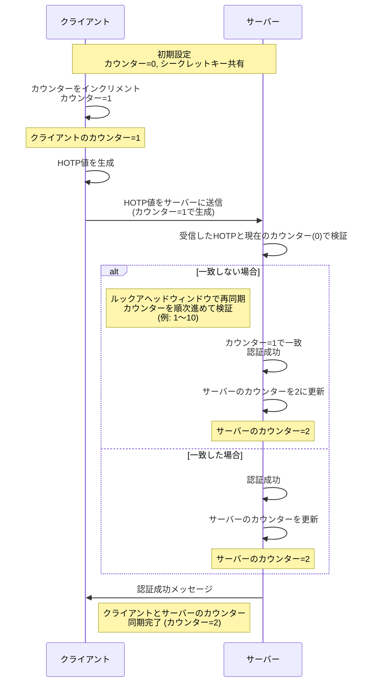

RFC 4226 - HOTP: An HMAC-Based One-Time Password Algorithmの主要なところを読んでみた。

## [4. Algorithm Requirements](https://tex2e.github.io/rfc-translater/html/rfc4226.html#4--Algorithm-Requirements)

1. シーケンスまたはカウンター方式の使用（R1）
   1. 大量デバイスへの組み込みを想定して、シーケンスやカウンターに基づく方式が必須です。
2. ハードウェアの負担軽減（R2）
   1. バッテリーや計算性能、ディスプレイのサイズなど、ハードウェアへの負荷を最小限に抑えることが望まれます。
3. 入力不要のデバイス対応（R3）
   1. 数字入力をサポートしないトークンでも利用可能であることが必須です。
4. ユーザーフレンドリーな表示（R4）
   1. 少なくとも`6桁`の数値を表示し、簡単に読み取れる形式とする必要があります。
5. カウンターの再同期機能（R5）
   1. カウンターの再同期をユーザーフレンドリーに行える仕組みが必須です。
6. 強力な共有シークレットの使用（R6）
   1. 共有シークレットの長さは`128ビット`以上が必須で、`160ビット`以上が推奨されます。

## [5.  HOTP Algorithm](https://tex2e.github.io/rfc-translater/html/rfc4226.html#5--HOTP-Algorithm)

### 5.1 Notation and Symbols

文字列は常にバイナリ文字列（0と1の並び）を指します。

- **|s|**: 文字列 `s` の長さ
- **|n|**: 数値 `n` の絶対値
- **s[i]**: 文字列 `s` の i 番目のビット（ビットの番号は0から始まる）
  - 例: `s = s[0]s[1]...s[n-1]` （ここで `n = |s|` は `s` の長さ）
- **StToNum**: 文字列を数値に変換する関数
  - 例: `StToNum(110) = 6` （"110" をバイナリ数として解釈したときの値）

#### Symbols Used in This Document

| Symbol | Represents                                                                                         |
|--------|----------------------------------------------------------------------------------------------------|
| **C(Counter)**  | 8バイトのカウンター値、HOTP生成器（クライアント）とHOTP検証器（サーバー）の間で同期される移動要素               |
| **K(Key)**  | クライアントとサーバー間の共有シークレット、各HOTP生成器には異なる一意のシークレットKが割り当てられる             |
| **T(Throttling parameter)**  | スロットリングパラメータ、T回の認証失敗後、サーバーがユーザーからの接続を拒否                                  |
| **s(resynchronization parameter)**  | 再同期パラメータ、サーバーは連続するs個のカウンター値を試行して認証を検証                                    |
| **Digit** | HOTP値の桁数、システムパラメータ                                                                    |

- s（resynchronization parameter）
  - sは「再同期パラメータ」で、サーバーがHOTPのカウンター値のズレを補正するために使われます。
  - サーバーは、クライアントから受信したワンタイムパスワード（OTP）がカウンターの同期から少しずれている可能性を考慮し、s回分まで連続したカウンター値を試して検証を行います。
  - たとえば、クライアント側でカウンターが2回進んでいた場合、サーバーが同期できるようにsを3に設定すると、最大3つ先までのカウンターを試みて正しいOTPを確認します。
  - これにより、クライアントとサーバーのカウンターが多少ずれても、再同期が可能になります。
- Digit（number of digits）
  - Digitは、HOTPで生成されるOTPの桁数を設定するためのシステムパラメータです。
  - 例えば、Digitが「6」に設定されている場合、生成されるOTPは「6桁」（例：123456）となります。
  - 一般的に6桁または8桁の値が使用され、これによりパスワードの長さが統一され、セキュリティレベルを確保できます。

### 5.2. Description

- RFC 2104 に定義されている HMAC-SHA-1 アルゴリズムを使用する。
- カウンター値 (C) と対称キー (K) を基に、次の式で計算される：

  ```plaintext
    HOTP(K,C) = Truncate(HMAC-SHA-1(K,C))
  ```

- トランケーション (Truncate) により、 HMAC-SHA-1 の出力（160 ビット）から、特定のビット位置から部分的な値を取り出し、6～8桁の数値として最終的な HOTP 値が生成される。
- キー (K)、カウンター (C)、データ値はビッグエンディアン（高位バイトから順に）でハッシュされる。

<details markdown="1">
<summary>BigEndian とは？</summary>

BigEndian（ビッグエンディアン） は、数値のバイト列の並び順の一種です。

- BigEndian：最上位バイト（大きな桁）から順に並べる方式です。たとえば、数値 0x12345678 を BigEndian で並べると [0x12, 0x34, 0x56, 0x78] になります。
- LittleEndian：最下位バイト（小さな桁）から順に並べる方式です。同じ数値 0x12345678 を LittleEndian で並べると [0x78, 0x56, 0x34, 0x12] となります。

</details>

### 5.3. Generating an HOTP Value

HOTP 値を生成するための3つのステップは以下の通りです。

```plaintext
  Step 1: Generate an HMAC-SHA-1 value
  Let HS = HMAC-SHA-1(K, C)  // HS is a 20-byte string

  Step 2: Generate a 4-byte string (Dynamic Truncation)
  Let Sbits = DT(HS)         // DT, defined below, returns a 31-bit string

  Step 3: Compute an HOTP value
  Let Snum = StToNum(Sbits)   // Convert Sbits to a number in 0...2^{31}-1
  Return D = Snum mod 10^Digit // D is a number in the range 0...10^{Digit}-1
```

1. Step 1: HMAC-SHA-1 値の生成
   1. 秘密キー ( K ) とカウンター ( C ) を用いて、HMAC-SHA-1 アルゴリズムを使用し、HMAC 値 HS を生成します。
   2. HS は 20 バイト (160 ビット) の文字列で、次のステップで使用されます。
2. Step 2: 4バイトの文字列を生成 (Dynamic Truncation)
   1. Dynamic Truncation により、20 バイトの HS から動的に 4 バイト (31 ビット) の Sbits を取り出します。
   2. この手法により、HMAC の一部から動的なオフセットを使って特定の 4 バイトを抽出することで、ユーザーごとに異なる結果が得られるようになります。
   3. 4 バイトの長さは、最大で約 2^31（約21億通り）の異なる値を表現できます。
      1. この範囲はセキュリティ的に実用的で、かつ乱数的な OTP を生成するのに十分です。
      2. 多分、現行の PC スペックでも全ての値を試して突破するのは困難。また、4 バイトにすることで計算効率も高く保てるため、この長さが選ばれたと考える。
3. Step 3: HOTP 値の計算
   1. 4 バイトの Sbits を数値 Snum に変換し、0 から ( 2^{31}-1 ) の範囲に収めます。
   2. 次に、Snum を ( 10^{Digit} ) で割り算し、指定桁数に収めた数値 D を返します。
   3. D は最終的な HOTP 値で、0 から ( 10^{Digit}-1 ) の範囲内の整数になります。

#### Dynamic Truncation の手順

HMAC の出力から 4 バイトを動的に抽出するための手順は以下の通りです。

```plaintext
DT(String) // String = String[0]...String[19]
  Let OffsetBits be the low-order 4 bits of String[19]
  Offset = StToNum(OffsetBits) // 0 <= Offset <= 15
  Let P = String[Offset]...String[Offset+3]
  Return the Last 31 bits of P
```

1. Offset の決定
   1. String の最後のバイト（String[19]）の下位 4 ビットを取り出し、OffsetBits とします。
   2. OffsetBits の値を数値に変換し、Offset とします。この Offset によって、HMAC 出力内のどの位置から 4 バイトを抽出するかが動的に決まります。
   3. Offset の値は 0 から 15 の間に収まります。
2. 4 バイトの抽出
   1. Offset の位置から始まる 4 バイトを P として抽出します。
   2. 例として、Offset = 10 であれば、P は String[10] から String[13] の 4 バイトになります。
3. 31 ビットの取得
   1. P の最上位ビット（符号ビット）をマスクして取り除き、残りの 31 ビットを返します。
   2. 最上位ビットを取り除くことで、符号付き・符号なしの計算の違いによる処理系依存を防ぎ、一貫した結果を得られるようにしています。

HOPT生成するGoコード

```go
package main

import (
 "crypto/hmac"
 "crypto/sha1"
 "encoding/binary"
 "fmt"
 "math"
)

// HOTP calculates an OTP based on a shared key (K), counter (C), and desired number of digits.
func HOTP(K []byte, C uint64, digits int) int {
 // Step 1: Generate HMAC-SHA-1 value
 fmt.Println("Step 1: Generate HMAC-SHA-1 value")
 HS := hmacSha1(K, C)
 fmt.Printf("  HMAC-SHA-1 output (HS): %x\n", HS)

 // Step 2: Perform Dynamic Truncation
 fmt.Println("Step 2: Perform Dynamic Truncation")
 Sbits := dynamicTruncation(HS)
 fmt.Printf("  31-bit truncated value (Sbits): %d\n", Sbits)

 // Step 3: Compute the HOTP value
 fmt.Println("Step 3: Compute the HOTP value")
 Snum := int(Sbits)
 modulus := int(math.Pow10(digits))
 D := Snum % modulus
 fmt.Printf("  HOTP value (D): %0*d\n", digits, D)

 return D
}

// hmacSha1 generates the HMAC-SHA-1 value for a given key and counter
func hmacSha1(K []byte, C uint64) []byte {
 h := hmac.New(sha1.New, K)
 counterBytes := make([]byte, 8)
 binary.BigEndian.PutUint64(counterBytes, C) // Counter in BigEndian format
 h.Write(counterBytes)
 return h.Sum(nil) // Returns the 20-byte HMAC-SHA-1 output
}

// dynamicTruncation extracts 31 bits from the HMAC-SHA-1 result
func dynamicTruncation(HS []byte) uint32 {
 offset := HS[19] & 0x0F // Offset is the low 4 bits of the last byte
 fmt.Printf("  Offset (from last byte of HS): %d\n", offset)

 portion := HS[offset : offset+4] // Extract 4 bytes starting from offset
 fmt.Printf("  4-byte string extracted (portion): %x\n", portion)

 return binary.BigEndian.Uint32(portion) & 0x7FFFFFFF // Return last 31 bits
}

func main() {
 K := []byte("12345678901234567890") // Shared secret key
 C := uint64(1)                      // Counter value
 digits := 6                         // Desired OTP length

 otp := HOTP(K, C, digits)
 fmt.Printf("Final HOTP: %06d\n", otp) // Print the OTP value with zero padding
}

```

<details markdown="1"><summary>ビットシフトで 4 バイトを 1 つの 32 ビット整数に結合する例</summary>

以下の 4 つのバイト（各 8 ビット）を使って 1 つの 32 ビット整数を作成します。

- `byte1` = `0x12` （2 進数： `00010010`）
- `byte2` = `0x34` （2 進数：`00110100`）
- `byte3` = `0x56` （2 進数：`01010110`）
- `byte4` = `0x78` （2 進数：`01111000`）

#### 手順とビットシフトのイメージ

1. **`byte1` を最上位バイト（左端）に配置**  
   `byte1` を 24 ビット左にシフトし、32 ビット整数の最上位バイトに配置します。

    ```text
      byte1 << 24 = 00010010 00000000 00000000 00000000
      = 0x12000000
    ```

2. **`byte2` を 2 番目のバイトに配置**  
`byte2` を 16 ビット左にシフトし、32 ビット整数の 2 番目の位置に配置します。

    ```text
    byte2 << 16 = 00000000 00110100 00000000 00000000
    = 0x00340000
    ```

3. **`byte3` を 3 番目のバイトに配置**  
`byte3` を 8 ビット左にシフトし、32 ビット整数の 3 番目の位置に配置します。

    ```text
    byte3 << 8  = 00000000 00000000 01010110 00000000
    = 0x00005600
    ```

4. **`byte4` を最下位バイト（右端）に配置**  
`byte4` はシフトせず、そのまま最下位バイトに配置します。

    ```text
    byte4       = 00000000 00000000 00000000 01111000
    = 0x00000078
    ```

#### 各バイトを結合して 32 ビット整数を作成

各バイトを OR 演算で結合し、最終的な 32 ビット整数を作成します。

```text
bin_code = (byte1 << 24) | (byte2 << 16) | (byte3 << 8) | byte4
= 00010010 00110100 01010110 01111000
= 0x12345678
```

##### 全体のイメージ

```text
byte1      byte2      byte3      byte4
00010010 | 00110100 | 01010110 | 01111000
```

結合した結果、`0x12345678` という 32 ビットの数値が得られます。

この Markdown スニペットをファイルに出力して使用すると、視覚的にビットシフトの流れを理解しやすくなります。

</details>

## 7. Security Requirements

### 7.1. Authentication Protocol Requirements

- **RP1**: Pは二要素認証をサポートする必要がある  
  - 「知っている情報」（例: パスワード、PINコード）と「持っている物」（トークン）の組み合わせで認証を行う

- **RP2**: Pはブルートフォース攻撃に対して脆弱であってはならない  
  - 検証サーバー側でスロットリング/ロックアウト機能を推奨

- **RP3**: Pはセキュアな通信チャネルで実装するべき  
  - ユーザープライバシー保護とリプレイ攻撃防止のために暗号化された通信を使用

### 7.2. Validation of HOTP Values

1. **HOTP値の認証処理**
   - HOTPクライアントはカウンタを増加し次のHOTP値 (HOTP Value) を計算します。
   - 認証サーバが受け取ったHOTP値がクライアントの計算値と一致した場合、HOTP値は確認されます。
   - この場合、サーバはカウンタ値 (Counter Value) を一つ増やします。
2. **HOTP値の不一致時の処理**
   - サーバが受け取った値がクライアントの計算値と一致しない場合、サーバは再調整プロトコル (Resynchronization Protocol) を実行します。(look-ahead windowの使用)
   - 再調整が失敗した場合、サーバは再認証を要求します。これは最大許可回数 (Maximum Number of Authorized Attempts) に達するまで繰り返されます。
3. **最大許可回数に達した場合**
   - 最大許可回数に達した場合、サーバはアカウントをロックし、ユーザーへの通知手続を開始します。



※最大許可回数に達した場合は表現していません。

### 7.3. Throttling at the Server

ブルートフォース攻撃の防止手段

ロックアウトスキーム

- 推奨事項:
  - One-Time Passwordに対する最大試行回数 T の設定
  - validation serverは各HOTPデバイスごとに個別のカウンターを管理し、失敗した試行を記録する
  - resynchronizationがwindow-basedであり、window sizeが大きい場合、Tはあまり大きくしないこと

- 設定の注意:
  - Tは、利便性が大きく損なわれない範囲で、可能な限り低く設定すること

別の方法として「遅延スキーム」を使う

1. パラメータ設定: T というパラメータを定義し、これを元に待機時間を計算します。例えば、T = 5 とします。

2. 試行ごとの待機時間: 認証が失敗するたびに、サーバーは再試行までの待機時間を T*A 秒とします。ここで、A は失敗した試行回数を示します。
   - 1回目の失敗後は T*1 = 5 秒待機
   - 2回目の失敗後は T*2 = 10 秒待機
   - 3回目の失敗後は T*3 = 15 秒待機

   このように、失敗が続くと待機時間も増加していき、ブルートフォース攻撃を試みることが難しくなります。

遅延またはロックアウトスキームは、複数の並行した推測攻撃を防ぐためにログインセッションを越えて適用されなければなりません。

### 7.4. Resynchronization of the Counter

サーバーのカウンターは、成功した HOTP 認証の後にのみインクリメントされるが、
トークンのカウンターはユーザーが新しい HOTP を要求するたびにインクリメントされる。
そのため、サーバーとトークンのカウンターが同期していない可能性がある。

サーバー側に **`look-ahead window` のパラメータ `s`**（サイズ）を設定することを推奨する。
サーバーは次の `s` 個の HOTP サーバー値を再計算し、これを受信した HOTP クライアント値と照合できる。  

- `s` によって設定された上限により、サーバーが無限に HOTP 値を確認し続けることを防止
- 攻撃者が HOTP 値を製造する範囲を制限できる。
- `s` は可能な限り小さく設定する一方、ユーザビリティに影響が出ないことも考慮されるべきである。

オプションで、ユーザーが連続したカウンターに対する複数（例：2つや3つ）の HOTP 値を送信することにより、再同期することも可能である。
これは、1つの HOTP 値を推測するよりも、連続した値を偽造する方が困難であるため、セキュリティが向上する。

### 7.5. Management of Shared Secrets

shared secretsの生成および保存するための2つの異なるアプローチ

1. Deterministic Generation  
   - HOTPのshared secretsを`master secret`から導出する方法。
   - `master secret`はサーバーのみで管理され、改ざん防止デバイスを使って保管。
   - 必要時に`shared secrets`を生成することで、漏洩リスクを低減し、常時保存を不要に。
   1. 特徴
      - 改ざん防止デバイスを用いて`master key`を保管し、デバイスの公開情報を基に`shared secrets`を生成。
      - 生成はオンデマンドで行い、必要時にのみ秘密鍵を作成することでセキュリティを向上。
   2. shared secretsの生成方法
      - 次の2つの方法がある。
         - 単一の`master key`で生成
           - 全デバイスが同じ`master key (MK)`から個別の秘密鍵を生成。
           - 各HOTPデバイスの`shared secret`は、次の式で求められる。

             ```math
               K_i = SHA-1(MK, i)
             ```

           - `i`はデバイスを一意に識別する公開情報（例：シリアル番号、トークンIDなど）。
         - 複数の`master keys`で生成
           - 各デバイスに異なる`master secret (MK_i)`を使用して秘密鍵を生成。
           - 各デバイスの秘密鍵は以下の式で求められる。

             ```math
               {K_{i,j} = SHA-1(MK_i, j)}
             ```

           - `j`はデバイスを識別する公開情報。
           - 万が一`master key (MK_i)`が漏洩した場合でも、すべてのデバイスを交換せずに別の`master key`に切り替え可能。
2. Random Generation
   - HOTPのshared secretsをランダムに生成する方法
   - ランダムに生成は[RFC4086](https://tex2e.github.io/rfc-translater/html/rfc4086.html)に準拠を推奨
   1. 特徴
      - 物理乱数発生装置や信頼性のあるソフトウェアによりランダムに生成
      - shared secretsの保管時には暗号化が推奨され、必要なときにのみ復号
      - 暗号化されたshared secretsは改ざん防止のため、安全な場所に保管
      - 検証時にのみ復号し、shared secretsの管理アクセスは最低限に制限
   2. shared secretsの生成方法
      - 次の2つの方法がある。
        - ハードウェア乱数生成
           - 物理現象のランダム性を活用した生成方法
           - 例: オシレーターを利用し、攻撃耐性を強化
        - ソフトウェア乱数生成
           - 各種ソースからサンプルを取得し、一方向関数（例：SHA-1）を適用して乱数を生成
