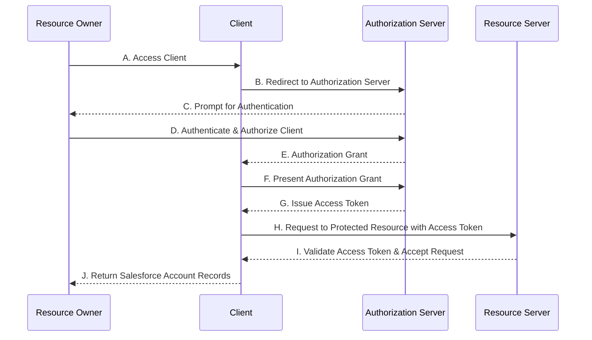

OAuth 2.0承認フレームワークを使って、
サードパーティアプリケーションがHTTPサービスへの制限付きアクセスするまでの
流れを図にします。

Webサイト（以下、Client）の特定の機能を利用する際に、
Salesforce API（以下、Resource Server）からAccountのレコードを安全に取得する方法について説明します。
OAuth 2.0承認フレームワークを使用すると、
Salesforceの連携ユーザー（以下、ResourceOwner）のログインIDとパスワードをClientに共有せずに、
どのようにデータを取得するかに焦点を当てています。

[RFC 6749 - The OAuth 2.0 Authorization Framework](https://tex2e.github.io/rfc-translater/html/rfc6749.html)