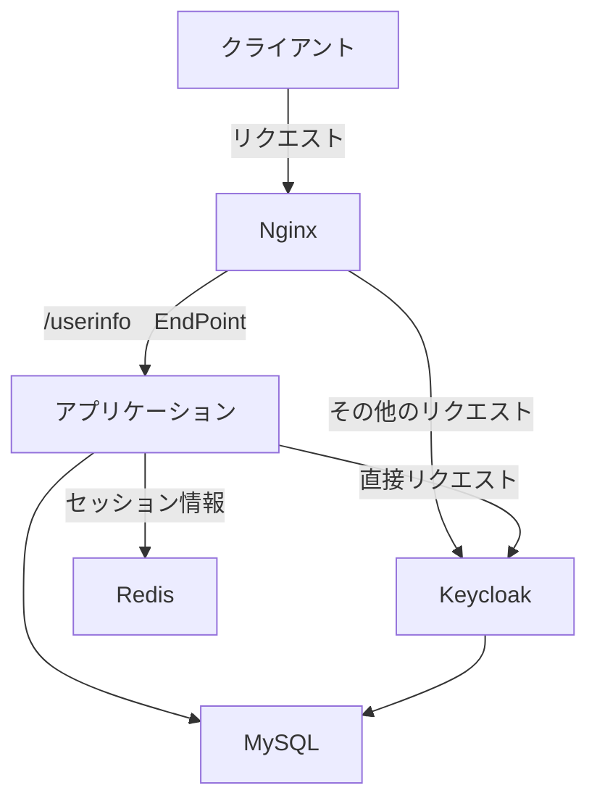

この記事では、Dockerを用いてKeycloakをNginxの背後でリバースプロキシとして運用する方法について解説します。このセットアップでは、Keycloakをセキュリティサービスとして活用しながら、Nginxを通じてリソースへのアクセスを制御することができます。特に、内部アプリケーションがプロキシを介さずにKeycloak APIへ直接リクエストを送る設定に焦点を当てます。

### アーキテクチャの概要

以下のアーキテクチャ図は、クライアントがNginxを通じてリクエストを送り、NginxがそのリクエストをアプリケーションやKeycloakへルーティングする流れを示しています。アプリケーションは、セッション情報をRedisに保存し、またMySQLをデータストアとして利用します。この構成により、Keycloakを介したセキュリティ管理と効率的なリソースアクセスが実現されます。



### 構成

ディレクトリ構造としては、アプリケーション、Nginxの設定ファイル、Docker Composeファイルを含むシンプルな構造を採用しています。これらのファイルを用いて、Keycloak、Nginx、MySQL、Redis、アプリケーションの各サービスを定義します。

```bash
$ tree   
.
├── app
│   └── Dockerfile
├── compose.yml
└── nginx
    └── conf.d
        └── default.conf
```

### Docker Composeの設定

Docker Composeファイルでは、各サービスの設定と相互の依存関係が記述されています。Keycloakの設定には、プロキシヘッダーやホスト名の設定が含まれ、Nginxを通じた通信が正しく機能するようになっています。特に、KC_PROXY_HEADERSとKC_HOSTNAMEの設定は、プロキシ環境下でのKeycloakの適切な動作を保証するために重要です。

```yaml
services:
  keycloak:
    image: quay.io/keycloak/keycloak:24.0.1
    platform: linux/amd64
    expose:
      - 8080
    environment:
      KEYCLOAK_ADMIN: admin
      KEYCLOAK_ADMIN_PASSWORD: admin
      KC_DB: mysql
      KC_DB_URL_HOST: mysql
      KC_DB_URL_DATABASE: keycloak
      KC_DB_USERNAME: keycloak
      KC_DB_PASSWORD: password
      KC_PROXY_HEADERS: "xforwarded"
      KC_HOSTNAME: "localhost:8080"
      KC_HTTP_ENABLED: true
    command:
      - start-dev
    depends_on:
      mysql:
        condition: service_healthy
      redis:
        condition: service_started
      keycloak:
        condition: service_started
    volumes:
      - keycloak_data:/opt/keycloak/data

  nginx:
    image: nginx:latest
    ports:
      - "8080:8080"
    volumes:
      - ./nginx/conf.d/default.conf:/etc/nginx/conf.d/default.conf
    depends_on:
      - keycloak
      - app

  mysql:
    image: mysql:8.3
    platform: linux/amd64
    expose:
      - 3306
    environment:
      MYSQL_ROOT_PASSWORD: root
      MYSQL_DATABASE: keycloak
      MYSQL_USER: keycloak
      MYSQL_PASSWORD: password
    healthcheck:
      test: ["CMD", "mysqladmin", "ping", "-h", "localhost", "-uroot", "-ppassword"]
      interval: 10s
      timeout: 5s
      retries: 5
    volumes:
      - mysql_data:/var/lib/mysql

  redis:
    image: redis:7.2.4
    expose:
      - 6379
    volumes:
      - redis_data:/data

  app:
    build:
      context: ./..
      dockerfile: docker/app/Dockerfile
    expose:
      - 3000
    environment:
      PORT: 3000
      CONTACTS_DB_HOST: mysql
      CONTACTS_DB_USER: local-db-user
      CONTACTS_DB_PASSWORD: password
      CONTACTS_DB_DATABASE: contacts
      CONTACTS_DB_PORT: 3306
      IDENTITY_DB_HOST: mysql
      IDENTITY_DB_USER: local-db-user
      IDENTITY_DB_PASSWORD: password
      IDENTITY_DB_DATABASE: identityExtension
      IDENTITY_DB_PORT: 3306
      REDIS_ENDPOINT: redis://redis:6379
      BACKEND_IDP: http://keycloak:8080
    depends_on:
      mysql:
        condition: service_healthy
      redis:
        condition: service_started
      keycloak:
        condition: service_started

volumes:
  keycloak_data:
  mysql_data:
  redis_data:

```

#### Keycloakの設定ポイント

KeycloakをNginxの背後で運用する際の重要な設定ポイントを紹介します。

- **KC_PROXY_HEADERS**: `"xforwarded"`を指定することで、KeycloakはX-Forwarded-* ヘッダーを通じてクライアントから受け取る情報（例えば、実際のIPアドレスやプロトコル）を信頼し利用します。これは、プロキシを介した環境でクライアント情報の正確性を保持するために必要です。
- **KC_HOSTNAME**: Keycloakが外部からアクセスされる際のホスト名（またはIPアドレス）とポートを指定します。`"localhost:8080"` のように設定することで、特定のホスト名やポートでKeycloakを公開する際の挙動を定義します。
- **KC_HTTP_ENABLED**: この環境変数を `true` に設定すると、HTTPプロトコルでのアクセスを許可します。セキュアな環境ではHTTPSの使用が推奨されますが、開発環境など特定のケースではHTTPを有効にすることがあります。
- **開発モードでのKeycloak起動**: `command`オプションに`start-dev`を指定してKeycloakを起動することがあります。これは、開発時の利便性を高めるための設定で、本番環境ではセキュリティ強化された`start`コマンドを使用することが推奨されます。

#### Docker Composeの依存性と健全性チェック

サービス間の依存関係を管理し、特にMySQLが正しく起動していることを保証するために、Docker Composeの`depends_on`セクションに`condition: service_healthy`を設定することが重要です。これにより、依存サービスが健全な状態になるまで、他のサービスの起動を遅延させることができます。

- **目的**: 依存するサービスが完全に起動し、受け入れ準備が整うまで、アプリケーションサービスの起動を待機させます。
- **`service_healthy`の役割**: Dockerのヘルスチェック機能を利用して、コンテナが健全かどうかを定期的に確認し、その結果に基づいてサービスの起動順序を制御します。

関連記事:

- [Keycloak Reverse Proxy Setup](https://www.keycloak.org/server/reverseproxy)
- [Keycloak All Configuration Options](https://www.keycloak.org/server/all-config)

### Nginxの設定

Nginxは、Keycloakへのリクエストをプロキシし、特定のURLパターンにマッチするリクエストに対しては、
URLの一部を書き換えてアプリケーションにルーティングするように設定されています。
この設定により、特定のエンドポイントへのアクセスを制御できます。

```config
server {
    listen 8080;

    server_name localhost;
    location ~ ^/realms/([^/]+)/protocol/openid-connect/userinfo {
        rewrite ^/realms/[^/]+/protocol/openid-connect/userinfo /api/v1/userInformation/enrich break;
        proxy_pass http://app:3000;
        proxy_set_header Host $http_host;
        proxy_set_header X-Real-IP $remote_addr;
        proxy_set_header X-Forwarded-For $proxy_add_x_forwarded_for;
        proxy_set_header X-Forwarded-Proto $scheme;
        proxy_set_header X-Forwarded-Port $server_port;
        proxy_redirect off;
    }

    location / {
        proxy_pass http://keycloak:8080;
        proxy_set_header Host $http_host;
        proxy_set_header X-Real-IP $remote_addr;
        proxy_set_header X-Forwarded-For $proxy_add_x_forwarded_for;
        proxy_set_header X-Forwarded-Proto $scheme;
        proxy_set_header X-Forwarded-Port $server_port;
        proxy_redirect off;
    }
}
```
