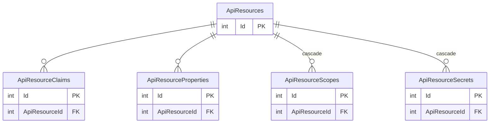
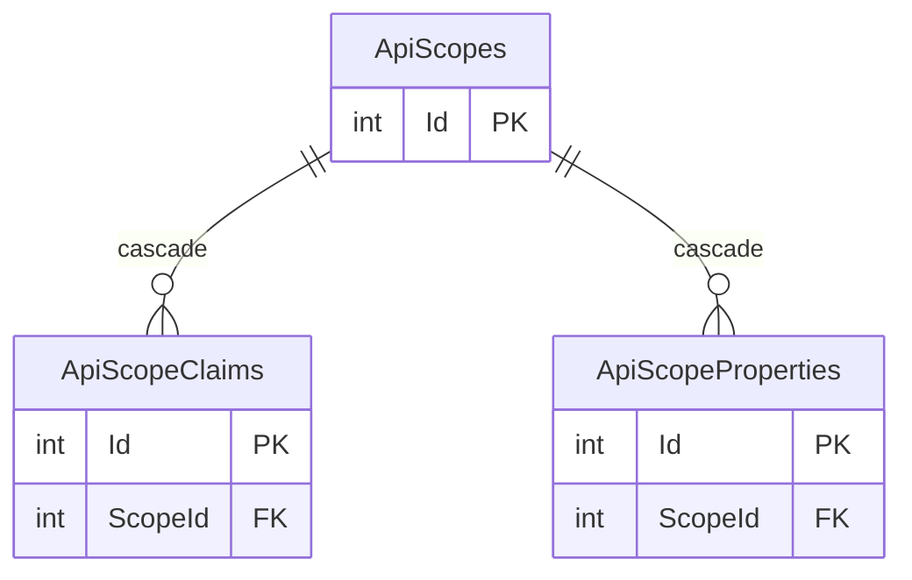
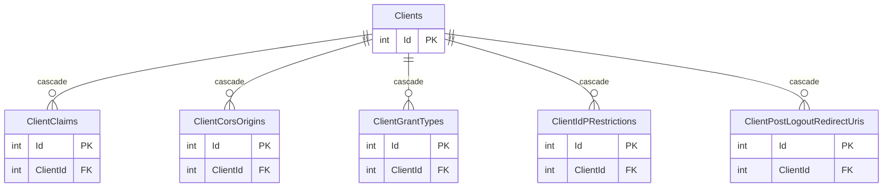
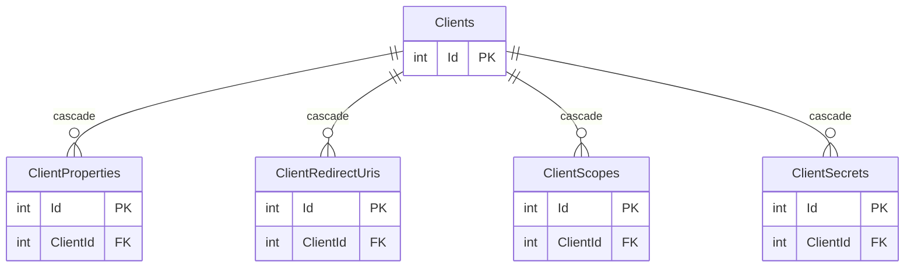
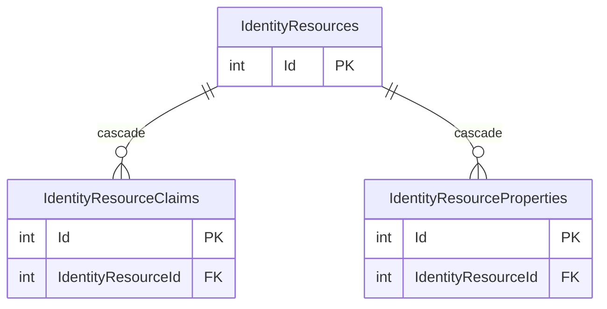

[Table定義](https://github.dev/DuendeSoftware/IdentityServer/blob/main/migrations/IdentityServerDb/Migrations/ConfigurationDb/ConfigurationDbContextModelSnapshot.cs)を書き起こしてみた

## ER図

- `||` - これは強い関連を意味し、主キーまたは候補キー（ユニークキー）として機能するエンティティを指します。
- `o{` - これは「ゼロまたは多数」のカーディナリティを示し、一方のエンティティが他方に対してゼロ回以上の関連を持つことができます。
- `cascade` - これは外部キー制約の一種で、あるエンティティの変更や削除が行われたときに、関連するエンティティのレコードに対しても同じ操作が自動的に適用されることを意味します。
  - **削除のカスケード**: 関連するテーブルのレコードも連動して削除されます。
  - **更新のカスケード**: 関連するテーブルの対応するキーが自動的に更新されます。

Clients数が多いので分割
*Clients分割1*

*Clients分割2*

## ApiResources テーブル

| 列名                               | データ型                | 必須 | 説明                           |
|------------------------------------|-------------------------|------|--------------------------------|
| Id                                 | int                     | Yes  | ユニークな識別子               |
| Enabled                            | bit                     | Yes  | 有効/無効のフラグ              |
| Name                               | nvarchar(200)           | Yes  | 名前                           |
| DisplayName                        | nvarchar(200)           | No   | 表示名                         |
| Description                        | nvarchar(1000)          | No   | 説明                           |
| AllowedAccessTokenSigningAlgorithms | nvarchar(100)           | No   | 許可されたアクセストークン署名アルゴリズム |
| ShowInDiscoveryDocument             | bit                     | Yes  | 発見文書に表示するかどうかのフラグ |
| RequireResourceIndicator            | bit                     | Yes  | リソースインジケータが必要かどうかのフラグ |
| Created                            | datetime2               | Yes  | 作成日時                       |
| Updated                            | datetime2               | No   | 更新日時                       |
| LastAccessed                       | datetime2               | No   | 最終アクセス日時               |
| NonEditable                        | bit                     | Yes  | 編集不可のフラグ                |

主キー制約: PK_ApiResources (Id)

| インデックス名                                          | 列       | 説明                                  |
|-------------------------------------------------------|----------|---------------------------------------|
| IX_ApiResources_Name                                   | [Name]   | Apiリソースの名前に関する一意のインデックス |

## ApiResourceClaims テーブル

| 列名          | データ型        | 必須 | 説明                           |
|---------------|-----------------|------|--------------------------------|
| Id            | int             | Yes  | ユニークな識別子               |
| ApiResourceId | int             | Yes  | 関連するApiリソースのID       |
| Type          | nvarchar(200)   | Yes  | クレームタイプ                 |

主キー制約: PK_ApiResourceClaims (Id)
外部キー制約: FK_ApiResourceClaims_ApiResources_ApiResourceId (ApiResourceId -> ApiResources.Id) (参照先のレコードが削除された場合、削除も行う)

| インデックス名                                          | 列                       | 説明                                     |
|-------------------------------------------------------|--------------------------|------------------------------------------|
| IX_ApiResourceClaims_ApiResourceId_Type                | [ApiResourceId], [Type]  | Apiリソースのクレームに関する一意のインデックス |

## ApiResourceProperties テーブル

| 列名          | データ型        | 必須 | 説明                           |
|---------------|-----------------|------|--------------------------------|
| Id            | int             | Yes  | ユニークな識別子               |
| ApiResourceId | int             | Yes  | 関連するApiリソースのID       |
| Key           | nvarchar(250)   | Yes  | プロパティのキー               |
| Value         | nvarchar(2000)  | Yes  | プロパティの値                 |

主キー制約: PK_ApiResourceProperties (Id)
外部キー制約: FK_ApiResourceProperties_ApiResources_ApiResourceId (ApiResourceId -> ApiResources.Id) (参照先のレコードが削除された場合、削除も行う)

| インデックス名                                          | 列                        | 説明                                        |
|-------------------------------------------------------|---------------------------|---------------------------------------------|
| IX_ApiResourceProperties_ApiResourceId_Key             | [ApiResourceId], [Key]    | Apiリソースのプロパティに関する一意のインデックス |

## ApiResourceScopes テーブル

| 列名          | データ型        | 必須 | 説明                           |
|---------------|-----------------|------|--------------------------------|
| Id            | int             | Yes  | ユニークな識別子               |
| Scope         | nvarchar(200)   | Yes  | スコープ                       |
| ApiResourceId | int             | Yes  | 関連するApiリソースのID       |

主キー制約: PK_ApiResourceScopes (Id)
外部キー制約: FK_ApiResourceScopes_ApiResources_ApiResourceId (ApiResourceId -> ApiResources.Id) (参照先のレコードが削除された場合、削除も行う)

| インデックス名                                          | 列                        | 説明                                        |
|-------------------------------------------------------|---------------------------|---------------------------------------------|
| IX_ApiResourceScopes_ApiResourceId_Scope              | [ApiResourceId], [Scope]  | Apiリソースのスコープに関する一意のインデックス |

## ApiResourceSecrets テーブル

| 列名          | データ型        | 必須 | 説明                           |
|---------------|-----------------|------|--------------------------------|
| Id            | int             | Yes  | ユニークな識別子               |
| ApiResourceId | int             | Yes  | 関連するApiリソースのID       |
| Description   | nvarchar(1000)  | No   | 説明                           |
| Value         | nvarchar(4000)  | Yes  | シークレット値                 |
| Expiration    | datetime2       | No   | 有効期限                       |
| Type          | nvarchar(250)   | Yes  | タイプ                         |
| Created       | datetime2       | Yes  | 作成日時                       |

主キー制約: PK_ApiResourceSecrets (Id)
外部キー制約: FK_ApiResourceSecrets_ApiResources_ApiResourceId (ApiResourceId -> ApiResources.Id) (参照先のレコードが削除された場合、削除も行う)

| インデックス名                                          | 列               | 説明                                  |
|-------------------------------------------------------|------------------|---------------------------------------|
| IX_ApiResourceSecrets_ApiResourceId                    | [ApiResourceId] | Apiリソースのシークレットに関するインデックス |

## ApiScopes テーブル

| 列名                   | データ型        | 必須 | 説明                           |
|------------------------|-----------------|------|--------------------------------|
| Id                     | int             | Yes  | ユニークな識別子               |
| Enabled                | bit             | Yes  | 有効/無効のフラグ              |
| Name                   | nvarchar(200)   | Yes  | 名前                           |
| DisplayName            | nvarchar(200)   | No   | 表示名                         |
| Description            | nvarchar(1000)  | No   | 説明                           |
| Required               | bit             | Yes  | 必須かどうかのフラグ            |
| Emphasize              | bit             | Yes  | 強調表示するかどうかのフラグ   |
| ShowInDiscoveryDocument| bit             | Yes  | 発見文書に表示するかどうかのフラグ |
| Created                | datetime2       | Yes  | 作成日時                       |
| Updated                | datetime2       | No   | 更新日時                       |
| LastAccessed           | datetime2       | No   | 最終アクセス日時               |
| NonEditable            | bit             | Yes  | 編集不可のフラグ                |

主キー制約: PK_ApiScopes (Id)

| インデックス名                                          | 列       | 説明                                  |
|-------------------------------------------------------|----------|---------------------------------------|
| IX_ApiScopes_Name                                     | [Name]   | Apiスコープの名前に関する一意のインデックス |

## ApiScopeClaims テーブル

| 列名     | データ型        | 必須 | 説明                           |
|----------|-----------------|------|--------------------------------|
| Id       | int             | Yes  | ユニークな識別子               |
| ScopeId  | int             | Yes  | 関連するApiスコープのID       |
| Type     | nvarchar(200)   | Yes  | クレームタイプ                 |

主キー制約: PK_ApiScopeClaims (Id)
外部キー制約: FK_ApiScopeClaims_ApiScopes_ScopeId (ScopeId -> ApiScopes.Id) (参照先のレコードが削除された場合、削除も行う)

| インデックス名                                          | 列               | 説明                             |
|-------------------------------------------------------|------------------|----------------------------------|
| IX_ApiScopeClaims_ScopeId_Type                        | [ScopeId], [Type] | Apiスコープのクレームに関する一意のインデックス |

## ApiScopeProperties テーブル

| 列名     | データ型        | 必須 | 説明                           |
|----------|-----------------|------|--------------------------------|
| Id       | int             | Yes  | ユニークな識別子               |
| ScopeId  | int             | Yes  | 関連するApiスコープのID       |
| Key      | nvarchar(250)   | Yes  | プロパティのキー               |
| Value    | nvarchar(2000)  | Yes  | プロパティの値                 |

主キー制約: PK_ApiScopeProperties (Id)
外部キー制約: FK_ApiScopeProperties_ApiScopes_ScopeId (ScopeId -> ApiScopes.Id) (参照先のレコードが削除された場合、削除も行う)

| インデックス名                                          | 列                | 説明                             |
|-------------------------------------------------------|-------------------|----------------------------------|
| IX_ApiScopeProperties_ScopeId_Key                     | [ScopeId], [Key]   | Apiスコープのプロパティに関する一意のインデックス |

## Clients テーブル

| 列名                                  | データ型                | 必須 | 説明                           |
|---------------------------------------|-------------------------|------|--------------------------------|
| Id                                    | int                     | Yes  | ユニークな識別子               |
| Enabled                               | bit                     | Yes  | 有効/無効のフラグ              |
| ClientId                              | nvarchar(200)           | Yes  | クライアントID                 |
| ProtocolType                          | nvarchar(200)           | Yes  | プロトコルの種類               |
| RequireClientSecret                   | bit                     | Yes  | クライアントシークレットが必要かどうかのフラグ |
| ClientName                            | nvarchar(200)           | No   | クライアントの名前             |
| Description                           | nvarchar(1000)          | No   | 説明                           |
| ClientUri                             | nvarchar(2000)          | No   | クライアントのURI              |
| LogoUri                               | nvarchar(2000)          | No   | ロゴのURI                      |
| RequireConsent                        | bit                     | Yes  | 同意が必要かどうかのフラグ     |
| AllowRememberConsent                  | bit                     | Yes  | 同意の記憶を許可するかどうかのフラグ |
| AlwaysIncludeUserClaimsInIdToken      | bit                     | Yes  | 常にユーザークレームをIdトークンに含めるかどうかのフラグ |
| RequirePkce                           | bit                     | Yes  | PKCEが必要かどうかのフラグ     |
| AllowPlainTextPkce                    | bit                     | Yes  | 平文のPKCEを許可するかどうかのフラグ |
| RequireRequestObject                  | bit                     | Yes  | リクエストオブジェクトが必要かどうかのフラグ |
| AllowAccessTokensViaBrowser           | bit                     | Yes  | ブラウザ経由でアクセストークンを許可するかどうかのフラグ |
| RequireDPoP                           | bit                     | Yes  | DPoPが必要かどうかのフラグ     |
| DPoPValidationMode                    | int                     | Yes  | DPoPの検証モード               |
| DPoPClockSkew                         | time                    | Yes  | DPoPのクロックスキュー           |
| FrontChannelLogoutUri                 | nvarchar(2000)          | No   | フロントチャネルのログアウトURI |
| FrontChannelLogoutSessionRequired     | bit                     | Yes  | フロントチャネルのログアウトセッションが必要かどうかのフラグ |
| BackChannelLogoutUri                  | nvarchar(2000)          | No   | バックチャネルのログアウトURI  |
| BackChannelLogoutSessionRequired      | bit                     | Yes  | バックチャネルのログアウトセッションが必要かどうかのフラグ |
| AllowOfflineAccess                    | bit                     | Yes  | オフラインアクセスを許可するかどうかのフラグ |
| IdentityTokenLifetime                 | int                     | Yes  | Identity Tokenの有効期限     |
| AllowedIdentityTokenSigningAlgorithms | nvarchar(100)           | No   | 許可されたIdentity Token署名アルゴリズム |
| AccessTokenLifetime                   | int                     | Yes  | アクセストークンの有効期限     |
| AuthorizationCodeLifetime             | int                     | Yes  | 認可コードの有効期限           |
| ConsentLifetime                       | int                     | No   | 同意の有効期限                 |
| AbsoluteRefreshTokenLifetime          | int                     | Yes  | 絶対的なリフレッシュトークンの有効期限 |
| SlidingRefreshTokenLifetime           | int                     | Yes  | スライディングリフレッシュトークンの有効期限 |
| RefreshTokenUsage                     | int                     | Yes  | リフレッシュトークンの使用方法 |
| UpdateAccessTokenClaimsOnRefresh      | bit                     | Yes  | リフレッシュ時にアクセストークンのクレームを更新するかどうかのフラグ |
| RefreshTokenExpiration                | int                     | Yes  | リフレッシュトークンの有効期限 |
| AccessTokenType                       | int                     | Yes  | アクセストークンのタイプ       |
| EnableLocalLogin                      | bit                     | Yes  | ローカルログインを許可するかどうかのフラグ |
| IncludeJwtId                          | bit                     | Yes  | JWT IDを含めるかどうかのフラグ   |
| AlwaysSendClientClaims                | bit                     | Yes  | 常にクライアントクレームを送信するかどうかのフラグ |
| ClientClaimsPrefix                    | nvarchar(200)           | No   | クライアントクレームの接頭辞   |
| PairWiseSubjectSalt                   | nvarchar(200)           | No   | ペアワイズサブジェクトソルト   |
| InitiateLoginUri                      | nvarchar(2000)          | No   | ログインの開始URI               |
| UserSsoLifetime                       | int                     | No   | ユーザーSSOの有効期限           |
| UserCodeType                          | nvarchar(100)           | No   | ユーザーコードのタイプ         |
| DeviceCodeLifetime                    | int                     | Yes  | デバイスコードの有効期限       |
| CibaLifetime                          | int                     | No   | CIBAの有効期限                 |
| PollingInterval                       | int                     | No   | ポーリング間隔                 |
| CoordinateLifetimeWithUserSession     | bit                     | No   | ユーザーセッションとの有効期間を調整するかどうかのフラグ |
| Created                               | datetime2               | Yes  | 作成日時                       |
| Updated                               | datetime2               | No   | 更新日時                       |
| LastAccessed                          | datetime2               | No   | 最終アクセス日時               |
| NonEditable                           | bit                     | Yes  | 編集不可のフラグ                |
| PushedAuthorizationLifetime           | int                     | No   | Pushed Authorizationの有効期限 |
| RequirePushedAuthorization            | bit                     | Yes  | Pushed Authorizationが必要かどうかのフラグ |

主キー制約: PK_Clients (Id)

| インデックス名                                          | 列        | 説明                                  |
|-------------------------------------------------------|-----------|---------------------------------------|
| IX_Clients_ClientId                                   | [ClientId]| クライアントのIDに関する一意のインデックス |

## ClientClaims テーブル

| 列名     | データ型        | 必須 | 説明                           |
|----------|-----------------|------|--------------------------------|
| Id       | int             | Yes  | ユニークな識別子               |
| Type     | nvarchar(250)   | Yes  | クレームタイプ                 |
| Value    | nvarchar(250)   | Yes  | クレームの値                   |
| ClientId | int             | Yes  | 関連するクライアントのID       |

主キー制約: PK_ClientClaims (Id)
外部キー制約: FK_ClientClaims_Clients_ClientId (ClientId -> Clients.Id) (参照先のレコードが削除された場合、削除も行う)

| インデックス名                                          | 列                        | 説明                                  |
|-------------------------------------------------------|---------------------------|---------------------------------------|
| IX_ClientClaims_ClientId_Type_Value                   | [ClientId], [Type], [Value] | クライアントのクレームに関する一意のインデックス |

## ClientCorsOrigins テーブル

| 列名     | データ型        | 必須 | 説明                           |
|----------|-----------------|------|--------------------------------|
| Id       | int             | Yes  | ユニークな識別子               |
| Origin   | nvarchar(150)   | Yes  | CORSのオリジン                 |
| ClientId | int             | Yes  | 関連するクライアントのID       |

主キー制約: PK_ClientCorsOrigins (Id)
外部キー制約: FK_ClientCorsOrigins_Clients_ClientId (ClientId -> Clients.Id) (参照先のレコードが削除された場合、削除も行う)

| インデックス名                                          | 列                    | 説明                                |
|-------------------------------------------------------|-----------------------|-------------------------------------|
| IX_ClientCorsOrigins_ClientId_Origin                  | [ClientId], [Origin] | クライアントのCORSオリジンに関する一意のインデックス |

## IdentityProviders テーブル

| 列名          | データ型        | 必須 | 説明                           |
|---------------|-----------------|------|--------------------------------|
| Id            | int             | Yes  | ユニークな識別子               |
| Scheme        | nvarchar(200)   | Yes  | スキーム                       |
| DisplayName   | nvarchar(200)   | No   | 表示名                         |
| Enabled       | bit             | Yes  | 有効/無効のフラグ              |
| Type          | nvarchar(20)    | Yes  | タイプ                         |
| Properties    | nvarchar(max)   | No   | プロパティ                     |
| Created       | datetime2       | Yes  | 作成日時                       |
| Updated       | datetime2       | No   | 更新日時                       |
| LastAccessed  | datetime2       | No   | 最終アクセス日時               |
| NonEditable   | bit             | Yes  | 編集不可のフラグ                |

主キー制約: PK_IdentityProviders (Id)

| インデックス名                                          | 列       | 説明                                |
|-------------------------------------------------------|----------|-------------------------------------|
| IX_IdentityProviders_Scheme                           | [Scheme] | アイデンティティプロバイダのスキームに関する一意のインデックス |

## ClientGrantTypes テーブル

| 列名       | データ型      | 必須 | 説明                       |
|------------|---------------|------|----------------------------|
| Id         | int           | Yes  | ユニークな識別子           |
| GrantType  | nvarchar(250) | Yes  | グラントタイプ             |
| ClientId   | int           | Yes  | 関連するクライアントのID   |

主キー制約: PK_ClientGrantTypes (Id)
外部キー制約: FK_ClientGrantTypes_Clients_ClientId (ClientId -> Clients.Id) (参照先のレコードが削除された場合、削除も行う)

| インデックス名                                          | 列                        | 説明                             |
|-------------------------------------------------------|---------------------------|----------------------------------|
| IX_ClientGrantTypes_ClientId_GrantType               | [ClientId], [GrantType]   | クライアントのグラントタイプに関する一意のインデックス |

## ClientIdPRestrictions テーブル

| 列名      | データ型      | 必須 | 説明                           |
|-----------|---------------|------|--------------------------------|
| Id        | int           | Yes  | ユニークな識別子               |
| Provider  | nvarchar(200) | Yes  | 識別プロバイダ                 |
| ClientId  | int           | Yes  | 関連するクライアントのID       |

主キー制約: PK_ClientIdPRestrictions (Id)
外部キー制約: FK_ClientIdPRestrictions_Clients_ClientId (ClientId -> Clients.Id) (参照先のレコードが削除された場合、削除も行う)

| インデックス名                                          | 列                         | 説明                                |
|-------------------------------------------------------|----------------------------|-------------------------------------|
| IX_ClientIdPRestrictions_ClientId_Provider            | [ClientId], [Provider]     | クライアントのIDP制限に関する一意のインデックス |

## ClientPostLogoutRedirectUris テーブル

| 列名                  | データ型        | 必須 | 説明                           |
|-----------------------|-----------------|------|--------------------------------|
| Id                    | int             | Yes  | ユニークな識別子               |
| PostLogoutRedirectUri | nvarchar(400)   | Yes  | ログアウト後のリダイレクトURI   |
| ClientId              | int             | Yes  | 関連するクライアントのID       |

主キー制約: PK_ClientPostLogoutRedirectUris (Id)
外部キー制約: FK_ClientPostLogoutRedirectUris_Clients_ClientId (ClientId -> Clients.Id) (参照先のレコードが削除された場合、削除も行う)

| インデックス名                                          | 列                                | 説明                                    |
|-------------------------------------------------------|-----------------------------------|-----------------------------------------|
| IX_ClientPostLogoutRedirectUris_ClientId_PostLogoutRedirectUri | [ClientId], [PostLogoutRedirectUri] | クライアントのログアウト後のリダイレクトURIに関する一意のインデックス |

## ClientProperties テーブル

| 列名      | データ型      | 必須 | 説明                       |
|-----------|---------------|------|----------------------------|
| Id        | int           | Yes  | ユニークな識別子           |
| ClientId  | int           | Yes  | 関連するクライアントのID   |
| Key       | nvarchar(250) | Yes  | プロパティのキー           |
| Value     | nvarchar(2000)| Yes  | プロパティの値             |

主キー制約: PK_ClientProperties (Id)
外部キー制約: FK_ClientProperties_Clients_ClientId (ClientId -> Clients.Id) (参照先のレコードが削除された場合、削除も行う)

| インデックス名                                          | 列                        | 説明                             |
|-------------------------------------------------------|---------------------------|----------------------------------|
| IX_ClientProperties_ClientId_Key                      | [ClientId], [Key]        | クライアントのプロパティに関する一意のインデックス |

## ClientRedirectUris テーブル

| 列名         | データ型      | 必須 | 説明                           |
|--------------|---------------|------|--------------------------------|
| Id           | int           | Yes  | ユニークな識別子               |
| RedirectUri  | nvarchar(400) | Yes  | リダイレクトURI                |
| ClientId     | int           | Yes  | 関連するクライアントのID       |

主キー制約: PK_ClientRedirectUris (Id)
外部キー制約: FK_ClientRedirectUris_Clients_ClientId (ClientId -> Clients.Id) (参照先のレコードが削除された場合、削除も行う)

| インデックス名                                          | 列                        | 説明                             |
|-------------------------------------------------------|---------------------------|----------------------------------|
| IX_ClientRedirectUris_ClientId_RedirectUri            | [ClientId], [RedirectUri] | クライアントのリダイレクトURIに関する一意のインデックス |

## ClientScopes テーブル

| 列名     | データ型      | 必須 | 説明                       |
|----------|---------------|------|----------------------------|
| Id       | int           | Yes  | ユニークな識別子           |
| Scope    | nvarchar(200) | Yes  | スコープ                   |
| ClientId | int           | Yes  | 関連するクライアントのID   |

主キー制約: PK_ClientScopes (Id)
外部キー制約: FK_ClientScopes_Clients_ClientId (ClientId -> Clients.Id) (参照先のレコードが削除された場合、削除も行う)

| インデックス名                                          | 列                         | 説明                             |
|-------------------------------------------------------|----------------------------|----------------------------------|
| IX_ClientScopes_ClientId_Scope                        | [ClientId], [Scope]       | クライアントのスコープに関する一意のインデックス |

## ClientSecrets テーブル

| 列名       | データ型      | 必須 | 説明                       |
|------------|---------------|------|----------------------------|
| Id         | int           | Yes  | ユニークな識別子           |
| ClientId   | int           | Yes  | 関連するクライアントのID   |
| Description| nvarchar(2000)| No   | 説明                       |
| Value      | nvarchar(4000)| Yes  | シークレット値             |
| Expiration | datetime2     | No   | 有効期限                   |
| Type       | nvarchar(250) | Yes  | タイプ                     |
| Created    | datetime2     | Yes  | 作成日時                   |

主キー制約: PK_ClientSecrets (Id)
外部キー制約: FK_ClientSecrets_Clients_ClientId (ClientId -> Clients.Id) (参照先のレコードが削除された場合、削除も行う)

| インデックス名                                          | 列                | 説明                             |
|-------------------------------------------------------|-------------------|----------------------------------|
| IX_ClientSecrets_ClientId                             | [ClientId]        | クライアントのシークレットに関するインデックス |

## IdentityResources テーブル

| 列名                  | データ型        | 必須 | 説明                           |
|-----------------------|-----------------|------|--------------------------------|
| Id                    | int             | Yes  | ユニークな識別子               |
| Enabled               | bit             | Yes  | 有効/無効のフラグ              |
| Name                  | nvarchar(200)   | Yes  | 名前                           |
| DisplayName           | nvarchar(200)   | No   | 表示名                         |
| Description           | nvarchar(1000)  | No   | 説明                           |
| Required              | bit             | Yes  | 必須かどうかのフラグ            |
| Emphasize             | bit             | Yes  | 強調表示するかどうかのフラグ   |
| ShowInDiscoveryDocument| bit             | Yes  | 発見文書に表示するかどうかのフラグ |
| Created               | datetime2       | Yes  | 作成日時                       |
| Updated               | datetime2       | No   | 更新日時                       |
| NonEditable           | bit             | Yes  | 編集不可のフラグ                |

主キー制約: PK_IdentityResources (Id)

| インデックス名                                          | 列       | 説明                                  |
|-------------------------------------------------------|----------|---------------------------------------|
| IX_IdentityResources_Name                             | [Name]   | アイデンティティリソースの名前に関する一意のインデックス |

## IdentityResourceClaims テーブル

| 列名              | データ型      | 必須 | 説明                       |
|-------------------|---------------|------|----------------------------|
| Id                | int           | Yes  | ユニークな識別子           |
| IdentityResourceId| int           | Yes  | 関連するアイデンティティリソースのID |
| Type              | nvarchar(200) | Yes  | クレームタイプ             |

主キー制約: PK_IdentityResourceClaims (Id)
外部キー制約: FK_IdentityResourceClaims_IdentityResources_IdentityResourceId (IdentityResourceId -> IdentityResources.Id) (参照先のレコードが削除された場合、削除も行う)

| インデックス名                                          | 列                        | 説明                             |
|-------------------------------------------------------|---------------------------|----------------------------------|
| IX_IdentityResourceClaims_IdentityResourceId_Type     | [IdentityResourceId], [Type] | アイデンティティリソースのクレームに関する一意のインデックス |

## IdentityResourceProperties テーブル

| 列名              | データ型      | 必須 | 説明                       |
|-------------------|---------------|------|----------------------------|
# | Id                | int           | Yes  | ユニークな識別子           |
| IdentityResourceId| int           | Yes  | 関連するアイデンティティリソースのID |
| Key               | nvarchar(250) | Yes  | プロパティのキー           |
| Value             | nvarchar(2000)| Yes  | プロパティの値             |

主キー制約: PK_IdentityResourceProperties (Id)
外部キー制約: FK_IdentityResourceProperties_IdentityResources_IdentityResourceId (IdentityResourceId -> IdentityResources.Id) (参照先のレコードが削除された場合、削除も行う)

| インデックス名                                          | 列                        | 説明                             |
|-------------------------------------------------------|---------------------------|----------------------------------|
| IX_IdentityResourceProperties_IdentityResourceId_Key  | [IdentityResourceId], [Key]  | アイデンティティリソースのプロパティに関する一意のインデックス |
