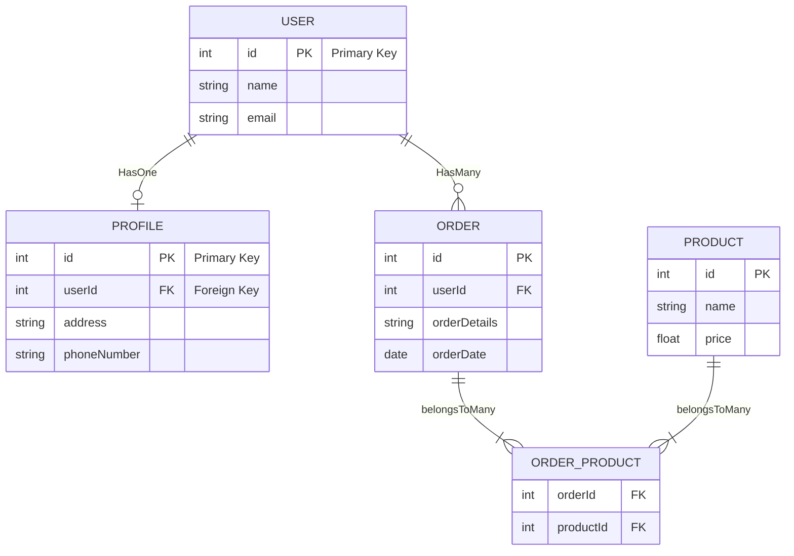
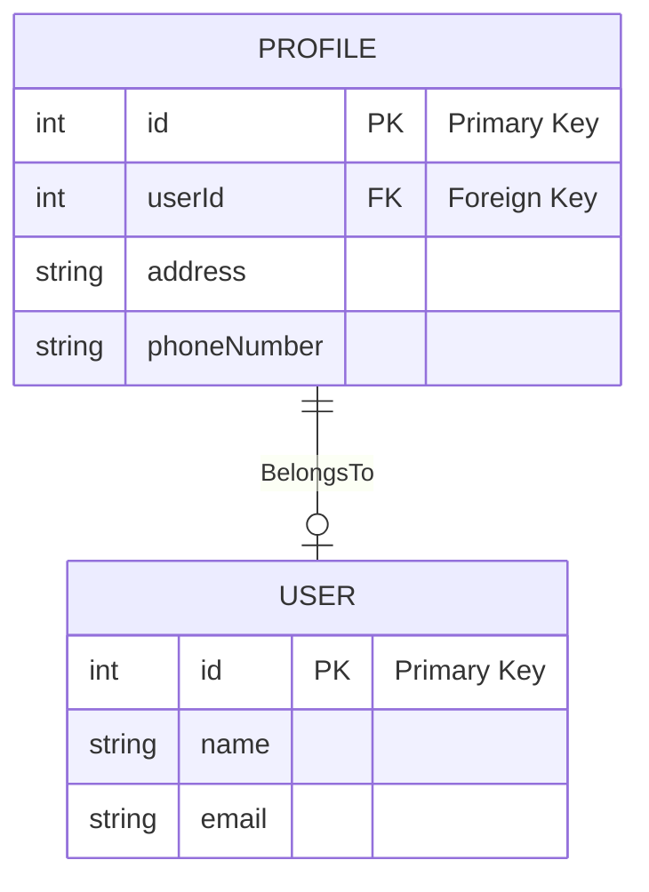
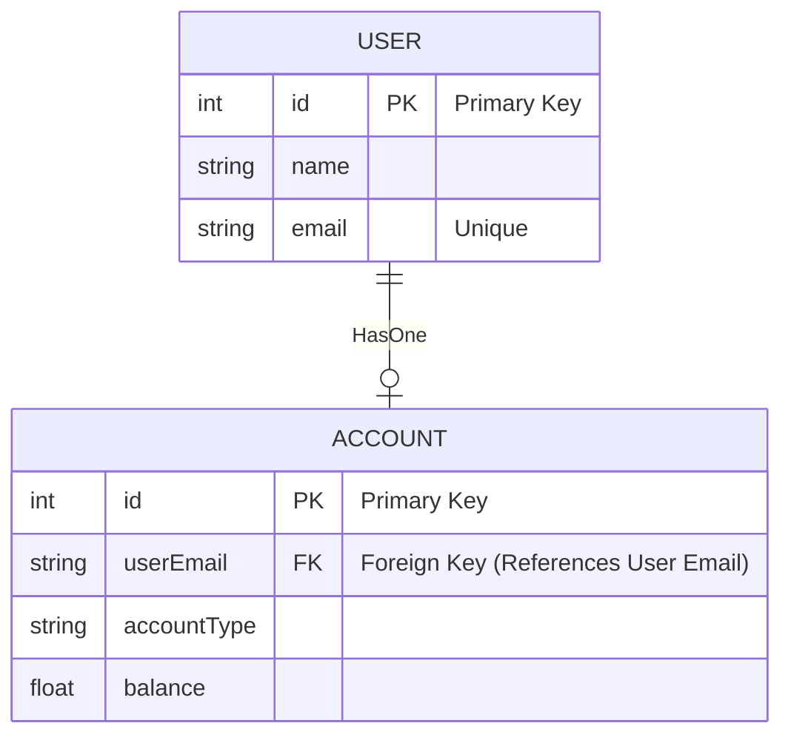

読んだドキュメントは<https://sequelize.org/docs/v6/core-concepts/assocs/>　です。

### Associations

Associationsには４種類ある

1. The HasOne association
   1. `USER.hasOne(PROFILE)` `USER`と`PROFILE`の間に一対一の関係が存在し、外部キーがターゲットモデル（`PROFILE`）に定義される
2. The BelongsTo association
   1. `PROFILE.belongsTo(USER)` `USER`と`PROFILE`の間に一対一の関係が存在し、外部キーがターゲットモデル（`PROFILE`）に定義される
3. The HasMany association
   1. `USER.hasMany(ORDER)` `USER`と`ORDER`の間に一対多の関係が存在し、外部キーがターゲットモデル（`ORDER`）に定義される
4. The BelongsToMany association
   1. `ORDER.belongsToMany(PRODUCT, { through: 'ORDER_PRODUCT' })` `ORDER`と`PRODUCT`の間に多対多の関係が存在し、表ORDER_PRODUCTを junction tableとして使用する





#### Standard relationships

標準的なリレーショナルシップの作成の仕方

1. **One-To-One**
   1. `hasOne` / `belongsTo`を一緒に使う
   2. Implementation

        ```typescript
            USER.hasOne(PROFILE, foreignKey: 'userId');
            PROFILE.belongsTo(USER);
        ```

   1. `USER`がsource model/`PROFILE`がtarget model　である
2. **One-To-Many**
   1. `HasMany` / `belongsTo`を一緒に使う
   2. Implementation

        ```typescript
            USER.hasMany(ORDER, foreignKey: 'userId');
            ORDER.belongsTo(USER);
        ```

   1. `USER`がsource model/`ORDER`がtarget model　である
3. **Many-To-Many**
   1. 二つの`belongsToMany` を併用します。
   2. Implementation

        ```typescript
            ORDER.belongsToMany(PRODUCT, { through: ORDER_PRODUCT });
            PRODUCT.belongsToMany(ORDER, { through: ORDER_PRODUCT });
        ```

#### sourceKey と targetKey を使い分けるコツ

#### BelongsTo アソシエーション

**定義**: PROFILE.belongsTo(USER) では、PROFILEはソースモデル、USERはターゲットモデルです。
**外部キーの配置**: この関係では、外部キーはソースモデル PROFILE に保持されます。
**参照キー**: 外部キーはターゲットモデル USER のあるフィールドを参照します。このため、targetKeyを使用して、USERのどのフィールドを参照するかを指定します。

#### HasOne および HasMany アソシエーション

**定義**: USER.hasOne(PROFILE) および USER.hasMany(ORDER) では、Aがソース、Bがターゲットモデルです。
**外部キーの配置**: これらの関係では、外部キーはターゲットモデル PROFILE/ORDER に配置されます。
**参照キー**: 外部キーはソースモデル USER のあるフィールドを参照します。このため、sourceKeyを使用して、USERのどのフィールドを参照するかを指定します。

#### BelongsToMany アソシエーション

**定義**: ORDER.belongsToMany(PRODUCT) は、2つのモデル間の多対多の関係を示します。
**外部キーの配置**: この関係では、ジャンクションテーブル（中間テーブル）が使用されます。
**参照キー**: ジャンクションテーブルには、ソースモデル ORDER と ターゲットモデル PRODUCT の両方のフィールドを参照する外部キーが含まれます。したがって、sourceKey（ORDERのフィールドを参照）とtargetKey（PRODUCTのフィールドを参照）の両方が使用可能です。

#### なぜAssociationsはペアで定義するのか？

```typescript

// hasOneだけ設定している場合
USER.hasOne(PROFILE, foreignKey: 'userId');

// これは機能します...
await USER.findOne({ include: PROFILE });

// しかし、これはエラーを投げます：
await PROFILE.findOne({ include: USER });

```

### 主キー以外のフィールドを参照するアソシエーションの作成

主キーではない他のフィールドを使用してアソシエーションを定義することも可能です。
この他のフィールドには一意の制約が必要です。たとえば、belongsTo関係では、
外部キーはソースモデル（例: ACCOUNT）に配置され、
ターゲットモデル（例: USER）のユニークなフィールド（例: email）を参照するように設定できます。

```typescript
Account.belongsTo(User, { foreignKey: 'userEmail', targetKey: 'email' });
```



### ユニーク制約の必要性

Associationsで参照されるフィールドには、一意制約が設定されていなければならないことを忘れないでください。
そうでない場合、エラーがスローされます
（SequelizeDatabaseError のような謎のエラーメッセージが表示されることもあります）： SQLITE_ERROR: foreign key mismatch - "ships" referencing "captains" for SQLite)。
