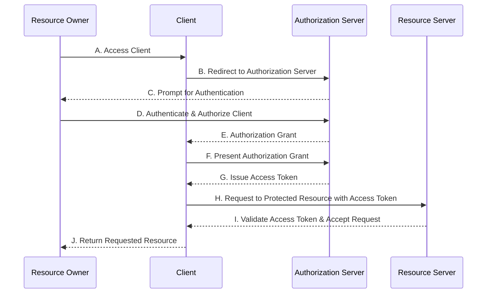

OAuth 2.0承認フレームワークのAuthorization Code Grant を使った、
サードパーティアプリケーションがアクセス制限されたリソース（保護されたリソース）へ
アクセスするまでの流れを図にします。

※Refresh TokenのフローはステップFから始めます。Access Tokenが期限切れの場合、Clientは保存していたRefresh TokenをステップFでAuthorization ServerにRequestすることで、新しいAccess Tokenを取得することができます。

[RFC 6749 - The OAuth 2.0 Authorization Framework](https://tex2e.github.io/rfc-translater/html/rfc6749.html)
